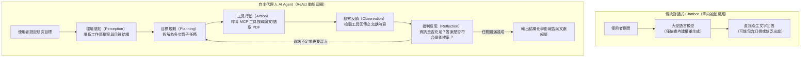
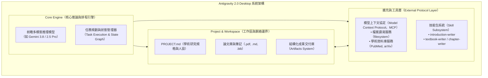
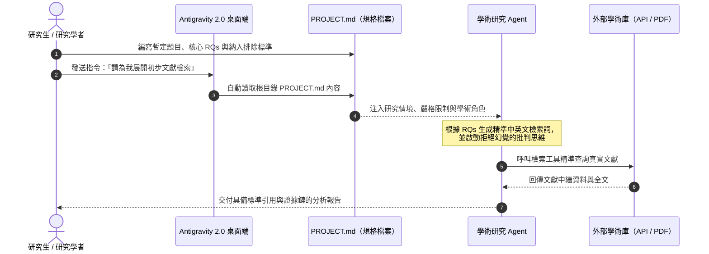
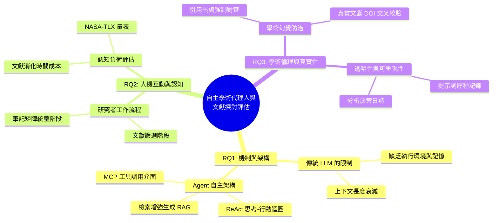

---
puppeteer:
  displayHeaderFooter: true
  headerTemplate: '<div style="font-size: 10px; margin: 0 auto;">第一章：從對話走向自主代理——Antigravity 2.0 Desktop 核心概念與論文工作區建構</div>'
  footerTemplate: '<div style="font-size: 10px; margin: 0 auto;">第 <span class="pageNumber"></span> 頁 / 共 <span class="totalPages"></span> 頁</div>'
  margin:
    top: "1.5cm"
    bottom: "1.5cm"
    left: "1.5cm"
    right: "1.5cm"
---
<style>
  h2 {
    page-break-before: always;
  }
</style>
---

# 第一章：從對話走向自主代理——Antigravity 2.0 Desktop 核心概念與論文工作區建構

## 課程導讀

歡迎來到「AI Agent 學術研究與文獻探討實務」的第一週課堂。在過去幾年中，生成式人工智慧（Generative Artificial Intelligence）以驚人的速度進入了學術研究領域。大部分同學可能已經習慣在網頁瀏覽器中開啟 ChatGPT、Claude 或 Gemini，將一段文獻貼入對話框並請求摘要，或者請模型協助潤飾英文論文摘要。然而，當我們嘗試進行系統化、深度的學術文獻探討（Literature Review）時，往往會迅速撞上傳統對話式聊天機器人的技術天花板——文獻篇幅過長導致模型遺忘前文、模型無法感知電腦資料夾中的 PDF 檔案、引用來源無法查證，甚至隨意捏造看似真實卻根本不存在的論文篇名與作者。

本課程的核心宗旨，在於帶領同學們跨越「單純與大型語言模型對話」的初級階段，正式邁入「自主代理人（AI Agent）」的研究範式。我們將以專為深度工作與研究設計的 **Antigravity 2.0 Desktop** 為實踐平台，學習如何將 AI 轉化為受過嚴謹學術訓練的研究助理。貫穿本學期所有教材與實作的核心主軸為：

> **傳統對話式 AI 是被動的問答者，而 AI Agent 是具備「感知、規劃、行動與反思」能力的自主研究夥伴。**

在本週的課程中，我們將從底層運作機制出發，剖析 AI Agent 與傳統聊天機器人的本質差異；接著動手建立專屬的學術研究工作區（Workspace），並透過上下文工程（Context Engineering）在根目錄定義結構化研究規範文件（`PROJECT.md`），為 AI Agent 注入專屬的學術人設與研究問題，為整個學期的文獻探討打下堅實的根基。

---

## 第一節：AI Agent 的運作機制與研究典範轉移

### 1.1 聊天機器人（Chatbot）與自主代理人（AI Agent）的本質差異

為了清楚界定技術的邊界，我們首先需要理解聊天機器人與 AI Agent 之間在運作架構上的巨大鴻溝。一般的聊天機器人（Chatbot）本質上是基於機率分佈的「單輪或多輪文字預測引擎」。當使用者輸入一段文字（Prompt）後，模型會根據注意力機制計算下一個最具統計可能性的詞彙（Token），並直接輸出回答。在這樣的互動模式中，模型的行為是完全被動的：如果使用者的提示詞不夠精確，模型不會主動檢查資訊是否齊全，也不會自主去查證外部事實；一旦一次回答結束，模型的運算週期便立即終止，等待人類給予下一道刺激。

相較之下，人工智慧代理人（Artificial Intelligence Agent，簡稱 AI Agent）則是一個具備完整決策迴圈的自主認知系統。AI Agent 不僅僅是大型語言模型（LLM），而是以 LLM 作為其「大腦（Reasoning Engine）」，並結合了感知模組、長期與短期記憶系統、任務規劃器以及工具調用介面。當我們向 Agent 提出一個複雜目標時，它不會急於一次性給出答案，而是會啟動著名的 **ReAct 循環（Reason-Action Loop，ReAct）**，在思考、行動與反思之間不斷迭代，直到達成既定目標。



如上圖所示，AI Agent 的工作流程包含四個關鍵核心階段：
1. **環境感知（Perception）：** 掃描使用者指定的本機工作區、目錄架構與現有文獻資源，掌握客觀上下文環境。
2. **邏輯規劃（Planning）：** 面對「整理某主題近五年文獻」等抽象指令時，自動將其拆解為「關鍵字檢索、過濾重複論文、讀取重點摘要、提取方法學比較」等多個執行步驟。
3. **工具調用（Action）：** 透過外部介面（如終端機指令、學術資料庫 API、本機檔案系統讀寫器）執行具體操作，取得第一手真實文獻數據。
4. **批判反思（Reflection）：** 評估工具回傳的文獻是否真實回答了研究問題；若發現搜尋結果偏差或遺漏關鍵論點，會自動調整搜尋語法重新查詢，而非直接將瑕疵資訊呈現給使用者。

### 1.2 為什麼學術文獻探討迫切需要 Agent 範式？

在進行學術研究時，文獻探討往往被公認為最耗費心力、最具認知負荷的階段。研究生與研究學者在閱讀文獻時，經常面臨龐大的文獻量與碎片化的筆記資料。當我們嘗試使用一般的網頁版 ChatGPT 來輔助文獻回顧時，普遍會遭遇三大無法克服的致命痛點：

1. **上下文長度限制與長文遺忘（Context Drift & Needle-in-a-Haystack Problem）：** 即使現代大型模型號稱具備數十萬乃至百萬 Token 的上下文視窗，在將數十篇數萬字的學術論文一口氣倒入對話框時，模型仍極易產生「中間遺忘（Lost in the Middle）」現象，忽略論文中關鍵的統計數據、對照組條件或研究限制。
2. **缺乏本機檔案感知與目錄結構認知（File-System Agnosticism）：** 網頁版模型無法即時看見讀者電腦中整理好的資料夾（例如 `papers/2024_survey.pdf`、`notes/methodology.md`），更無法主動為新下載的論文建立統一的索引結構，導致人機之間必須不斷進行「複製、貼上、下載」的低效搬運。
3. **缺乏客觀驗證工具與學術幻覺（Academic Hallucination）：** 語言模型是基於文字接續機率運作，並無「真實性」的物理校驗能力。若向其詢問某個冷門領域的理論文獻，模型極可能自信地編造出格式完美的虛假文獻引用（包含假的 DOI、期刊名與卷期）。在學術研究中，引用不存在的文獻屬於嚴重的學術不端行為。

下表完整對比了傳統 Chatbot 與 AI Agent 在學術研究支援上的能力差異：

| 評比維度 | 傳統對話式 Chatbot（如 ChatGPT 網頁版） | 學術專用 AI Agent（如 Antigravity 2.0） | 對文獻探討的實務價值 |
| :--- | :--- | :--- | :--- |
| **運作模式** | 被動單向問答，一次性產生文字回應 | 主動自主循環，多步驟規劃與執行 | 能自主推進複雜的研究綜述任務 |
| **資訊來源** | 僅依賴訓練權重與當次貼入的對話片段 | 直接連結本機工作區、檔案系統與學術 API | 確保分析依據來自真實且完整的論文原件 |
| **長度適應** | 長文本處理成本高，容易遺忘細節 | 透過檔案索引、切片檢索與動態讀取管理脈絡 | 能有效掌握數十篇至上百篇文獻的交叉比對 |
| **驗證能力** | 無法執行代碼或呼叫工具驗證事實 | 可呼叫 Python 腳本、查詢 CrossRef/PubMed API | 完全杜絕虛假文獻篇名與假引用的幻覺問題 |
| **產出結構** | 隨機條列式文字，格式隨對話浮動 | 嚴格依照學術規範產出結構化 Markdown 文檔 | 直接作為學術論文文獻探討章節的正式底稿 |
### 1.3 Antigravity 2.0 Desktop 架構拆解

為了解決上述學術研究的實務痛點，Google 團隊打造了新一代深度研究與代理人開發環境——**Antigravity 2.0 Desktop**。這套系統並不是另一個簡單的聊天前端介面，而是一座整合了推論引擎、檔案系統感知、工具協定與技能擴充模組的專業工作站。



如架構圖所示，Antigravity 2.0 Desktop 由四個核心構件共同協同運作：

1. **核心引擎（Core Engine）：** 負責驅動頂尖多模態推理模型（如 Gemini 2.5/3.8 系列），管理非同步任務排程。核心引擎控制著 Agent 的注意力流，並具備自我修復與長程思考能力。
2. **專案與工作區（Project & Workspace）：** 這是 Agent 感知世界的實體物理邊界。每個工作區對應於本機電腦中的一個資料夾。透過根目錄下的研究規格書（`PROJECT.md`），Agent 能在啟動時迅速載入研究目標、學術規範與核心研究問題（Research Questions，RQs），並將產出的文獻回顧結構化儲存於成果目錄中。
3. **模型上下文協定（Model Context Protocol，MCP）：** 由 Anthropic 提出並迅速被業界接納的開放通訊協定。MCP 徹底打破了 AI 與本機工具之間的藩籬，讓 Antigravity 能夠安全地呼叫本機檔案讀寫工具、終端機執行器，甚至是外部學術 API（如 PubMed、arXiv、CrossRef），讓 Agent 擁有隨時取用外部知識的手腳。
4. **技能擴充系統（Skill）：** 技能包是高度結構化的專業工作指南。每個 Skill 包含特定的指令規則（`SKILL.md`）、風格規範（`writing_style.md`）、高質量示範範例（`examples/`）以及專用輔助腳本（`scripts/`）。例如本專案所使用的 `introduction-writer` 與 `textbook-writer`，便能強制約束 Agent 拋棄聊天語氣，改以大學教材等級的嚴謹學術文風撰寫講義。

### 1.4 課堂探索小活動：體驗對話與代理的思維轉變

> **活動時間：** 5 分鐘
> **活動目標：** 體會「給予問題（Prompt）」與「賦予目標與邊界（Agent Mission）」的認知差異。
>
> 1. 請同學打開手邊習慣的網頁版 AI（如 ChatGPT 或 Gemini），輸入指令：
>    *「請幫我寫一篇關於大型語言模型在醫療診斷上應用的文獻探討。」*
> 2. 觀察其產出的結果：其摘要是否包含具體的論文發表期刊、DOI 與對照數據？引用的文獻是否經過查證？
> 3. 思考：若要將這項任務轉交給一位真實的學術助理，你會如何明確指示其搜尋的資料庫、納入的論文年份標準，以及論文存檔的資料夾路徑？請記錄下你的思維差別。

```text
老師的真心話：
許多同學一開始使用 AI 寫論文時，最容易犯的錯誤就是把 AI 當成「全知全能的搜索引擎」，
直接問它：「請問某某領域最新的頂級論文有哪些？」
請大家永遠記住：大型語言模型在沒有外部工具與工作區檔案約束的情況下，其本質只是一個
「句子接續器」。它會用極度自信的語氣，為你創造出一篇結構嚴謹、文法優美，但「作者是捏造的、
期刊卷號是湊出來的、DOI 是死連結」的假文獻！
這不是模型在說謊，而是它的數學本質只在乎「文字像不像真的論文」。
因此，學術研究唯一可信的途徑，是透過 Agent 讀取本機真實存在的 PDF 檔案，或是透過
MCP 工具即時連線官方學術資料庫。切忌拿未經檢驗的聊天對話直接放入畢業論文中！

```

---

## 第二節：Antigravity 桌面版環境建置與目錄結構

### 2.1 軟體安裝與安全性設定檢核

要讓 AI Agent 具備操作檔案的能力，環境的安全防護是學術研究中不可妥協的首要前提。Antigravity 2.0 Desktop 提供了一套完整的權限防護沙盒機制。在安裝與初始配置時，我們必須落實下列檢核步驟：

1. **安裝環境檢核：** 確認電腦作業系統（Windows 10/11 64-bit、macOS 或 Linux）已正確安裝 Antigravity 桌面端，並確認終端機具備基本執行環境（如 Python 3.10+、Git 工具鏈）。
2. **API 金鑰與認證管理：** 學術研究涉及大量的推論運算，通常需要串接官方 API Key（如 Google AI Studio API Key 或 Anthropic API Key）。請嚴格遵循安全準則： **絕對不要將 API 金鑰直接以明文硬編碼寫入公開的 Markdown 筆記或程式碼中**。Antigravity 提供了全域憑證金鑰儲存庫，會將敏感密鑰儲存於系統層級的安全保險箱中。
3. **檔案操作授權機制（Permission Boundary）：** 首次在 Antigravity 內執行具有寫入權限或終端機指令的工具時，系統會彈出確認提示。作為負責任的研究者，應確認指令的影響範圍侷限於指定的論文工作區內，嚴禁授權 Agent 對個人系統磁碟（如 `C:\Windows` 或使用者個人根目錄）進行全域檔案掃描與寫入。

### 2.2 建立論文專屬工作區（Workspace）的工程化標準

在一般的電腦使用習慣中，許多人習慣將下載的文獻隨意拖曳到桌面或「下載」資料夾中，導致檔名充滿 `document (1).pdf` 或亂碼數字。這種混亂的檔案組織方式對人類來說難以檢索，對 AI Agent 而言更是災難——因為 Agent 必須消耗寶貴的注意力視窗去梳理雜亂無章的無效檔案。

在 Antigravity 中， **一個工作區（Workspace）即代表一個獨立的研究專案邊界**。為論文建立標準化的目錄結構，是實現自動化文獻探討的基石。我們建議所有研究生與學術從業者採用以下「研究專案三層樹狀結構」：

```text
my_thesis_workspace/
│
├── PROJECT.md               # 核心靈魂：研究規格定義書（研究題目、RQs、納入排除標準）
│
├── 01_papers/               # 原始文獻庫（嚴禁手動污染）
│   ├── raw_pdf/             # 存放原始發表的 PDF 原件（統一命名：年份_第一作者_篇名縮寫.pdf）
│   └── extracted_text/      # 由工具自動將 PDF 轉出之 Markdown/TXT 格式，供 Agent 秒級檢索
│
├── 02_notes/                # 文獻精讀筆記與矩陣卡片
│   ├── literature_matrix.md # 跨文獻研究方法與數據比較矩陣表
│   └── reading_cards/       # 針對單篇文獻的詳細提煉筆記
│
├── 03_drafts/               # 論文草稿與結構化產出
│   ├── 01_introduction.md   # 第一章：研究背景與動機
│   └── 02_literature_review.md # 第二章：文獻探討綜整
│
└── references.bib           # 全域學術引用 BibTeX 資料庫（供 LaTeX / Word 引用管理軟體連動）

```

這樣規劃的優點在於**關注點分離（Separation of Concerns）**：
- `01_papers/` 是客觀事實的來源，Agent 擁有唯讀權限，確保原始文獻不被意外竄改；
- `02_notes/` 是資訊的中間提煉層，Agent 可以在此處反覆更新比對矩陣；
- `03_drafts/` 則是最終呈現給指導教授或期刊評審的學術成品；
- 最頂層的 `PROJECT.md` 則是指揮全域的總導航圖。

### 2.3 工作區路徑與學術隱私防護規範

在數位人文與學術研究中，資料隱私（Data Privacy）與智慧財產權受到嚴格的學術倫理規範保護。建立工作區時，必須時刻堅守下列三大原則：

1. **路徑命名嚴禁包含空白與特殊符號：** 在 Windows 或 Linux 環境中，若工作區路徑包含空格（如 `C:\Users\Leo\My Research Papers\`），在背景呼叫 Python 腳本或命令列解析器時，極易因字串截斷而發生路徑解析錯誤。請養成使用底線 `_` 或減號 `-` 的標準工程命名習慣（如 `C:\Users\Leo\research_workspace\`）。
2. **本地優先與未公開資料隔離：** 許多同學的研究題目涉及未發表的實驗數據、訪談逐字稿或機密產學合作專案。在 Antigravity 2.0 中，工作區是以本機磁碟為根基，所有本機檔案索引與整理工作均在電腦內部執行；只有在需要推論理解時，才會將必要的文字片段發送至經過企業級隱私保護驗證的大型模型端點。嚴禁將含有受試者真實個資的機密資料夾直接暴露在無限制的網路搜尋工具下。
3. **版本控制與忽略清單（.gitignore）：** 建議每個 Workspace 搭配 Git 進行版本歷程控管。原始 PDF 檔案通常體積較大，不適合推送到遠端儲存庫；可在根目錄配置 `.gitignore` 檔案排除 `01_papers/raw_pdf/`，僅將純文字筆記、`PROJECT.md` 與論文草稿進行雲端備份，達到輕量且安全的雙重保障。

### 2.4 課堂實作小活動：搭建你的論文工作區骨架

> **活動時間：** 10 分鐘
> **活動任務：** 在電腦中親手建立標準研究目錄結構。
>
> 1. 打開電腦中的檔案總管，在合適的磁碟路徑下建立資料夾：`thesis_literature_agent`。
> 2. 在該資料夾內，分別建立四個子目錄：`01_papers`、`02_notes`、`03_drafts`，並在根目錄建立空的 `PROJECT.md` 檔案。
> 3. 開啟 Antigravity 2.0 Desktop，點擊「Open Workspace（開啟工作區）」，選擇剛剛建立的 `thesis_literature_agent` 資料夾。
> 4. 觀察 Antigravity 左側檔案導航列是否正確辨識出該目錄結構。

```text
老師的提醒：
在輔導學生建立研究環境時，我最常看到的災難就是：同學把整個 C 槽使用者目錄（C:\Users\Username）
當成 Workspace 打開！
這會導致什麼後果？當 Agent 試圖尋找你的論文筆記時，它會花費幾十分鐘去遍歷你的 Windows 暫存檔、
App 資料庫甚至是瀏覽器快取，不僅消耗大量運算資源，還會讓 Agent 完全失焦。
記住：Workspace 的範圍越精確、越乾淨，Agent 的思考與回應就越敏銳、越精準！

```

---

## 第三節：賦予 Agent 專屬人設與研究規格

### 3.1 上下文工程（Context Engineering）的核心原理

在過去使用聊天機器人時，大家普遍習慣撰寫落落長的「系統提示詞（System Prompt）」，例如：「你現在是一個精通資訊傳播學的教授，請用專業的語氣回答我……」。然而，當對話輪次增加或開啟新對話時，這些口頭約定往往會隨風而逝，模型又會回到預設的泛用客服語調。

為了解決這個問題，現代 Agent 開發全面轉向了 **上下文工程（Context Engineering）**。上下文工程的核心思想在於： **不要依賴臨時的口頭對話，而是將結構化規則、領域邊界、任務目標與交付標準，持久化固化為檔案系統中的實體文件**。

在 Antigravity 2.0 架構中，放置於 Workspace 根目錄下的 `PROJECT.md` 正是實現上下文工程的靈魂載體。每當 Agent 啟動或執行任何子任務時，核心引擎會優先自動加載 `PROJECT.md` 作為全域常駐的「系統基石記憶（System Grounding Anchor）」。這意味著，無論後續指派什麼任務，Agent 都會在心中時刻衡量：「這項操作是否符合 `PROJECT.md` 所界定的研究題目？是否遵循了指導教授要求的學術嚴謹度？」



### 3.2 結構化研究定義書（`PROJECT.md`）的組成維度

一份合格的學術專案規格書絕不能只是簡短的幾句話，它必須涵蓋三個互為支撐的結構化模組：

#### 維度一：研究題目與核心研究問題（Research Questions，RQs）
研究問題是整篇論文的指南針。若研究問題過於寬泛（例如「AI 對人類社會的影響」），Agent 在檢索文獻時便會迷失在百萬篇泛泛之論中；唯有定義具備操作性、有具體自變項與應變項的 RQs，Agent 才能精確篩選高品質文獻。

#### 維度二：研究範疇（Domain）與文獻納入／排除標準（Inclusion/Exclusion Criteria）
在系統化文獻回顧（Systematic Literature Review，SLR）中，透明客觀的篩選標準是保障學術客觀性的命脈。我們必須明確告知 Agent：
- **文獻類型限制：** 僅納入經過同儕審查（Peer-reviewed）之期刊論文與頂級會議論文，或是包含經同行背書之 arXiv 預印本？
- **發表時間範圍：** 限定近三年（2022～2025 年）的最新突破，還是需要回溯至十年前的開創性經典？
- **排除標準：** 排除商業公關報導、論壇雜談、非英文或繁體中文之文獻，以及缺乏具體實驗驗證的純概念演講。

#### 維度三：Agent 的學術角色與回應紀律
明確規範 Agent 扮演的學術助理角色，並立下三條鐵律：
1. **事實嚴謹性：** 所有的論點必須明確標註出處（Author, Year），嚴禁無中生有。
2. **客觀批判性：** 評述文獻時，不僅要列出其成果，還必須主動指出該研究的「限制（Limitations）」與樣本偏差。
3. **拒絕回答無依據的推論：** 當檢索到的文獻不足以回答問題時，Agent 必須誠實回答「目前工作區的文獻資料不足以支撐該推論，需要補充額外文獻」，絕不可為了討好使用者而胡亂臆測。

以下為同學示範一份標準且立即可用的 `PROJECT.md` 範本程式碼：

```markdown
# 論文研究規格書：PROJECT.md

## 1. 論文暫定題目
以大型語言模型為核心之自主學術代理人於文獻探討工作流程之建構與實證評估

## 2. 核心研究問題（Research Questions）
- **RQ1（機制面）：** 具備 ReAct 自主循環的 AI Agent，在跨文獻概念綜合與方法學對比之準確度上，相較於傳統單輪問答大型語言模型有何顯著提升？
- **RQ2（效率與認知面）：** 人文社會學科研究者在導入桌面版 AI Agent 輔助文獻探討後，其文獻篩選時間與整體認知負荷（Cognitive Load）呈現何種變化趨勢？
- **RQ3（學術倫理與幻覺面）：** 透過本機工作區感知（Workspace Perception）與結構化上下文工程約束，能否有效將學術引用虛構率（Hallucination Rate）降至零？

## 3. 研究範疇與文獻篩選標準
- **核心領域（Domain）：** 人機互動（HCI）、人工智慧教育應用（AIED）、自然語言處理應用（Applied NLP）。
- **文獻納入標準（Inclusion Criteria）：**
  1. 發表年份介於 2021 年至 2025 年之間。
  2. 發表於 SCI / SSCI 索引期刊，或頂級國際學術會議（如 ACM CHI, ACL, EMNLP, NeurIPS）。
  3. 研究內容涉及「大型語言模型之工具調用（Tool-use）」或「AI 輔助學術閱讀與寫作」。
- **文獻排除標準（Exclusion Criteria）：**
  1. 缺乏具體實證評估或量化/質性數據的純商業宣傳文章。
  2. 非同行審查之個人部落格、新聞報導或社交平台評論。

## 4. Agent 學術角色與行為守則
- **角色定位：** 你是一位受過嚴謹研究方法訓練的「博士級學術研究助理」。
- **行為準則：**
  1. **引用鐵律：** 每一句提及文獻論點的陳述，末尾必須標記 `(作者, 年份)`，並在文末附上對應之完整條目。
  2. **主動質疑：** 針對閱讀到的文獻，應指出其方法學之潛在限制（例如樣本數不足、缺乏消融實驗）。
  3. **誠實反思：** 若目前工作區內無相關文獻，應明確回答「工作區現有文獻不足」，並主動提出建議檢索之關鍵字，嚴禁臆造不存在的論文篇名。

```

### 3.3 驅動 Agent 啟動自主研究：開展心智圖與關鍵字群

當我們在工作區根目錄妥善保存好 `PROJECT.md` 後，我們便可以發送第一道指令，測試 Agent 是否已經完全吸收這份研究規格。

我們不需要一次丟給它「請寫出整章文獻回顧」這種龐大且失焦的任務。最理想的啟動方式，是請 Agent **「閱讀 `PROJECT.md`，並針對三大核心 RQs 展開初步的概念心智圖與多維度中英文關鍵字群」**。

當 Agent 正確讀取文件後，它會自動為研究者梳理出清晰的研究概念層級，並產出如下的結構化概念心智圖：



除了心智圖外，Agent 還能根據納入排除標準，提煉出供學術資料庫（如 IEEE Xplore、ACM Digital Library、Web of Science）檢索使用的精準關鍵字群組（Keywords Group）：

| 檢索維度（Dimension） | 核心概念（Core Concept） | 英文檢索關鍵字（English Keywords） | 中文檢索關鍵字（Chinese Keywords） |
| :--- | :--- | :--- | :--- |
| **維度一：核心技術架構** | 自主代理人與思考架構 | `Autonomous Agents`, `ReAct framework`, `Tool-augmented LLM`, `Model Context Protocol` | 自主代理人、ReAct 框架、工具擴充語言模型、模型上下文協定 |
| **維度二：應用任務情境** | 文獻探討與學術閱讀 | `Literature Review automation`, `Academic synthesis`, `Scientific paper analysis`, `Scholarly assistance` | 文獻探討自動化、學術文獻綜合、科學論文分析、學術助理系統 |
| **維度三：評估指標與倫理** | 認知負荷與學術幻覺 | `Cognitive load in HCI`, `Citation hallucination`, `Factuality verification`, `Research reproducibility` | 人機互動認知負荷、文獻引用幻覺、真實性驗證、研究可重現性 |
透過這組關鍵字群，研究者便能有系統地使用學術檢索工具，將下載的文獻精準投放至工作區的 `01_papers/` 目錄中，讓後續的文獻精讀與章節寫作水到渠成。

### 3.4 課堂實作小活動：編寫你的第一份 `PROJECT.md`

> **活動時間：** 15 分鐘
> **活動任務：** 將個人感興趣的研究構想具體化為規格檔案，並與 Agent 展開首次學術對話。
>
> 1. 請同學打開 VS Code 或文字編輯器，在剛才建立的 Workspace 根目錄中開啟 `PROJECT.md`。
> 2. 參考本節範本，填入你這學期暫定的論文題目、至少兩項核心研究問題（RQ1、RQ2），並寫下你的文獻篩選年份標準。
> 3. 在 Antigravity 2.0 介面中向 Agent 輸入指令：
>    *「請閱讀根目錄下的 `PROJECT.md`，告訴我你對本研究目標的理解，並為我列出 3 組適合在 Google Scholar 或 Web of Science 搜尋的精準布林檢索字串（Boolean Search Strings）。」*
> 4. 檢視 Agent 是否有嚴格按照你的規範回答，並體會有無 `PROJECT.md` 約束的巨大品質差距。

```text
老師的真心話：
寫作 PROJECT.md 的過程，其實不是在『伺候 AI』，而是在『逼迫自己把研究想清楚』。
很多同學論文寫到碩二甚至碩三還在卡關，不是因為書讀得不夠多，而是從來沒有把自己的核心研究問題
（RQs）一字一句精確寫下來。
當你能夠寫出一份讓 AI Agent 挑不出毛病、邊界清清楚楚的 PROJECT.md 時，你的論文研究其實就已經
成功了百分之五十！
請把 PROJECT.md 當成你與 Agent 之間的『學術契約』，隨著學期的推進，隨時回來修訂、擴充它！

```

---

## 本週小結與下週預告

在本週的第一講中，我們成功建立了對自主代理人（AI Agent）的宏觀認知地圖。我們明白了從聊天機器人邁向自主代理，關鍵在於引進具備環境感知與工具行動的 ReAct 循環；我們也實地搭建了標準的學術工作區（Workspace），並透過上下文工程在根目錄注入了靈魂核心——`PROJECT.md`，學會如何引導 Agent 生成研究心智圖與關鍵字群。

在下一週（第二講）的課程中，我們將正式進入**「智慧文獻爬梳與本機向量化檢索」**的實戰。我們將學習如何運用 MCP 擴充模組，自動抓取 arXiv 與 PubMed 上的開放獲取（Open Access）論文，並透過文字清理腳本將 PDF 轉譯為乾淨的 Markdown 格式，讓 Agent 能在數秒內精確標定上百篇論文中的方法學異同。請同學們務必在課後確認自己的 Workspace 與 `PROJECT.md` 已設置妥當，我們下週見！
