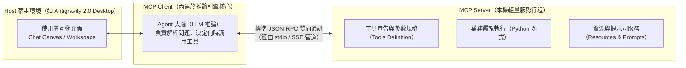
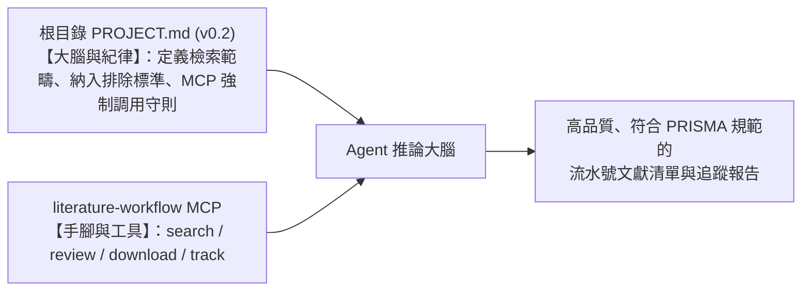

---
puppeteer:
  displayHeaderFooter: true
  headerTemplate: '<div style="font-size: 14px; margin: 0 auto;">第二章：智慧文獻爬梳與人機協同審查——從 OpenAlex API 到 PRISMA 追蹤管線建構</div>'
  footerTemplate: '<div style="font-size: 14px; margin: 0 auto;">第 <span class="pageNumber"></span> 頁 / 共 <span class="totalPages"></span> 頁</div>'
  margin:
    top: "1.5cm"
    bottom: "1.5cm"
    left: "1.5cm"
    right: "1.5cm"
---
<style>
  /* 全域字型大小放大為 1.4 倍（預設 16px * 1.4 = 22.4px） */
  html, body, .mume, .markdown-preview {
    font-size: 22.4px !important;
    line-height: 1.6 !important;
  }
  /* 標題分頁控制 */
  h2 {
    page-break-before: always;
  }
  /* 表格與程式碼區塊維持等比例適配 */
  table {
    font-size: 0.9em !important;
  }
  pre, code {
    font-size: 0.88em !important;
  }
</style>
---

# 第二章：智慧文獻爬梳與人機協同審查：從 OpenAlex API 到 PRISMA 追蹤管線建構

## 課程導讀：漸進式鷹架引導策略

歡迎回到「AI Agent 學術研究與文獻探討實務」的第二週課堂。在第一講中，我們完整建立了對自主代理人（AI Agent）的認知架構，劃定了包含五大工程目錄（`01_papers`、`02_notes`、`03_drafts`、`04_research_data`、`05_project_history`）的標準工作區（Workspace），並透過上下文工程在根目錄注入了靈魂規格書（`PROJECT.md`）。至此，我們已經為 AI Agent 賦予了明確的學術研究人設、剛性時程里程碑以及探索性核心研究問題（Exploratory RQs）。

然而，紙上談兵終究無法產出具備實證基礎的論文。環顧我們目前的工作區，最關鍵的客觀事實來源—— `01_papers/` 文獻庫，目前依然空空如也。

在傳統的研究歷程中，研究生蒐集文獻的方式往往是低效且碎片化的：打開搜尋引擎或圖書館系統，手動下載幾十篇檔名混亂的 PDF 檔案堆置在電腦桌面；當需要比對文獻時，又必須一篇篇打開 PDF 進行肉眼掃描。而在導入 AI 輔助時，若缺乏嚴謹的檢索標準與人機品質把關，更極易被學術水刊、爭議出版商或脫離主題的論文牽著鼻子走。

本週課程的核心主旨，是要為 Antigravity 2.0 的 AI Agent 正式裝上 **「感知文獻的眼睛」與「調用工具的雙手」**。為了兼顧學術研究的嚴謹性與工程實踐的掌控感，本週教材特別採用 **「漸進式鷹架引導策略（Progressive Scaffolding Strategy）」**，依序帶領大家跨越三大思維階段：

1. **第一階段：原理奠基與手動實戰（第 1 節）**
   - **實體操作感知**：學生在終端機（Terminal）中親手執行獨立的命令列工具（`fetch_openalex.py`），理解 API 請求、學術品質防護設定（`journal_filter_config.json`）與資料夾結構（`01_papers/raw_pdf/`）的真實運作。
   - **人機協同品質把關**：親手在帶有兩位數流水號的 `candidate_papers_01.md`（支援多輪檢索 `candidate_papers[00-99].md`）逐一審視期刊來源（Source）與摘要（Abstract），透過專屬互動審查工具落實批判審查（標記 `[+]` 採納、`[-]` 排除或 `[ ]` 暫留），並由專屬追蹤檔案持續管理文獻獲取狀態。親自走過手動流程，才能徹底破除「AI 是黑盒子神仙」的迷思，確立研究者對學術品質的絕對主導權。
2. **第二階段：工程抽象與協定封裝（第 2 節）**
   - **工具化躍遷**：學習當代自主代理人最重要的擴充標準——模型上下文協定（Model Context Protocol，MCP）。
   - **統一伺服器架構**：將前期手動執行的個別腳本，抽象化並整合封裝為全功能雙模 MCP 伺服器（`scripts\literature_workflow_mcp.py`），使檢索、審查與下載成為 Agent 隨時可調用的標準工具鏈（Tools）。
   - **人機協同暫停點設計**：學習如何在 Agentic Workflow 中設計「斷點機制」，確保 Agent 在調用檢索工具後主動停下腳步，等待研究者審核勾選後方可繼續執行。
3. **第三階段：端到端自然語言研究協作（第 3 節實作驗證）**
   - **思維維度躍遷**：在 Antigravity 2.0 對話畫布中，以自然語言發起端到端文獻研究對話，體驗由「終端機手動操作員」升級為「指揮 AI Agent 的高階研究者」之流暢威力！

唯有先親手走過第一階段的泥濘與細節，你才能在第二、三階段真正看懂 Agent 的每一步動作，不被黑盒子牽著走，成為真正具備主導權的高階研究者。

---

## 課前準備：確認核心工具腳本與升級 PROJECT.md (v0.2)

在專案根目錄下建立 `scripts/` 資料夾，並將本週課程所提供的核心工具腳本放入該目錄中：
- `scripts/fetch_openalex.py`（文獻檢索、互動審查與全文追蹤管理工具）
- `scripts/literature_workflow_mcp.py`（統一學術文獻檢索與審查 MCP 伺服器）
- `scripts/journal_filter_config.json`（學術品質防護設定檔：自訂排除巨型與爭議期刊）
- 根目錄 `PROJECT.md`（升級至 `v0.2 智慧文獻管線與工具治理版`，舊版 `v0.1` 存於 `05_project_history/`，為 Agent 注入文獻檢索標準與 MCP 工具治理紀律）

---

## 第一節：學術文獻檢索、審查與追蹤管理實戰：scripts/fetch_openalex.py

在撰寫碩士論文的文獻探討章節時，研究者最迫切的需求並非探究學術資料庫底層龐雜的 API 規格，而是**如何透過直覺、精確且可控的工程工具，在最短時間內從全球學術圖譜中篩選出真正切合研究問題（RQs）的高價值文獻，並建立透明且持續的獲取追蹤歷程**。

為此，本專案在 `scripts/` 目錄中封裝了專屬的自動化文獻檢索、審查與全文追蹤管理工具：
- **核心工具路徑**：`scripts/fetch_openalex.py`

本工具完全採用 Python 原生標準庫編寫，隨插即用。它將繁瑣的網路連線、文字解析與檔案結構抽象化，為研究生提供五大標準指令：

```bash
# 1. 檢索候選文獻（自動生成兩位數流水號評估檔，如 candidate_papers_01.md 與專屬追蹤檔）
python scripts/fetch_openalex.py search "檢索關鍵字" [參數]

# 2. 全域瀏覽目前所有 candidate_papers[00-99].md 之檢索條件、審查狀態與文獻獲取進度
python scripts/fetch_openalex.py list

# 3. 專屬互動式文獻審查工具（逐篇判定採納 [+]、排除 [-]、保留 [ ]）
python scripts/fetch_openalex.py review [清單序號，例：01]

# 4. 針對選定清單中確認採納（[+]）的文獻執行全文獲取，並分類更新至專屬追蹤檔
python scripts/fetch_openalex.py download [清單序號，例：01]

# 5. 持續追蹤管理工具：自動感測 raw_pdf/ 中補全的訂閱文獻並更新追蹤報告
python scripts/fetch_openalex.py track [清單序號，例：01]

```

---

### 1.1 文獻檢索指令（search）與參數配置詳解

`search` 是文獻獲取管線的第一道關卡。研究者下達檢索主題後，腳本會自動連線 OpenAlex API，按照論文被引用次數由高至低排序，並在 `01_papers/` 目錄下自動建立帶有兩位數流水號的候選評估文件（例如第一次檢索產出 `candidate_papers_01.md`，第二次產出 `candidate_papers_02.md`）。

#### 指令語法與參數清單

```text
python scripts/fetch_openalex.py search [關鍵字] [-m 最大筆數] [-s 起始年份] [-e 結束年份]

```

下表完整整理了 `search` 指令所支援之關鍵參數、預設數值與在碩士論文寫作中的實務用途：

| 參數名稱 | 縮寫 | 型態 | 預設值 | 碩士論文檢索實務用途說明 |
| :--- | :--- | :--- | :--- | :--- |
| `query` | 無（位置參數） | 字串 | 必填 | 研究主題關鍵字。支援單詞、複合詞組或英文布林片語（建議使用雙引號包覆）。 |
| `--max` | `-m` | 整數 | `10` | 設定本輪欲評估之最大候選論文數量。初期探索建議設為 10 到 15 篇，避免認知負荷過重。 |
| `--start-year` | `-s` | 整數 | `2022` | 文獻發表的起始年份。預設鎖定近三年最新文獻，確保學術技術處於前沿。 |
| `--end-year` | `-e` | 整數 | `2026` | 文獻發表的結束年份。預設設定至當年度，確保能收錄到最新預印與正式出版論文。 |
| `--no-filter` | 無 | 旗標 | 關閉 | 停用學術品質防護。預設情況下系統會自動依據外部設定檔排除巨型期刊與爭議出版社。 |

#### 學術品質防護：外部設定檔排除巨型期刊與爭議出版社（scripts/journal_filter_config.json）

在傳統檢索中，若僅依據「被引用次數由高至低（`cited_by_count:desc`）」排序，搜尋結果前幾名極易被**巨型期刊（Mega-journals，如 MDPI 旗下的 Sustainability、Sensors，以及 Frontiers 系列、PLOS ONE、IEEE Access 等）**或同儕審查爭議出版社所佔據。

為了解決此痛點，本專案將期刊排除規則**抽離為外部獨立設定檔**：
- **外部設定路徑**：`scripts/journal_filter_config.json`

研究者**無需修改任何 Python 程式碼**，即可直接在該 JSON 檔案中彈性增刪自訂名單：
```json
{
  "enabled": true,
  "filter_retracted": true,
  "excluded_publishers": [
    "Multidisciplinary Digital Publishing Institute",
    "MDPI",
    "Frontiers Media",
    "Hindawi",
    "OMICS"
  ],
  "excluded_mega_journals": [
    "Sustainability",
    "Sensors",
    "Applied Sciences",
    "IJERPH",
    "PLOS ONE",
    "IEEE Access",
    "Scientific Reports",
    "Heliyon"
  ]
}
```
當執行檢索時，系統會自動在 API 端排除撤稿論文（`is_retracted:false`），並擴大初選抓取數量逐篇過濾，確保留存在候選名單（`candidate_papers_XX.md`）中的皆為符合專業領域指標的高公信力文獻！

#### 檔名流水號與 YAML Frontmatter 追蹤機制

為了妥善管理研究過程中針對不同關鍵字或年代的多輪探索，本工具採用 **「兩位數檢索流水號機制」**（`01` $\rightarrow$ `02` $\rightarrow$ `03` ... `99`，對應 `candidate_papers[00-99].md`），確保先前的檢索結果絕不被意外覆蓋。

每份候選文件最頂部均會自動注入標準的 **YAML Frontmatter**，精準記錄本次檢索的環境參數與後續審查進度：

```yaml
---
search_info:
  sequence_id: "01"
  search_time: "2026-09-18 10:44:17"
  query: "AI Agents in Higher Education scaffolding"
  max_results: 10
  start_year: 2022
  end_year: 2026
review_stats:
  total: 10
  included: 0      # 採納 [+] 篇數
  excluded: 0      # 排除 [-] 篇數
  pending: 10      # 保留 [ ] 篇數
---

```

透過這套 Frontmatter，研究者與 AI Agent 能一眼掌握：
- **`search_info`**：檢索時間戳記、查詢詞與年份邊界，方便日後在論文方法學章節中如實交代文獻篩選的檢索協定（Search Protocol）。
- **`review_stats`**：自動維護當前清單的審查統計——共有多少篇文獻被標記為採納（`included`）、排除（`excluded`）或待定（`pending`）。

#### 多情境檢索操作範例

**範例一：標準探索——檢索近三年核心高被引論文（預設 10 篇）**

```bash
python scripts/fetch_openalex.py search "AI Agents in Higher Education scaffolding"

```
*說明：未額外傳入參數時，系統預設擷取 2022 年至 2026 年被引用數最高的 10 篇論文，輸出為 `01_papers/candidate_papers_01.md`。*

**範例二：擴大篩選庫——放寬篇數並鎖定五年經典文獻（25 篇、2020-2025）**

```bash
python scripts/fetch_openalex.py search "Reflective Journals Educational Action Research" --max 25 --start-year 2020 --end-year 2025

```
*說明：明確要求檢索 25 篇、發表區間介於 2020 至 2025 年間的文獻，自動生成下一流水號檔案（如 `candidate_papers_02.md`）。*

**範例三：聚焦前沿介入——探討生成式 AI 與認知負荷之最新發表**

```bash
python scripts/fetch_openalex.py search "Cognitive Load GenAI Thesis Writing" -m 15 -s 2023 -e 2026

```

**範例四：跨學科探索——教學實踐研究（SoTL）之國際期刊論文**

```bash
python scripts/fetch_openalex.py search "Scholarship of Teaching and Learning Generative AI" --max 10 --start-year 2022

```

---

### 1.2 候選論文審查機制：專屬審查工具（review）

文獻檢索完成後，最關鍵的學術環節在於 **「研究者的人工品質把關」**。我們絕不盲目將所有檢索到的文獻照單全收，而是必須針對每篇論文的發表來源（Source 期刊信譽）與摘要（Abstract）進行批判性審查，所有審查操作一律由專屬的命令列互動工具 `review` 負責。

#### 三態審查標記系統
在專屬審查工具中，每篇論文支援三種審查決策狀態：
- **`[+]` 採納納入（Included / 相關）**：論文主題、方法或實證對象切合研究問題，確認納入論文研究，後續將自動抓取全文。
- **`[-]` 刪除排除（Excluded / 不相關）**：主題偏差、受試者不合、掠奪性刊物或方法學瑕疵，明確予以排除。標記排除能完整保留「曾檢索但經批判後剔除」之紀錄，符合系統性文獻回顧（PRISMA）標準。
- **`[ ]` 保留待定（Pending / 暫不表意見）**：僅憑摘要尚無法斷定是否相關，暫時維持待定狀態，不執行全文下載。

#### 終端機專屬審查工具操作（review）

研究者可直接在終端機啟動互動式審查器：

```bash
# 方式 1：自動列出目錄下所有候選清單供挑選
python scripts/fetch_openalex.py review

# 方式 2：直接指定特定流水號清單進行審查
python scripts/fetch_openalex.py review 01

```

執行後，終端機會逐篇呈現論文的篇名、發表期刊、出版年份、被引用次數、全文開放取用狀態與還原後之完整摘要，並提示操作選項：
- 輸入 `+`（或 `y`）：標記為 **`[+]` 採納納入**。
- 輸入 `-`（或 `n`）：標記為 **`[-]` 刪除排除**。
- 輸入 `k`（或按空白鍵）：標記為 **`[ ]` 保留待定**。
- 按 `Enter`：跳過本篇，維持當前審查狀態前進至下一篇。
- 輸入 `b`：返回上一篇重新審核。
- 輸入 `q`：儲存當前已審查之成果並退出系統。

完成審查退出時，腳本會自動將修改寫入 Markdown 文件， **即時更新頂部 YAML Frontmatter 統計，並同步聯動刷新專屬文獻獲取追蹤檔案**！

---

### 1.3 候選文獻庫總覽與多輪檢索管理：list 指令

隨著研究推進，研究生通常會針對不同關鍵字發起多次檢索（例如：`candidate_papers_01.md` 探討教學鷹架、`candidate_papers_02.md` 探討反思日記）。如何縱覽整體文獻庫的累積狀況？

本工具提供專屬的 `list` 瀏覽指令：

```bash
python scripts/fetch_openalex.py list

```

執行後，終端機將輸出排版整齊的 **「碩士論文候選文獻庫總覽」** 表格：

```text
================================================================================================================
 碩士論文候選文獻庫總覽 (Master Thesis Candidate Papers Catalog)
================================================================================================================
序號   檔案名稱                     檢索時間              篇數    採納[+]   排除[-]   待定[ ]   OA下載    已補訂閱     待調閱    檢索關鍵字
----------------------------------------------------------------------------------------------------------------
01   candidate_papers_01.md   2026-09-18 10:44  3     1       1       1       1       0        0      AI Agent Education
02   candidate_papers_02.md   2026-09-18 11:12  3     2       1       0       0       1        1      reflective journals scaf...
----------------------------------------------------------------------------------------------------------------
總計   共 2 批候選清單                -                 6     3       2       1       1       1        1      全專案文獻總庫
================================================================================================================

```

#### 總覽資訊之學術價值
1. **多批次橫向對比**：清楚掌握各批次檢索關鍵字收錄的文獻品質與採納率（`[+]` vs `[-]`）。
2. **全文入庫進度監控**：即時掌握「已成功自動下載的 OA 篇數」、「已自圖書館調閱補全的篇數」與「仍待調閱的封閉期刊篇數」，避免重要文獻在寫作階段遺漏。

---

### 1.4 文獻獲取、專屬追蹤檔案與持續追蹤機制：download 與 track 指令

#### 專屬文獻獲取追蹤檔案（Tracking Files）
對每一份候選清單 `candidate_papers_XX.md`，系統均會建立一對一專屬的獲取追蹤資料檔案：
- **結構化資料檔**：`01_papers/candidate_papers_XX_tracking.json`（供腳本與 Agent 即時讀取）。
- **可讀性報告檔**：`01_papers/candidate_papers_XX_tracking.md`（視覺化排版，供研究生查閱進度）。

追蹤報告將所有被研究者標記為 **`[+]` 採納納入** 的文獻，嚴密劃分為三大類別：
1. **已經自動下載之合法 Open Access (OA) PDF**：
   - 記錄篇名、第一作者、年份、發表期刊、本機 PDF 路徑與檔案大小。
2. **已經提供之訂閱文獻 PDF（研究者自圖書館取得）**：
   - 記錄研究生透過學校圖書館資料庫取得、放入 `01_papers/raw_pdf/` 的封閉期刊原件及其提供時間。
3. **尚未提供之訂閱文獻 PDF（待向校園圖書館調閱）**：
   - 明確標示論文篇名、發表期刊、**DOI 官方直連網址 **與 **系統標準建議儲存檔名**（例如：`2023_Rasul_The_role_of_ChatGPT_in_higher_educa.pdf`）。

#### 執行全文獲取指令（download）

當使用 `review` 指令完成標記後，即可發起全文獲取任務：

```bash
# 針對指定流水號清單執行下載
python scripts/fetch_openalex.py download 01

```

`download` 運作特性：
- 僅處理標記為 **`[+]`** 的論文，自動跳過 `[-]` 與 `[ ]`。
- 若為 Open Access 直連，自動下載至 `01_papers/raw_pdf/`，歸入「已經自動下載合法 OA PDF」。
- 若為商業封閉期刊（或遠端設有反爬蟲限制），自動歸入「尚未提供之訂閱文獻 PDF」，並在終端機打印出清晰的圖書館調閱指引。

#### 封閉訂閱文獻獲取：校園圖書館與 Google Scholar 檢索連結

在文獻獲取實務中，某些在 OpenAlex 標示為封閉訂閱的文獻，實務上常有以下兩大獲取管道：
1. **校園圖書館電子資源**：利用學校訂購的期刊資料庫或校園 VPN 直接下載官方授權 PDF。
2. **Google Scholar 開放典藏**：在 Google Scholar 上常能檢索到作者個人網站、機構典藏庫（Institutional Repositories）或預印本庫所釋出的合法公開全文版本。

為此，系統在文獻追蹤報告（`candidate_papers_XX_tracking.md`）與終端機中，會自動為尚未入庫的文獻提供 **「DOI 官方直連」** 與 **「Google Scholar 一鍵檢索連結」**。研究者只需點擊連結至圖書館或 Google Scholar 下載 PDF，並以系統建議的標準檔名存入 `01_papers/raw_pdf/`，接著執行 `track` 指令即可自動感測補全入庫！

#### 持續追蹤管理指令（track）：自動感測圖書館補全入庫

當研究生看到「尚未提供之訂閱文獻」時，只要利用校園圖書館電子資源查詢或校園 VPN 下載 PDF，並以系統建議的檔名存入 `01_papers/raw_pdf/` 目錄中。

接著，只要在終端機輸入：

```bash
python scripts/fetch_openalex.py track 01

```

**`track` 工具的自動化魔力**：
1. 腳本會自動掃描 `01_papers/raw_pdf/` 目錄。
2. 比對檔名、第一作者與發表年份，自動感測到新加入的論文 PDF 原件。
3. 自動將該文獻由「尚未提供之訂閱文獻」移轉至「已經提供之訂閱文獻」，刷新計算取得率，並即時更新 `candidate_papers_01_tracking.md` 報告！

---

### 1.5 課堂實作活動：從檢索、審查到全文獲取與持續追蹤

> **活動時間：** 15 分鐘
> **活動任務：** 透過 `fetch_openalex.py` 完整走過「參數檢索 -> 總覽瀏覽 -> 互動審查（[+]/[-]/[ ]）-> 全文獲取 -> 圖書館調閱持續追蹤」之標準流程。
>
> 1. **步驟一：執行自訂參數檢索**
>    打開終端機，依據個人研究題目設定關鍵字與參數（以教育行動研究為例）：
>    ```bash
>    python scripts/fetch_openalex.py search "Reflective Journals Educational Action Research" --max 10 --start-year 2022
>    ```
>    檢視終端機輸出，確認已在 `01_papers/` 生成首份帶流水號的文件（如 `candidate_papers_01.md`）與專屬追蹤檔 `candidate_papers_01_tracking.md`。
> 2. **步驟二：瀏覽文獻庫總覽**
>    在終端機執行總覽指令：
>    ```bash
>    python scripts/fetch_openalex.py list
>    ```
>    觀察表格中所列出的批次序號、檢索關鍵字與初始統計數據（採納 0 / 排除 0 / 待定 10）。
> 3. **步驟三：進行專屬互動審查（review）**
>    執行專屬審查工具：
>    ```bash
>    python scripts/fetch_openalex.py review 01
>    ```
>    根據終端機摘要提示，至少將 2 篇標記為採納 `[+]`，1 篇標記為排除 `[-]`，其餘保留待定 `[ ]`，最後輸入 `q` 儲存離開。
> 4. **步驟四：執行全文下載並檢視追蹤報表**
>    在終端機輸入下載指令：
>    ```bash
>    python scripts/fetch_openalex.py download 01
>    ```
>    打開 `01_papers/candidate_papers_01_tracking.md`，觀察「合法 OA 自動下載」與「尚未提供訂閱文獻」之分類清單。
> 5. **步驟五：體驗持續追蹤機制（track）**
>    若有被歸入「尚未提供」的訂閱論文，在終端機執行：
>    ```bash
>    python scripts/fetch_openalex.py track 01
>    ```
>    體會系統如何自動感測 `01_papers/raw_pdf/` 的檔案變化並無縫更新追蹤狀態。

```text
老師的真心話：
許多碩士生在剛開始做文獻回顧時，最容易陷入兩個極端：
要嘛是『看到一篇就讀一篇』，毫無系統性地被零星文獻牽著鼻子走；
要嘛是『盲目迷信全自動化』，完全不管論文是來自國際頂級權威期刊還是不知名的掠奪性水刊。
我們為 fetch_openalex.py 設計兩位數流水號管理、專屬命令列互動審查（禁止直接手動改檔）、
以及【採納納入 [+] / 刪除排除 [-] / 保留待定 [ ]】三態審查與專屬追蹤檔案（Tracking Files），
正是要幫大家建立起嚴謹的學術批判與工程追蹤習慣！
每一次檢索都是一次獨立的探索軌跡（01, 02...），每一篇被你親手採納（[+]）或剔除（[-]）的文獻，
都在 Frontmatter 與 Tracking Report 中留下了清清楚楚的證據。
當指導教授問你：『你這章文獻探討是怎麼蒐集、如何篩選、封閉期刊如何調閱入庫的？』
你打開這份帶有流水號、Frontmatter 與追蹤報表的完整清單，你的學術嚴謹度與說服力就已經無懈可擊！

```

---

## 第二節：模型上下文協定（MCP）核心機制與本地工具擴充

### 2.1 為什麼 AI Agent 需要 MCP？

在第一節中，我們已經成功透過命令列腳本向 OpenAlex 檢索並獲取了候選學術文獻。但此時產生了一個全新的工程挑戰： **我們該如何讓 Antigravity 2.0 中的 AI Agent 自主調用這些檢索與審查工具，而不是每次都由研究者切換到終端機手動敲指令？**

在傳統的軟體架構中，若想讓 AI 具備操作外部工具的能力，各家平台往往採用封閉私有的外掛（Plugin）或函式調用（Function Calling）格式。例如 OpenAI 有自己的 GPT Actions 規範，其他平台又有各自相異的 API 介面。這導致開發者每換一個平台，就必須重新編寫整套工具對接程式，造成嚴重的生態破碎。

為了解決這個問題，Anthropic 於 2024 年底公開發表了開源的 **模型上下文協定（Model Context Protocol，簡稱 MCP）**。MCP 迅速獲得包括 Google Antigravity、Cursor 以及開源社群的全力支持，成為當代 AI 代理人串接本機資源與外部工具的統一黃金標準。

> **如果說 USB（通用序列匯流排）徹底統一了鍵盤、滑鼠、隨身碟與電腦的實體連接，那麼 MCP 就是 AI Agent 世界的「軟體通用 USB 規格」。**

透過 MCP，我們只需要編寫一次 Python 工具程式，任何支援 MCP 的 AI Agent 就能立刻自動發現、理解並正確調用這項能力。

### 2.2 MCP 架構三要素：Host、Client 與 Server

MCP 採用經典且高擴充性的三層式客戶端-伺服器架構（Client-Server Architecture）：



這三者分工明確：
1. **Host（宿主應用程式）：** 就是使用者操作的軟體環境，例如我們電腦上運行的 **Antigravity 2.0 Desktop**。Host 負責管理工作區介面、設定檔以及安全授權機制。
2. **Client（MCP 客戶端）：** 內建於 Antigravity 的核心推論引擎中。Client 負責與多個 MCP Server 保持連線，將 Server 提供的工具規格轉換為提示詞傳遞給 LLM 大腦；當 LLM 決定呼叫某個工具時，Client 負責發送執行請求。
3. **Server（MCP 伺服器）：** 這是我們即將動手撰寫的本機程式。一個 MCP Server 是一個獨立運行的輕量行程，它專注於提供特定的「專屬技能」——例如讀取特定目錄、搜尋本機向量庫或連線特定資料庫。

### 2.3 透過 Antigravity 2.0 GUI 開啟並配置 MCP 設定檔

在理解了 MCP「軟體 USB 插頭」的運作原理後，我們便可以將本專案的文獻處理腳本（`scripts/literature_workflow_mcp.py`）正式註冊給 Antigravity 2.0 桌面端。

為了避免手動在檔案總管中尋找隱藏路徑與資料夾，**Antigravity 2.0 Desktop 介面提供了直覺的一鍵捷徑**，能直接在系統預設的文字編輯器中開啟全域 MCP 設定檔。

#### 伺服器登錄三步驟流程

請依循以下三步驟完成 MCP 伺服器的註冊與啟用：

##### 步驟一：開啟 Antigravity 2.0 Desktop 介面並開啟設定檔

開啟 **Antigravity 2.0 Desktop** 介面，依序進入：

```text
Settings ──> Customizations ──> Installed MCP Servers ──> Open MCP Config
```

點選 **Open MCP Config** 按鈕，系統即會自動在預設的文字編輯器（如 VS Code 或 Notepad）中開啟 `mcp_config.json` 設定檔。

##### 步驟二：編輯與寫入 Filesystem 與文獻工作流 MCP Server JSON 設定

在打開的 `mcp_config.json` 檔案中，填入基礎的 **Filesystem MCP Server**（提供本機目錄檔案操作支援）以及本週專屬的 **學術文獻全流程（literature-workflow）MCP Server**。

請依據你使用的作業系統（Windows 或 macOS）選擇對應的設定語法：

###### A. Windows 使用者設定範例

```json
{
  "mcpServers": {
    "filesystem": {
      "command": "npx",
      "args": [
        "-y",
        "@modelcontextprotocol/server-filesystem",
        "C:\\Users\\<你的使用者名稱>\\Documents\\GitHub\\my_thesis_workspace"
      ]
    },
    "literature-workflow": {
      "command": "python",
      "args": [
        "C:\\Users\\<你的使用者名稱>\\Documents\\GitHub\\my_thesis_workspace\\scripts\\literature_workflow_mcp.py"
      ],
      "env": {
        "PYTHONIOENCODING": "utf-8"
      }
    }
  }
}
```

###### B. macOS 使用者設定範例

```json
{
  "mcpServers": {
    "filesystem": {
      "command": "npx",
      "args": [
        "-y",
        "@modelcontextprotocol/server-filesystem",
        "/Users/<你的使用者名稱>/Documents/GitHub/my_thesis_workspace"
      ]
    },
    "literature-workflow": {
      "command": "python3",
      "args": [
        "/Users/<你的使用者名稱>/Documents/GitHub/my_thesis_workspace/scripts/literature_workflow_mcp.py"
      ],
      "env": {
        "PYTHONIOENCODING": "utf-8"
      }
    }
  }
}
```

> [!IMPORTANT]
> **工具定位與環境變數核心要點：**
> - **`filesystem` 工具**：確保路徑指向你的碩士論文工作區（`my_thesis_workspace`），讓 Agent 具備本機讀寫權限。
> - **`literature-workflow` 工具**：指向工作區中的 `scripts/literature_workflow_mcp.py` 腳本。
> - **`PYTHONIOENCODING` 設定**：強制設為 `utf-8`，確保終端機與 Agent 雙向交換繁簡中文字元時無亂碼。

編輯完成後，請按下快速鍵儲存檔案（Windows: `Ctrl + S`，macOS: `Cmd + S`）並關閉文字編輯器。

##### 步驟三：重新開啟 Antigravity 2.0 Desktop

最後，**完全關閉並重新啟動 Antigravity 2.0 Desktop**。
系統重啟時會自動讀取更新後的 `mcp_config.json`，完成伺服器掛載與工具探索！

---

### 2.4 課堂實作活動：探索 Antigravity 內建與本機 MCP 環境

> **活動時間：** 5 分鐘
> **活動任務：** 透過 Open MCP Config 完成設定寫入與重啟，檢查工具就位狀態。
>
> 1. 打開 Antigravity 2.0 Desktop，進入：
>    **Settings ──> Customizations ──> Installed MCP Servers ──> Open MCP Config**
> 2. 在開啟的 `mcp_config.json` 中貼入 Filesystem 與 literature-workflow 伺服器設定（填妥個人電腦的絕對路徑）並存檔。
> 3. **重新開啟 Antigravity 2.0 Desktop**。
> 4. 回到 **Installed MCP Servers** 清單，觀察 `filesystem` 與 `literature-workflow` 是否呈現啟用連線狀態，點開檢視其註冊的 Tools 工具清單。
> 5. 思考：當我們為 Agent 增添了這些專屬的本機檔案與文獻處理工具後，Agent 的能力會產生什麼質的飛躍？

```text
老師的提醒：
文科背景的同學千萬不要被『客戶端-伺服器』或『通訊協定』這類名詞嚇退了！
在實務操作中，MCP 伺服器本質上就是一支『掛上了標準化說明的 Python 程式』。
你不用架構複雜的雲端網站，也不用設定防火牆。
它就像是在你的 Python 腳本外殼上，裝了一個符合國際規格的『USB 插頭』，
只要在 Open MCP Config 裡寫妥設定並重啟 Antigravity，你的 AI 就能立刻多出一項『搜尋個人論文庫』的超能力！

```

---

## 第三節：第二階段工程躍遷：學術文獻檢索與審查之 MCP 工具鏈

### 3.1 上下文工程的關鍵靈魂：為何單靠 MCP 不夠？升級新版 `PROJECT.md (v0.2)` 強化檢索與整理功能

在進入 MCP 工具調用之前，我們必須先釐清一個關鍵認知： **「光是在環境中安裝好 MCP 工具，並不保證 Agent 會乖乖按照你的學術規範去調用它！」**

#### 實作常見的兩大痛點（Why We Need PROJECT.md v0.2）
許多研究生在進入 Agent 實戰時，經常遭遇以下兩大困擾：
1. **Agent 的「工具漂移（Tool Drift）」**：
   當你對 Agent 說：「幫我找 10 篇相關文獻」時，Agent 很可能會自行寫了一段臨時的 Python 腳本（使用 `requests` 或 `urllib`），或是直接調用環境中其他通用外掛（例如 Science Plugin 附帶的通用 `literature-search-openalex` Skill），直接在背景向 OpenAlex 亂發請求，**完全繞過了我們精心設計的 `literature-workflow` MCP 工具**！
   - 其後果是災難性的：沒有生成標準流水號（`candidate_papers_XX.md`）、沒有 YAML Frontmatter 記錄、沒有建立一對一專屬追蹤檔（`tracking.json`），文獻散落一地，徹底破壞了系統性文獻回顧（PRISMA）的管線完整性。
2. **檢索失焦與缺乏人機審查把關**：
   若無明確規範，Agent 的檢索詞容易過於寬鬆，抓來一堆純觀點短文（Editorials）、非高等教育（如 K-12 幼兒教育）或純演算法工程的論文；更嚴重的是，Agent 甚至會越俎代庖，未經研究者審查就一口氣把幾十篇不相干的全文通通下載下來，造成算力與空間的浪費。

#### 核心心法：MCP 是「手腳（Capabilities）」，PROJECT.md 才是「大腦與紀律（Governance & Criteria）」
- **MCP 伺服器**：只負責向 Agent 宣告「本機有哪些工具可用（Tools Specification）」。
- **`PROJECT.md`**：則是 Agent 每次開口前必讀的「全域常駐契約（System Grounding Anchor）」。唯有在 `PROJECT.md` 中將檢索條件與行為紀律寫死，Agent 才會具備高度的學術自律。



#### 新版 `PROJECT.md (v0.2)` 在檢索與整理上的兩大核心功能強化

為了徹底解決上述問題，我們在專案根目錄將第一講的初探規格書升級為 **`PROJECT.md (v0.2 智慧文獻管線與工具治理版)`**（舊版 v0.1 則歸檔至 `05_project_history/PROJECT_v0.1.md`），重點擴充了以下兩大模組：

##### 1. 文獻檢索範疇與過濾條件（Search Protocol & Criteria）—— 讓檢索精準聚焦
- **核心研究維度與檢索關鍵字概念（Keywords & Concepts）**：
  每位同學的論文架構與研究主題皆不相同，**請務必依據自己論文的核心問題與研究架構**（例如自變項、因變項、中介機制、研究對象或實務場域等），分析並定義出屬於你自己的檢索維度。

  以本專案『導入AI Agent對研究生撰寫論文的認知影響』的示範為例，我們拆解出可供檢索的維度與詞彙範例：
  - *範例維度一（介入自變項 / 技術）：* `"AI Agents"`, `"Scaffolding"`, `"Automated Literature Review"`
  - *範例維度二（歷程與認知機制）：* `"Cognitive Load"`, `"Self-Regulated Learning"`, `"Reflective Journals"`
  - *範例維度三（研究場域與對象）：* `"Higher Education"`, `"Graduate Students"`, `"Thesis Writing"`

  > [!TIP]
  > **檢索維度因論文而異，沒有固定公式！**
  > 同學們完全不需要拘泥於「三維度」或上述類別，強烈鼓勵大家依照自己論文的核心架構，自由定義屬於你的分析維度（例如「教學策略 × 學習成效」雙維度，或是「理論架構 × 演算法 × 評估指標 × 應用情境」多維度）。Agent 讀取後，即會依據你所定義的專屬維度，以嚴謹的布林邏輯跨維度組合檢索詞，杜絕無意義的亂槍打鳥。
- **剛性納入標準（Inclusion Criteria）**：
  限定文獻發表於近三年、發表於 SSCI / SCI 國際同儕審查期刊或頂級研討會，且必須為具備實證方法（Empirical Studies）的研究。
- **明確排除標準（Exclusion Criteria）**：
  明確指示 Agent 排除非實證的純觀點投書（Opinion Pieces/Editorials）、排除非高等教育領域（如 K-12 基礎教育），以及排除脫離教學實踐的純底層演算法工程論文。

##### 2. Agent 角色與行為互動守則（Agent Governance & Rules）—— 讓工具調用嚴格受控
- **嚴格禁止自行編寫臨時腳本或調用外部 Skill（MCP 工具調用強制規範）**：
  在第 5.4 條以剛性文字明定：
  > *「當執行文獻檢索、候選清單生成、論文審查、全文下載與獲取追蹤時，**一律嚴禁**自行編寫臨時 Python 腳本或使用 curl/urllib 發送未管線化的請求，**亦嚴禁**調用外部 plugin 之 Skill（如 `literature-search-openalex`）替代專案工作流。**必須且只能**調用專案正式登錄之 `literature-workflow` MCP 工具鏈……任何文獻探討操作均必須嚴格維護兩位數流水號機制（`candidate_papers_XX.md`）與專屬獲取追蹤檔案，符合系統性文獻回顧（PRISMA）標準。」*
  這一條規範就像給 Agent 上了緊箍咒，徹底消除了 Agent 自行寫爬蟲腳本或任意呼叫外部通用外掛的「工具漂移」行為！
- **落實人機協同品質把關（Human-in-the-Loop 暫停點設計）**：
  在第 5.5 條強制規範：
  > *「當調用 `search_candidate_papers` 完成候選論文檢索後，**必須主動在對話中暫停**，條列呈現論文之期刊出處、年份與核心摘要，並提供初步的採納 `[+]` 或排除 `[-]` 建議。**絕不可擅自越俎代庖逕行下載全文**，必須等待研究者在對話中以自然語言核定決策後，調用 `review_candidate_papers` 寫入決策，方可接續執行下載。」*
  確保文獻納入與排除的最終學術決定權永遠在研究生手中！

---

### 3.2 從獨立腳本到統一工具鏈：為什麼需要整合 MCP？

在第一節中，同學們已經在終端機中親自體驗了 `fetch_openalex.py` 的手動操作（檢索、審查、下載與持續追蹤）。親自走過這一步，讓我們對文獻的物理目錄（`raw_pdf/`）、API 資料交換結構以及研究者在 `candidate_papers.md` 中的批判勾選有了扎實的感知。

然而，如果我們日常做研究時，每次想找論文都要跳出對話框、切換到終端機輸入指令，這樣的工作流依然充滿了摩擦力。更關鍵的是，若缺乏標準工具協定約束，Agent 會嘗試以自由發揮的腳本進行非標準查詢，導致檢索記錄難以追蹤。

為了解決這些問題，我們進入漸進式鷹架的第二階段： **將先前驗證過的檢索與審查功能，全面抽象封裝為專屬的「學術文獻檢索與審查 MCP 伺服器」**！

---

### 3.3 全流程 MCP 伺服器架構與自然語言驅動實務

本專案已將文獻爬梳、審查與下載追蹤管線，全面封裝為統一的 MCP 伺服器（存放於 `scripts\literature_workflow_mcp.py`）。

在 Antigravity 2.0 中， **研究生完全不需要記憶任何複雜的底層程式函式名稱或命令列參數**。AI Agent 具備優秀的語意理解與工具調用（Function Calling）能力，能夠準確理解你的自然語言研究意圖，自動在背景呼叫對應的後端模組。

以下完整整理在第二週文獻研究管線中，如何以 **自然語言提示詞（Prompts）** 驅動 Agent 自主完成任務：

---

#### 1. 探索性文獻智慧檢索（跨年份、關鍵字與篇數條件過濾）
當你需要針對特定研究題目或核心問題（RQs）向全球學術知識庫搜尋文獻時，直接在對話框給出自然語言指令，並可明確指定**主題關鍵字、發表年份區間、篇數上限**：

> **自然語言驅動範例：**
> - *「幫我找 2023 年之後利用 AI Agent 進行 Automated Systematic Literature Reviews 的相關文獻，先列出 10 篇最具代表性的候選論文。」*
> - *「請向 OpenAlex 檢索 2022 年到 2025 年間，探討『高等教育中學生撰寫反思日記（Reflective Journals）搭配鷹架支援（Scaffolding）』的代表性期刊論文，找出被引用次數最高的前 10 篇。」*
> - *「針對『生成式 AI 輔助論文寫作對研究生認知負荷的影響』，幫我檢索近三年的候選論文清單並建立評估檔。」*

**Agent 的後端自主行為：**
Agent 解析語意後，自動提取主題關鍵字與年份參數向 OpenAlex API 發送請求，在 `01_papers/` 生成帶有兩位數流水號的 `candidate_papers_XX.md` 與專屬獲取追蹤檔案，並在對話視窗條列展示論文出處、年份與摘要重點。

---

#### 2. 對話式人機協同品質審查（Human-in-the-Loop 批判性核定）
檢索完成後，研究者可依據個人的研究節奏與文獻複雜度，自由選擇 **「批次快速審查」** 或 **「逐筆引導審查」**：

##### 模式 A：批次快速審查（適合快速閱覽總覽後一次性核定）
當你檢視完 Agent 整理的候選清單概覽，對各篇文獻已有明確決策時：

> **自然語言驅動範例：**
> - *「第 1、3 篇切中我的研究問題，請標記為採納 [+]；第 2 篇的研究對象是國小學童不符設定，請標記為排除 [-]；其餘先保留待定 [ ]。」*
> - *「我看過你的分析了，完全同意你的建議，請將第 1 到 4 篇採納納入，第 5 篇排除。」*

##### 模式 B：對話式逐筆審查（適合深入評估、一問一答逐篇判定）
若文獻篇幅較長、主題較嚴謹，你想一篇一篇詳細看過摘要、論點與 Agent 的建議再做決定：

> **自然語言驅動範例：**
> - *「請針對候選清單 01，帶我一篇一篇看，每篇請呈現完整摘要與你的評估分析，我核定完一篇後再看下一篇。」*
> - （Agent 呈現第 1 篇分析與推薦後）研究者回答：*「這篇核心理論切合，請標記採納 [+]，並請繼續展示第 2 篇。」*
> - （Agent 寫入第 1 篇狀態並展示第 2 篇後）研究者回答：*「第 2 篇的方法設計有疑慮，標記排除 [-]，換下一篇。」*
> - （Agent 寫入第 2 篇狀態並展示第 3 篇後）研究者回答：*「第 3 篇先保留待定 [ ]，繼續下一篇。」*

##### 模式 C：終端機鍵盤極速審查（命令列雙模模式）
若研究者偏好全鍵盤沉浸式極速操作，亦可在終端機執行：

```bash
python scripts/literature_workflow_mcp.py review 01

```
系統將啟動原生互動式逐筆審查工具，逐篇展示並支援鍵盤單鍵判定（`+` 採納、`-` 排除、`k` 保留、`Enter` 跳過、`b` 上一篇、`q` 儲存）。

**Agent 的後端自主行為：**
無論採取批次或逐筆審查，Agent 均會自動呼叫後端審查模組，即時將 `[+]`、`[-]` 與 `[ ]` 決策寫入對應的 Markdown 文件，重新計算 Frontmatter 統計，並同步刷新專屬獲取追蹤報表（`candidate_papers_XX_tracking.md`）。

---

#### 3. 採納文獻全文自動獲取與調閱指引
完成文獻挑選後，用一句自然語言指示 Agent 自動抓取全文：

> **自然語言驅動範例：**
> - *「請幫我下載剛才已採納標記為 [+] 的所有論文全文。」*
> - *「請針對 candidate_papers_01 中確認納入的文獻執行全文下載，並回報有哪些受版權限制需要我去學校圖書館手動調閱。」*

**Agent 的後端自主行為：**
Agent 自動掃描候選清單中標記為 `[+]` 的論文，將合法 Open Access 的 PDF 原件自動下載至 `01_papers/raw_pdf/`；針對需要校園訂閱的付費期刊，自動在追蹤檔整理出 DOI 官網直連與 Google Scholar 檢索連結以及建議儲存檔名，清晰引導研究者快速調閱入庫。

---

### 3.4 課堂實作活動：端到端自然語言文獻研究實戰

> **活動時間：** 15 分鐘
> **活動任務：** 全面告別終端機手動敲指令，在 Antigravity 對話畫布中以自然語言驅動全流程文獻研究！
>
> 0. **確認根目錄 PROJECT.md 已就位（v0.2 治理版）**：
>    - 檢查工作區根目錄的 `PROJECT.md` 是否已升級至包含第 4 節「文獻檢索範疇與過濾條件」與第 5 節「Agent 行為互動守則」，確保 Agent 受到約束，強制調用 `literature-workflow` 工具鏈而非隨意自行編寫爬蟲腳本。
> 1. 打開 Antigravity 對話視窗，向 Agent 發出第一階段檢索指令：
>    *「幫我找 2023 年之後利用 AI Agent 進行 Automated Systematic Literature Reviews 的相關文獻，先列出 10 篇最具代表性的候選論文。」*
>    （亦可替換為你的論文研究主題，例如：*「請幫我向 OpenAlex 檢索 2022 年後探討『反思日記在高等教育中之鷹架支援』的代表性文獻。」*）
> 2. **觀察思考與人機協同暫停點**：
>    - 觀察 Agent 在思考過程中主動調用後端檢索模組。
>    - 檢視 Agent 在對話視窗中的回覆：觀察它如何條列呈現文獻出處（期刊信譽、年份）與摘要重點，並主動向你提出初步的採納 [+] 與排除 [-] 建議！
> 3. **研究者在對話中進行審核核定（Human-in-the-Loop）**：
>    - 研究者檢閱後，可選擇 **批次核定**：
>      *「同意你的評估，採納第 1、3 篇，排除第 2 篇，第 4 篇也採納。」*
>    - 亦可要求 Agent 進行 **逐筆引導審查**：
>      *「請一篇一篇帶我看完整摘要，我每篇確認後再看下一篇。」*
>    - 觀察 Agent 自動將決策即時寫入檔案並刷新追蹤檔。
> 4. **發起第二階段自動化獲取與調閱指引**：
>    - 對 Agent 說：*「請幫我下載採納的全文，並回報文獻下載狀態與待調閱清單。」*
>    - 觀察 Agent 如何自動完成 Open Access PDF 下載並產出結構化調閱連結！
> 5. **驗證文獻庫就位**：
>    - 檢查 `01_papers/raw_pdf/` 目錄，確認已下載合法 OA PDF 原件。
>    - 查閱 `01_papers/candidate_papers_XX_tracking.md`，確認取得率與圖書館/Scholar 檢索指引皆已清楚記載。

```text
老師的真心話：
恭喜大家走完了這趟『漸進式鷹架』的第二週完整旅程！
回想一下：第一節課你還在 Terminal 敲指令、看檔案是怎麼一行行被抓下來、啟動 review 審查工具判讀 [+]、自己跑追蹤報告；
而現在，你只要在對話視窗中談笑風生，Agent 就能精準調用工具鏈、主動停下來向你請示、並自動為你批量完成論文的檢索與下載管理。
這種『先苦後甘』的訓練，就是最扎實的專業底氣！
當外面不懂技術的人只會把 AI 當成隨機許願機、完全不知道 AI 抓了什麼垃圾水刊時，
你已經對資料夾裡的每篇 PDF、期刊信譽設定、以及人機協同的每處道德防線了然於胸。
下一週我們將進一步處理真實研究中極為關鍵的環節——『外部自尋文獻匯入與學術元數據治理』，
把指導教授交付的經典論文、博碩士論文網與各方自尋文獻，全面納入統一規範的文獻管理體系中！

```

---

## 本週小結與下週預告

在本週（第二講）的密集實戰中，我們成功為 AI Agent 建構了一條專業級的學術文獻檢索與人機審查流水線。我們不再依賴人工手動搬運文獻，而是掌握了四大核心里程碑：
1. **學術知識庫大門：** 透過 OpenAlex REST API，跨越了商業資料庫與生醫領域的門檻，學會設定結構化過濾條件，自動批量獲取具備 Open Access 全文的期刊論文與元數據。
2. **學術品質防護與 PRISMA 追蹤管理：** 透過外部設定檔排除巨型期刊與爭議出版商，並藉由兩位數流水號機制（`candidate_papers_XX.md`）與專屬追蹤檔（`tracking.md`），落實嚴謹的三態批判審查（採納 `[+]`、排除 `[-]`、待定 `[ ]`）。
3. **理解 MCP 擴充核心：** 掌握了當代自主代理人最重要的擴充標準——模型上下文協定（MCP），理解 Host、Client 與 Server 之間的 stdio 通訊與 JSON-RPC 工具調用原理。
4. **掛載文獻檢索審查 MCP 伺服器：** 配置 `literature_workflow_mcp.py` 伺服器，將文獻檢索、對話審查與全文下載全面工具化，並落實人機協同暫停點，讓 Agent 擁有隨傳隨到的自主手腳。

### 下週預告：第三講——外部自尋文獻匯入與學術元數據治理

在第二週中，我們建立了從 OpenAlex API 自動檢索文獻的標準管線。然而在真實研究歷程中，研究者不可避免地會擁有許多 **「外部自尋文獻」** ：
- 指導教授指定閱讀的經典 PDF 論文。
- 來自臺灣博碩士論文知識加值系統（NDLTD in Taiwan）、華藝線上圖書館（Airiti Library）的中文學位論文或期刊。
- 研究者自行自 ResearchGate、SSRN、研討會官網下載的文獻。
- 隨身碟與桌面上檔名混亂、缺乏出版欄位的未整理檔案（如 `1-s2.0-S0360...pdf`、`download (3).pdf`）。

這些外部檔案缺乏 OpenAlex 的結構化元數據，若未經處理直接丟入工作區，將造成 Agent 辨識出錯、引用混亂。

在 **第三週（第三講）** 的課程中，我們將全神貫注於 **「外部自尋文獻匯入與學術元數據治理」**：
- **外部文獻的五大治理赤字**：深入解析檔名失真、作者混亂與缺少 DOI 對 Agent 上下文的破壞。
- **DOI 自動探測與元數據逆向解析**：從未經結構化的 PDF 首頁自動提取 DOI，並調用 CrossRef REST API 與 OpenAlex API 逆向獲取權威出版元數據。
- **非 DOI 與中文文獻補全策略**：處理學位論文與無 DOI 中文文獻的元數據登錄機制。
- **自尋文獻規範化入庫管線**：實作 `import_external_papers.py`，自動完成「檔名重構（`{年份}_{作者}_{短篇名}.pdf`）、去重檢驗（Deduplication）與自尋文獻總目錄建檔」，將外部文獻無縫整併進我們的學術文獻庫！

完成第三週的文獻收攏後，我們將在 **第四週正式展開「學術文字工程：從 PDF 排版詛咒到純淨 Markdown」**，徹底攻克雙欄排版與 References 雜音！
