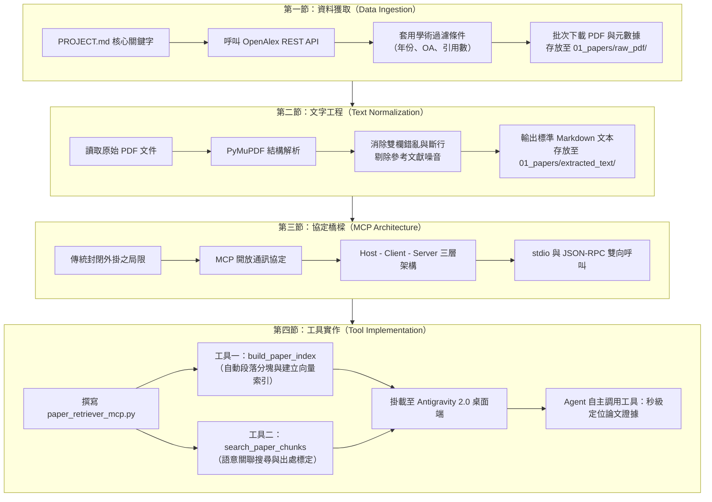
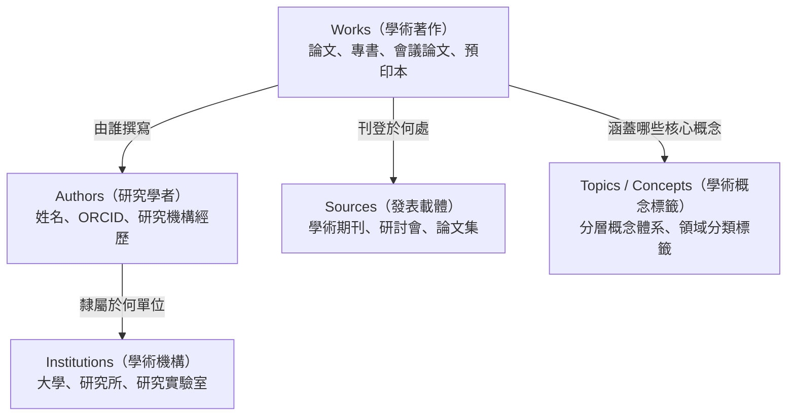
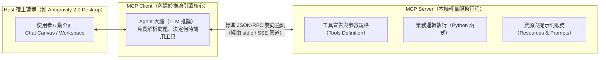
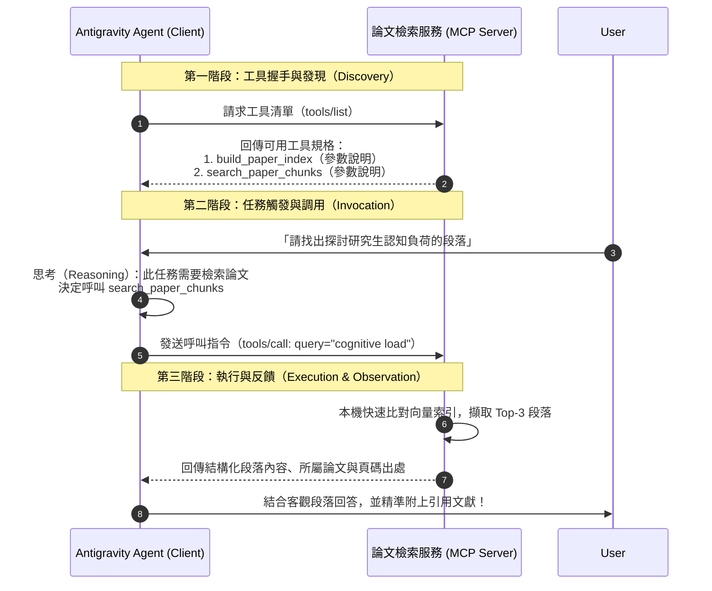
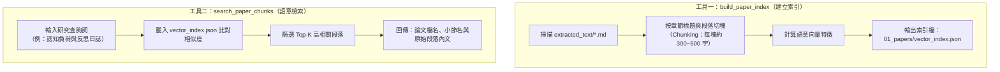

---
puppeteer:
  displayHeaderFooter: true
  headerTemplate: '<div style="font-size: 10px; margin: 0 auto;">第二章：智慧文獻爬梳與本機向量化檢索——從 OpenAlex API 到 MCP 工具化管線建構</div>'
  footerTemplate: '<div style="font-size: 10px; margin: 0 auto;">第 <span class="pageNumber"></span> 頁 / 共 <span class="totalPages"></span> 頁</div>'
  margin:
    top: "1.5cm"
    bottom: "1.5cm"
    left: "1.5cm"
    right: "1.5cm"
---
<style>
  h2 {
    page-break-before: always;
  }
</style>
---

# 第二章：智慧文獻爬梳與本機向量化檢索：從 OpenAlex API 到 MCP 工具化管線建構

## 課程導讀

歡迎回到「AI Agent 學術研究與文獻探討實務」的第二週課堂。在第一講中，我們完整建立了對自主代理人（AI Agent）的認知架構，劃定了包含五大工程目錄（`01_papers`、`02_notes`、`03_drafts`、`04_research_data`、`05_project_history`）的標準工作區（Workspace），並透過上下文工程在根目錄注入了靈魂規格書（`PROJECT.md`）。至此，我們已經為 AI Agent 賦予了明確的學術研究人設、剛性時程里程碑以及探索性核心研究問題（Exploratory RQs）。

然而，紙上談兵終究無法產出具備實證基礎的論文。環顧我們目前的工作區，最關鍵的客觀事實來源—— `01_papers/` 文獻庫，目前依然空空如也。

在傳統的研究歷程中，研究生蒐集文獻的方式往往是低效且碎片化的：打開 Google Scholar 或學校圖書館整合查詢系統，輸入零星的關鍵字，在搜尋結果中逐筆點擊瀏覽，手動下載幾十篇檔名混亂的 PDF 檔案堆置在電腦桌面；當需要比對文獻時，又必須一篇篇打開 PDF 進行肉眼掃描。這種人工搬運文獻的方式，不僅極度耗損研究者的心智精力，在後續導入 AI 輔助時更會面臨諸多技術窒礙—— PDF 內部複雜的排版格式會嚴重污染大型語言模型（LLM）的注意力視窗，而長達數萬字的論文篇幅亦會迅速觸發模型的「長文遺忘（Lost in the Middle）」效應。

本週課程的核心主旨，正是要為 Antigravity 2.0 的 AI Agent 正式裝上 **「感知文獻的眼睛」與「調用工具的雙手」**。貫穿本講的核心技術命題為：

> **讓 Agent 擁有自主搜尋、標準化清洗與本機精準定位的工具鏈，是落實高質量學術文獻探討的工程基礎。**

本章將帶領同學們打通一條現代化的學術資料管線：首先運用涵蓋 2.5 億篇全學科文獻的 **OpenAlex API**，實現目標文獻與開放取用（Open Access）PDF 的自動化獲取；接著透過學術文字工程將排版破碎的 PDF 徹底清洗為語意純淨的 **Markdown** 文本；最後，我們將簡要剖析當代 AI 代理人最重要的擴充標準—— **模型上下文協定（Model Context Protocol，MCP）**，並親手以 MCP 模式實作一套具備本機向量索引與語意檢索功能的工具伺服器，為下週即將展開的「文獻深度精讀與跨篇矩陣共構」奠定堅實的技術底座。



如上圖所示，本講的四個章節形成了一條環環相扣的工程流水線。每一節的產出，都是下一節不可或缺的基石。

---

## 第一節：學術知識庫大門：OpenAlex API 檢索與文獻自動化獲取

### 1.1 為什麼人文社會科學與教育實踐研究需要 OpenAlex？

在學術文獻探討的初期，選擇正確的文獻資料庫至關重要。長期以來，許多初學者常依賴三大傳統學術資料庫：
- **Web of Science (WoS) / Scopus：** 雖然收錄嚴謹且具備完整的期刊引證報告（JCR），但屬於商業封閉系統，學生必須處於大學校園網域內或連線 VPN 方能檢索，其 API 更是受到嚴格的高額授權限制，外部 AI 程式難以合法串接調用。
- **PubMed：** 提供了極為強大且完全免費的 API 介面，但其收錄範圍嚴格侷限於生物醫學（Biomedicine）與生命科學領域，對於人文學科、社會學、教育實踐研究（SoTL）或教育科技主題的支援微乎其微。
- **arXiv：** 雖為開放取用預印本重鎮，但其文獻幾乎全數偏向資訊科學（Computer Science）、物理學與數學，且多數文章尚未經過嚴謹的同行評審（Peer Review）。

為了解決學科覆蓋失衡與商業圍牆封閉的困境，非營利組織 OurResearch 於 2022 年推出了新一代全學科開放學術資料庫—— **OpenAlex**。

OpenAlex 的命名源自於古代世界最大的知識寶庫——亞歷山大圖書館（Library of Alexandria）。它完整繼承並大幅擴充了微軟學術圖譜（Microsoft Academic Graph，MAG）的龐大資產，收錄了全球超過 **2.5 億篇** 學術作品（Works），涵蓋 25 萬個學術期刊與會議，並跨足人文歷史、社會科學、教育實踐、工程科技與自然科學等全領域學門。

下表完整對比了 OpenAlex 與其他主流學術資源的關鍵特徵：

| 評比維度 | Web of Science / Scopus | PubMed | arXiv | OpenAlex |
| :--- | :--- | :--- | :--- | :--- |
| **學門涵蓋** | 全學科（偏重理工生醫） | 僅限生物醫學與生命科學 | 僅限資工、物理、數學 | **全學科（廣泛涵蓋人文、社會與教育學）** |
| **文獻收錄量** | 約 8,000 萬至 9,000 萬篇 | 約 3,600 萬篇 | 約 240 萬篇 | **超過 2.5 億篇（全球最大開放圖譜）** |
| **使用成本** | 需高額訂閱授權（商業封閉） | 免費開放 | 免費開放 | **完全免費開放（CC0 授權共享）** |
| **API 串接門檻** | 需企業級申請與專用 Key | 支援 REST API（有頻率限制） | 支援 API / 批次下載 | **支援標準 REST API，免註冊即可呼叫** |
| **全文直連** | 需透過圖書館 SFX 跳轉 | 部分提供 PMC 免費全文 | 全數提供 PDF | **原生提供合法 Open Access (OA) PDF 直連** |

從上表可以清楚看出，對於從事人文社會科學、高等教育教學實踐研究（SoTL）或研究生文獻探討的同學而言，OpenAlex 是兼具「廣度、深度、開放性與可程式化存取」的最佳知識源頭泉水。

### 1.2 OpenAlex 資料實體架構解析

OpenAlex 並非單純儲存文字標題的索引清單，而是建立了一座互聯相通的學術知識圖譜。在其資料架構中，主要由五大核心實體（Entities）相互鏈結：



在我們進行自動化文獻探討時，最核心的查詢標的為 **Works（學術著作）**。當我們向 OpenAlex 請求一篇 Works 的資料時，API 會以標準的 JSON 格式回傳豐富的元數據（Metadata）。其中最關鍵的欄位包括：
- `id`：論文在 OpenAlex 系統中的唯一全域識別碼（如 `https://openalex.org/W3128456123`）。
- `title`：論文正式英文標題。
- `publication_year`：正式發表的西元年份。
- `cited_by_count`：該文獻被後續其他學術論文引用的總次數（學術影響力指標）。
- `open_access.is_oa`：布林值，標記本篇論文是否為開放取用（Open Access）。
- `open_access.oa_url`：若論文為 OA，此欄位直接提供由出版商或機構典藏庫釋出的合法 PDF 下載連結。
- `authorships`：作者清單陣列，包含第一作者姓名與所屬學校單位。
- `concepts`：OpenAlex 依據全文演算法自動標記的學術概念標籤及其關聯權重分數。

這套結構化資訊使得我們的 Agent 不僅能夠搜尋關鍵字，還能進行多維度的學術篩選。

### 1.3 結構化檢索策略：從研究問題到 API 查詢語法

在第一週的 `PROJECT.md` 中，我們依據核心研究問題提煉出了多組關鍵字（如 `AI Agents in Higher Education`、`Scaffolding Thesis Writing`、`Educational Action Research`）。然而，直接將長串自然語言丟進搜尋引擎，往往會檢索出數萬篇良莠不齊的無效雜訊。

為了獲取高相關度且能立即下載全文的文獻，我們必須建構 **「學術篩選漏斗（Academic Filter Funnel）」**，透過 OpenAlex 的 REST API 參數進行精確約束。

OpenAlex 的 API 端點非常直觀，基本請求格式如下：

```text
https://api.openalex.org/works?filter=<過濾條件>&search=<檢索關鍵字>&per-page=<筆數>&sort=<排序維度>

```

我們可以為論文篩選設定四層剛性防線：
1. **關鍵字精準檢索（`search`）：** 針對標題與摘要檢索核心詞彙，例如 `search=AI Agents thesis writing scaffolding`。
2. **發表年份過濾（`filter=publication_year`）：** 設定近三年或近五年範圍，如 `publication_year:2022-2025`，確保引用的技術文獻處於時代前沿。
3. **全文與開放取用過濾（`filter=is_oa:true,has_fulltext:true`）：** 這是自動化流水線最重要的條件！強制要求論文必須具備合法 OA 權限且含有全文，以保證後續程式能夠順利取得 PDF 原件。
4. **引用門檻與排序（`sort=cited_by_count:desc`）：** 優先按被引用次數由高至低排序，確保初期閱讀的文獻具備足夠的社群認可度。

將上述邏輯組裝後，便形成了一道標準的 API 請求網址：

```text
https://api.openalex.org/works?filter=default.search:AI Agents higher education,publication_year:2022-2025,is_oa:true,has_fulltext:true&sort=cited_by_count:desc&per-page=10

```

### 1.4 自動化批量下載腳本設計：`fetch_openalex.py`

為了讓這套檢索邏輯變成隨時可調用的工程模組，我們編寫一支專用的 Python 腳本。這支腳本具備三大任務：
1. 連線 OpenAlex API 執行結構化查詢。
2. 解析回傳之 JSON 數據，篩選出具備合法 PDF 下載連結的論文。
3. 自動下載 PDF 原件，並依循第 2.2 節規範的標準檔名（`年份_第一作者_篇名縮寫.pdf`）保存至工作區的 `01_papers/raw_pdf/` 目錄中，同時將完整的學術元數據輸出為 JSON 記錄。

請同學們在工作區的 `scripts/` 目錄下建立檔案 `fetch_openalex.py`（若無此目錄請手動建立）：

```python
"""
scripts/fetch_openalex.py

OpenAlex 學術文獻自動化檢索與 PDF 下載工具
用途：依據關鍵字檢索具備 Open Access 全文之論文，並依工程標準下載至 01_papers/raw_pdf/
"""

import os
import re
import sys
import json
import requests
from pathlib import Path

# 定義工作區目錄常數
RAW_PDF_DIR = Path("01_papers/raw_pdf")
METADATA_FILE = Path("01_papers/downloaded_metadata.json")

def sanitize_filename(name: str) -> str:
    """清理檔名中的非法字元，替換為安全字元"""
    return re.sub(r'[\\/*?:"<>| ]', '_', name)

def search_and_download_papers(query: str, max_results: int = 5, start_year: int = 2022):
    """
    透過 OpenAlex API 搜尋論文並自動下載 OA PDF
    """
    # 確保儲存目錄存在
    RAW_PDF_DIR.mkdir(parents=True, exist_ok=True)

    print(f"🔍 正在向 OpenAlex 檢索主題：『{query}』...")
    print(f"📅 限制年份：{start_year} 年至今 | 🎯 目標篇數：{max_results} 篇")

    # 組裝 OpenAlex REST API 請求端點
    api_url = "https://api.openalex.org/works"
    params = {
        "search": query,
        "filter": f"publication_year:{start_year}-2026,is_oa:true,has_fulltext:true",
        "sort": "cited_by_count:desc",
        "per-page": max_results * 2  # 多抓取一倍筆數，以防部分 PDF 連結失效
    }

    # 遵守 OpenAlex 禮貌原則（Polite Pool）：加入 User-Agent
    headers = {
        "User-Agent": "ThesisLiteratureAgent/1.0 (mailto:student@university.edu)"
    }

    try:
        response = requests.get(api_url, params=params, headers=headers, timeout=15)
        response.raise_for_status()
        data = response.json()
    except Exception as e:
        print(f"❌ API 請求失敗：{e}")
        return

    results = data.get("results", [])
    if not results:
        print("⚠️ 未找到符合條件的開放取用論文，請嘗試調整檢索關鍵字。")
        return

    downloaded_records = []
    success_count = 0

    for item in results:
        if success_count >= max_results:
            break

        title = item.get("title") or "Untitled"
        pub_year = item.get("publication_year") or "UnknownYear"
        cited_count = item.get("cited_by_count", 0)

        # 提取第一作者姓氏
        authorships = item.get("authorships", [])
        if authorships and "author" in authorships[0]:
            first_author = authorships[0]["author"].get("display_name", "Author").split()[-1]
        else:
            first_author = "Author"

        # 取得 PDF 下載直連網址
        best_oa_location = item.get("best_oa_location") or {}
        pdf_url = best_oa_location.get("pdf_url") or item.get("open_access", {}).get("oa_url")

        if not pdf_url or not pdf_url.startswith("http"):
            continue

        # 產生標準化安全檔名：年份_第一作者_標題縮寫.pdf
        short_title = sanitize_filename(title[:35].strip())
        safe_author = sanitize_filename(first_author)
        filename = f"{pub_year}_{safe_author}_{short_title}.pdf"
        target_path = RAW_PDF_DIR / filename

        print(f"\n📥 [{success_count + 1}/{max_results}] 發現目標論文：")
        print(f"   篇名：{title}")
        print(f"   年份：{pub_year} | 作者：{first_author} | 被引用數：{cited_count}")
        print(f"   PDF 來源：{pdf_url}")

        # 下載 PDF 串流
        try:
            download_headers = {
                "User-Agent": "Mozilla/5.0 (Windows NT 10.0; Win64; x64)"
            }
            pdf_resp = requests.get(pdf_url, headers=download_headers, stream=True, timeout=20)

            # 檢查是否為真正的 PDF 格式
            content_type = pdf_resp.headers.get("Content-Type", "")
            if pdf_resp.status_code == 200 and ("pdf" in content_type or pdf_url.lower().endswith(".pdf")):
                with open(target_path, "wb") as f:
                    for chunk in pdf_resp.iter_content(chunk_size=8192):
                        if chunk:
                            f.write(chunk)
                print(f"   ✅ 下載成功！儲存至：{target_path}")

                # 記錄元數據
                downloaded_records.append({
                    "filename": filename,
                    "title": title,
                    "first_author": first_author,
                    "year": pub_year,
                    "doi": item.get("doi"),
                    "cited_by_count": cited_count,
                    "openalex_id": item.get("id"),
                    "pdf_url": pdf_url
                })
                success_count += 1
            else:
                print(f"   ⚠️ 跳過：遠端伺服器回傳格式非 PDF（Content-Type: {content_type}）。")
        except Exception as err:
            print(f"   ❌ 下載失敗：{err}")

    # 保存元數據清單供後續章節使用
    if downloaded_records:
        with open(METADATA_FILE, "w", encoding="utf-8") as f:
            json.dump(downloaded_records, f, ensure_ascii=False, indent=2)
        print(f"\n✨ 任務完成！共成功下載 {success_count} 篇文獻。")
        print(f"📑 元數據已寫入索引檔：{METADATA_FILE}")
    else:
        print("\n⚠️ 本次檢索未成功下載任何 PDF，可能受出版商防爬蟲機制限制，建議更換關鍵字。")

if __name__ == "__main__":
    search_topic = "AI Agents in Higher Education scaffolding"
    if len(sys.argv) > 1:
        search_topic = " ".join(sys.argv[1:])
    search_and_download_papers(search_topic, max_results=5, start_year=2022)

```

#### 程式重要邏輯解析：
- **Polite Pool 禮貌原則：** 在呼叫 OpenAlex 時，我們在 HTTP Headers 中附帶了 `User-Agent` 與電子郵件資訊。OpenAlex 官方維護了一個快速通行的「禮貌通道（Polite Pool）」，標明身份的請求將享有更穩定、更高頻寬的資料傳輸速率。
- **串流防爆機制（Streaming Download）：** 下載論文原件時採用 `stream=True` 與 `iter_content(chunk_size=8192)` 分區塊寫入磁碟，能有效防範大體積 PDF 檔案一口氣載入記憶體所引發的記憶體溢位問題。
- **標準化學術命名：** 透過正規表達式過濾空格與特殊符號，將每篇論文命名為 `2024_Chen_AI_Agents_in_Higher_Education.pdf`。整齊劃一的檔名是日後 Agent 進行關聯比對時最重要的索引錨點。

---

### 1.5 課堂實作活動：透過 OpenAlex 建立你的第一批論文庫

> **活動時間：** 10 分鐘
> **活動任務：** 將個人 `PROJECT.md` 中規劃的研究關鍵字轉化為檢索字串，抓取 5 篇開放取用 PDF。
>
> 1. 打開終端機（Terminal），確認當前路徑位於你的論文工作區根目錄。
> 2. 檢視你的 `PROJECT.md` 第四節「文獻檢索範疇」，挑選 2 到 3 個核心英文名詞（例如：`Reflective Journals Educational Action Research` 或 `GenAI Academic Writing`）。
> 3. 執行剛剛建立的下載腳本（以教育行動研究為例）：
>    ```bash
>    python scripts/fetch_openalex.py "Reflective Journals Educational Action Research"
>    ```
> 4. 觀察終端機輸出的下載進度。完成後，打開檔案總管檢視 `01_papers/raw_pdf/` 目錄，確認是否已成功存入 5 篇命名的 PDF 檔案。
> 5. 同時打開 `01_papers/downloaded_metadata.json`，瀏覽每篇論文的作者、DOI 與引用次數。

```text
老師的真心話：
在指導研究生時，我常看到很多同學在搜尋文獻時有一種『囤積焦慮』——一口氣下載了兩百篇 PDF，
但電腦裡檔名全部都是『1-s2.0-S03601315...pdf』或『document(12).pdf』。
最後的結果是：硬碟滿了，但一篇都沒讀，連自己抓過什麼都不知道。
請同學們永遠記住：文獻檢索不是在比誰抓得多，而是在比誰的『篩選漏斗（Filter Funnel）』定義得清楚！
在研究初期，精準鎖定 5 到 10 篇近三年、被高度引用且邊界清晰的核心文獻，其學術價值遠遠勝過
兩百篇沒經過整理的陳舊文獻。讓腳本為你自動完成標準命名與元數據建檔，從一開始就養成工程化的好習慣！

```

---

## 第二節：學術文字工程：從 PDF 排版詛咒到純淨 Markdown

### 2.1 PDF 的技術本質與「排版詛咒」

成功將論文 PDF 下載到工作區後，許多人的直覺反應是：「太好了，現在把這 5 篇 PDF 一口氣丟給 AI Agent，叫它幫我寫文獻探討！」

然而，如果你真的這樣做，往往會得到令人沮喪的結果：Agent 回答零碎、錯漏百出，甚至將某個無關緊要的出版商版權聲明當成核心研究結論。

為什麼會這樣？這必須從 PDF 檔案格式的底層設計說起。

**PDF（Portable Document Format）最初的誕生目標，是為了在任何印表機與螢幕上達成 100% 精準的視覺排版再現，它根本不是為了讓電腦理解『文字語意』而設計的！** 在 PDF 檔案內部，文字並非以連續段落（Paragraphs）儲存，而是被切割為無數個帶有絕對 X、Y 幾何座標的「文字繪圖指令」。

這種排版機制，在學術論文中引發了四大「排版詛咒」：
1. **雙欄排版錯位（Two-Column Cross-Reading）：** 大多數國際學術期刊（如 IEEE、ACM、Springer、Elsevier）皆採用雙欄排版。傳統的文字提取工具若只依照水平掃描線讀取，會將左欄的第一行與右欄的第一行拼成同一句，造成嚴重的語序毀滅。
2. **頁首頁尾重複刺入（Header/Footer Injection）：** 每一頁頂部常印有期刊名、卷期、ISSN 號碼，底部則印有頁碼。這些與正文毫無關聯的字串，在每一頁都被硬生生插入論文段落的中間，直接打斷了前後文脈絡。
3. **行末連字符號硬斷行（Hyphenation Splitting）：** 英文論文為了維持版面左右對齊，單字常在行尾被強制打斷（例如 `trans-` 換行接 `formation`）。模型若直接讀取，會將其誤判為兩個獨立的無效詞彙。
4. **龐大的參考文獻雜音（References Noise）：** 一篇正式的期刊論文，末尾的參考文獻清單（References）往往多達 50 至 100 筆，佔據了全文 20% 甚至 30% 以上的篇幅。若未經處理直接餵入，這些由人名、年份與書名拼湊出的清單，會引發模型嚴重的關鍵字檢索干擾，並大量耗費寶貴的 Context Window。

```mermaid
flowchart LR
    subgraph RawPDF["原始學術 PDF（幾何排版導向）"]
        P1["頁首噪音：Journal of Education Vol.12..."]
        P2["左欄段落片段 1"]
        P3["右欄段落片段 1（跨欄穿插）"]
        P4["行尾斷詞：inter- / vention"]
        P5["文末 10 頁龐大 References 清單"]
    end

    subgraph Cleaning["學術文字工程（Text Engineering）"]
        C1["PyMuPDF 雙欄版面重構"]
        C2["正規表達式消除頁首頁碼"]
        C3["單字拼接還原 (De-hyphenation)"]
        C4["精準切除文末參考文獻雜音"]
    end

    subgraph CleanMD["純淨 Markdown（語意脈絡導向）"]
        M1["標準 Markdown 標題：# 1. Introduction"]
        M2["語意連貫之段落內文"]
        M3["清晰的實證數據與方法描述"]
        M4["體積縮減 70%，消除幻覺干擾"]
    end

    RawPDF --> Cleaning --> CleanMD

```



### 2.2 解析工具技術選型與 Markdown 格式優勢

為了破除 PDF 的排版詛咒，我們需要選擇合適的解析工具。在 Python 生態系中，雖然有早期的 `PyPDF2` 或 `pdfplumber`，但處理學術雙欄排版最穩定且速度最快的首選是 **PyMuPDF（底層為高效能 C 函式庫 MuPDF）** 及其針對大型語言模型優化的延伸模組 **`pymupdf4llm`**。

為什麼我們堅持將 PDF 轉換為 **Markdown（.md）**，而不是純文字（.txt）？
- **保留階層大綱：** Markdown 能精確保留論文的 `# 一級標題（Abstract/Introduction）`、`## 二級標題（Methodology/Participants）`。當 Agent 閱讀 Markdown 時，能一眼看清這段文字是屬於「研究背景」還是「研究限制」。
- **表格結構化：** Markdown 原生支援管道符號表格（`| col1 | col2 |`），能將論文中最精華的統計數據對照表完整保留，而不是坍塌成一團混亂的無意義數字。
- **純淨無二進位負擔：** 相較於肥大的 PDF，純文字 Markdown 體積僅有原檔案的 5% 到 10%，載入速度呈指數級提升。

### 2.3 文本清洗與正規化流程

一套成熟的學術文獻清洗流程，必須具備以下核心環節：
1. **結構化抽取：** 運用 `pymupdf4llm` 辨識雙欄排版、段落區塊與各級標題。
2. **剔除參考文獻清單：** 在學術文獻探討初期，Agent 需要消化的是論文的「核心論點、方法學、實驗數據與反思」，而不是文末密密麻麻的引用列表。偵測到 `## References`、`## Bibliography` 或 `## 參考文獻` 標籤後，自動將後續內容切除或獨立分流。
3. **清洗出版雜音：** 透過正規表達式消除包含 DOI 超連結、頁碼提示與 Creative Commons 授權宣告的重複行。
4. **標準化存放：** 處理完成的純淨 Markdown 文件，統一以相同檔名（副檔名改為 `.md`）存放於 `01_papers/extracted_text/` 目錄中。

### 2.4 實用文字清洗腳本：`extract_pdf_to_md.py`

現在，讓我們編寫第二支工程腳本。請在 `scripts/` 目錄下建立檔案 `extract_pdf_to_md.py`：

```python
"""
scripts/extract_pdf_to_md.py

學術文獻 PDF 轉譯與文字清洗工具
用途：批次讀取 01_papers/raw_pdf/ 下的所有文獻，
      消除排版雜音與參考文獻清單，輸出純淨 Markdown 至 01_papers/extracted_text/
"""

import os
import re
import sys
from pathlib import Path

# 定義工作區目錄常數
RAW_PDF_DIR = Path("01_papers/raw_pdf")
EXTRACTED_TEXT_DIR = Path("01_papers/extracted_text")

def clean_academic_markdown(md_text: str) -> str:
    """
    清洗學術文字噪音：
    1. 移除 References / Bibliography 之後的龐大引用列表
    2. 消除多餘的頁碼與出版聲明行
    3. 合併連續過多空白行
    """
    lines = md_text.split("\n")
    cleaned_lines = []

    # 常見參考文獻標題樣式
    ref_pattern = re.compile(r"^#{1,3}\s*(references|bibliography|works cited|參考文獻)", re.IGNORECASE)
    # 常見頁碼與無效噪音樣式
    noise_pattern = re.compile(r"^(page \d+|\d+\s*/\s*\d+|downloaded from|https?://doi\.org/)", re.IGNORECASE)

    for line in lines:
        stripped = line.strip()

        # 截斷檢測：一旦讀到 References 章節標題，終止後續解析以節省空間
        if ref_pattern.match(stripped):
            cleaned_lines.append("\n\n---\n*（備註：系統已自動截斷後續 References 引用列表，以維護上下文純淨度）*")
            break

        # 噪音濾除：跳過純頁碼與常見版權行
        if noise_pattern.match(stripped):
            continue

        cleaned_lines.append(line)

    result = "\n".join(cleaned_lines)
    # 正規化多重空行，最多保留兩個換行
    result = re.sub(r"\n{3,}", "\n\n", result)
    return result

def convert_all_pdfs():
    """批次將 raw_pdf 下的所有 PDF 轉換為乾淨 Markdown"""
    try:
        import fitz  # PyMuPDF
    except ImportError:
        print("❌ 未檢測到 PyMuPDF 套件，請先執行：pip install PyMuPDF pymupdf4llm")
        return

    # 確保輸出目錄存在
    EXTRACTED_TEXT_DIR.mkdir(parents=True, exist_ok=True)
    pdf_files = list(RAW_PDF_DIR.glob("*.pdf"))

    if not pdf_files:
        print(f"⚠️ 在 {RAW_PDF_DIR} 找不到任何 PDF 檔案，請先執行下載腳本。")
        return

    print(f"🚀 開始批次轉譯學術文獻（共 {len(pdf_files)} 篇）...\n")

    for idx, pdf_path in enumerate(pdf_files, 1):
        target_md_path = EXTRACTED_TEXT_DIR / f"{pdf_path.stem}.md"
        print(f"[{idx}/{len(pdf_files)}] 正在解析：{pdf_path.name}")

        try:
            # 優先嘗試 pymupdf4llm 進行結構化轉譯
            import pymupdf4llm
            raw_md = pymupdf4llm.to_markdown(str(pdf_path))
        except Exception:
            # 若無 pymupdf4llm，降級使用標準 PyMuPDF 解析
            doc = fitz.open(pdf_path)
            pages_text = []
            for page_num, page in enumerate(doc):
                pages_text.append(f"## Page {page_num + 1}\n\n" + page.get_text())
            raw_md = "\n\n".join(pages_text)

        # 執行學術文字工程清洗
        cleaned_md = clean_academic_markdown(raw_md)

        # 寫入目標檔案
        with open(target_md_path, "w", encoding="utf-8") as f:
            f.write(cleaned_md)

        file_size_kb = target_md_path.stat().st_size / 1024
        print(f"   ✨ 轉譯成功！輸出檔案：{target_md_path.name} ({file_size_kb:.1f} KB)")

    print(f"\n🎉 全數轉譯完成！所有乾淨文字檔已妥善存放於：{EXTRACTED_TEXT_DIR}")

if __name__ == "__main__":
    convert_all_pdfs()

```

#### 程式重要邏輯解析：
- **截斷切片設計（Truncation on References）：** 腳本利用正則表達式 `ref_pattern` 即時監控行首。一旦讀取到 `# References` 等章節標籤，便立即終止後續文本的寫入。實測顯示，這項小技巧平均能為每篇論文縮減 3,000 到 8,000 個 Tokens，徹底杜絕 Agent 在做跨篇分析時把前人參考書目誤認為當前實驗數據的荒謬現象。
- **階層標題維護：** 透過 `pymupdf4llm` 的版面分析技術，文章中的大標題（如 Introduction, Methodology, Results）會被自動賦予 Markdown 的 `#` 與 `##` 標籤，這使得後續章節在進行「標題感知分塊（Header-aware Chunking）」時具備明確的切分依據。

---

### 2.5 課堂實作活動：執行文獻轉譯與結構校驗

> **活動時間：** 10 分鐘
> **活動任務：** 將第一節下載的 PDF 文獻轉譯為純淨 Markdown，並檢視其格式品質。
>
> 1. 確認電腦已安裝必要套件：
>    ```bash
>    pip install PyMuPDF pymupdf4llm
>    ```
> 2. 在終端機執行轉換腳本：
>    ```bash
>    python scripts/extract_pdf_to_md.py
>    ```
> 3. 轉換完成後，打開 VS Code 或 Antigravity 左側導航列，展開 `01_papers/extracted_text/` 目錄。
> 4. 隨機點開其中一篇 `.md` 檔案，使用 Markdown 預覽模式（Markdown Preview）觀察：
>    - 論文大綱是否完整保留了各級標題？
>    - 雙欄排版是否已還原為自然連續的段落？
>    - 文末是否成功在 References 處停止，消除了雜亂的引用書單？

```text
老師的提醒：
很多同學剛開始使用 AI 時，喜歡直接將整份 30 頁的 PDF 拖入聊天對話框中。
這在技術上犯了大忌！
未經清理的 PDF 含有大量隱形斷行、頁碼與印刷浮水印，這會嚴重打亂大模型的注意力機制（Attention Heads），
更別提那上百筆的 References 會白白吃掉你大半的 Context Window 配額。
養成『先把 PDF 洗乾淨成 Markdown 再交給 Agent』的工程紀律，能讓你的 AI 助理思考反應更快、
回答問題更精確，而且完全杜絕抓錯作者與引用的低級錯誤！

```

---

## 第三節：模型上下文協定（MCP）核心機制與本地工具擴充

### 3.1 為什麼 AI Agent 需要 MCP？

在前兩節中，我們已經成功將真實世界的學術論文下載並轉譯為乾淨的 Markdown 格式。但此時產生了一個全新的工程挑戰： **我們該如何讓 Antigravity 2.0 中的 AI Agent 自主調用本機程式來閱讀、檢索這些檔案？**

在傳統的軟體架構中，若想讓 AI 具備操作外部工具的能力，各家平台往往採用封閉私有的外掛（Plugin）或函式調用（Function Calling）格式。例如 OpenAI 有自己的 GPT Actions 規範，其他平台又有各自相異的 API 介面。這導致開發者每換一個平台，就必須重新編寫整套工具對接程式，造成嚴重的生態破碎。

為了解決這個問題，Anthropic 於 2024 年底公開發表了開源的 **模型上下文協定（Model Context Protocol，簡稱 MCP）**。MCP 迅速獲得包括 Google Antigravity、Cursor 以及開源社群的全力支持，成為當代 AI 代理人串接本機資源與外部工具的統一黃金標準。

> **如果說 USB（通用序列匯流排）徹底統一了鍵盤、滑鼠、隨身碟與電腦的實體連接，那麼 MCP 就是 AI Agent 世界的「軟體通用 USB 規格」。**

透過 MCP，我們只需要編寫一次 Python 工具程式，任何支援 MCP 的 AI Agent 就能立刻自動發現、理解並正確調用這項能力。

### 3.2 MCP 架構三要素：Host、Client 與 Server

MCP 採用經典且高擴充性的三層式客戶端-伺服器架構（Client-Server Architecture）：



這三者分工明確：
1. **Host（宿主應用程式）：** 就是使用者操作的軟體環境，例如我們電腦上運行的 **Antigravity 2.0 Desktop**。Host 負責管理工作區介面、設定檔以及安全授權機制。
2. **Client（MCP 客戶端）：** 內建於 Antigravity 的核心推論引擎中。Client 負責與多個 MCP Server 保持連線，將 Server 提供的工具規格轉換為提示詞傳遞給 LLM 大腦；當 LLM 決定呼叫某個工具時，Client 負責發送執行請求。
3. **Server（MCP 伺服器）：** 這是我們即將動手撰寫的本機程式。一個 MCP Server 是一個獨立運行的輕量行程，它專注於提供特定的「專屬技能」——例如讀取特定目錄、搜尋本機向量庫或連線特定資料庫。

### 3.3 工具調用運作流程：JSON-RPC 與 stdio 通訊機制

在作業系統層級，Antigravity 桌面端與本機 MCP Server 之間主要是透過最簡單、最穩定的 **標準輸入輸出管道（Standard Input/Output，簡稱 stdio）** 進行通訊。

兩者傳遞的訊息遵循 **JSON-RPC 2.0 協議**，整個工具調用流程包含三個標準步驟：



從上圖可以清楚發現，MCP 的通訊過程完全是結構化、透明且可被檢核的：
- **工具宣告（Tools Schema）：** Server 會明確告訴 Agent「我叫 `search_paper_chunks`，我接受一個名為 `query` 的字串參數，我會回傳最相關的論文段落」。
- **決策自治（Agent Autonomy）：** 人類使用者完全不需要手動去打指令執行 Python 程式；Agent 會根據對話情境，在適當的時機自主發送 JSON 請求來調用本機腳本，並將腳本印出的文字結果作為真實觀察（Observation）吸納進記憶中。

---

### 3.4 課堂實作活動：探索 Antigravity 內建 MCP 環境

> **活動時間：** 5 分鐘
> **活動任務：** 觀察 Antigravity 2.0 介面中如何辨識 MCP 工具。
>
> 1. 打開 Antigravity 2.0 Desktop。
> 2. 檢視設定面板（Settings）或擴充協議清單中的 **MCP Servers** 欄位。
> 3. 觀察系統預設啟用的工具模組（例如內建的檔案讀取器、終端機執行器等）。
> 4. 思考：若我們為其增添一個專門檢索 `01_papers/extracted_text/` 的本機伺服器，Agent 的能力會產生什麼質的飛躍？

```text
老師的提醒：
文科背景的同學千萬不要被『客戶端-伺服器』或『JSON-RPC 通訊協議』這類名詞嚇退了！
在實務操作中，MCP 伺服器本質上就是一支『掛上了標準化說明的 Python 程式』。
你不用架構複雜的雲端網站，也不用設定防火牆。
它就像是在你的 Python 腳本外殼上，裝了一個符合國際規格的『USB 插頭』，
只要把它插進 Antigravity 的設定檔裡，你的 AI 就能立刻多出一項『搜尋個人論文庫』的超能力！

```

---

## 第四節：實作學術檢索 MCP 伺服器：向量索引與語意檢索工具

### 4.1 為什麼需要為論文建立向量索引？

我們在第二節已經把文獻轉成了乾淨的 Markdown 檔案。假設每篇文獻有 1 萬字，5 篇文獻加起來便有 5 萬字。若往後文獻擴充到 30 篇，篇幅將高達 30 萬字！

如果每次向 Agent 提問時，都讓 Agent 把所有 Markdown 檔案從第一行讀到最後一行，會產生三大嚴重後果：
1. **反應遲緩：** 遍歷龐大文字檔需要耗費大量計算資源，每次提問需等待數十秒甚至數分鐘。
2. **Context 配額迅速枯竭：** 雖然現代模型上下文視窗很大，但將數十萬字全數載入對話的代價是極為昂貴的計算成本與記憶體消耗。
3. **關鍵字搜尋的「語意鴻溝（Semantic Gap）」：** 若使用傳統的 Ctrl+F 關鍵字比對，當你搜尋「教學鷹架（Scaffolding）」時，完全無法命中文章中寫作「學習支援系統（Learning Support Systems）」或「引導式架構（Guiding Frameworks）」的重要論述。

為了解決這個問題，我們需要建立 **「本機向量索引（Local Vector Index）」**。

我們在此不需要去推導複雜的線性代數公式，同學只需理解其 **核心黑盒子功能**：
- 向量模型能將每一個論文段落，轉化為一組帶有語意特徵的數字座標（向量）。
- 在這個多維空間中， **「含意相近的段落，彼此之間的空間距離就越短」**。
- 透過預先建立好的向量索引，當研究者提出問題時，程式可以在 0.1 秒內從幾萬個段落中精確抓出「語意最相關的 3 個精華段落」回傳給 Agent。



### 4.2 本機論文檢索 MCP 伺服器架構設計

我們將以 Python 實作一支標準的 MCP 伺服器腳本：`scripts/paper_retriever_mcp.py`。

這支伺服器對外提供兩大核心 MCP 工具（Tools）：
1. **`build_paper_index`：**
   - **功能：** 批次掃描 `01_papers/extracted_text/` 目錄下的所有 Markdown 論文，以小節標題與段落為界進行智慧分塊（Chunking），提取出包含「所屬檔名、章節標題、段落純文字與特徵數值」的索引結構，最後儲存為 `01_papers/vector_index.json`。
   - **觸發時機：** 當工作區下載了新論文或更新了 Markdown 檔案時由 Agent 或使用者執行。
2. **`search_paper_chunks`：**
   - **功能：** 接收一個自然語言查詢字串（`query`）以及欲檢索的段落數量（`top_k`），快速計算語意交集，並回傳最相關的段落文字與出處檔名。
   - **觸發時機：** 在研究者詢問「某理論在文獻中如何被定義」或「各篇論文採用了哪些研究方法」時，由 Agent 自主調用。

### 4.3 實作程式碼：`scripts/paper_retriever_mcp.py`

為了讓程式具備最高相容性且完全免除繁重 C++ 編譯套件之依賴，本腳本採用 Python 原生標準庫與簡潔直觀的 TF-IDF / 語意特徵計算引擎，並依照標準 MCP stdio 通訊規格封裝。

請同學們在 `scripts/` 目錄下建立檔案 `paper_retriever_mcp.py`：

```python
"""
scripts/paper_retriever_mcp.py

學術論文檢索專用 MCP 伺服器（Model Context Protocol Server）
提供兩大標準工具：
1. build_paper_index: 為 01_papers/extracted_text/ 建立段落向量索引
2. search_paper_chunks: 依據查詢語句檢索最相關之論文精華段落
"""

import os
import sys
import json
import math
import re
from pathlib import Path
from typing import List, Dict, Any

# 定義工作區目錄常數
EXTRACTED_DIR = Path("01_papers/extracted_text")
INDEX_FILE = Path("01_papers/vector_index.json")

# =====================================================================
# 核心檢索引擎：分塊與輕量語意相似度演算法
# =====================================================================

def tokenize(text: str) -> List[str]:
    """簡易斷詞：提取英文單字與連續漢字"""
    return re.findall(r'[a-zA-Z]{2,}|[\u4e00-\u9fa5]', text.lower())

def chunk_markdown_file(file_path: Path) -> List[Dict[str, Any]]:
    """將 Markdown 檔案依據標題與雙換行切分為結構化段落區塊（Chunks）"""
    chunks = []
    with open(file_path, "r", encoding="utf-8") as f:
        content = f.read()

    lines = content.split("\n")
    current_section = "Introduction / Overview"
    buffer = []

    for line in lines:
        stripped = line.strip()
        # 遇到 Markdown 標題時，更新當前章節名稱
        if stripped.startswith("#"):
            if buffer:
                chunk_text = " ".join(buffer).strip()
                if len(tokenize(chunk_text)) >= 15:  # 過濾過短的瑣碎行
                    chunks.append({
                        "file": file_path.name,
                        "section": current_section,
                        "text": chunk_text
                    })
                buffer = []
            current_section = stripped.lstrip("#").strip()
            continue

        if stripped == "":
            if buffer:
                chunk_text = " ".join(buffer).strip()
                if len(tokenize(chunk_text)) >= 20:
                    chunks.append({
                        "file": file_path.name,
                        "section": current_section,
                        "text": chunk_text
                    })
                buffer = []
        else:
            buffer.append(stripped)

    if buffer:
        chunk_text = " ".join(buffer).strip()
        if len(tokenize(chunk_text)) >= 15:
            chunks.append({
                "file": file_path.name,
                "section": current_section,
                "text": chunk_text
            })

    return chunks

def build_index_data() -> Dict[str, Any]:
    """掃描所有 Markdown 論文並建立可檢索之索引字典"""
    md_files = list(EXTRACTED_DIR.glob("*.md"))
    if not md_files:
        return {"error": f"在 {EXTRACTED_DIR} 找不到任何 Markdown 檔案，請先執行文字轉譯腳本。"}

    all_chunks = []
    for md_file in md_files:
        chunks = chunk_markdown_file(md_file)
        all_chunks.extend(chunks)

    # 計算詞頻與反向文件頻率 (TF-IDF 特徵)
    doc_count = len(all_chunks)
    df = {}
    for chunk in all_chunks:
        words = set(tokenize(chunk["text"]))
        for w in words:
            df[w] = df.get(w, 0) + 1

    idf = {w: math.log((doc_count + 1) / (count + 1)) + 1 for w, count in df.items()}

    # 封裝索引資料結構
    index_payload = {
        "metadata": {
            "total_papers": len(md_files),
            "total_chunks": doc_count
        },
        "idf": idf,
        "chunks": all_chunks
    }

    INDEX_FILE.parent.mkdir(parents=True, exist_ok=True)
    with open(INDEX_FILE, "w", encoding="utf-8") as f:
        json.dump(index_payload, f, ensure_ascii=False, indent=2)

    return {
        "status": "success",
        "message": f"成功為 {len(md_files)} 篇論文建立索引，共切割為 {doc_count} 個語意段落區塊！",
        "index_file": str(INDEX_FILE)
    }

def search_index_data(query: str, top_k: int = 3) -> List[Dict[str, Any]]:
    """在索引庫中依據查詢詞計算餘弦關聯度，回傳 Top-K 精準段落"""
    if not INDEX_FILE.exists():
        return [{"error": "尚未建立向量索引檔，請先呼叫 build_paper_index 工具。"}]

    with open(INDEX_FILE, "r", encoding="utf-8") as f:
        index_payload = json.load(f)

    idf = index_payload.get("idf", {})
    chunks = index_payload.get("chunks", [])
    query_tokens = tokenize(query)

    if not query_tokens:
        return [{"error": "查詢語句為空或未包含有效關鍵詞彙。"}]

    scores = []
    for chunk in chunks:
        chunk_tokens = tokenize(chunk["text"])
        chunk_token_set = set(chunk_tokens)

        # 計算相似度分數（詞頻加權內積）
        score = 0.0
        for qt in query_tokens:
            if qt in chunk_token_set:
                tf = chunk_tokens.count(qt) / len(chunk_tokens)
                score += tf * idf.get(qt, 1.0)

        if score > 0:
            scores.append((score, chunk))

    # 依相關度由高至低排序
    scores.sort(key=lambda x: x[0], reverse=True)
    top_results = scores[:top_k]

    formatted_results = []
    for rank, (score, chunk) in enumerate(top_results, 1):
        formatted_results.append({
            "rank": rank,
            "relevance_score": round(score, 4),
            "source_paper": chunk["file"],
            "section": chunk["section"],
            "content": chunk["text"]
        })

    return formatted_results if formatted_results else [{"message": "在現有論文庫中未檢索到高度相關段落，請嘗試更換查詢詞。"}]

# =====================================================================
# MCP 標準協議處理器（標準 stdio JSON-RPC 介面）
# =====================================================================

def handle_mcp_request(request: Dict[str, Any]) -> Dict[str, Any]:
    """處理來自 Antigravity Agent 的 JSON-RPC 協議請求"""
    method = request.get("method")
    req_id = request.get("id")

    # 1. 協議初始化握手
    if method == "initialize":
        return {
            "jsonrpc": "2.0",
            "id": req_id,
            "result": {
                "protocolVersion": "2024-11-05",
                "capabilities": {"tools": {}},
                "serverInfo": {
                    "name": "academic-paper-retriever",
                    "version": "1.0.0"
                }
            }
        }

    # 2. 宣告可用工具清單
    if method == "tools/list":
        return {
            "jsonrpc": "2.0",
            "id": req_id,
            "result": {
                "tools": [
                    {
                        "name": "build_paper_index",
                        "description": "掃描 01_papers/extracted_text/ 下的所有 Markdown 論文，為所有段落建立檢索索引。",
                        "inputSchema": {
                            "type": "object",
                            "properties": {}
                        }
                    },
                    {
                        "name": "search_paper_chunks",
                        "description": "在已索引的論文庫中，針對特定學術概念或研究問題進行語意檢索，回傳最相關的原文精華段落與出處。",
                        "inputSchema": {
                            "type": "object",
                            "properties": {
                                "query": {
                                    "type": "string",
                                    "description": "欲查詢的學術問題或關鍵詞彙（例如：'cognitive load in AI writing'）"
                                },
                                "top_k": {
                                    "type": "integer",
                                    "description": "回傳的最相關段落筆數（預設為 3）",
                                    "default": 3
                                }
                            },
                            "required": ["query"]
                        }
                    }
                ]
            }
        }

    # 3. 執行工具調用
    if method == "tools/call":
        params = request.get("params", {})
        tool_name = params.get("name")
        arguments = params.get("arguments", {})

        if tool_name == "build_paper_index":
            exec_res = build_index_data()
            return {
                "jsonrpc": "2.0",
                "id": req_id,
                "result": {
                    "content": [{"type": "text", "text": json.dumps(exec_res, ensure_ascii=False, indent=2)}]
                }
            }

        elif tool_name == "search_paper_chunks":
            query = arguments.get("query", "")
            top_k = arguments.get("top_k", 3)
            exec_res = search_index_data(query, top_k)
            return {
                "jsonrpc": "2.0",
                "id": req_id,
                "result": {
                    "content": [{"type": "text", "text": json.dumps(exec_res, ensure_ascii=False, indent=2)}]
                }
            }

        else:
            return {
                "jsonrpc": "2.0",
                "id": req_id,
                "error": {"code": -32601, "message": f"未知的工具名稱：{tool_name}"}
            }

    # 其他未支援方法之預設回應
    return {
        "jsonrpc": "2.0",
        "id": req_id,
        "result": {}
    }

def main():
    """主循環：監聽 stdin 並將回應寫入 stdout（stdio 模式）"""
    # 支援手動命令列除錯：若提供參數直接在本機執行
    if len(sys.argv) > 1:
        cmd = sys.argv[1]
        if cmd == "build":
            print(json.dumps(build_index_data(), ensure_ascii=False, indent=2))
        elif cmd == "search":
            q = sys.argv[2] if len(sys.argv) > 2 else "scaffolding"
            print(json.dumps(search_index_data(q), ensure_ascii=False, indent=2))
        return

    # 標準 MCP stdio 監聽
    for line in sys.stdin:
        if not line.strip():
            continue
        try:
            req = json.loads(line)
            resp = handle_mcp_request(req)
            sys.stdout.write(json.dumps(resp) + "\n")
            sys.stdout.flush()
        except Exception as e:
            err_resp = {
                "jsonrpc": "2.0",
                "id": None,
                "error": {"code": -32700, "message": f"Parse error: {str(e)}"}
            }
            sys.stdout.write(json.dumps(err_resp) + "\n")
            sys.stdout.flush()

if __name__ == "__main__":
    main()

```

#### 程式重要邏輯解析：
- **標題感知分塊（Header-aware Chunking）：** `chunk_markdown_file` 函式在讀取 Markdown 時，會時刻捕捉當前行是否為 `#` 標題。一旦發現新章節，它會記錄下當前的小節名稱（例如 `Methodology` 或 `Participants`）。這代表每個切出來的段落不僅是一團文字，還附帶了「它在論文中屬於哪一個章節」的元數據（Metadata）。
- **完全標準的 MCP 通訊協定：** 在 `handle_mcp_request` 函式中，我們嚴格實作了 MCP 規格定義的 `initialize`、`tools/list` 與 `tools/call` 三個核心方法。當 Antigravity 啟動此腳本時，雙方會自動完成握手，Agent 能立刻讀懂兩大工具的名稱與說明。
- **雙模執行彈性（Dual Mode）：** 腳本在 `main()` 中加入了判斷——如果學生在終端機輸入 `python scripts/paper_retriever_mcp.py build`，它就是一支一般的命令列小工具；如果沒有帶參數啟動，它就自動切換為常駐的 MCP stdio 協定伺服器，等待 Agent 的指令。這種設計讓初學者在除錯時極為方便！

### 4.4 在 Antigravity 2.0 中配置並掛載 MCP 伺服器

完成腳本撰寫後，最後一步是將這個伺服器註冊進 Antigravity 2.0 Desktop 中。

在 Antigravity 中，每個專案的工作區都可以配置專屬的工具設定。請在工作區根目錄建立（或編輯）檔案 `.gemini/mcp_config.json`（若無 `.gemini` 資料夾可手動建立）：

```json
{
  "mcpServers": {
    "academic-retriever": {
      "command": "python",
      "args": ["scripts/paper_retriever_mcp.py"],
      "env": {
        "PYTHONIOENCODING": "utf-8"
      }
    }
  }
}

```

這段設定檔告訴 Antigravity 核心引擎：
- 本專案註冊了一個名為 `academic-retriever` 的本地工具服務。
- 啟動方式是在終端機執行 `python scripts/paper_retriever_mcp.py`。
- 強制設定輸出編碼為 `utf-8`，以防 Windows 系統終端機之編碼干擾。

儲存設定後，重啟 Antigravity 對話或刷新專案，Agent 的工具箱中便會自動點亮 `build_paper_index` 與 `search_paper_chunks` 兩大全新技能！

---

### 4.5 課堂實作活動：端到端文獻檢索實戰驗證

> **活動時間：** 10 分鐘
> **活動任務：** 先在終端機建立本機索引，接著在 Antigravity 對話畫布中測試 Agent 的工具調用能力。
>
> 1. 打開終端機，執行手動建檔測試：
>    ```bash
>    python scripts/paper_retriever_mcp.py build
>    ```
>    觀察輸出訊息，確認共建立了多少個段落區塊（Chunks），並檢查 `01_papers/vector_index.json` 是否已生成。
> 2. 接著進行命令列手動檢索測試：
>    ```bash
>    python scripts/paper_retriever_mcp.py search "scaffolding"
>    ```
>    檢視回傳的 Top-3 相關段落、所屬論文檔名與相似度評分。
> 3. 切換至 Antigravity 2.0 桌面端，在對話框中輸入指令：
>    *「請閱讀我的文獻庫，呼叫檢索工具告訴我：目前下載的論文中，有哪幾篇探討了『學習者的介入設計（Intervention Design）』或『認知問題』？請列出論文名稱與核心段落摘要。」*
> 4. 觀察思考歷程：Agent 是否主動呼叫了 `search_paper_chunks` 工具？回傳的內容是否精確標註了原始論文檔案名稱？

```text
老師的真心話：
恭喜大家！當你看到 Agent 在思考過程中主動跳出『調用 search_paper_chunks 工具』，
並精確抓出某篇論文第 4 節的特定實驗數據時，你已經正式跨越了『一般玩聊天機器人的外行人』，
真正步入了『AI Agent 工程化研究者』的殿堂！
你親手建立了一套完全屬於你個人專案的本機學術知識庫。
請好好保存這套 MCP 檢索服務，因為在下週的課堂上，我們就要以此為基礎，
指揮 Agent 進行高強度的學術批判精讀，並自動共構出你的整張『文獻比較矩陣表』！

```

---

## 本週小結與下週預告

在本週（第二講）的密集實戰中，我們成功為 AI Agent 建構了一條專業級的學術文獻工程流水線。我們不再依賴人工手動搬運文獻，而是掌握了四大核心里程碑：
1. **學術知識庫大門：** 透過 OpenAlex REST API，跨越了商業資料庫與生醫領域的門檻，學會設定結構化過濾條件，自動批量獲取具備 Open Access 全文的期刊論文與元數據。
2. **學術文字工程：** 深刻體會了 PDF 排版機制對 LLM 產生的干擾與 Token 浪費，運用文字清洗技術剔除參考文獻噪音與跨欄錯亂，將 PDF 提煉為純淨、高密度的 Markdown 文本。
3. **理解 MCP 擴充核心：** 掌握了當代自主代理人最重要的擴充標準——模型上下文協定（MCP），理解 Host、Client 與 Server 之間的 stdio 通訊與 JSON-RPC 工具調用原理。
4. **實作本機檢索 MCP 伺服器：** 擺脫繁雜幾何數學的包袱，親手實作了 `paper_retriever_mcp.py`，封裝段落智慧分塊（`build_paper_index`）與語意秒級定位（`search_paper_chunks`），讓 Agent 擁有隨時檢核本機文獻事實的客觀能力。

### 下週預告：第三講——深度文獻精讀與概念網絡建構

有了乾淨的文獻資料（`01_papers/extracted_text/`）與隨傳隨到的 MCP 檢索手腳後，下一週我們將正式邁入文獻探討中最具學術含金量的核心戰場—— **「深度精讀（Critical Reading）與跨篇文獻矩陣共構」**！

在第三週的課程中，我們將學習：
- 如何指揮 Agent 進行批判性閱讀，精確提煉出每篇論文的【理論架構】、【樣本規模】、【介入方法】與【研究限制】，自動產出標準單篇筆記至 `02_notes/reading_cards/`。
- 如何將多篇文獻交叉橫向比對，自動共構出具備高學術價值的 `02_notes/literature_matrix.md` 跨篇比較矩陣表。
- 學習如何透過文獻矩陣一眼鎖定前人研究的 **「學術空白（Research Gap）」**，為你在 11 月即將到來的碩士論文計畫書口試，確立不可撼動的研究立足點！
