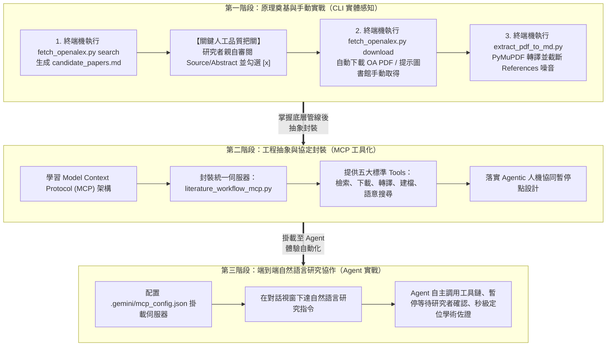
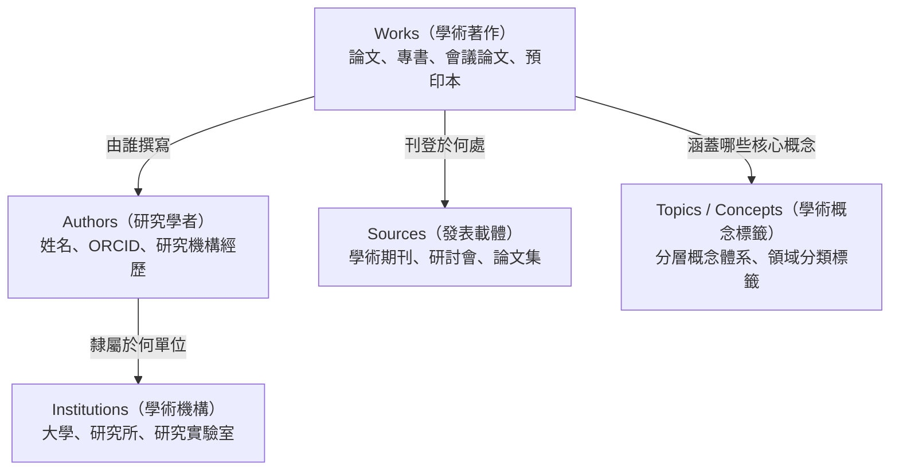
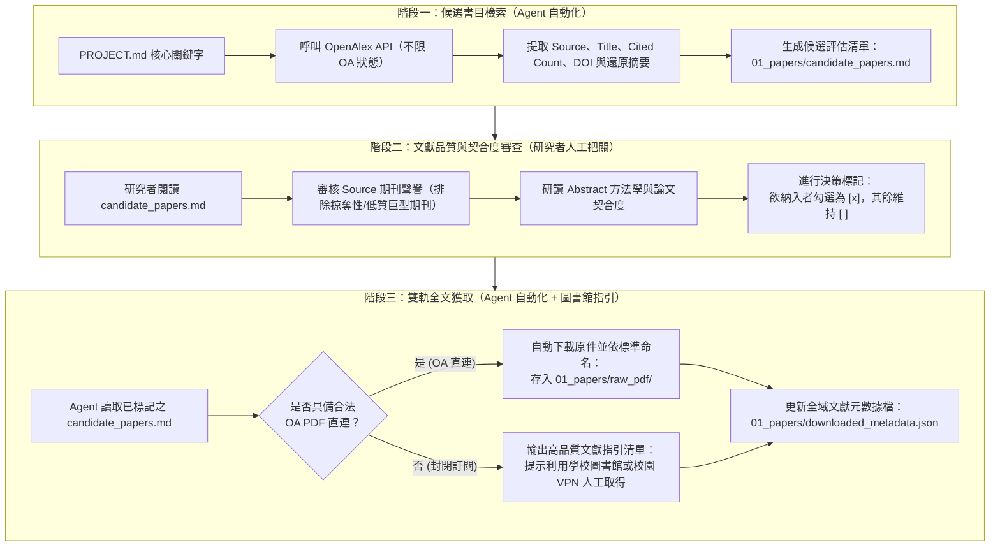
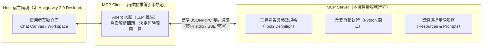
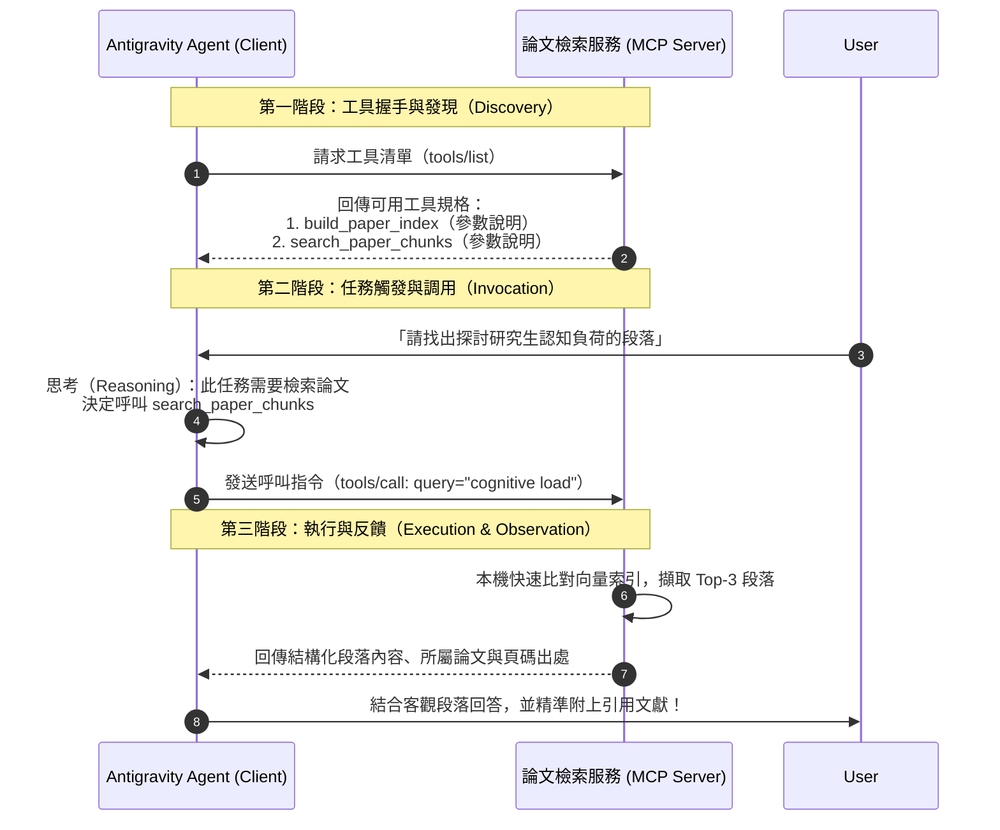
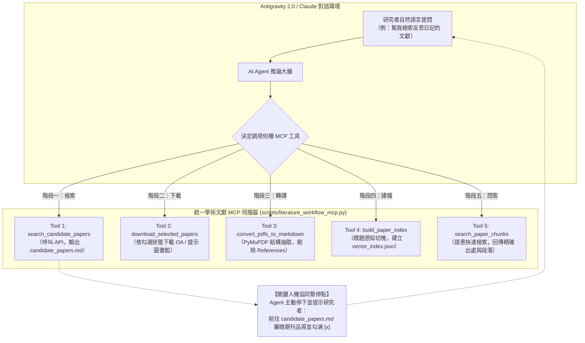

---
puppeteer:
  displayHeaderFooter: true
  headerTemplate: '<div style="font-size: 14px; margin: 0 auto;">第二章：智慧文獻爬梳與本機向量化檢索——從 OpenAlex API 到 MCP 工具化管線建構</div>'
  footerTemplate: '<div style="font-size: 14px; margin: 0 auto;">第 <span class="pageNumber"></span> 頁 / 共 <span class="totalPages"></span> 頁</div>'
  margin:
    top: "1.5cm"
    bottom: "1.5cm"
    left: "1.5cm"
    right: "1.5cm"
---
<style>
  /* 全域字型大小放大為 1.4 倍（預設 16px * 1.4 = 22.4px） */
  html, body, .mume, .markdown-preview {
    font-size: 22.4px !important;
    line-height: 1.6 !important;
  }
  /* 標題分頁控制 */
  h2 {
    page-break-before: always;
  }
  /* 表格與程式碼區塊維持等比例適配 */
  table {
    font-size: 0.9em !important;
  }
  pre, code {
    font-size: 0.88em !important;
  }
</style>
---

# 第二章：智慧文獻爬梳與本機向量化檢索：從 OpenAlex API 到 MCP 工具化管線建構

## 課程導讀：漸進式鷹架引導策略

歡迎回到「AI Agent 學術研究與文獻探討實務」的第二週課堂。在第一講中，我們完整建立了對自主代理人（AI Agent）的認知架構，劃定了包含五大工程目錄（`01_papers`、`02_notes`、`03_drafts`、`04_research_data`、`05_project_history`）的標準工作區（Workspace），並透過上下文工程在根目錄注入了靈魂規格書（`PROJECT.md`）。至此，我們已經為 AI Agent 賦予了明確的學術研究人設、剛性時程里程碑以及探索性核心研究問題（Exploratory RQs）。

然而，紙上談兵終究無法產出具備實證基礎的論文。環顧我們目前的工作區，最關鍵的客觀事實來源—— `01_papers/` 文獻庫，目前依然空空如也。

在傳統的研究歷程中，研究生蒐集文獻的方式往往是低效且碎片化的：打開搜尋引擎或圖書館系統，手動下載幾十篇檔名混亂的 PDF 檔案堆置在電腦桌面；當需要比對文獻時，又必須一篇篇打開 PDF 進行肉眼掃描。而在導入 AI 輔助時，若缺乏工程化處理，PDF 內部複雜的雙欄排版與龐大的參考文獻列表，更會嚴重污染大型語言模型（LLM）的注意力視窗。

本週課程的核心主旨，是要為 Antigravity 2.0 的 AI Agent 正式裝上 **「感知文獻的眼睛」與「調用工具的雙手」**。為了兼顧學術研究的嚴謹性與工程實踐的掌控感，本週教材特別採用 **「漸進式鷹架引導策略（Progressive Scaffolding Strategy）」**，依序帶領大家跨越三大思維階段：

1. **第一階段：原理奠基與手動實戰（第 1～2 節）**
   - **實體操作感知**：學生在終端機（Terminal）中親手執行獨立的命令列工具（`fetch_openalex.py` 與 `extract_pdf_to_md.py`），理解 API 請求、資料夾結構（`01_papers/raw_pdf/`、`extracted_text/`）與雙欄 PDF 文字工程的真實運作。
   - **人機協同品質把關**：親手在 `candidate_papers.md` 逐一審視期刊來源（Source）與摘要（Abstract），落實批判勾選（`[x]`）。親自走過手動流程，才能徹底破除「AI 是黑盒子神仙」的迷思，確立研究者對學術品質的絕對主導權。
2. **第二階段：工程抽象與協定封裝（第 3～4 節）**
   - **工具化躍遷**：學習當代自主代理人最重要的擴充標準——模型上下文協定（Model Context Protocol，MCP）。
   - **統一伺服器架構**：將前期散落、手動執行的個別腳本，抽象化並整合封裝為全功能雙模 MCP 伺服器（`scripts\literature_workflow_mcp.py`），使檢索、下載、文字轉譯、向量建檔與語意搜尋成為 Agent 隨時可調用的標準工具鏈（Tools）。
   - **人機協同暫停點設計**：學習如何在 Agentic Workflow 中設計「斷點機制」，確保 Agent 在調用檢索工具後主動停下腳步，等待研究者審核勾選後方可繼續執行。
3. **第三階段：端到端自然語言研究協作（第 4.5 節實作驗證）**
   - **思維維度躍遷**：在 Antigravity 2.0 對話畫布中，以自然語言發起端到端文獻研究對話，體驗由「終端機手動操作員」升級為「指揮 AI Agent 的高階研究者」之流暢威力！



如上圖所示，唯有先親手走過第一階段的泥濘與細節，你才能在第二、三階段真正看懂 Agent 的每一步動作，不被黑盒子牽著走，成為真正具備主導權的高階研究者。

---

## 第一節：學術知識庫大門：OpenAlex API 檢索與文獻自動化獲取

### 1.1 為什麼人文社會科學與教育實踐研究需要 OpenAlex？

在學術文獻探討的初期，選擇正確的文獻資料庫至關重要。長期以來，許多初學者常依賴三大傳統學術資料庫：
- **Web of Science (WoS) / Scopus：** 雖然收錄嚴謹且具備完整的期刊引證報告（JCR），但屬於商業封閉系統，學生必須處於大學校園網域內或連線 VPN 方能檢索，其 API 更是受到嚴格的高額授權限制，外部 AI 程式難以合法串接調用。
- **PubMed：** 提供了極為強大且完全免費的 API 介面，但其收錄範圍嚴格侷限於生物醫學（Biomedicine）與生命科學領域，對於人文學科、社會學、教育實踐研究（SoTL）或教育科技主題的支援微乎其微。
- **arXiv：** 雖為開放取用預印本重鎮，但其文獻幾乎全數偏向資訊科學（Computer Science）、物理學與數學，且多數文章尚未經過嚴謹的同行評審（Peer Review）。

為了解決學科覆蓋失衡與商業圍牆封閉的困境，非營利組織 OurResearch 於 2022 年推出了新一代全學科開放學術資料庫—— **OpenAlex**。

OpenAlex 的命名源自於古代世界最大的知識寶庫——亞歷山大圖書館（Library of Alexandria）。它完整繼承並大幅擴充了微軟學術圖譜（Microsoft Academic Graph，MAG）的龐大資產，收錄了全球超過 **2.5 億篇** 學術作品（Works），涵蓋 25 萬個學術期刊與會議，並跨足人文歷史、社會科學、教育實踐、工程科技與自然科學等全領域學門。

下表完整對比了 OpenAlex 與其他主流學術資源的關鍵特徵：

| 評比維度 | Web of Science / Scopus | PubMed | arXiv | OpenAlex |
| :--- | :--- | :--- | :--- | :--- |
| **學門涵蓋** | 全學科（偏重理工生醫） | 僅限生物醫學與生命科學 | 僅限資工、物理、數學 | **全學科（廣泛涵蓋人文、社會與教育學）** |
| **文獻收錄量** | 約 8,000 萬至 9,000 萬篇 | 約 3,600 萬篇 | 約 240 萬篇 | **超過 2.5 億篇（全球最大開放圖譜）** |
| **使用成本** | 需高額訂閱授權（商業封閉） | 免費開放 | 免費開放 | **完全免費開放（CC0 授權共享）** |
| **API 串接門檻** | 需企業級申請與專用 Key | 支援 REST API（有頻率限制） | 支援 API / 批次下載 | **支援標準 REST API，免註冊即可呼叫** |
| **全文直連** | 需透過圖書館 SFX 跳轉 | 部分提供 PMC 免費全文 | 全數提供 PDF | **原生提供合法 Open Access (OA) PDF 直連** |

從上表可以清楚看出，對於正在進行文獻探討的同學而言，OpenAlex 是兼具「廣度、深度、開放性與可程式化存取」的最佳知識來源。

### 1.2 OpenAlex 資料實體架構解析

OpenAlex 並非單純儲存文字標題的索引清單，而是建立了一座互聯相通的學術知識圖譜。在其資料架構中，主要由五大核心實體（Entities）相互鏈結：



在我們進行自動化文獻探討時，最核心的查詢標的為 **Works（學術著作）**。當我們向 OpenAlex 請求一篇 Works 的資料時，API 會以標準的 JSON 格式回傳豐富的元數據（Metadata）。其中最關鍵的欄位包括：
- `id`：論文在 OpenAlex 系統中的唯一全域識別碼（如 `https://openalex.org/W3128456123`）。
- `title`：論文正式英文標題。
- `publication_year`：正式發表的西元年份。
- `cited_by_count`：該文獻被後續其他學術論文引用的總次數（學術影響力指標）。
- `open_access.is_oa`：布林值，標記本篇論文是否為開放取用（Open Access）。
- `open_access.oa_url`：若論文為 OA，此欄位直接提供由出版商或機構典藏庫釋出的合法 PDF 下載連結。
- `authorships`：作者清單陣列，包含第一作者姓名與所屬學校單位。
- `concepts`：OpenAlex 依據全文演算法自動標記的學術概念標籤及其關聯權重分數。

這套結構化資訊使得我們的 Agent 不僅能夠搜尋關鍵字，還能進行多維度的學術篩選。

### 1.3 結構化檢索策略與人機協同品質判讀（Human-in-the-Loop Literature Appraisal）

在第一週的 `PROJECT.md` 中，我們依據核心研究問題提煉出了多組關鍵字（如 `AI Agents in Higher Education`、`Scaffolding Thesis Writing`、`Educational Action Research`）。然而，許多初學者在串接學術 API 時，常有一種危險的迷思： **「為了追求完全自動化，強制設定只抓取具備 Open Access (OA) 免費全文直連的文獻。」**

這種做法在嚴謹的學術研究中，潛藏著極大的學術風險與方法學偏誤：
1. **巨型期刊與品質參差（Mega-journals & Predatory Publishing）：** 許多純開放取用（Open Access）的「巨型期刊（Mega-journals）」或收費出版商，其審稿門檻極寬鬆、退稿率低，甚至夾雜商業掠奪性出版物。若僅因其提供免費下載直連便全數吸納，文獻庫將充斥品質可疑的雜訊。
2. **優質經典期刊受限於版權壁壘（Closed Access Paywalls）：** 在教育學、人文社會科學與各專業領域中，諸多歷史悠久、經過最高標準同行評審（Peer Review）的頂級學術期刊（如 Elsevier、Springer、Taylor & Francis、Wiley、Sage 所出版之指標性 SSCI/SCI 期刊），絕大多數仍採用傳統訂閱制或混合開放取用制。在 OpenAlex 資料庫中，這些文獻通常**沒有公開直連的免費 OA PDF**，但這並不代表它們不重要——事實上， **各大學圖書館早已為全校師生付費訂閱了這些核心資料庫**！
3. **判斷文獻品質是研究生不可被 AI 取代的核心素養：** 文獻探討不是在比「誰抓全文抓得快」，而是在比「誰選的文獻證據具備公信力」。研究生必須學會透過 **發表載體（Source 期刊信譽）** 、 **論文題名（Title）** 與 **研究摘要（Abstract）** 進行批判性審查。

因此，現代學術 AI Agent 的文獻爬梳管線，必須落實 **「人機協同（Human-in-the-loop）」** 的三階段專業工作流：



- **階段一（檢索候選書目）：** Agent 向 OpenAlex API 發送結構化查詢，放寬 OA 限制以完整納入領域內高被引之經典論文，並將 OpenAlex 特有的倒排索引（Inverted Index）摘要還原為自然文字段落，整合成結構化的 `01_papers/candidate_papers.md`。
- **階段二（人工品質判讀）：** 研究者打開清單，逐一檢驗每篇文獻的發表來源（Source）與摘要論述。確定具備學術參考價值者，將標題旁的 `[ ]` 改為 `[x]`。
- **階段三（全文獲取與指引）：** Agent 讀取勾選結果：若為 OA 全文則自動串流下載；若為高品質封閉期刊，Agent 絕不隨意捨棄，而是明確提示篇名、DOI 與建議檔名，引導研究者透過學校圖書館入口獲取全文後置入 `01_papers/raw_pdf/`。

---

### 1.4 第一階段手動實戰工具：`scripts\fetch_openalex.py`

為了落實這套「人機協同篩選管線」，在第一階段的鷹架學習中，專案已提供獨立的命令列工程腳本，位於：
- **專案存放位置**：`scripts\fetch_openalex.py`

#### 工具目的與用途
本程式是串接全球最大開放學術圖譜 OpenAlex 的自動化工具，專門落實「研究者主導品質把關、Agent 負責自動化搬運」的核心原則。主要支援兩大階段之工作任務：
1. **候選書目檢索與清單生成（`search` 任務）**：
   - 依據研究問題關鍵字發出 API 查詢，抓取候選論文的發表來源（Source 期刊/研討會）、第一作者、出版年份、被引用次數、摘要與 Open Access 狀態。
   - 自動生成結構化評估清單 `01_papers/candidate_papers.md`，並將原始元數據快取於 `01_papers/candidates_cache.json`，提供研究者進行人工批判審查。
2. **全文自動下載與圖書館指引（`download` 任務）**：
   - 自動解析研究者在 `candidate_papers.md` 中親自審查並標記勾選（`[x]`）的論文。
   - 若為合法開放取用（Open Access）論文，程式自動將原件 PDF 串流下載並以規範檔名存放至 `01_papers/raw_pdf/`。
   - 若為高品質之商業封閉期刊（非直接 OA），程式絕不隨意捨棄，而是主動提示論文題名、發表載體、DOI 直連與建議存放路徑，指引研究者透過校園圖書館付費資源或 VPN 人工取得。

#### 終端機操作指令範例
同學們只需在終端機中執行以下指令即可操作此工具：

```bash
# 步驟 1：檢索候選文獻並生成評估清單（預設擷取 10 篇、年份 2022 至今）
python scripts/fetch_openalex.py search "AI Agents in Higher Education scaffolding"

# 步驟 2：在編輯器開啟 candidate_papers.md 審閱完成並勾選 [x] 後，執行全文獲取
python scripts/fetch_openalex.py download

```

#### 核心運作原理與設計亮點
- **純標準庫無外部依賴（Zero External Dependency）**：全腳本採用 Python 原生標準庫（`urllib.request`、`json`、`re`、`pathlib`），完全免除額外安裝第三方套件的相容性困擾，任何作業系統環境皆可隨插即用。
- **倒排索引摘要還原（Abstract Inversion）**：OpenAlex 出於空間優化考量，回傳的摘要為倒排索引字典（`abstract_inverted_index`）。腳本內建重組演算法將字詞按位置重新排列，還原出通順流暢的完整段落，方便研究者在 Markdown 中直接閱讀。
- **人機協同核選捕捉（Markdown Checkbox Parsing）**：透過正規表達式 `## \d+\. \[[xX]\]` 即時辨識學生在 `candidate_papers.md` 中親自勾選認可的論文，嚴格貫徹學術倫理規範。
- **雙軌獲取機制（Dual-track Ingestion）**：兼顧免費 OA 自動下載與付費封閉期刊之圖書館人工取得指引，確保文獻庫兼具獲取效率與權威學術品質。

---

### 1.5 課堂實作活動：第一階段手動文獻篩選與全文庫建構

> **活動時間：** 15 分鐘
> **活動任務：** 親自在終端機體驗「檢索候選書目 -> 人工審閱 Source 與 Abstract 勾選 -> 自動下載與圖書館獲取提示」的三階段研究歷程。
>
> 1. **步驟一：檢索候選書目**
>    打開終端機（Terminal），確認當前路徑位於你的論文工作區根目錄，輸入指令檢索候選論文：
>    ```bash
>    python scripts/fetch_openalex.py search "Reflective Journals Educational Action Research"
>    ```
>    觀察終端機提示，確認已於 `01_papers/candidate_papers.md` 生成候選清單。
> 2. **步驟二：人工批判審閱與勾選決策**
>    打開 `01_papers/candidate_papers.md`：
>    - 檢視前 10 篇論文的 **發表來源（Source）**，辨識哪些是聲譽良好的國際期刊，哪些是品質較有爭議的載體。
>    - 研讀 **摘要（Abstract）**，判斷研究主題、受試者與研究方法是否真正切中你碩士論文的 RQ。
>    - 挑選 **3 到 5 篇** 真正具備學術含金量的文獻，將標題旁的 `[ ]` 改為 `[x]` 並儲存檔案。
> 3. **步驟三：執行全文下載與人工補齊**
>    在終端機輸入下載指令：
>    ```bash
>    python scripts/fetch_openalex.py download
>    ```
>    - 檢視終端機輸出：觀察有多少篇文獻由系統自動下載至 `01_papers/raw_pdf/`。
>    - 若出現「[封閉] 需人工自學校圖書館取得」的文獻，複製其提供的 DOI 網址，連線校園網路或大學圖書館整合查詢系統取得 PDF，並依腳本建議檔名存入 `01_papers/raw_pdf/`。
> 4. 打開 `01_papers/downloaded_metadata.json`，確認最終建立的文獻庫清單。

```text
老師的真心話：
在進入 AI 時代後，許多人誤以為文獻探討就是『按一個按鈕，AI 自動下載 100 篇文獻並寫出摘要』。
這是不懂學術研究的外行人想法！
如果我們不加思索地只抓取那些能免費下載的 OA 論文，你的論文基礎很可能全都是來自商業水刊的空泛文章，
反而漏掉了那些由知名學會出版、被深鎖在大學圖書館付費庫裡的經典之作。
記住：AI Agent 是你的高效率助理，但『文獻品質的把關者永遠是研究者自己』！
學會看 Source 期刊、學會讀 Abstract 抓重點，並親手挑選出那 5 篇真正撐起你研究價值的基石論文，
這才是做碩士研究最核心、最無可取代的心智鍛鍊！

```

---

## 第二節：學術文字工程：從 PDF 排版詛咒到純淨 Markdown

### 2.1 PDF 的技術本質與「排版詛咒」

成功將論文 PDF 下載到工作區後，許多人的直覺反應是：「太好了，現在把這 5 篇 PDF 一口氣丟給 AI Agent，叫它幫我寫文獻探討！」

然而，如果你真的這樣做，往往會得到令人沮喪的結果：Agent 回答零碎、錯漏百出，甚至將某個無關緊要的出版商版權聲明當成核心研究結論。

為什麼會這樣？這必須從 PDF 檔案格式的底層設計說起。

**PDF（Portable Document Format）最初的誕生目標，是為了在任何印表機與螢幕上達成 100% 精準的視覺排版再現，它根本不是為了讓電腦理解『文字語意』而設計的！** 在 PDF 檔案內部，文字並非以連續段落（Paragraphs）儲存，而是被切割為無數個帶有絕對 X、Y 幾何座標的「文字繪圖指令」。

這種排版機制，在學術論文中引發了四大「排版詛咒」：
1. **雙欄排版錯位（Two-Column Cross-Reading）：** 大多數國際學術期刊（如 IEEE、ACM、Springer、Elsevier）皆採用雙欄排版。傳統的文字提取工具若只依照水平掃描線讀取，會將左欄的第一行與右欄的第一行拼成同一句，造成嚴重的語序毀滅。
2. **頁首頁尾重複刺入（Header/Footer Injection）：** 每一頁頂部常印有期刊名、卷期、ISSN 號碼，底部則印有頁碼。這些與正文毫無關聯的字串，在每一頁都被硬生生插入論文段落的中間，直接打斷了前後文脈絡。
3. **行末連字符號硬斷行（Hyphenation Splitting）：** 英文論文為了維持版面左右對齊，單字常在行尾被強制打斷（例如 `trans-` 換行接 `formation`）。模型若直接讀取，會將其誤判為兩個獨立的無效詞彙。
4. **龐大的參考文獻雜音（References Noise）：** 一篇正式的期刊論文，末尾的參考文獻清單（References）往往多達 50 至 100 筆，佔據了全文 20% 甚至 30% 以上的篇幅。若未經處理直接餵入，這些由人名、年份與書名拼湊出的清單，會引發模型嚴重的關鍵字檢索干擾，並大量耗費寶貴的 Context Window。

```mermaid
flowchart LR
    subgraph RawPDF["原始學術 PDF（幾何排版導向）"]
        P1["頁首噪音：Journal of Education Vol.12..."]
        P2["左欄段落片段 1"]
        P3["右欄段落片段 1（跨欄穿插）"]
        P4["行尾斷詞：inter- / vention"]
        P5["文末 10 頁龐大 References 清單"]
    end

    subgraph Cleaning["學術文字工程（Text Engineering）"]
        C1["PyMuPDF 雙欄版面重構"]
        C2["正規表達式消除頁首頁碼"]
        C3["單字拼接還原 (De-hyphenation)"]
        C4["精準切除文末參考文獻雜音"]
    end

    subgraph CleanMD["純淨 Markdown（語意脈絡導向）"]
        M1["標準 Markdown 標題：# 1. Introduction"]
        M2["語意連貫之段落內文"]
        M3["清晰的實證數據與方法描述"]
        M4["體積縮減 70%，消除幻覺干擾"]
    end

    RawPDF --> Cleaning --> CleanMD

```



### 2.2 解析工具技術選型與 Markdown 格式優勢

為了破除 PDF 的排版詛咒，我們需要選擇合適的解析工具。在 Python 生態系中，雖然有早期的 `PyPDF2` 或 `pdfplumber`，但處理學術雙欄排版最穩定且速度最快的首選是 **PyMuPDF（底層為高效能 C 函式庫 MuPDF）** 及其針對大型語言模型優化的延伸模組 **`pymupdf4llm`**。

為什麼我們堅持將 PDF 轉換為 **Markdown（.md）**，而不是純文字（.txt）？
- **保留階層大綱：** Markdown 能精確保留論文的 `# 一級標題（Abstract/Introduction）`、`## 二級標題（Methodology/Participants）`。當 Agent 閱讀 Markdown 時，能一眼看清這段文字是屬於「研究背景」還是「研究限制」。
- **表格結構化：** Markdown 原生支援管道符號表格（`| col1 | col2 |`），能將論文中最精華的統計數據對照表完整保留，而不是坍塌成一團混亂的無意義數字。
- **純淨無二進位負擔：** 相較於肥大的 PDF，純文字 Markdown 體積僅有原檔案的 5% 到 10%，載入速度呈指數級提升。

### 2.3 文本清洗與正規化流程

一套成熟的學術文獻清洗流程，必須具備以下核心環節：
1. **結構化抽取：** 運用 `pymupdf4llm` 辨識雙欄排版、段落區塊與各級標題。
2. **剔除參考文獻清單：** 在學術文獻探討初期，Agent 需要消化的是論文的「核心論點、方法學、實驗數據與反思」，而不是文末密密麻麻的引用列表。偵測到 `## References`、`## Bibliography` 或 `## 參考文獻` 標籤後，自動將後續內容切除或獨立分流。
3. **清洗出版雜音：** 透過正規表達式消除包含 DOI 超連結、頁碼提示與 Creative Commons 授權宣告的重複行。
4. **標準化存放：** 處理完成的純淨 Markdown 文件，統一以相同檔名（副檔名改為 `.md`）存放於 `01_papers/extracted_text/` 目錄中。

### 2.4 第一階段手動實戰工具：`scripts\extract_pdf_to_md.py`

為了批次處理從圖書館或開放取用管道獲取的 PDF 文獻，在第一階段手動操作中，專案已建置標準文字清洗轉譯腳本，位於：
- **專案存放位置**：`scripts\extract_pdf_to_md.py`

#### 工具目的與用途
本工具負責將難以被 LLM 高效消化的雙欄二進位 PDF 文獻，轉換為語意結構完整、輕量純淨的 Markdown 格式：
1. **批次轉譯**：自動掃描 `01_papers/raw_pdf/` 目錄下的所有 PDF 檔案，運用 `pymupdf4llm` 高效引擎進行結構化抽取，保留文章的大標題、小節標籤與 Markdown 表格。
2. **剔除參考文獻清單**：偵測到 `## References` 或 `## Bibliography` 章節時自動執行切片截斷，平均為每篇文獻剔除 3,000 至 8,000 個 Tokens 的無效引用噪音，避免干擾 Agent 上下文。
3. **消除排版雜音**：透過正規表達式消除頁碼、重複出現的出版聲明與版權行。
4. **結構化儲存**：處理完成的純淨文本，統一以同名 `.md` 格式存放於 `01_papers/extracted_text/` 目錄中，作為後續向量分塊與知識檢索之乾淨語料。

#### 終端機操作指令範例
請確保環境已安裝 `PyMuPDF` 與 `pymupdf4llm`，並於工作區終端機中執行：

```bash
# 安裝轉譯套件（若尚未安裝）
pip install PyMuPDF pymupdf4llm

# 批次執行 PDF 轉譯與文字清洗
python scripts/extract_pdf_to_md.py

```

#### 核心運作原理與設計亮點
- **截斷切片設計（Truncation on References）**：腳本利用正則表達式監控行首標題，一旦識別進入參考文獻即終止後續解析，既節省儲存與模型 Token 開銷，更徹底杜絕 Agent 將前人參考書目誤認為當前實驗結論之現象。
- **階層標題維護（Heading Preservation）**：透過版面分析技術，原文中的大標題（如 Introduction, Methodology, Results）會被自動賦予 Markdown 的 `#` 與 `##` 標籤，為後續章節之「標題感知分塊（Header-aware Chunking）」奠定關鍵切分依據。
- **降級容錯保護（Fallback Parsing）**：若環境中未安裝 `pymupdf4llm`，程式自動平滑降級為標準 PyMuPDF 解析，確保在任何電腦環境下皆能順暢產出。

---

### 2.5 課堂實作活動：第一階段手動文字轉譯與結構校驗

> **活動時間：** 10 分鐘
> **活動任務：** 親自在終端機將第一節下載的 PDF 文獻轉譯為純淨 Markdown，並檢視其格式品質。
>
> 1. 確認電腦已安裝必要套件：
>    ```bash
>    pip install PyMuPDF pymupdf4llm
>    ```
> 2. 在終端機執行轉換腳本：
>    ```bash
>    python scripts/extract_pdf_to_md.py
>    ```
> 3. 轉換完成後，打開 VS Code 或 Antigravity 左側導航列，展開 `01_papers/extracted_text/` 目錄。
> 4. 隨機點開其中一篇 `.md` 檔案，使用 Markdown 預覽模式（Markdown Preview）觀察：
>    - 論文大綱是否完整保留了各級標題？
>    - 雙欄排版是否已還原為自然連續的段落？
>    - 文末是否成功在 References 處停止，消除了雜亂的引用書單？

```text
老師的提醒：
很多同學剛開始使用 AI 時，喜歡直接將整份 30 頁的 PDF 拖入聊天對話框中。
這在技術上犯了大忌！
未經清理的 PDF 含有大量隱形斷行、頁碼與印刷浮水印，這會嚴重打亂大模型的注意力機制（Attention Heads），
更別提那上百筆的 References 會白白吃掉你大半的 Context Window 配額。
養成『先把 PDF 洗乾淨成 Markdown 再交給 Agent』的工程紀律，能讓你的 AI 助理思考反應更快、
回答問題更精確，而且完全杜絕抓錯作者與引用的低級錯誤！

```

---

## 第三節：模型上下文協定（MCP）核心機制與本地工具擴充

### 3.1 為什麼 AI Agent 需要 MCP？

在前兩節中，我們已經成功將真實世界的學術論文下載並轉譯為乾淨的 Markdown 格式。但此時產生了一個全新的工程挑戰： **我們該如何讓 Antigravity 2.0 中的 AI Agent 自主調用本機程式來閱讀、檢索這些檔案？**

在傳統的軟體架構中，若想讓 AI 具備操作外部工具的能力，各家平台往往採用封閉私有的外掛（Plugin）或函式調用（Function Calling）格式。例如 OpenAI 有自己的 GPT Actions 規範，其他平台又有各自相異的 API 介面。這導致開發者每換一個平台，就必須重新編寫整套工具對接程式，造成嚴重的生態破碎。

為了解決這個問題，Anthropic 於 2024 年底公開發表了開源的 **模型上下文協定（Model Context Protocol，簡稱 MCP）**。MCP 迅速獲得包括 Google Antigravity、Cursor 以及開源社群的全力支持，成為當代 AI 代理人串接本機資源與外部工具的統一黃金標準。

> **如果說 USB（通用序列匯流排）徹底統一了鍵盤、滑鼠、隨身碟與電腦的實體連接，那麼 MCP 就是 AI Agent 世界的「軟體通用 USB 規格」。**

透過 MCP，我們只需要編寫一次 Python 工具程式，任何支援 MCP 的 AI Agent 就能立刻自動發現、理解並正確調用這項能力。

### 3.2 MCP 架構三要素：Host、Client 與 Server

MCP 採用經典且高擴充性的三層式客戶端-伺服器架構（Client-Server Architecture）：



這三者分工明確：
1. **Host（宿主應用程式）：** 就是使用者操作的軟體環境，例如我們電腦上運行的 **Antigravity 2.0 Desktop**。Host 負責管理工作區介面、設定檔以及安全授權機制。
2. **Client（MCP 客戶端）：** 內建於 Antigravity 的核心推論引擎中。Client 負責與多個 MCP Server 保持連線，將 Server 提供的工具規格轉換為提示詞傳遞給 LLM 大腦；當 LLM 決定呼叫某個工具時，Client 負責發送執行請求。
3. **Server（MCP 伺服器）：** 這是我們即將動手撰寫的本機程式。一個 MCP Server 是一個獨立運行的輕量行程，它專注於提供特定的「專屬技能」——例如讀取特定目錄、搜尋本機向量庫或連線特定資料庫。

### 3.3 工具調用運作流程：JSON-RPC 與 stdio 通訊機制

在作業系統層級，Antigravity 桌面端與本機 MCP Server 之間主要是透過最簡單、最穩定的 **標準輸入輸出管道（Standard Input/Output，簡稱 stdio）** 進行通訊。

兩者傳遞的訊息遵循 **JSON-RPC 2.0 協議**，整個工具調用流程包含三個標準步驟：



從上圖可以清楚發現，MCP 的通訊過程完全是結構化、透明且可被檢核的：
- **工具宣告（Tools Schema）：** Server 會明確告訴 Agent「我叫 `search_paper_chunks`，我接受一個名為 `query` 的字串參數，我會回傳最相關的論文段落」。
- **決策自治（Agent Autonomy）：** 人類使用者完全不需要手動去打指令執行 Python 程式；Agent 會根據對話情境，在適當的時機自主發送 JSON 請求來調用本機腳本，並將腳本印出的文字結果作為真實觀察（Observation）吸納進記憶中。

---

### 3.4 課堂實作活動：探索 Antigravity 內建 MCP 環境

> **活動時間：** 5 分鐘
> **活動任務：** 觀察 Antigravity 2.0 介面中如何辨識 MCP 工具。
>
> 1. 打開 Antigravity 2.0 Desktop。
> 2. 檢視設定面板（Settings）或擴充協議清單中的 **MCP Servers** 欄位。
> 3. 觀察系統預設啟用的工具模組（例如內建的檔案讀取器、終端機執行器等）。
> 4. 思考：若我們為其增添一個專門檢索 `01_papers/extracted_text/` 的本機伺服器，Agent 的能力會產生什麼質的飛躍？

```text
老師的提醒：
文科背景的同學千萬不要被『客戶端-伺服器』或『JSON-RPC 通訊協議』這類名詞嚇退了！
在實務操作中，MCP 伺服器本質上就是一支『掛上了標準化說明的 Python 程式』。
你不用架構複雜的雲端網站，也不用設定防火牆。
它就像是在你的 Python 腳本外殼上，裝了一個符合國際規格的『USB 插頭』，
只要把它插進 Antigravity 的設定檔裡，你的 AI 就能立刻多出一項『搜尋個人論文庫』的超能力！

```

---

## 第四節：第二階段工程躍遷：學術文獻全流程 MCP 伺服器架構

### 4.1 從獨立腳本到統一工具鏈：為什麼需要整合 MCP？

在第一節與第二節中，同學們已經在終端機中親自體驗了 `fetch_openalex.py` 與 `extract_pdf_to_md.py` 的手動操作。親自走過這一步，讓我們對文獻的物理目錄（`raw_pdf/`、`extracted_text/`）、API 資料交換結構以及研究者在 `candidate_papers.md` 中的批判勾選有了扎實的感知。

然而，如果我們日常做研究時，每次想找論文都要跳出對話框、切換到終端機輸入指令、再手動執行轉譯，這樣的工作流依然充滿了摩擦力。更關鍵的是，當論文庫逐漸累積到 10 篇、30 篇（文字量高達數十萬字）時，若每次向 Agent 提問都讓它從頭到尾把所有 Markdown 讀一遍，將引發三大痛點：
1. **反應遲緩**：遍歷龐大文字檔案需要消耗大量運算資源與等待時間。
2. **Context 配額迅速枯竭**：將數十萬字全文無差別載入對話，既昂貴又容易引發模型的「長文遺忘（Lost in the Middle）」效應。
3. **關鍵字搜尋的語意鴻溝（Semantic Gap）**：傳統文字比對無法跨越同義詞或相近概念（例如搜尋「教學鷹架」無法命中內文的「學習支援系統」）。

為了解決這些問題，我們進入漸進式鷹架的第二階段： **將先前驗證過的獨立 Python 功能，全面抽象封裝為單一、全功能的「學術文獻全流程 MCP 伺服器」**！



---

### 4.2 全流程 MCP 伺服器架構：`scripts\literature_workflow_mcp.py`

專案已將前述所有管線整合為統一的 MCP 服務，存放於：
- **專案存放位置**：`scripts\literature_workflow_mcp.py`

#### 工具清單與功能設計
本伺服器遵循 Anthropic MCP 標準規範，對外提供五大核心工具（Tools）：
1. **`search_candidate_papers`（候選書目檢索工具）**：
   - **參數**：`query`（檢索主題）、`start_year`（起始年份，預設 2022）、`max_candidates`（數量，預設 10）。
   - **功能**：向 OpenAlex API 檢索文獻，並自動輸出結構化評估清單 `01_papers/candidate_papers.md`。
2. **`download_selected_papers`（勾選全文下載工具）**：
   - **功能**：自動掃描 `01_papers/candidate_papers.md` 中被研究者標記為 `[x]` 的論文，下載合法 OA 原件至 `01_papers/raw_pdf/`；若為封閉期刊，則提示 DOI 與建議檔名。
3. **`convert_pdfs_to_markdown`（文本清洗轉譯工具）**：
   - **功能**：批次掃描 `01_papers/raw_pdf/` 下的所有 PDF，自動剔除 References 引用清單與出版噪音，將純淨 Markdown 輸出至 `01_papers/extracted_text/`。
4. **`build_paper_index`（論文向量索引建檔工具）**：
   - **功能**：掃描 `01_papers/extracted_text/` 下的所有 Markdown 論文，以標題與段落為界進行智慧切塊（Chunking），提取語意特徵權重並儲存為 `01_papers/vector_index.json`。
5. **`search_paper_chunks`（論文精華段落語意檢索工具）**：
   - **參數**：`query`（查詢問題）、`top_k`（回傳段落數，預設 3）。
   - **功能**：依據自然語言查詢，在 0.1 秒內計算語意關聯度，精確回傳關聯度最高之段落文本、所屬章節與文獻出處檔名。

#### 【核心教學亮點】Agentic 人機協同暫停點設計（Human-in-the-Loop Breakpoint）
在全自動化的 Agent 工作流中，最常見也是最嚴重的學術倫理錯誤，就是 **「讓 AI 越權替研究者做主觀價值決定」**（例如讓 AI 自行決定哪篇論文好並直接下載分析）。

為了杜絕這種問題，我們在 `literature_workflow_mcp.py` 的 `search_candidate_papers` 工具回傳訊息中，設計了明確的防護機制：
- 當 Agent 呼叫搜尋工具後，工具會回傳：
  > `[重要提示]：候選清單已成功輸出至 01_papers/candidate_papers.md！請主動提示研究者打開檔案，審查各篇論文之發表來源（Source 期刊）與摘要（Abstract），確認具備學術品質後將標題旁的 [ ] 改為 [x]。待研究者確認完成後，再行調用 download_selected_papers 工具。`
- 透過這項設計，Agent 在對話視窗中接收到回傳後，會 **強制停下腳步**，主動向研究者發出提示，並等待研究者親自完成勾選並在對話中告知「我已勾選完成」，Agent 才會接續執行下載與轉譯。
- 這項設計完美展現了現代 Agentic Workflow 如何兼顧「高效率自動化搬運」與「研究者主導學術品質」！

---

### 4.3 終端機雙模除錯與核心架構解析

本伺服器具備「雙模執行（Dual Mode）」特性，既能作為命令列工具供人手動測試與除錯，亦能作為常駐服務供 Agent 透過 stdio 通訊調用：

#### 終端機命令列測試指令
在將伺服器正式掛載至 Agent 前，同學們可在終端機中手動測試各項工具：

```bash
# 測試 1：檢索候選論文清單
python scripts/literature_workflow_mcp.py search "AI Agents in Higher Education scaffolding"

# 測試 2：下載 candidate_papers.md 中已勾選 [x] 的論文
python scripts/literature_workflow_mcp.py download

# 測試 3：批次將 PDF 轉譯清洗為 Markdown
python scripts/literature_workflow_mcp.py convert

# 測試 4：重建本機論文向量索引庫
python scripts/literature_workflow_mcp.py index

# 測試 5：直接在終端機測試語意檢索效果
python scripts/literature_workflow_mcp.py query "scaffolding"

```

#### 核心運作原理與設計亮點
- **標題感知分塊（Header-aware Chunking）**：分塊演算法在解析 Markdown 時，會時刻捕捉當前行之標題層級（`#`、`##`）。切分出的每個段落除內文外，均保留「所屬章節（Section）」元數據，讓 Agent 檢索時能精確辨識文字來自 Methodology 或 Results。
- **標準 MCP stdio 通訊協定（JSON-RPC 2.0）**：嚴格實作 MCP 規格之 `initialize`、`tools/list` 與 `tools/call` 三大核心方法。啟動時自動與 Agent 完成握手，Agent 能即時解析工具 Schema 與參數定義。
- **輕量內建語意特徵引擎**：不需載入數 GB 的外部向量庫模型，在任何電腦上皆能於數秒內完成全班數十篇文獻的即時檢索與評分。

---

### 4.4 在 Antigravity 2.0 中配置並掛載全流程 MCP 伺服器

完成伺服器建置後，最後一步是將這個全流程工具註冊進 Antigravity 2.0 Desktop 中。

請在工作區根目錄建立（或編輯）檔案 `.gemini/mcp_config.json`（若無 `.gemini` 資料夾可手動建立）：

```json
{
  "mcpServers": {
    "literature-workflow": {
      "command": "python",
      "args": ["scripts/literature_workflow_mcp.py"],
      "env": {
        "PYTHONIOENCODING": "utf-8"
      }
    }
  }
}

```

這段設定檔告訴 Antigravity 核心引擎：
- 本專案註冊了一個名為 `literature-workflow` 的全功能學術工具服務。
- 啟動方式是在終端機執行 `python scripts/literature_workflow_mcp.py`。
- 強制設定輸出編碼為 `utf-8`，以防 Windows 系統終端機之編碼干擾。

儲存設定後，重啟 Antigravity 對話或刷新專案，Agent 的工具箱中便會自動點亮五大全新技能！

---

### 4.5 課堂實作活動：第三階段端到端自然語言文獻研究實戰

> **活動時間：** 15 分鐘
> **活動任務：** 從終端機手動敲指令全面躍遷至 Antigravity 對話畫布，以自然語言驅動全流程文獻研究！
>
> 1. 打開 Antigravity 對話視窗，向 Agent 發出第一階段檢索指令：
>    *「請幫我向 OpenAlex 檢索 2022 年後探討『反思日記（Reflective Journals）在高等教育中之鷹架支援』的代表性文獻。」*
> 2. **觀察思考與人機協同暫停點**：
>    - 觀察 Agent 在思考過程中主動調用 `search_candidate_papers` 工具。
>    - 檢視 Agent 在對話視窗中的回覆：觀察它是否嚴格遵循人機協同原則，停下來並提示你前往 `01_papers/candidate_papers.md` 審閱期刊品質與摘要？
> 3. **研究者親自審核勾選**：
>    - 打開 `01_papers/candidate_papers.md`，審閱前 10 篇論文的 Source 與 Abstract。
>    - 挑選 3 到 5 篇真正切中研究主題的高品質論文，將標題旁的 `[ ]` 改為 `[x]` 並存檔。
> 4. **發起第二階段自動化獲取**：
>    - 返回對話框，對 Agent 說：*「我已經在 candidate_papers.md 中完成品質審核並勾選了欲採用的文獻，請幫我下載全文並轉譯為乾淨文字，接著建立索引庫。」*
>    - 觀察 Agent 如何自動接續調用 `download_selected_papers`、`convert_pdfs_to_markdown` 與 `build_paper_index` 工具！
> 5. **發起第三階段學術語意深度檢索**：
>    - 向 Agent 提出具體的學術問題：
>      *「請檢索本機文獻庫，回答我：各篇文獻中發現學生在撰寫反思日記時最常遭遇哪些認知困難或學習障礙？請列出引文佐證與所屬章節出處。」*
>    - 觀察 Agent 調用 `search_paper_chunks` 工具，在秒級內精準定位論文段落，並給出帶有出處依據的權威回答！

```text
老師的真心話：
恭喜大家走完了這趟『漸進式鷹架』的完整旅程！
回想一下：第一節課你還在 Terminal 敲指令、看檔案是怎麼一行行被抓下來、手動開編輯器勾選 [x]、自己跑文字清洗；
而現在，你只要在對話視窗中談笑風生，Agent 就能精準調用工具鏈、主動停下來向你請示、並在秒級內為你定位出十幾萬字文獻裡的關鍵證據。
這種『先苦後甘』的訓練，就是最扎實的專業底氣！
當外面不懂技術的人只會把 AI 當成隨機許願機、完全不知道 AI 抓了什麼垃圾水刊時，
你已經對資料夾裡的每篇 PDF、每段清洗規則、以及人機協同的每處道德防線了然於胸。
唯有掌握底層細節的研究者，才能真正駕馭高級 Agent，在未來的碩士論文研究中立於不敗之地！

```

---

## 本週小結與下週預告

在本週（第二講）的密集實戰中，我們成功為 AI Agent 建構了一條專業級的學術文獻工程流水線。我們不再依賴人工手動搬運文獻，而是掌握了四大核心里程碑：
1. **學術知識庫大門：** 透過 OpenAlex REST API，跨越了商業資料庫與生醫領域的門檻，學會設定結構化過濾條件，自動批量獲取具備 Open Access 全文的期刊論文與元數據。
2. **學術文字工程：** 深刻體會了 PDF 排版機制對 LLM 產生的干擾與 Token 浪費，運用文字清洗技術剔除參考文獻噪音與跨欄錯亂，將 PDF 提煉為純淨、高密度的 Markdown 文本。
3. **理解 MCP 擴充核心：** 掌握了當代自主代理人最重要的擴充標準——模型上下文協定（MCP），理解 Host、Client 與 Server 之間的 stdio 通訊與 JSON-RPC 工具調用原理。
4. **實作本機檢索 MCP 伺服器：** 擺脫繁雜幾何數學的包袱，親手實作了 `paper_retriever_mcp.py`，封裝段落智慧分塊（`build_paper_index`）與語意秒級定位（`search_paper_chunks`），讓 Agent 擁有隨時檢核本機文獻事實的客觀能力。

### 下週預告：第三講——深度文獻精讀與概念網絡建構

有了乾淨的文獻資料（`01_papers/extracted_text/`）與隨傳隨到的 MCP 檢索手腳後，下一週我們將正式邁入文獻探討中最具學術含金量的核心戰場—— **「深度精讀（Critical Reading）與跨篇文獻矩陣共構」**！

在第三週的課程中，我們將學習：
- 如何指揮 Agent 進行批判性閱讀，精確提煉出每篇論文的【理論架構】、【樣本規模】、【介入方法】與【研究限制】，自動產出標準單篇筆記至 `02_notes/reading_cards/`。
- 如何將多篇文獻交叉橫向比對，自動共構出具備高學術價值的 `02_notes/literature_matrix.md` 跨篇比較矩陣表。
- 學習如何透過文獻矩陣一眼鎖定前人研究的 **「學術空白（Research Gap）」**，為你在 11 月即將到來的碩士論文計畫書口試，確立不可撼動的研究立足點！
