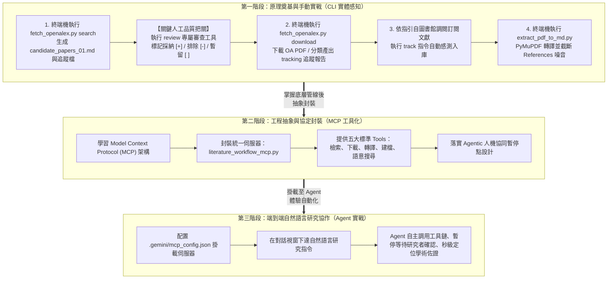
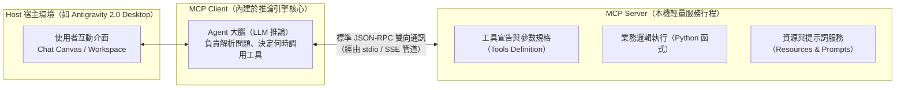
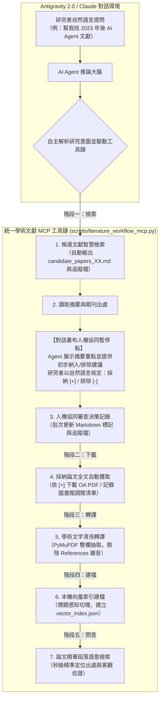

---
puppeteer:
  displayHeaderFooter: true
  headerTemplate: '<div style="font-size: 14px; margin: 0 auto;">第二章：智慧文獻爬梳與本機向量化檢索——從 OpenAlex API 到 MCP 工具化管線建構</div>'
  footerTemplate: '<div style="font-size: 14px; margin: 0 auto;">第 <span class="pageNumber"></span> 頁 / 共 <span class="totalPages"></span> 頁</div>'
  margin:
    top: "1.5cm"
    bottom: "1.5cm"
    left: "1.5cm"
    right: "1.5cm"
---
<style>
  /* 全域字型大小放大為 1.4 倍（預設 16px * 1.4 = 22.4px） */
  html, body, .mume, .markdown-preview {
    font-size: 22.4px !important;
    line-height: 1.6 !important;
  }
  /* 標題分頁控制 */
  h2 {
    page-break-before: always;
  }
  /* 表格與程式碼區塊維持等比例適配 */
  table {
    font-size: 0.9em !important;
  }
  pre, code {
    font-size: 0.88em !important;
  }
</style>
---

# 第二章：智慧文獻爬梳與本機向量化檢索：從 OpenAlex API 到 MCP 工具化管線建構

## 課程導讀：漸進式鷹架引導策略

歡迎回到「AI Agent 學術研究與文獻探討實務」的第二週課堂。在第一講中，我們完整建立了對自主代理人（AI Agent）的認知架構，劃定了包含五大工程目錄（`01_papers`、`02_notes`、`03_drafts`、`04_research_data`、`05_project_history`）的標準工作區（Workspace），並透過上下文工程在根目錄注入了靈魂規格書（`PROJECT.md`）。至此，我們已經為 AI Agent 賦予了明確的學術研究人設、剛性時程里程碑以及探索性核心研究問題（Exploratory RQs）。

然而，紙上談兵終究無法產出具備實證基礎的論文。環顧我們目前的工作區，最關鍵的客觀事實來源—— `01_papers/` 文獻庫，目前依然空空如也。

在傳統的研究歷程中，研究生蒐集文獻的方式往往是低效且碎片化的：打開搜尋引擎或圖書館系統，手動下載幾十篇檔名混亂的 PDF 檔案堆置在電腦桌面；當需要比對文獻時，又必須一篇篇打開 PDF 進行肉眼掃描。而在導入 AI 輔助時，若缺乏工程化處理，PDF 內部複雜的雙欄排版與龐大的參考文獻列表，更會嚴重污染大型語言模型（LLM）的注意力視窗。

本週課程的核心主旨，是要為 Antigravity 2.0 的 AI Agent 正式裝上 **「感知文獻的眼睛」與「調用工具的雙手」**。為了兼顧學術研究的嚴謹性與工程實踐的掌控感，本週教材特別採用 **「漸進式鷹架引導策略（Progressive Scaffolding Strategy）」**，依序帶領大家跨越三大思維階段：

1. **第一階段：原理奠基與手動實戰（第 1～2 節）**
   - **實體操作感知**：學生在終端機（Terminal）中親手執行獨立的命令列工具（`fetch_openalex.py` 與 `extract_pdf_to_md.py`），理解 API 請求、資料夾結構（`01_papers/raw_pdf/`、`extracted_text/`）與雙欄 PDF 文字工程的真實運作。
   - **人機協同品質把關**：親手在帶有兩位數流水號的 `candidate_papers_01.md`（支援多輪檢索 `candidate_papers[00-99].md`）逐一審視期刊來源（Source）與摘要（Abstract），透過專屬互動審查工具落實批判審查（標記 `[+]` 採納、`[-]` 排除或 `[ ]` 暫留），並由專屬追蹤檔案持續管理文獻獲取狀態。親自走過手動流程，才能徹底破除「AI 是黑盒子神仙」的迷思，確立研究者對學術品質的絕對主導權。
2. **第二階段：工程抽象與協定封裝（第 3～4 節）**
   - **工具化躍遷**：學習當代自主代理人最重要的擴充標準——模型上下文協定（Model Context Protocol，MCP）。
   - **統一伺服器架構**：將前期散落、手動執行的個別腳本，抽象化並整合封裝為全功能雙模 MCP 伺服器（`scripts\literature_workflow_mcp.py`），使檢索、下載、文字轉譯、向量建檔與語意搜尋成為 Agent 隨時可調用的標準工具鏈（Tools）。
   - **人機協同暫停點設計**：學習如何在 Agentic Workflow 中設計「斷點機制」，確保 Agent 在調用檢索工具後主動停下腳步，等待研究者審核勾選後方可繼續執行。
3. **第三階段：端到端自然語言研究協作（第 4.3 節實作驗證）**
   - **思維維度躍遷**：在 Antigravity 2.0 對話畫布中，以自然語言發起端到端文獻研究對話，體驗由「終端機手動操作員」升級為「指揮 AI Agent 的高階研究者」之流暢威力！



如上圖所示，唯有先親手走過第一階段的泥濘與細節，你才能在第二、三階段真正看懂 Agent 的每一步動作，不被黑盒子牽著走，成為真正具備主導權的高階研究者。

---

## 課前準備：建立 scripts/ 目錄並放入教師提供的核心工具腳本

在專案根目錄下建立 `scripts/` 資料夾，並將本週課程所提供的工具腳本放入該目錄中：
- `scripts/fetch_openalex.py`（文獻檢索、互動審查與全文追蹤管理工具）
- `scripts/extract_pdf_to_md.py`（PDF 雙欄轉譯與降噪工具）
- `scripts/literature_workflow_mcp.py`（統一學術文獻 MCP 伺服器）

---

## 第一節：學術文獻檢索、審查與追蹤管理實戰：scripts/fetch_openalex.py

在撰寫碩士論文的文獻探討章節時，研究者最迫切的需求並非探究學術資料庫底層龐雜的 API 規格，而是**如何透過直覺、精確且可控的工程工具，在最短時間內從全球學術圖譜中篩選出真正切合研究問題（RQs）的高價值文獻，並建立透明且持續的獲取追蹤歷程**。

為此，本專案在 `scripts/` 目錄中封裝了專屬的自動化文獻檢索、審查與全文追蹤管理工具：
- **核心工具路徑**：`scripts/fetch_openalex.py`

本工具完全採用 Python 原生標準庫編寫，隨插即用。它將繁瑣的網路連線、文字解析與檔案結構抽象化，為研究生提供五大標準指令：

```bash
# 1. 檢索候選文獻（自動生成兩位數流水號評估檔，如 candidate_papers_01.md 與專屬追蹤檔）
python scripts/fetch_openalex.py search "檢索關鍵字" [參數]

# 2. 全域瀏覽目前所有 candidate_papers[00-99].md 之檢索條件、審查狀態與文獻獲取進度
python scripts/fetch_openalex.py list

# 3. 專屬互動式文獻審查工具（逐篇判定採納 [+]、排除 [-]、保留 [ ]）
python scripts/fetch_openalex.py review [清單序號，例：01]

# 4. 針對選定清單中確認採納（[+]）的文獻執行全文獲取，並分類更新至專屬追蹤檔
python scripts/fetch_openalex.py download [清單序號，例：01]

# 5. 持續追蹤管理工具：自動感測 raw_pdf/ 中補全的訂閱文獻並更新追蹤報告
python scripts/fetch_openalex.py track [清單序號，例：01]

```

---

### 1.1 文獻檢索指令（search）與參數配置詳解

`search` 是文獻獲取管線的第一道關卡。研究者下達檢索主題後，腳本會自動連線 OpenAlex API，按照論文被引用次數由高至低排序，並在 `01_papers/` 目錄下自動建立帶有兩位數流水號的候選評估文件（例如第一次檢索產出 `candidate_papers_01.md`，第二次產出 `candidate_papers_02.md`）。

#### 指令語法與參數清單

```text
python scripts/fetch_openalex.py search [關鍵字] [-m 最大筆數] [-s 起始年份] [-e 結束年份]

```

下表完整整理了 `search` 指令所支援之關鍵參數、預設數值與在碩士論文寫作中的實務用途：

| 參數名稱 | 縮寫 | 型態 | 預設值 | 碩士論文檢索實務用途說明 |
| :--- | :--- | :--- | :--- | :--- |
| `query` | 無（位置參數） | 字串 | 必填 | 研究主題關鍵字。支援單詞、複合詞組或英文布林片語（建議使用雙引號包覆）。 |
| `--max` | `-m` | 整數 | `10` | 設定本輪欲評估之最大候選論文數量。初期探索建議設為 10 到 15 篇，避免認知負荷過重。 |
| `--start-year` | `-s` | 整數 | `2022` | 文獻發表的起始年份。預設鎖定近三年最新文獻，確保學術技術處於前沿。 |
| `--end-year` | `-e` | 整數 | `2026` | 文獻發表的結束年份。預設設定至當年度，確保能收錄到最新預印與正式出版論文。 |

#### 檔名流水號與 YAML Frontmatter 追蹤機制

為了妥善管理研究過程中針對不同關鍵字或年代的多輪探索，本工具採用 **「兩位數檢索流水號機制」**（`01` $\rightarrow$ `02` $\rightarrow$ `03` ... `99`，對應 `candidate_papers[00-99].md`），確保先前的檢索結果絕不被意外覆蓋。

每份候選文件最頂部均會自動注入標準的 **YAML Frontmatter**，精準記錄本次檢索的環境參數與後續審查進度：

```yaml
---
search_info:
  sequence_id: "01"
  search_time: "2026-09-18 10:44:17"
  query: "AI Agents in Higher Education scaffolding"
  max_results: 10
  start_year: 2022
  end_year: 2026
review_stats:
  total: 10
  included: 0      # 採納 [+] 篇數
  excluded: 0      # 排除 [-] 篇數
  pending: 10      # 保留 [ ] 篇數
---

```

透過這套 Frontmatter，研究者與 AI Agent 能一眼掌握：
- **`search_info`**：檢索時間戳記、查詢詞與年份邊界，方便日後在論文方法學章節中如實交代文獻篩選的檢索協定（Search Protocol）。
- **`review_stats`**：自動維護當前清單的審查統計——共有多少篇文獻被標記為採納（`included`）、排除（`excluded`）或待定（`pending`）。

#### 多情境檢索操作範例

**範例一：標準探索——檢索近三年核心高被引論文（預設 10 篇）**

```bash
python scripts/fetch_openalex.py search "AI Agents in Higher Education scaffolding"

```
*說明：未額外傳入參數時，系統預設擷取 2022 年至 2026 年被引用數最高的 10 篇論文，輸出為 `01_papers/candidate_papers_01.md`。*

**範例二：擴大篩選庫——放寬篇數並鎖定五年經典文獻（25 篇、2020-2025）**

```bash
python scripts/fetch_openalex.py search "Reflective Journals Educational Action Research" --max 25 --start-year 2020 --end-year 2025

```
*說明：明確要求檢索 25 篇、發表區間介於 2020 至 2025 年間的文獻，自動生成下一流水號檔案（如 `candidate_papers_02.md`）。*

**範例三：聚焦前沿介入——探討生成式 AI 與認知負荷之最新發表**

```bash
python scripts/fetch_openalex.py search "Cognitive Load GenAI Thesis Writing" -m 15 -s 2023 -e 2026

```

**範例四：跨學科探索——教學實踐研究（SoTL）之國際期刊論文**

```bash
python scripts/fetch_openalex.py search "Scholarship of Teaching and Learning Generative AI" --max 10 --start-year 2022

```

---

### 1.2 候選論文審查機制：專屬審查工具（review）

文獻檢索完成後，最關鍵的學術環節在於 **「研究者的人工品質把關」**。我們絕不盲目將所有檢索到的文獻照單全收，而是必須針對每篇論文的發表來源（Source 期刊信譽）與摘要（Abstract）進行批判性審查，所有審查操作一律由專屬的命令列互動工具 `review` 負責。

#### 三態審查標記系統
在專屬審查工具中，每篇論文支援三種審查決策狀態：
- **`[+]` 採納納入（Included / 相關）**：論文主題、方法或實證對象切合研究問題，確認納入論文研究，後續將自動抓取全文。
- **`[-]` 刪除排除（Excluded / 不相關）**：主題偏差、受試者不合、掠奪性刊物或方法學瑕疵，明確予以排除。標記排除能完整保留「曾檢索但經批判後剔除」之紀錄，符合系統性文獻回顧（PRISMA）標準。
- **`[ ]` 保留待定（Pending / 暫不表意見）**：僅憑摘要尚無法斷定是否相關，暫時維持待定狀態，不執行全文下載。

#### 終端機專屬審查工具操作（review）

研究者可直接在終端機啟動互動式審查器：

```bash
# 方式 1：自動列出目錄下所有候選清單供挑選
python scripts/fetch_openalex.py review

# 方式 2：直接指定特定流水號清單進行審查
python scripts/fetch_openalex.py review 01

```

執行後，終端機會逐篇呈現論文的篇名、發表期刊、出版年份、被引用次數、全文開放取用狀態與還原後之完整摘要，並提示操作選項：
- 輸入 `+`（或 `y`）：標記為 **`[+]` 採納納入**。
- 輸入 `-`（或 `n`）：標記為 **`[-]` 刪除排除**。
- 輸入 `k`（或按空白鍵）：標記為 **`[ ]` 保留待定**。
- 按 `Enter`：跳過本篇，維持當前審查狀態前進至下一篇。
- 輸入 `b`：返回上一篇重新審核。
- 輸入 `q`：儲存當前已審查之成果並退出系統。

完成審查退出時，腳本會自動將修改寫入 Markdown 文件， **即時更新頂部 YAML Frontmatter 統計，並同步聯動刷新專屬文獻獲取追蹤檔案**！

---

### 1.3 候選文獻庫總覽與多輪檢索管理：list 指令

隨著研究推進，研究生通常會針對不同關鍵字發起多次檢索（例如：`candidate_papers_01.md` 探討教學鷹架、`candidate_papers_02.md` 探討反思日記）。如何縱覽整體文獻庫的累積狀況？

本工具提供專屬的 `list` 瀏覽指令：

```bash
python scripts/fetch_openalex.py list

```

執行後，終端機將輸出排版整齊的 **「碩士論文候選文獻庫總覽」** 表格：

```text
================================================================================================================
 碩士論文候選文獻庫總覽 (Master Thesis Candidate Papers Catalog)
================================================================================================================
序號   檔案名稱                     檢索時間              篇數    採納[+]   排除[-]   待定[ ]   OA下載    已補訂閱     待調閱    檢索關鍵字
----------------------------------------------------------------------------------------------------------------
01   candidate_papers_01.md   2026-09-18 10:44  3     1       1       1       1       0        0      AI Agent Education
02   candidate_papers_02.md   2026-09-18 11:12  3     2       1       0       0       1        1      reflective journals scaf...
----------------------------------------------------------------------------------------------------------------
總計   共 2 批候選清單                -                 6     3       2       1       1       1        1      全專案文獻池
================================================================================================================

```

#### 總覽資訊之學術價值
1. **多批次橫向對比**：清楚掌握各批次檢索關鍵字收錄的文獻品質與採納率（`[+]` vs `[-]`）。
2. **全文入庫進度監控**：即時掌握「已成功自動下載的 OA 篇數」、「已自圖書館調閱補全的篇數」與「仍待調閱的封閉期刊篇數」，避免重要文獻在寫作階段遺漏。

---

### 1.4 文獻獲取、專屬追蹤檔案與持續追蹤機制：download 與 track 指令

#### 專屬文獻獲取追蹤檔案（Tracking Files）
對每一份候選清單 `candidate_papers_XX.md`，系統均會建立一對一專屬的獲取追蹤資料檔案：
- **結構化資料檔**：`01_papers/candidate_papers_XX_tracking.json`（供腳本與 Agent 即時讀取）。
- **可讀性報告檔**：`01_papers/candidate_papers_XX_tracking.md`（視覺化排版，供研究生查閱進度）。

追蹤報告將所有被研究者標記為 **`[+]` 採納納入** 的文獻，嚴密劃分為三大類別：
1. **已經自動下載之合法 Open Access (OA) PDF**：
   - 記錄篇名、第一作者、年份、發表期刊、本機 PDF 路徑與檔案大小。
2. **已經提供之訂閱文獻 PDF（研究者自圖書館取得）**：
   - 記錄研究生透過學校圖書館資料庫取得、放入 `01_papers/raw_pdf/` 的封閉期刊原件及其提供時間。
3. **尚未提供之訂閱文獻 PDF（待向校園圖書館調閱）**：
   - 明確標示論文篇名、發表期刊、**DOI 官方直連網址 **與 **系統標準建議儲存檔名**（例如：`2023_Rasul_The_role_of_ChatGPT_in_higher_educa.pdf`）。

#### 執行全文獲取指令（download）

當使用 `review` 指令完成標記後，即可發起全文獲取任務：

```bash
# 針對指定流水號清單執行下載
python scripts/fetch_openalex.py download 01

```

`download` 運作特性：
- 僅處理標記為 **`[+]`** 的論文，自動跳過 `[-]` 與 `[ ]`。
- 若為 Open Access 直連，自動下載至 `01_papers/raw_pdf/`，歸入「已經自動下載合法 OA PDF」。
- 若為商業封閉期刊（或遠端設有反爬蟲限制），自動歸入「尚未提供之訂閱文獻 PDF」，並在終端機打印出清晰的圖書館調閱指引。

#### 持續追蹤管理指令（track）：自動感測圖書館補全入庫

當研究生看到「尚未提供之訂閱文獻」時，只要利用校園圖書館電子資源查詢或校園 VPN 下載 PDF，並以系統建議的檔名存入 `01_papers/raw_pdf/` 目錄中。

接著，只要在終端機輸入：

```bash
python scripts/fetch_openalex.py track 01

```

**`track` 工具的自動化魔力**：
1. 腳本會自動掃描 `01_papers/raw_pdf/` 目錄。
2. 比對檔名、第一作者與發表年份，自動感測到新加入的論文 PDF 原件。
3. 自動將該文獻由「尚未提供之訂閱文獻」移轉至「已經提供之訂閱文獻」，刷新計算取得率，並即時更新 `candidate_papers_01_tracking.md` 報告！

---

### 1.5 課堂實作活動：從檢索、審查到全文獲取與持續追蹤

> **活動時間：** 15 分鐘
> **活動任務：** 透過 `fetch_openalex.py` 完整走過「參數檢索 -> 總覽瀏覽 -> 互動審查（[+]/[-]/[ ]）-> 全文獲取 -> 圖書館調閱持續追蹤」之標準流程。
>
> 1. **步驟一：執行自訂參數檢索**
>    打開終端機，依據個人研究題目設定關鍵字與參數（以教育行動研究為例）：
>    ```bash
>    python scripts/fetch_openalex.py search "Reflective Journals Educational Action Research" --max 10 --start-year 2022
>    ```
>    檢視終端機輸出，確認已在 `01_papers/` 生成首份帶流水號的文件（如 `candidate_papers_01.md`）與專屬追蹤檔 `candidate_papers_01_tracking.md`。
> 2. **步驟二：瀏覽文獻庫總覽**
>    在終端機執行總覽指令：
>    ```bash
>    python scripts/fetch_openalex.py list
>    ```
>    觀察表格中所列出的批次序號、檢索關鍵字與初始統計數據（採納 0 / 排除 0 / 待定 10）。
> 3. **步驟三：進行專屬互動審查（review）**
>    執行專屬審查工具：
>    ```bash
>    python scripts/fetch_openalex.py review 01
>    ```
>    根據終端機摘要提示，至少將 2 篇標記為採納 `[+]`，1 篇標記為排除 `[-]`，其餘保留待定 `[ ]`，最後輸入 `q` 儲存離開。
> 4. **步驟四：執行全文下載並檢視追蹤報表**
>    在終端機輸入下載指令：
>    ```bash
>    python scripts/fetch_openalex.py download 01
>    ```
>    打開 `01_papers/candidate_papers_01_tracking.md`，觀察「合法 OA 自動下載」與「尚未提供訂閱文獻」之分類清單。
> 5. **步驟五：體驗持續追蹤機制（track）**
>    若有被歸入「尚未提供」的訂閱論文，在終端機執行：
>    ```bash
>    python scripts/fetch_openalex.py track 01
>    ```
>    體會系統如何自動感測 `01_papers/raw_pdf/` 的檔案變化並無縫更新追蹤狀態。

```text
老師的真心話：
許多碩士生在剛開始做文獻回顧時，最容易陷入兩個極端：
要嘛是『看到一篇就讀一篇』，毫無系統性地被零星文獻牽著鼻子走；
要嘛是『盲目迷信全自動化』，完全不管論文是來自國際頂級權威期刊還是不知名的掠奪性水刊。
我們為 fetch_openalex.py 設計兩位數流水號管理、專屬命令列互動審查（禁止直接手動改檔）、
以及【採納納入 [+] / 刪除排除 [-] / 保留待定 [ ]】三態審查與專屬追蹤檔案（Tracking Files），
正是要幫大家建立起嚴謹的學術批判與工程追蹤習慣！
每一次檢索都是一次獨立的探索軌跡（01, 02...），每一篇被你親手採納（[+]）或剔除（[-]）的文獻，
都在 Frontmatter 與 Tracking Report 中留下了清清楚楚的證據。
當指導教授問你：『你這章文獻探討是怎麼蒐集、如何篩選、封閉期刊如何調閱入庫的？』
你打開這份帶有流水號、Frontmatter 與追蹤報表的完整清單，你的學術嚴謹度與說服力就已經無懈可擊！

```

---

## 第二節：學術文字工程：從 PDF 排版詛咒到純淨 Markdown

### 2.1 PDF 的技術本質與「排版詛咒」

成功將論文 PDF 下載到工作區後，許多人的直覺反應是：「太好了，現在把這 5 篇 PDF 一口氣丟給 AI Agent，叫它幫我寫文獻探討！」

然而，如果你真的這樣做，往往會得到令人沮喪的結果：Agent 回答零碎、錯漏百出，甚至將某個無關緊要的出版商版權聲明當成核心研究結論。

為什麼會這樣？這必須從 PDF 檔案格式的底層設計說起。

**PDF（Portable Document Format）最初的誕生目標，是為了在任何印表機與螢幕上達成 100% 精準的視覺排版再現，它根本不是為了讓電腦理解『文字語意』而設計的！** 在 PDF 檔案內部，文字並非以連續段落（Paragraphs）儲存，而是被切割為無數個帶有絕對 X、Y 幾何座標的「文字繪圖指令」。

這種排版機制，在學術論文中引發了四大「排版詛咒」：
1. **雙欄排版錯位（Two-Column Cross-Reading）：** 大多數國際學術期刊（如 IEEE、ACM、Springer、Elsevier）皆採用雙欄排版。傳統的文字提取工具若只依照水平掃描線讀取，會將左欄的第一行與右欄的第一行拼成同一句，造成嚴重的語序毀滅。
2. **頁首頁尾重複刺入（Header/Footer Injection）：** 每一頁頂部常印有期刊名、卷期、ISSN 號碼，底部則印有頁碼。這些與正文毫無關聯的字串，在每一頁都被硬生生插入論文段落的中間，直接打斷了前後文脈絡。
3. **行末連字符號硬斷行（Hyphenation Splitting）：** 英文論文為了維持版面左右對齊，單字常在行尾被強制打斷（例如 `trans-` 換行接 `formation`）。模型若直接讀取，會將其誤判為兩個獨立的無效詞彙。
4. **龐大的參考文獻雜音（References Noise）：** 一篇正式的期刊論文，末尾的參考文獻清單（References）往往多達 50 至 100 筆，佔據了全文 20% 甚至 30% 以上的篇幅。若未經處理直接餵入，這些由人名、年份與書名拼湊出的清單，會引發模型嚴重的關鍵字檢索干擾，並大量耗費寶貴的 Context Window。

```mermaid
flowchart LR
    subgraph RawPDF["原始學術 PDF（幾何排版導向）"]
        P1["頁首噪音：Journal of Education Vol.12..."]
        P2["左欄段落片段 1"]
        P3["右欄段落片段 1（跨欄穿插）"]
        P4["行尾斷詞：inter- / vention"]
        P5["文末 10 頁龐大 References 清單"]
    end

    subgraph Cleaning["學術文字工程（Text Engineering）"]
        C1["PyMuPDF 雙欄版面重構"]
        C2["正規表達式消除頁首頁碼"]
        C3["單字拼接還原 (De-hyphenation)"]
        C4["精準切除文末參考文獻雜音"]
    end

    subgraph CleanMD["純淨 Markdown（語意脈絡導向）"]
        M1["標準 Markdown 標題：# 1. Introduction"]
        M2["語意連貫之段落內文"]
        M3["清晰的實證數據與方法描述"]
        M4["體積縮減 70%，消除幻覺干擾"]
    end

    RawPDF --> Cleaning --> CleanMD

```



### 2.2 解析工具技術選型與 Markdown 格式優勢

為了破除 PDF 的排版詛咒，我們需要選擇合適的解析工具。在 Python 生態系中，雖然有早期的 `PyPDF2` 或 `pdfplumber`，但處理學術雙欄排版最穩定且速度最快的首選是 **PyMuPDF（底層為高效能 C 函式庫 MuPDF）** 及其針對大型語言模型優化的延伸模組 **`pymupdf4llm`**。

為什麼我們堅持將 PDF 轉換為 **Markdown（.md）**，而不是純文字（.txt）？
- **保留階層大綱：** Markdown 能精確保留論文的 `# 一級標題（Abstract/Introduction）`、`## 二級標題（Methodology/Participants）`。當 Agent 閱讀 Markdown 時，能一眼看清這段文字是屬於「研究背景」還是「研究限制」。
- **表格結構化：** Markdown 原生支援管道符號表格（`| col1 | col2 |`），能將論文中最精華的統計數據對照表完整保留，而不是坍塌成一團混亂的無意義數字。
- **純淨無二進位負擔：** 相較於肥大的 PDF，純文字 Markdown 體積僅有原檔案的 5% 到 10%，載入速度呈指數級提升。

### 2.3 文本清洗與正規化流程

一套成熟的學術文獻清洗流程，必須具備以下核心環節：
1. **結構化抽取：** 運用 `pymupdf4llm` 辨識雙欄排版、段落區塊與各級標題。
2. **剔除參考文獻清單：** 在學術文獻探討初期，Agent 需要消化的是論文的「核心論點、方法學、實驗數據與反思」，而不是文末密密麻麻的引用列表。偵測到 `## References`、`## Bibliography` 或 `## 參考文獻` 標籤後，自動將後續內容切除或獨立分流。
3. **清洗出版雜音：** 透過正規表達式消除包含 DOI 超連結、頁碼提示與 Creative Commons 授權宣告的重複行。
4. **標準化存放：** 處理完成的純淨 Markdown 文件，統一以相同檔名（副檔名改為 `.md`）存放於 `01_papers/extracted_text/` 目錄中。

### 2.4 第一階段手動實戰工具：`scripts\extract_pdf_to_md.py`

為了批次處理從圖書館或開放取用管道獲取的 PDF 文獻，在第一階段手動操作中，專案已建置標準文字清洗轉譯腳本，位於：
- **專案存放位置**：`scripts\extract_pdf_to_md.py`

#### 工具目的與用途
本工具負責將難以被 LLM 高效消化的雙欄二進位 PDF 文獻，轉換為語意結構完整、輕量純淨的 Markdown 格式：
1. **批次轉譯**：自動掃描 `01_papers/raw_pdf/` 目錄下的所有 PDF 檔案，運用 `pymupdf4llm` 高效引擎進行結構化抽取，保留文章的大標題、小節標籤與 Markdown 表格。
2. **剔除參考文獻清單**：偵測到 `## References` 或 `## Bibliography` 章節時自動執行切片截斷，平均為每篇文獻剔除 3,000 至 8,000 個 Tokens 的無效引用噪音，避免干擾 Agent 上下文。
3. **消除排版雜音**：透過正規表達式消除頁碼、重複出現的出版聲明與版權行。
4. **結構化儲存**：處理完成的純淨文本，統一以同名 `.md` 格式存放於 `01_papers/extracted_text/` 目錄中，作為後續向量分塊與知識檢索之乾淨語料。

#### 終端機操作指令範例
請確保環境已安裝 `PyMuPDF` 與 `pymupdf4llm`，並於工作區終端機中執行：

```bash
# 安裝轉譯套件（若尚未安裝）
pip install PyMuPDF pymupdf4llm

# 批次執行 PDF 轉譯與文字清洗
python scripts/extract_pdf_to_md.py

```

#### 核心運作原理與設計亮點
- **截斷切片設計（Truncation on References）**：腳本利用正則表達式監控行首標題，一旦識別進入參考文獻即終止後續解析，既節省儲存與模型 Token 開銷，更徹底杜絕 Agent 將前人參考書目誤認為當前實驗結論之現象。
- **階層標題維護（Heading Preservation）**：透過版面分析技術，原文中的大標題（如 Introduction, Methodology, Results）會被自動賦予 Markdown 的 `#` 與 `##` 標籤，為後續章節之「標題感知分塊（Header-aware Chunking）」奠定關鍵切分依據。
- **降級容錯保護（Fallback Parsing）**：若環境中未安裝 `pymupdf4llm`，程式自動平滑降級為標準 PyMuPDF 解析，確保在任何電腦環境下皆能順暢產出。

---

### 2.5 課堂實作活動：第一階段手動文字轉譯與結構校驗

> **活動時間：** 10 分鐘
> **活動任務：** 親自在終端機將第一節下載的 PDF 文獻轉譯為純淨 Markdown，並檢視其格式品質。
>
> 1. 確認電腦已安裝必要套件：
>    ```bash
>    pip install PyMuPDF pymupdf4llm
>    ```
> 2. 在終端機執行轉換腳本：
>    ```bash
>    python scripts/extract_pdf_to_md.py
>    ```
> 3. 轉換完成後，打開 VS Code 或 Antigravity 左側導航列，展開 `01_papers/extracted_text/` 目錄。
> 4. 隨機點開其中一篇 `.md` 檔案，使用 Markdown 預覽模式（Markdown Preview）觀察：
>    - 論文大綱是否完整保留了各級標題？
>    - 雙欄排版是否已還原為自然連續的段落？
>    - 文末是否成功在 References 處停止，消除了雜亂的引用書單？

```text
老師的提醒：
很多同學剛開始使用 AI 時，喜歡直接將整份 30 頁的 PDF 拖入聊天對話框中。
這在技術上犯了大忌！
未經清理的 PDF 含有大量隱形斷行、頁碼與印刷浮水印，這會嚴重打亂大模型的注意力機制（Attention Heads），
更別提那上百筆的 References 會白白吃掉你大半的 Context Window 配額。
養成『先把 PDF 洗乾淨成 Markdown 再交給 Agent』的工程紀律，能讓你的 AI 助理思考反應更快、
回答問題更精確，而且完全杜絕抓錯作者與引用的低級錯誤！

```

---

## 第三節：模型上下文協定（MCP）核心機制與本地工具擴充

### 3.1 為什麼 AI Agent 需要 MCP？

在前兩節中，我們已經成功將真實世界的學術論文下載並轉譯為乾淨的 Markdown 格式。但此時產生了一個全新的工程挑戰： **我們該如何讓 Antigravity 2.0 中的 AI Agent 自主調用本機程式來閱讀、檢索這些檔案？**

在傳統的軟體架構中，若想讓 AI 具備操作外部工具的能力，各家平台往往採用封閉私有的外掛（Plugin）或函式調用（Function Calling）格式。例如 OpenAI 有自己的 GPT Actions 規範，其他平台又有各自相異的 API 介面。這導致開發者每換一個平台，就必須重新編寫整套工具對接程式，造成嚴重的生態破碎。

為了解決這個問題，Anthropic 於 2024 年底公開發表了開源的 **模型上下文協定（Model Context Protocol，簡稱 MCP）**。MCP 迅速獲得包括 Google Antigravity、Cursor 以及開源社群的全力支持，成為當代 AI 代理人串接本機資源與外部工具的統一黃金標準。

> **如果說 USB（通用序列匯流排）徹底統一了鍵盤、滑鼠、隨身碟與電腦的實體連接，那麼 MCP 就是 AI Agent 世界的「軟體通用 USB 規格」。**

透過 MCP，我們只需要編寫一次 Python 工具程式，任何支援 MCP 的 AI Agent 就能立刻自動發現、理解並正確調用這項能力。

### 3.2 MCP 架構三要素：Host、Client 與 Server

MCP 採用經典且高擴充性的三層式客戶端-伺服器架構（Client-Server Architecture）：



這三者分工明確：
1. **Host（宿主應用程式）：** 就是使用者操作的軟體環境，例如我們電腦上運行的 **Antigravity 2.0 Desktop**。Host 負責管理工作區介面、設定檔以及安全授權機制。
2. **Client（MCP 客戶端）：** 內建於 Antigravity 的核心推論引擎中。Client 負責與多個 MCP Server 保持連線，將 Server 提供的工具規格轉換為提示詞傳遞給 LLM 大腦；當 LLM 決定呼叫某個工具時，Client 負責發送執行請求。
3. **Server（MCP 伺服器）：** 這是我們即將動手撰寫的本機程式。一個 MCP Server 是一個獨立運行的輕量行程，它專注於提供特定的「專屬技能」——例如讀取特定目錄、搜尋本機向量庫或連線特定資料庫。

### 3.3 建立 .gemini/ 目錄並配置 MCP 連線設定檔

在理解了 MCP「軟體 USB 插頭」的運作原理後，我們便可以在工作區中建立專屬的協定設定檔，將 Python 腳本正式註冊給 Antigravity 2.0 桌面端。

請在專案根目錄下建立隱藏資料夾 `.gemini/`，並在其中新增 `mcp_config.json` 設定檔，內容如下：

```json
{
  "mcpServers": {
    "literature-workflow": {
      "command": "python",
      "args": [
        "scripts/literature_workflow_mcp.py"
      ],
      "env": {
        "PYTHONIOENCODING": "utf-8"
      }
    }
  }
}

```

這段設定檔告訴 Antigravity 核心引擎：
- 本專案註冊了一個名為 `literature-workflow` 的全功能學術工具服務。
- 啟動方式是在終端機執行 `python scripts/literature_workflow_mcp.py`。
- 強制設定輸出編碼為 `utf-8`，以防 Windows 系統終端機之編碼干擾。

---

### 3.4 課堂實作活動：探索 Antigravity 內建與本機 MCP 環境

> **活動時間：** 5 分鐘
> **活動任務：** 觀察 Antigravity 2.0 介面中如何辨識 MCP 工具與本機設定。
>
> 1. 打開 Antigravity 2.0 Desktop。
> 2. 檢視設定面板（Settings）或擴充協議清單中的 **MCP Servers** 欄位。
> 3. 觀察系統預設啟用的工具模組（例如內建的檔案讀取器、終端機執行器等），以及剛剛在 `.gemini/mcp_config.json` 註冊的項目。
> 4. 思考：若我們為其增添一個專門檢索 `01_papers/extracted_text/` 的本機伺服器，Agent 的能力會產生什麼質的飛躍？

```text
老師的提醒：
文科背景的同學千萬不要被『客戶端-伺服器』或『通訊協定』這類名詞嚇退了！
在實務操作中，MCP 伺服器本質上就是一支『掛上了標準化說明的 Python 程式』。
你不用架構複雜的雲端網站，也不用設定防火牆。
它就像是在你的 Python 腳本外殼上，裝了一個符合國際規格的『USB 插頭』，
只要把它插進 Antigravity 的設定檔裡，你的 AI 就能立刻多出一項『搜尋個人論文庫』的超能力！

```

---

## 第四節：第二階段工程躍遷：學術文獻全流程 MCP 伺服器架構

### 4.1 從獨立腳本到統一工具鏈：為什麼需要整合 MCP？

在第一節與第二節中，同學們已經在終端機中親自體驗了 `fetch_openalex.py` 與 `extract_pdf_to_md.py` 的手動操作。親自走過這一步，讓我們對文獻的物理目錄（`raw_pdf/`、`extracted_text/`）、API 資料交換結構以及研究者在 `candidate_papers.md` 中的批判勾選有了扎實的感知。

然而，如果我們日常做研究時，每次想找論文都要跳出對話框、切換到終端機輸入指令、再手動執行轉譯，這樣的工作流依然充滿了摩擦力。更關鍵的是，當論文庫逐漸累積到 10 篇、30 篇（文字量高達數十萬字）時，若每次向 Agent 提問都讓它從頭到尾把所有 Markdown 讀一遍，將引發三大痛點：
1. **反應遲緩**：遍歷龐大文字檔案需要消耗大量運算資源與等待時間。
2. **Context 配額迅速枯竭**：將數十萬字全文無差別載入對話，既昂貴又容易引發模型的「長文遺忘（Lost in the Middle）」效應。
3. **關鍵字搜尋的語意鴻溝（Semantic Gap）**：傳統文字比對無法跨越同義詞或相近概念（例如搜尋「教學鷹架」無法命中內文的「學習支援系統」）。

為了解決這些問題，我們進入漸進式鷹架的第二階段： **將先前驗證過的獨立 Python 功能，全面抽象封裝為單一、全功能的「學術文獻全流程 MCP 伺服器」**！



---

### 4.2 全流程 MCP 伺服器架構與自然語言驅動實務

本專案已將前述所有文獻爬梳、審查、下載、文字清洗與本機向量索引管線，全面封裝為統一的 MCP 伺服器（存放於 `scripts\literature_workflow_mcp.py`）。

在 Antigravity 2.0 中， **研究生完全不需要記憶任何複雜的底層程式函式名稱或命令列參數**。AI Agent 具備優秀的語意理解與工具調用（Function Calling）能力，能夠準確理解你的自然語言研究意圖，自動在背景呼叫對應的後端模組。

以下完整整理在碩士論文文獻研究的各個階段中，如何以**自然語言提示詞（Prompts）**驅動 Agent 自主完成任務：

---

#### 1. 探索性文獻智慧檢索（跨年份、關鍵字與篇數條件過濾）
當你需要針對特定研究題目或核心問題（RQs）向全球學術知識庫搜尋文獻時，直接在對話框給出自然語言指令，並可明確指定**主題關鍵字、發表年份區間、篇數上限**：

> **自然語言驅動範例：**
> - *「幫我找 2023 年之後利用 AI Agent 進行 Automated Systematic Literature Reviews 的相關文獻，先列出 10 篇最具代表性的候選論文。」*
> - *「請向 OpenAlex 檢索 2022 年到 2025 年間，探討『高等教育中學生撰寫反思日記（Reflective Journals）搭配鷹架支援（Scaffolding）』的代表性期刊論文，找出被引用次數最高的前 10 篇。」*
> - *「針對『生成式 AI 輔助論文寫作對研究生認知負荷的影響』，幫我檢索近三年的候選論文清單並建立評估檔。」*

**Agent 的後端自主行為：**
Agent 解析語意後，自動提取主題關鍵字與年份參數向 OpenAlex API 發送請求，在 `01_papers/` 生成帶有兩位數流水號的 `candidate_papers_XX.md` 與專屬獲取追蹤檔案，並在對話視窗條列展示論文出處、年份與摘要重點。

---

#### 2. 對話式人機協同品質審查（Human-in-the-Loop 批判性核定）
檢索完成後，研究者可依據個人的研究節奏與文獻複雜度，自由選擇 **「批次快速審查」** 或 **「逐筆引導審查」**：

##### 模式 A：批次快速審查（適合快速閱覽總覽後一次性核定）
當你檢視完 Agent 整理的候選清單概覽，對各篇文獻已有明確決策時：

> **自然語言驅動範例：**
> - *「第 1、3 篇切中我的研究問題，請標記為採納 [+]；第 2 篇的研究對象是國小學童不符設定，請標記為排除 [-]；其餘先保留待定 [ ]。」*
> - *「我看過你的分析了，完全同意你的建議，請將第 1 到 4 篇採納納入，第 5 篇排除。」*

##### 模式 B：對話式逐筆審查（適合深入評估、一問一答逐篇判定）
若文獻篇幅較長、主題較嚴謹，你想一篇一篇詳細看過摘要、論點與 Agent 的建議再做決定：

> **自然語言驅動範例：**
> - *「請針對候選清單 01，帶我一篇一篇看，每篇請呈現完整摘要與你的評估分析，我核定完一篇後再看下一篇。」*
> - （Agent 呈現第 1 篇分析與推薦後）研究者回答：*「這篇核心理論切合，請標記採納 [+]，並請繼續展示第 2 篇。」*
> - （Agent 寫入第 1 篇狀態並展示第 2 篇後）研究者回答：*「第 2 篇的方法設計有疑慮，標記排除 [-]，換下一篇。」*
> - （Agent 寫入第 2 篇狀態並展示第 3 篇後）研究者回答：*「第 3 篇先保留待定 [ ]，繼續下一篇。」*

##### 模式 C：終端機鍵盤極速審查（命令列雙模模式）
若研究者偏好全鍵盤沉浸式極速操作，亦可在終端機執行：

```bash
python scripts/literature_workflow_mcp.py review 01

```
系統將啟動原生互動式逐筆審查工具，逐篇展示並支援鍵盤單鍵判定（`+` 採納、`-` 排除、`k` 保留、`Enter` 跳過、`b` 上一篇、`q` 儲存）。

**Agent 的後端自主行為：**
無論採取批次或逐筆審查，Agent 均會自動呼叫後端審查模組，即時將 `[+]`、`[-]` 與 `[ ]` 決策寫入對應的 Markdown 文件，重新計算 Frontmatter 統計，並同步刷新專屬獲取追蹤報表（`candidate_papers_XX_tracking.md`）。

---

#### 3. 採納文獻全文自動獲取與圖書館調閱指引
完成文獻挑選後，用一句自然語言指示 Agent 自動抓取全文：

> **自然語言驅動範例：**
> - *「請幫我下載剛才已採納標記為 [+] 的所有論文全文。」*
> - *「請針對 candidate_papers_01 中確認納入的文獻執行全文下載，並回報有哪些受版權限制需要我去學校圖書館手動調閱。」*

**Agent 的後端自主行為：**
Agent 自動掃描候選清單中標記為 `[+]` 的論文，將合法 Open Access 的 PDF 原件自動下載至 `01_papers/raw_pdf/`；針對需要校園訂閱的付費期刊，自動在追蹤檔整理出 DOI 連結與建議儲存檔名，清晰引導研究者調閱。

---

#### 4. 批次文字工程（雙欄排版重構與剔除雜音）
全文下載就位後，指示 Agent 進行文字轉譯與清洗：

> **自然語言驅動範例：**
> - *「請把 raw_pdf 目錄下的所有 PDF 轉譯為乾淨的 Markdown 格式，記得剔除文末的參考文獻清單與出版商頁首頁尾噪音。」*
> - *「下載完成的論文已經就位，請幫我執行文字清洗，輸出純淨文本到 extracted_text 目錄。」*

**Agent 的後端自主行為：**
Agent 自動調用雙欄重構演算法，精準切除文末長達數頁的 References 清單、消除連字斷詞與頁碼，將純淨高密度的 Markdown 論文存放至 `01_papers/extracted_text/`。

---

#### 5. 本機語意索引建置與深度段落事實檢索
當乾淨文本就位，研究者便能隨時指揮 Agent 建立向量索引，並針對論文內文進行精準的證據檢索：

> **自然語言驅動範例：**
> - *「請為目前所有轉譯好的論文建立本地語意索引庫。」*
> - *「請檢索本機論文庫，告訴我：各篇文獻中對於『AI 鷹架如何降低學習者外在認知負荷』有哪些實證發現與量化數據？請附上具體引文與出處篇名。」*
> - *「各篇文獻在研究方法（Methodology）章節中，分別採用了什麼質性或量化研究工具？請幫我做個重點比較並標註所屬章節。」*

**Agent 的後端自主行為：**
Agent 首先以章節標題為界完成語意切塊並生成 `vector_index.json`；當收到學術問題時，能在 0.1 秒內在全班數十篇文獻中精準鎖定 Top-3 相關段落，帶出原始章節出處，並結合客觀證據回答，徹底避免大型語言模型的學術幻覺！

---

### 4.3 課堂實作活動：端到端自然語言文獻研究實戰

> **活動時間：** 15 分鐘
> **活動任務：** 全面告別終端機手動敲指令，在 Antigravity 對話畫布中以自然語言驅動全流程文獻研究！
>
> 1. 打開 Antigravity 對話視窗，向 Agent 發出第一階段檢索指令：
>    *「幫我找 2023 年之後利用 AI Agent 進行 Automated Systematic Literature Reviews 的相關文獻，先列出 10 篇最具代表性的候選論文。」*
>    （亦可替換為你的論文研究主題，例如：*「請幫我向 OpenAlex 檢索 2022 年後探討『反思日記在高等教育中之鷹架支援』的代表性文獻。」*）
> 2. **觀察思考與人機協同暫停點**：
>    - 觀察 Agent 在思考過程中主動調用後端檢索模組。
>    - 檢視 Agent 在對話視窗中的回覆：觀察它如何條列呈現文獻出處（期刊信譽、年份）與摘要重點，並主動向你提出初步的採納 [+] 與排除 [-] 建議！
> 3. **研究者在對話中進行審核核定（Human-in-the-Loop）**：
>    - 研究者檢閱後，可選擇 **批次核定**：
>      *「同意你的評估，採納第 1、3 篇，排除第 2 篇，第 4 篇也採納。」*
>    - 亦可要求 Agent 進行 **逐筆引導審查**：
>      *「請一篇一篇帶我看完整摘要，我每篇確認後再看下一篇。」*
>    - 觀察 Agent 自動將決策即時寫入檔案並刷新追蹤檔。
> 4. **發起第二階段自動化獲取與文字清洗**：
>    - 對 Agent 說：*「請幫我下載採納的全文並轉譯為乾淨文字，接著建立索引庫。」*
>    - 觀察 Agent 如何自動接續完成全文下載、雙欄清洗轉譯與向量索引建置！
> 5. **發起第三階段學術語意深度檢索**：
>    - 向 Agent 提出具體的學術問題：
>      *「請檢索本機文獻庫，回答我：各篇文獻中對於自動化系統性文獻回顧（Automated SLR）有哪些實證評估或研究限制？請列出引文佐證與所屬章節出處。」*
>    - 觀察 Agent 在秒級內精準定位論文段落，並給出帶有出處依據的權威回答！

```text
老師的真心話：
恭喜大家走完了這趟『漸進式鷹架』的完整旅程！
回想一下：第一節課你還在 Terminal 敲指令、看檔案是怎麼一行行被抓下來、啟動 review 審查工具判讀 [+]、自己跑文字清洗與追蹤報告；
而現在，你只要在對話視窗中談笑風生，Agent 就能精準調用工具鏈、主動停下來向你請示、並在秒級內為你定位出十幾萬字文獻裡的關鍵證據。
這種『先苦後甘』的訓練，就是最扎實的專業底氣！
當外面不懂技術的人只會把 AI 當成隨機許願機、完全不知道 AI 抓了什麼垃圾水刊時，
你已經對資料夾裡的每篇 PDF、每段清洗規則、以及人機協同的每處道德防線了然於胸。
唯有掌握底層細節的研究者，才能真正駕馭高級 Agent，在未來的碩士論文研究中立於不敗之地！

```

---

## 本週小結與下週預告

在本週（第二講）的密集實戰中，我們成功為 AI Agent 建構了一條專業級的學術文獻工程流水線。我們不再依賴人工手動搬運文獻，而是掌握了四大核心里程碑：
1. **學術知識庫大門：** 透過 OpenAlex REST API，跨越了商業資料庫與生醫領域的門檻，學會設定結構化過濾條件，自動批量獲取具備 Open Access 全文的期刊論文與元數據。
2. **學術文字工程：** 深刻體會了 PDF 排版機制對 LLM 產生的干擾與 Token 浪費，運用文字清洗技術剔除參考文獻噪音與跨欄錯亂，將 PDF 提煉為純淨、高密度的 Markdown 文本。
3. **理解 MCP 擴充核心：** 掌握了當代自主代理人最重要的擴充標準——模型上下文協定（MCP），理解 Host、Client 與 Server 之間的 stdio 通訊與 JSON-RPC 工具調用原理。
4. **掛載全流程文獻 MCP 伺服器：** 擺脫繁雜幾何數學與底層通訊的包袱，配置全流程 `literature_workflow_mcp.py` 伺服器，將文獻檢索、對話審查、全文下載、雙欄清洗與本機向量索引全面工具化，讓 Agent 擁有隨傳隨到的自主手腳與客觀事實檢核能力。

### 下週預告：第三講——深度文獻精讀與概念網絡建構

有了乾淨的文獻資料（`01_papers/extracted_text/`）與隨傳隨到的 MCP 檢索手腳後，下一週我們將正式邁入文獻探討中最具學術含金量的核心戰場—— **「深度精讀（Critical Reading）與跨篇文獻矩陣共構」**！

在第三週的課程中，我們將學習：
- 如何指揮 Agent 進行批判性閱讀，精確提煉出每篇論文的【理論架構】、【樣本規模】、【介入方法】與【研究限制】，自動產出標準單篇筆記至 `02_notes/reading_cards/`。
- 如何將多篇文獻交叉橫向比對，自動共構出具備高學術價值的 `02_notes/literature_matrix.md` 跨篇比較矩陣表。
- 學習如何透過文獻矩陣一眼鎖定前人研究的 **「學術空白（Research Gap）」**，為你在 11 月即將到來的碩士論文計畫書口試，確立不可撼動的研究立足點！
