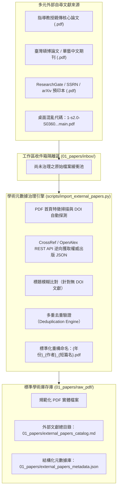
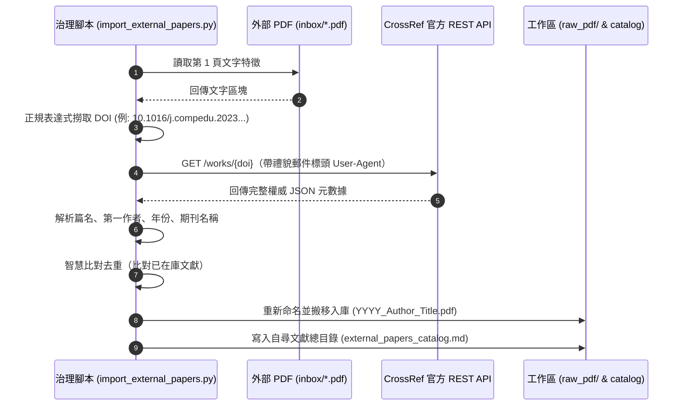

---
puppeteer:
  displayHeaderFooter: true
  headerTemplate: '<div style="font-size: 14px; margin: 0 auto;">第三章：外部自尋文獻匯入與學術元數據治理——從未經結構化的 PDF 到正規化學術資料庫</div>'
  footerTemplate: '<div style="font-size: 14px; margin: 0 auto;">第 <span class="pageNumber"></span> 頁 / 共 <span class="totalPages"></span> 頁</div>'
  margin:
    top: "1.5cm"
    bottom: "1.5cm"
    left: "1.5cm"
    right: "1.5cm"
---
<style>
  /* 全域字型大小放大為 1.4 倍（預設 16px * 1.4 = 22.4px） */
  html, body, .mume, .markdown-preview {
    font-size: 22.4px !important;
    line-height: 1.6 !important;
  }
  /* 標題分頁控制 */
  h2 {
    page-break-before: always;
  }
  /* 表格與程式碼區塊維持等比例適配 */
  table {
    font-size: 0.9em !important;
  }
  pre, code {
    font-size: 0.88em !important;
  }
</style>
---

# 第三章：外部自尋文獻匯入與學術元數據治理：從未經結構化的 PDF 到正規化學術資料庫

## 課程導讀：破除單一資料庫迷思，迎接多源文獻真實挑戰

歡迎來到「AI Agent 學術研究與文獻探討實務」的第三週課堂。

在上一週（第二講）中，我們成功建立了一套優雅的自動化文獻檢索管線：透過 OpenAlex REST API 設定結構化過濾條件、依引用次數排序、透過外部品質設定檔排除巨型期刊，並由研究者透過互動審查工具（`review`）落實批判把關，最終自動下載合法的開放取用（Open Access）PDF 檔案至 `01_papers/raw_pdf/`。這條管線的優勢在於：**每一篇文獻從抓取的第一秒開始，就具備完整清晰的學術元數據（Metadata）**——篇名、作者群、出版年份、來源期刊、被引用次數、DOI 與摘要無一遺漏。

然而，回到真實的研究世界中，任何有經驗的碩士研究生或學者都知道：**一章成熟、厚實的文獻探討，絕不可能只靠單一開放資料庫的關鍵字檢索就宣告完成！**

在實際的學術研究歷程中，你的電腦資料夾中隨時會湧入大量**「外部自尋文獻（External Ad-hoc Literature）」**：
1. **指導教授交辦的關鍵文獻**：教授在咪聽（Meeting）時寄給你的核心經典論文、或是研究室傳承的先導研究。
2. **本土與中文學術資源**：來自「臺灣博碩士論文知識加值系統（NDLTD in Taiwan）」的優秀學位論文、或是「華藝線上圖書館（Airiti Library）」、「中國知網（CNKI）」收錄的期刊論文。
3. **非傳統資料庫直接下載的檔案**：你在 Google Scholar、ResearchGate、SSRN、arXiv 或研討會官方網站上直接點擊下載的 PDF 預印本（Preprints）或作者典藏版。
4. **歷史累積的桌面混亂檔案**：隨身碟或電腦桌面中累積的檔案，檔名往往是出版商隨機生成的代碼（如 `1-s2.0-S036013152200123X-main.pdf`）、或是瀏覽器預設的 `download (4).pdf`。

### 致命的痛點：未經治理的 PDF 丟給 Agent 是災難的開始

許多研究生在獲得這些寶貴的 PDF 後，直覺的做法是直接將它們拖入工作區資料夾中，甚至直接丟入對話框要求 Agent 閱讀。

這種做法會立刻引發嚴重的**「上下文污染與學術失序」**：
- **Agent 陷入「身份盲區」**：檔名沒有年份與作者，Agent 在閱讀時必須耗費額外推理算力去猜測篇名與第一作者，極易將文章開頭的通訊作者或編者姓名誤認為主要作者。
- **引用格式斷裂（Citation Hallucination）**：外部 PDF 缺乏出版卷期、頁碼與權威 DOI，Agent 在撰寫文獻綜述時無法給出合規的 APA 7th 格式引用，甚至會因為資訊不足而自行「腦補」虛假出處。
- **重複文獻入庫（Duplication Waste）**：同一篇論文可能第二週在 OpenAlex 檢索過，第三週又由教授推薦下載；若檔名與結構不一致，Agent 會將其視為兩篇不同的文獻重複處理，造成算力浪費與文獻綜述的邏輯矛盾。



### 本週核心使命：為外部文獻建立統一的「學術戶籍登記制度」

本週課程的核心主旨，是要為我們的論文工作區建立一套嚴謹的 **「外部自尋文獻匯入與學術元數據治理管線（External Ingestion & Metadata Governance Pipeline）」**。

透過本週的實戰，我們將學會：
1. **建立工作區收件箱（Inbox）隔離制度**：所有外部自尋文獻一律先放入 `01_papers/inbox/` 暫存，絕不污染正式庫存。
2. **掌握 PDF 首頁特徵探測技術**：利用正則表達式自動從 PDF 第一頁撈取 DOI（數位物件識別碼）。
3. **運用 CrossRef REST API 逆向解析元數據**：以 DOI 為鑰匙，向全球學術出版商的權威總庫（CrossRef）即時逆向查詢標準篇名、作者群、期刊名、發表年份與卷期。
4. **建立自尋文獻目錄與去重防護**：將通過治理的文獻重新命名為 `{年份}_{作者}_{短篇名}.pdf` 搬入 `raw_pdf/`，產出專業的 `external_papers_catalog.md`，並將外部文獻賦予標準的審查採納 `[+]` 標記，無縫整併進第二週建立的文獻庫體系！

讓每一篇進入研究工作區的文獻，無論來源為何，都擁有完整權威的「學術身分證」！

---

## 課前準備：工作區目錄擴充與核心腳本配置

請在工作區中確認以下目錄結構與治理腳本：
- **建立外部文獻暫存收件箱**：`01_papers/inbox/`（用於放置所有外部自尋、下載但尚未治理的 PDF 原件）
- **確認核心工具腳本**：
  - `scripts/import_external_papers.py`（外部文獻解析、CrossRef 逆向查詢、去重與入庫工具）
  - `scripts/literature_workflow_mcp.py`（MCP 伺服器擴充外部文獻治理介面）
- **準備測試文獻**：請同學自電腦桌面或圖書館隨意準備 2～3 篇英文或中文 PDF 文獻（故意保留其混亂檔名），以便稍後實作驗證。

---

## 第一節：外部自尋文獻的五大治理赤字與元數據體系

### 1.1 碎片化文獻的「五大治理赤字（Governance Deficits）」

當我們檢視研究生的電腦桌面時，往往充斥著各種來源各異的 PDF 檔案。在軟體工程與資料治理的視角下，這些未經處理的文獻存在五大嚴重的「治理赤字」：

| 治理赤字 | 實務表徵 | 對 AI Agent 協同研究的致命危害 |
| :--- | :--- | :--- |
| **1. 檔名失真赤字 (Filename Obfuscation)** | 檔名為出版商隨機哈希碼（如 `sdarticle.pdf`、`10.1016@j.cedpsych.2023.pdf`）或預設流水號（`download (2).pdf`）。 | Agent 無法從檔名感知內容，必須無謂遍歷檔案首頁，大幅增加 Context Window 與 Token 開銷。 |
| **2. 作者與年份斷裂 (Citation Disconnection)** | 檔案本身缺乏結構化欄位，第一作者姓氏拼法與真實出版年份不明確。 | Agent 在論文寫作時極易混淆通訊作者與第一作者，產出錯誤的「In-text Citation」（文中引用）。 |
| **3. 出版來源去識別化 (Source De-identification)** | 無法即時得知文獻發表的期刊名稱、主辦研討會或學校系所，遺失卷期頁碼。 | 無法在 PRISMA 流程中檢核該文獻是否符合 SSCI/SCI 納入標準，亦無法產出文末標準參考書目。 |
| **4. 重複入庫赤字 (Deduplication Failure)** | 同一篇經典論文因多次下載，以不同檔名重複存在於多個子目錄中。 | Agent 在進行跨篇文獻綜述時，會將同一個研究當成兩筆獨立實證數據，導致研究論述產生嚴重的統計偏差。 |
| **5. PRISMA 追蹤斷鏈 (Traceability Disruption)** | 外部文獻繞過了系統性搜尋的流水號與評估清單，無法記錄「為何納入、何時納入」。 | 當口試委員詢問：「這篇重要文獻是在哪一個檢索階段獲取的？」研究者無法提出清晰的獲取軌跡。 |

### 1.2 學術元數據（Metadata）的權威標準：DOI 與 CrossRef 體系

為了解決治理赤字，我們必須引入國際學術發行界共通的標準元數據規格。

#### 什麼是 DOI（數位物件識別碼）？
**DOI（Digital Object Identifier）** 是國際 DOI 基金會（IDF）為數位資源制定的全球唯一且永久的識別標準。每一篇發表於國際正式期刊、研討會論文集甚至許多預印本的學術成果，均會被賦予一串獨一無二的字串：

$$\text{10.xxxx / [後綴識別碼]}$$

例如：
- `10.1016/j.compedu.2023.104789`
- `10.1080/08923647.2022.2046845`

其中前綴 `10.` 代表 DOI 命名體系，後續的四位以上數字代表出版社代碼（如 `10.1016` 代表 Elsevier），斜線後方則是出版品專屬代碼。只要掌握了一篇論文的 DOI，就像拿到了該論文的**「全球學術身分證號碼」**，即使該期刊更換網址或出版社易主，DOI 亦永不失效。

#### CrossRef：全球學術發行界最大的權威元數據中心
**CrossRef** 是由全球數千家學術出版社（包括 Elsevier、Springer Nature、Wiley、IEEE、ACM、Taylor & Francis 等）共同組成的官方註冊機構。當出版社正式發表一篇論文時，必須強制將該論文的**官方權威元數據（官方正式題目、所有作者詳細姓名與排序、所屬機構、期刊全名、ISSN、出版年份、卷期、起訖頁碼與授權狀態）**同步上傳至 CrossRef 資料庫。

更棒的是，CrossRef 提供了完全公開且**無需申請 API Key（無金鑰限制）**的 RESTful API 查詢端點：

```text
GET https://api.crossref.org/works/{DOI}
```

只要我們能從未經整理的 PDF 中探測到 DOI，就能在毫秒之內向 CrossRef 查詢並取回 100% 絕對權威、無人為拼寫錯誤的學術元數據！

---

## 第二節：元數據逆向解析與自動補全技術：從 PDF 文本到 CrossRef API

### 2.1 PDF 首頁文字特徵探測與 DOI 正規表達式

學術出版社在排版 PDF 時，幾乎毫無例外地都會在**論文的第一頁（First Page / Cover Page）**上方、底部或頁緣頁首處印上該篇文獻的 DOI 資訊。

因此，治理引擎的第一個關鍵步驟，就是運用輕量文字讀取技術讀取 PDF 第 1 頁（約前 2,000 個字元），並以高容錯的正規表達式（Regular Expression）進行特徵掃描：

```python
import re

# 匹配標準 DOI 的強健正規表達式
DOI_REGEX = re.compile(
    r'\b(10\.\d{4,9}/[-._;()/:A-Za-z0-9]+)\b',
    re.IGNORECASE
)
```

#### 實務上的邊界清洗陷阱（Edge Cases）
在實際掃描中，常會遇到以下干擾，治理引擎已內建清洗規則：
1. **URL 前綴干擾**：掃描到的字串常帶有 `https://doi.org/` 或 `http://dx.doi.org/`，程式會自動剔除 URL 前綴，只保留乾淨的 `10.xxxx/...` 核心代碼。
2. **結尾標點符號沾黏**：文章句末的句點、逗號或右括號常被正則誤包進去（如 `10.1016/j.chb.2023.104789.`），程式會自動去除結尾的無效標點。

### 2.2 透過 CrossRef REST API 逆向獲取權威 JSON

當探測到 DOI 後，腳本會立即向 CrossRef 伺服器發送標準 HTTP 請求。



#### 「禮貌請求原則（Polite Pool）」的工程實踐
CrossRef 官方為了防止濫用，同時又照顧學術研究者的需求，特別設計了「禮貌集（Polite Pool）機制」。我們在發送請求時，只要在 `User-Agent` 標頭中提供聯繫信箱：

```python
headers = {
    "User-Agent": "ThesisLiteratureAgent/1.0 (mailto:leo.student@thesis.edu; Academic Research)"
}
```

CrossRef 便會自動將該請求分流至高頻寬、低延遲的優先佇列中，不僅查詢速度比一般匿名請求快上數倍，而且完全免除被封鎖 IP 的風險！

### 2.3 無 DOI 文獻的標題模糊比對（OpenAlex 反查法）

如果是一篇年代稍早、或是預印本平台上尚未註冊正式 DOI 的論文，該如何處理？

治理引擎採用**「階梯式降級反查機制（Fallback Hierarchy）」**：
1. **第一優先**：偵測 DOI $\rightarrow$ 調用 CrossRef API（精準度 100%）。
2. **第二降級**：若無 DOI，自動提取 PDF 第一頁字型最大的一段文字（通常為論文標題），向 **OpenAlex API 的標題檢索端點**發送模糊查詢：
   ```text
   https://api.openalex.org/works?filter=title.search:{論文標題}
   ```
   透過計算回傳候選標題與 PDF 原標題的文字相似度（Levenshtein Distance），若相似度超過 85%，則自動採納 OpenAlex 提供的元數據補全！

### 2.4 中文學位論文與無 DOI 文獻的登錄機制

對於臺灣博碩士論文加值系統下載的學位論文、或是華藝線上圖書館的部分中文期刊，往往沒有國際 DOI 碼。

針對這類文獻，治理管線提供了直覺的**「互動式登錄補全機制」**：
- 程式在無法自動探測到 DOI 時，會於終端機列出檔案名稱，並提示研究者輸入關鍵三欄位：
  `[年份]`（例如：`2023`）
  `[研究生/作者姓名]`（例如：`林小明`）
  `[論文短標題/校所名稱]`（例如：`AI生成技術於高教寫作之行動研究`）
- 治理引擎即會自動將該文獻命名為標準格式：
  `2023_林小明_AI生成技術於高教寫作之行動研究.pdf`
- 並自動在自尋文獻目錄中標註來源為 `[臺灣碩博論文]` 或 `[中文學術期刊]`，達成全語種文獻的無縫納管！

---

## 第三節：實戰工具操作：scripts/import_external_papers.py

為使同學們在研究日常中能夠秒級處理外部文獻，本專案已在 `scripts/` 目錄中封裝了專屬的自動化外部文獻治理工具：
- **核心工具路徑**：`scripts/import_external_papers.py`

### 3.1 核心架構與五大操作指令

本工具採用 Python 原生標準庫搭配輕量 PDF 解析模組，隨插即用，支援以下五大指令：

```bash
# 1. 掃描收件箱：檢查 01_papers/inbox/ 中有哪些待治理的外部 PDF
python scripts/import_external_papers.py scan

# 2. 探測與解析：預覽 inbox/ 內文獻的 DOI 撈取與 CrossRef 元數據獲取結果（不搬移檔案）
python scripts/import_external_papers.py resolve

# 3. 正式治理入庫：執行權威元數據補全、去重檢查、標準化命名、搬移入庫並產出總目錄
python scripts/import_external_papers.py ingest

# 4. 瀏覽自尋文獻總目錄：檢視目前已入庫的所有外部文獻清單與出處
python scripts/import_external_papers.py list

# 5. 清理與維護：檢查 raw_pdf/ 中是否有任何孤立或格式不合規的外部文獻
python scripts/import_external_papers.py check
```

---

### 3.2 外部文獻標準化命名與去重防護演算法（Deduplication Engine）

#### 標準命名規則（Naming Convention）
所有通過治理的外部文獻，在從 `01_papers/inbox/` 搬入 `01_papers/raw_pdf/` 時，一律強制遵循第二週所建立的黃金命名法規：

$$\text{\{年份\}\_\{第一作者姓氏\}\_\{精簡安全篇名\}.pdf}$$

範例：
- 原始混亂檔名：`1-s2.0-S036013152200123X-main.pdf`
- 治理後入庫檔名：`2023_Chen_Scaffolding_Higher_Education_with_AI.pdf`

這種統一的命名慣例，能讓 Antigravity 2.0 的 Agent 僅憑檔案總管目錄就能精準掌握文獻脈絡，徹底消除資訊盲區。

#### 雙重智慧去重防護（Dual-Layer Deduplication）
為了避免同一篇文獻被重複匯入，治理引擎內建了嚴密的去重檢驗機制：
1. **第一重：DOI 唯一性碰撞比對**
   比對該文獻的 DOI 是否已經存在於第二週的 `candidate_papers_XX.md`、`tracking.json` 或先前已入庫的外部文獻資料庫中。若 DOI 相同，系統會立即判定為「重複文獻」，標示衝突並略過入庫，防止檔案膨脹。
2. **第二重：篇名歸一化字串比對（Normalized Title Matching）**
   針對未註冊 DOI 的文獻，系統將篇名去除標點符號、轉為全小寫後進行比對；若文字相似度高達 90% 以上，系統會發出警示提示研究者確認是否為同篇文獻的不同版本。

---

### 3.3 專屬自尋文獻總目錄：`01_papers/external_papers_catalog.md`

完成匯入治理後，系統會在 `01_papers/` 目錄下自動建立並即時刷新可讀性極高的總目錄文件：
- **視覺化總目錄報告**：`01_papers/external_papers_catalog.md`
- **結構化資料庫檔案**：`01_papers/external_papers_metadata.json`

總目錄報告的排版標準完全契合學術研究與 PRISMA 規範：

```markdown
# 外部自尋文獻治理總目錄 (External Papers Catalog)

> **最後更新時間**：`2026-09-28 14:20:10` | **自尋入庫總篇數**：`3 篇`
> **來源分佈**：教授交付推薦（1 篇）、博碩士論文（1 篇）、學術預印本/自尋（1 篇）

---

## 已入庫外部文獻清單

| 編號 | 標準檔名 | 發表年份 | 第一作者 | 發表期刊 / 研討會 / 出版來源 | DOI / 官方連結 | 來源標籤 |
| :---: | :--- | :---: | :---: | :--- | :--- | :---: |
| EXT-01 | `2023_Hwang_A_review_of_AI_agents_in_education.pdf` | 2023 | Hwang | Computers & Education | [10.1016/...](https://doi.org/...) | `[教授推薦]` |
| EXT-02 | `2024_Wang_Graduate_students_thesis_scaffolding.pdf` | 2024 | Wang | 國立臺灣師範大學資訊教育研究所碩士論文 | [臺灣博碩士論文網](https://...) | `[碩博論文]` |
| EXT-03 | `2023_Liu_Reflective_journals_in_higher_ed.pdf` | 2023 | Liu | Educational Technology & Society | [10.1145/...](https://doi.org/...) | `[自尋補充]` |

---

## 完整 APA 7th 標準引用條目（可直接複製貼入論文稿件）

1. Hwang, G.-J., & Tu, Y.-F. (2023). A review of AI agents in education. *Computers & Education*, 198, 104789. https://doi.org/10.1016/j.compedu.2023.104789
2. 王小明 (2024)。《AI 代理人輔助研究生論文寫作之行動研究》（碩士論文）。國立臺灣師範大學資訊教育研究所。
```

---

### 3.4 課堂實作活動：手動體驗外部文獻收件、解析與規範化入庫

> **活動時間：** 15 分鐘
> **活動任務：** 將 2～3 篇檔名混亂的 PDF 放入 `inbox/`，使用 `import_external_papers.py` 完成元數據逆向解析、標準命名與總目錄產出！
>
> 1. **步驟一：建立收件箱並放入混亂文獻**
>    在專案根目錄確認已存在 `01_papers/inbox/` 目錄。將你準備好的 PDF 檔案複製貼入該目錄中（例如 `paper_download.pdf`、`test_article.pdf`）。
> 2. **步驟二：掃描收件箱**
>    打開終端機，執行掃描指令：
>    ```bash
>    python scripts/import_external_papers.py scan
>    ```
>    觀察終端機輸出，確認系統已成功偵測到暫存的檔案清單。
> 3. **步驟三：執行元數據逆向探測（resolve）**
>    執行解析指令：
>    ```bash
>    python scripts/import_external_papers.py resolve
>    ```
>    觀察終端機如何從 PDF 第一頁抓取 DOI，並向 CrossRef 查詢回傳官方正確的篇名、作者與期刊名稱！
> 4. **步驟四：正式執行治理入庫（ingest）**
>    執行入庫指令：
>    ```bash
>    python scripts/import_external_papers.py ingest
>    ```
>    觀察檔案如何被自動重構命名（如 `2023_Author_Title.pdf`）並自動搬移至 `01_papers/raw_pdf/`。
> 5. **步驟五：檢查外部文獻總目錄**
>    開啟 `01_papers/external_papers_catalog.md`，檢視由系統自動排版生成的總目錄表格與 APA 7th 引用條目。

```text
老師的真心話：
很多同學常常問我：『老師，做研究為什麼要這麼講究檔名跟資料夾分類？直接把檔案丟給 AI 不就好了嗎？』
請記住：任何 AI 系統都遵循一個最冷酷的資訊定律——『垃圾進，垃圾出（Garbage in, Garbage out）』。
當你的檔案庫充滿了代碼檔名、沒有作者、沒有年份時，AI Agent 每次開口都在猜測，它的注意力全部浪費在無謂的猜謎上；
而當你為研究工作區建立了嚴謹的收件箱（inbox）與元數據治理制度後，每一篇文獻都是一等公民。
你對檔案結構的掌控力，就是你對學術研究品質的最高掌控力！

```

---

## 第四節：將外部文獻治理整合至 MCP 工具鏈

### 4.1 MCP 工具化擴充：讓 Agent 具備「收件箱感知能力」

在前一節中，我們在終端機中體驗了 `import_external_papers.py` 的手動操作。而在日常研究對話中，我們同樣希望 AI Agent 具備主動感知與處理自尋文獻的能力。

為此，我們在 `scripts/literature_workflow_mcp.py` 中擴充了兩大標準工具：
1. **`scan_inbox_papers`**：讓 Agent 能在對話中主動查看目前 `01_papers/inbox/` 中是否有研究生剛上傳的檔案。
2. **`ingest_external_papers`**：讓 Agent 能依據使用者的自然語言指示，在背景驅動治理引擎完成 DOI 撈取、CrossRef 反查、規範化命名與入庫目錄更新。

```json
{
  "name": "ingest_external_papers",
  "description": "掃描 01_papers/inbox/ 目錄中的外部自尋文獻 PDF，自動提取 DOI 並連線 CrossRef 補全權威元數據，執行去重比對後重新命名規範化搬入 01_papers/raw_pdf/，並同步更新 external_papers_catalog.md。",
  "inputSchema": {
    "type": "object",
    "properties": {
      "source_tag": {
        "type": "string",
        "description": "文獻來源標籤（例：'教授推薦', '博碩士論文', '自尋研討會'，預設 '外部自尋'）",
        "default": "外部自尋"
      }
    }
  }
}
```

---

### 4.2 自然語言驅動自尋文獻入庫

在配置好 MCP 伺服器後，研究生在對話畫布中只要透過直覺的自然語言即可完成整個工作流：

> **自然語言驅動範例：**
> - *「我剛把指導教授推薦的兩篇 PDF 丟到 inbox 資料夾了，請幫我掃描並解析它們的出版元數據。」*
> - *「請幫我將 inbox 裡的檔案正式治理入庫，來源標籤標註為『教授推薦』，並將生成的 APA 引用呈現在對話中。」*
> - *「幫我檢查目前已入庫的外部文獻目錄，看看有沒有跟第二週 OpenAlex 下載的文獻重複。」*

**Agent 的後端自主行為：**
Agent 自動呼叫 `ingest_external_papers` 工具，在終端後端讀取 PDF 首頁、連線 CrossRef API 撈取官方資訊、比對去重後規範化搬移至 `01_papers/raw_pdf/`，並在對話框中打印出優雅精準的文獻卡片與 APA 引用清單！

---

## 本週小結與下週預告

在本週（第三講）的實戰中，我們成功攻克了真實學術研究中最常遇到的「碎片化自尋文獻治理難題」。我們不再讓混亂的外部 PDF 隨意堆放，而是建構了標準的學術資料治理管線：
1. **收件箱隔離機制（Inbox Protocol）：** 建立了 `01_papers/inbox/` 暫存緩衝區，杜絕未經結構化的混亂檔案直接污染正式文獻庫。
2. **DOI 自動探測與 CrossRef 逆向解析：** 掌握從 PDF 首頁提取 DOI，並運用 CrossRef REST API 毫秒級取回 100% 權威出版元數據的核心技術。
3. **智慧去重與規範化入庫：** 藉由 DOI 與標題相似度比對杜絕重複文獻，並自動將檔案重新命名為 `{年份}_{作者}_{短篇名}.pdf` 搬入 `01_papers/raw_pdf/`。
4. **外部文獻總目錄建檔：** 自動生成排版美觀、具備 APA 7th 引用格式的 `01_papers/external_papers_catalog.md`。

---

### 下週預告：第四講——學術文字工程：從 PDF 排版詛咒到純淨 Markdown

至此，無論是由第二週 **OpenAlex API 自動檢索下載的文獻**，還是第三週 **由教授推薦、博碩士論文網自尋匯入的外部檔案**，全部都已經整整齊齊、以標準化命名安放在工作區的 `01_papers/raw_pdf/` 目錄中！

但此時一個更深層的技術挑戰橫亙在眼前：
> **「PDF 格式本質上是為了視覺列印設計的幾何繪圖指令，根本不是給大型語言模型閱讀的語意文本！」**

如果你直接把這些 PDF 餵給大模型，複雜的**雙欄排版（Two-Column Reading Order）**會讓句子左右錯亂跳讀；每頁重複出現的**頁首頁尾與期刊版權宣告**會粗暴刺入段落中間；文末動輒數十頁、上百筆的**參考文獻清單（References）**更會白白吃掉數萬個寶貴的 Token，甚至誘發嚴重的幻覺引用！

在 **第四週（第四講）** 的課程中，我們將全神貫注於 **「學術文字工程（Academic Text Engineering）」**：
- **剖析 PDF 底層排版詛咒**：深入解析幾何座標、連字符號斷詞（Hyphenation）與注意力機制受雜音干擾的實證原理。
- **文字工程工具鏈選型**：為什麼揚棄舊型解析器，全力擁抱高效能 C 函式庫核心的 `PyMuPDF` 與 `pymupdf4llm`。
- **精準切除 References 噪音**：運用正則表達式與章節邊界感知演算法，精準在文末切除參考文獻，為每篇論文節省 30% 以上的 Context Window。
- **雙欄重構與標題感知**：將雙欄版面還原為自然流暢的連續段落，並保留 `# 一級標題` 與 `## 二級標題`，產出純淨高密度的 Markdown 論文於 `01_papers/extracted_text/`。

為下一階段的本機 RAG 向量索引庫，打下最乾淨、最堅實的文本地基！
