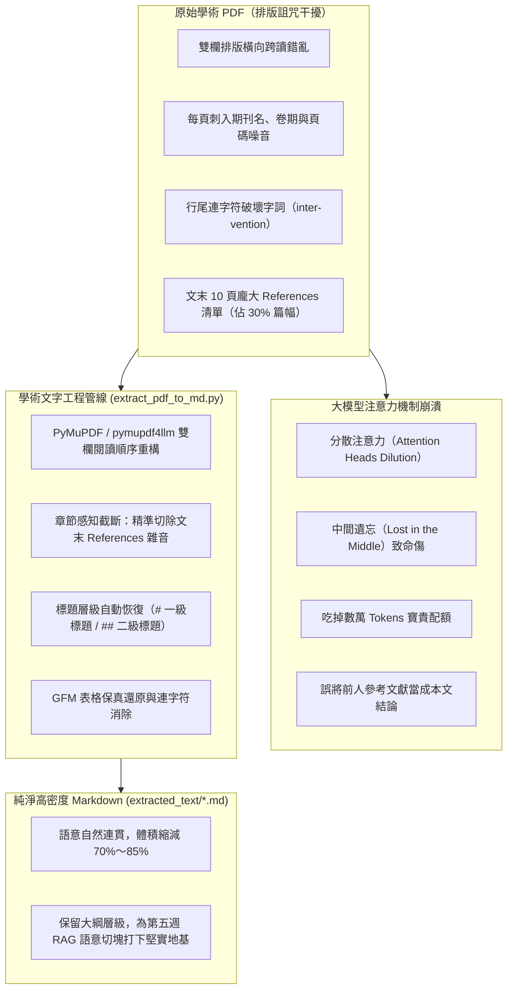
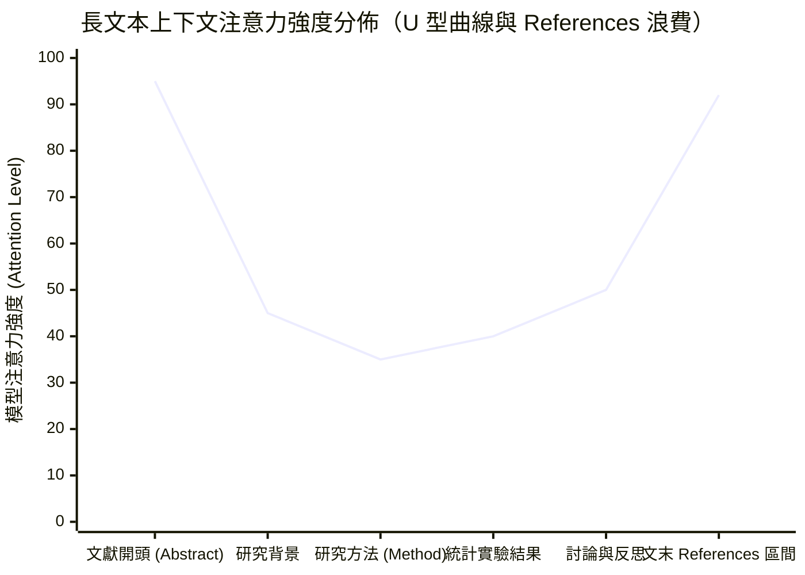
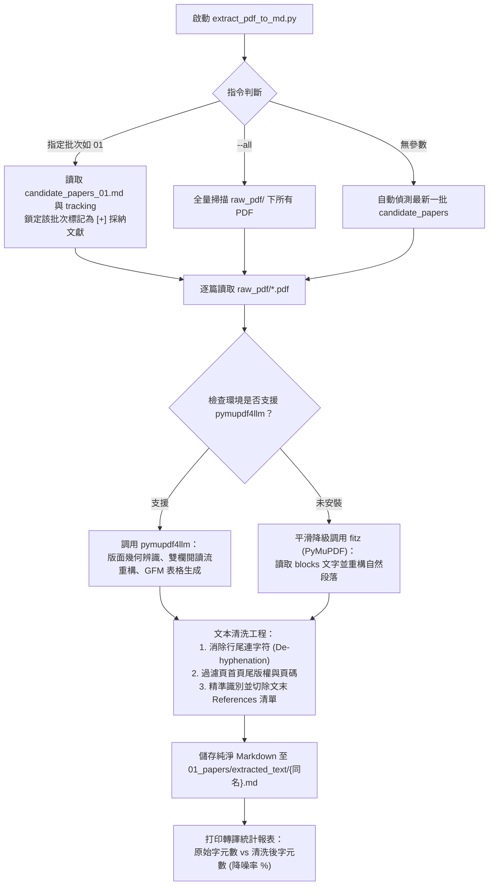

---
puppeteer:
  displayHeaderFooter: true
  headerTemplate: '<div style="font-size: 14px; margin: 0 auto;">第四章：學術文字工程——從 PDF 排版詛咒到純淨 Markdown</div>'
  footerTemplate: '<div style="font-size: 14px; margin: 0 auto;">第 <span class="pageNumber"></span> 頁 / 共 <span class="totalPages"></span> 頁</div>'
  margin:
    top: "1.5cm"
    bottom: "1.5cm"
    left: "1.5cm"
    right: "1.5cm"
---
<style>
  /* 全域字型大小放大為 1.4 倍（預設 16px * 1.4 = 22.4px） */
  html, body, .mume, .markdown-preview {
    font-size: 22.4px !important;
    line-height: 1.6 !important;
  }
  /* 標題分頁控制 */
  h2 {
    page-break-before: always;
  }
  /* 表格與程式碼區塊維持等比例適配 */
  table {
    font-size: 0.9em !important;
  }
  pre, code {
    font-size: 0.88em !important;
  }
</style>
---

# 第四章：學術文字工程：從 PDF 排版詛咒到純淨 Markdown

## 課程導讀：破除「直接把 PDF 丟給 AI」的致命迷思

歡迎來到「AI Agent 學術研究與文獻探討實務」的第四週課堂。

在過去三週的密集奠基中，我們已經為碩士論文工作區建構了極為嚴密的文獻採集與治理防線：
- **第一週（環境與脈絡規格）**：劃定了五大工程目錄，並在根目錄注入了靈魂規格書 `PROJECT.md`。
- **第二週（API 檢索與品質把關）**：透過 OpenAlex API 自動檢索論文、排除巨型期刊、落實三態人工審查（`[+]` 採納 / `[-]` 排除 / `[ ]` 待定），並自動下載開放取用（OA）全文。
- **第三週（自尋文獻與元數據治理）**：建立了 `01_papers/inbox/` 收件箱隔離制度，透過 DOI 自動探測與 CrossRef 逆向解析，將教授推薦或自行下載的外部文獻全面規範化入庫。

至此，環顧工作區的 `01_papers/raw_pdf/` 目錄，無論是 API 檢索還是外部自尋的論文，全部都已經整整齊齊、以標準檔名（`{年份}_{作者}_{短篇名}.pdf`）存放在磁碟中。

### 初學者的常見誤區：為什麼不能直接將整份 PDF 拖入聊天框？

面對這批得來不易的 PDF 原件，很多剛接觸生成式 AI 的研究生最直覺的操作是：
> *「太好了！我現在一口氣把這 10 篇 30 頁的 PDF 通通拖進 ChatGPT 或 Claude 聊天框裡，叫它幫我寫出文獻探討第二章！」*

如果你曾經這樣嘗試過，你一定經歷過以下令人沮喪的挫折：
1. **模型回答膚淺泛泛**：AI 似乎只讀了第一頁的摘要，後面扎實的研究方法、統計檢定與實證討論全被輕描淡寫帶過。
2. **語意顛三倒四**：文章中的因果關係莫名錯位，甚至把兩個完全不同的實驗組別數據混為一談。
3. **嚴重虛假引用（Hallucination）**：模型煞有其事地引述了某位知名學者的理論，但翻遍整篇論文，根本找不到該段文字。

為什麼會這樣？這並非大型語言模型（LLM）的智力不足，而是因為：
> **「PDF 格式最初的誕生目標，是為了在任何螢幕與印表機上達成 100% 精準的視覺排版再現，它根本不是為了讓電腦理解『文字語意』而設計的！」**



### 本週核心主旨：學術文字工程（Academic Text Engineering）

本週課程的核心任務，是要帶領大家全面攻克 PDF 的排版詛咒，掌握專業級的 **「學術文字工程（Academic Text Engineering）」**。

我們將剖析 PDF 的底層繪圖指令本質，運用高效能 C 核心的 `PyMuPDF` 與專為 LLM 設計的 `pymupdf4llm`，結合正規表達式章節截斷演算法，精準剔除佔據 30% 篇幅的參考文獻清單與出版噪音，將肥大混亂的二進位 PDF 淬鍊為結構完整、階層清晰、高資訊密度的純淨 Markdown（`.md`）。

**乾淨的學術文本（`01_papers/extracted_text/`），是下一週啟動本機 RAG 向量索引庫最關鍵的決勝基石！**

---

## 課前準備：套件安裝與文字工程腳本確認

在開始本週課程前，請確認本機 Python 環境已安裝專屬的文字轉譯套件，並檢查專案核心腳本：

1. **安裝高效能解析套件**：
   打開終端機，執行以下指令安裝 PyMuPDF 與 LLM 轉譯模組：
   ```bash
   pip install PyMuPDF pymupdf4llm
   ```
2. **確認核心文字工程腳本**：
   - `scripts/extract_pdf_to_md.py`（專屬雙欄排版重構、References 截斷與文字清洗工具）
   - `scripts/literature_workflow_mcp.py`（已登錄 `convert_pdfs_to_markdown` 工具之全流程 MCP 伺服器）
3. **確認在庫文獻**：
   確認 `01_papers/raw_pdf/` 目錄中已有第二週或第三週所累積的 PDF 文獻。

---

## 第一節：PDF 的底層技術本質與學術「排版詛咒」深度剖析

### 1.1 PDF 的技術本質：為什麼「看得到」但模型「讀不懂」？

在深入探討清洗技術之前，我們必須先釐清一個關鍵認知： **PDF 檔案內部儲存的並非「文章」，而是一連串「畫布繪圖指令」**。

由 Adobe 於 1993 年發布的 PDF（Portable Document Format），其技術核心繼承自 PostScript 頁面描述語言。在 PDF 檔案內部，並沒有「這是一篇文章的一句話」或「這是一個段落」的概念。相反地，PDF 內部記錄的是如下的絕對幾何座標指令：

```text
BT
/F1 12 Tf
72.00 712.50 Td
(The role of AI scaffolding in graduate thesis...) Tj
ET
```

這段指令的白話意義僅僅是：*「在頁面橫坐標 72.00、縱坐標 712.50 的位置，用 12 號字型畫出這串英文字元」*。

因為 PDF 只關心字元「畫在哪裡好看」，它天生喪失了語言的**「語意連續性（Semantic Continuity）」**。當我們使用傳統的純文字讀取工具時，程式只是依照坐標由上而下掃過，這在一般單欄文件尚可勉強應付，但一旦遇到國際學術期刊，便會引發致命的四大排版詛咒！

---

### 1.2 學術期刊四大「排版詛咒」實例剖析

#### 詛咒一：雙欄排版橫向跨讀（Two-Column Cross-Reading）
大多數國際高影響力期刊（如 Elsevier、Springer、IEEE、ACM、Taylor & Francis）為了提高印刷空間利用率，普遍採用雙欄（Two-column）排版。

若文字抽取程式未做版面幾何辨識，只依水平方向由左至右逐行讀取，將引發災難性的左右欄交錯拼貼：

```text
【人類眼中的閱讀順序】：
[左欄第 1 行] Artificial intelligence agents have demonstrated significant potential in supporting
[左欄第 2 行] graduate students through the challenging phases of thesis literature review.
[右欄第 1 行] Furthermore, empirical findings indicate that reflective journaling reduces
[右欄第 2 行] cognitive load when paired with structured automated scaffolding systems.

【未經處理的抽取結果（左右欄穿插拼貼）】：
Artificial intelligence agents have demonstrated significant potential in supporting Furthermore, empirical findings indicate that reflective journaling reduces graduate students through the challenging phases of thesis literature review. cognitive load when paired with structured automated scaffolding systems.
```

可以看到，兩個原本完全獨立的主題（左欄談 AI Agent 潛力、右欄談反思日記降載），在模型眼裡被混成了一團不可理解的胡言亂語，徹底摧毀了大型語言模型的推理能力！

---

#### 詛咒二：頁首頁尾重複刺入（Running Headers & Footers Contamination）
學術期刊每一頁頂部通常印有期刊名稱、卷期、ISSN、DOI 網址與出版年份；底部則印有頁碼與出版社版權宣告。

在傳統文字抽取中，每一頁翻頁之處，正文句子都會被這些出版雜訊粗暴切斷：

```text
...the experimental intervention was conducted over a period of twelve
Journal of Computer Assisted Learning, Vol. 39, No. 4, pp. 1120-1135, ISSN: 1365-2729
weeks, during which graduate participants submitted weekly reflection logs...
```

這種穿插直接打碎了前後文的長距離依賴脈絡，更會讓 Agent 誤將期刊名稱當成實驗介入的關鍵字！

---

#### 詛咒三：行末連字符號硬斷行（Hyphenation Splitting）
英文學術論文為了維持雙欄兩側對齊（Justified Alignment），單字在行尾常被強制截斷並加上連字號（`-`），例如 `trans-` 換行接 `formation`、`cog-` 換行接 `nitive`。

模型若未做「反連字處理（De-hyphenation）」，會將其視為兩個無效的生僻詞，直接破壞語意向量嵌入（Embedding）的比對品質。

---

#### 詛咒四：龐大的參考文獻雜音（References Noise）
這是學術文獻探討中**最嚴重的致命傷**！

一篇 15 至 25 頁的正式國際期刊論文，文末的參考文獻清單（References / Bibliography）往往高達 60 到 120 筆，佔據整篇論文 **25% 乃至 35% 以上的篇幅**（相當於 3,000 至 8,000 個 Tokens）。

##### 參考文獻清單對 LLM 的三大致命打擊：
1. **白白吃掉寶貴的 Context Window 配額**：10 篇論文的 References 清單就高達數萬字，大幅增加 API 呼叫成本與模型推論時間。
2. **引發「中間遺忘（Lost in the Middle）」效應**：心理語言學與 AI 實證研究顯示，大語言模型對長文本的注意力呈「U 型分佈」——對開頭與結尾的注意力最強，中間最容易遺忘。當一篇論文的最後 30% 全被密密麻麻的「人名、年代、書名」佔據時，模型會將其最強的注意力資源完全浪費在無效的清單上，進而遺忘前文的核心研究發現！
3. **誘發嚴重的學術幻覺（Hallucination）**：模型在總結這篇論文的貢獻時，極易將文末 References 中前人論文的標題，誤認為是當前這篇論文的實驗結論！



如上圖所示，如果我們不將文末的 References 清除，模型尾端高達 92% 的注意力精華，將被毫無價值的引用書單無情掠奪！

---

## 第二節：學術文字工程工具選型與 Markdown 語意優勢

### 2.1 Python PDF 工具庫深度評比

為了破解上述四大排版詛咒，我們需要挑選合適的工程工具。在 Python 生態系中，常見的 PDF 函式庫表現如下：

| 工具庫名稱 | 底層核心 | 處理 30 頁雙欄 PDF 速度 | 雙欄閱讀順序還原能力 | 標題與表格保真度 | 結論與選型建議 |
| :--- | :--- | :--- | :--- | :--- | :--- |
| **PyPDF2 / pypdf** | 純 Python | 極慢（約 4～8 秒） | ❌ 無（僅依坐標粗暴水平提取） | ❌ 標題遺失、表格坍塌成碎片 | **不合格**：僅適合簡單單欄文本。 |
| **pdfplumber** | 基於 pdfminer | 慢（約 6～12 秒） | ⚠️ 需手動撰寫大量邊界幾何判定 | ⭕ 幾何表格框線辨識良好 | **備選**：適合特定複雜財務表格，但日常文獻處理太慢。 |
| **PyMuPDF (fitz)** | 高效能 C (MuPDF) | ⚡ 極快（約 0.2 秒） | ⭕ 優秀（提供強大 blocks/spans 幾何分析） | ⭕ 字型大小與粗體保留完整 | **優良基石**：專案的核心底層後盾。 |
| **`pymupdf4llm`** | PyMuPDF 延伸模組 | ⚡ 極快（約 0.3 秒） | 🏆 **完美（專為 LLM 語意重構設計）** | 🏆 **自動產出 GitHub GFM Markdown** | **首選標準**：本專案採用之官方推薦工具！ |

本專案全面採用 **`PyMuPDF` 結合 `pymupdf4llm`**，能在數百毫秒內自動計算字元群聚（Clustering）、還原雙欄閱讀順序，並將字型大小自動映射為 Markdown 標題標籤！

---

### 2.2 為什麼堅持使用 Markdown 作為學術語意載體？

在將 PDF 轉譯為純文字時，我們絕不輸出為無結構的 `.txt`，而是嚴格要求轉譯為 **Markdown（`.md`）**。

Markdown 對於學術研究 Agent 具有四大無可替代的戰略優勢：

1. **結構層級一目了然（Hierarchy Preservation）**：
   Markdown 的 `# 1. Introduction`、`## 2.3 Participants` 能清楚告訴 Agent 這段文字的學術定位。當 Agent 被要求「提取樣本量與受試者背景」時，它能精確定位到 `## Participants` 章節，而不會在研究背景中漫無邊際地搜尋。
2. **數據表格完美保真（GFM Table Structure）**：
   論文中最核心的實驗統計數據（如 $t$ 檢定值、$p$ 值、信效度分析、Cohen's $d$ 效果量），在 Markdown 中以標準管道符號（`| Variable | Mean | SD |`）結構化儲存，Agent 能精準讀懂表格中的欄位對照關係。
3. **超輕量與零二進位負擔（Token Efficiency）**：
   一份 25 頁的 PDF 原件大小約 3MB 至 8MB；轉譯為純淨 Markdown 後，檔案體積通常僅剩 40KB 到 80KB，體積縮減超過 **90%**，不僅載入速度呈指數級飛躍，更徹底免除了二進位解析的記憶體開銷。
4. **與第五週本機 RAG 向量切塊（Chunking）無縫對齊**：
   在即將到來的第五週中，我們將學習「標題感知切塊（Heading-aware Chunking）」。Markdown 的標題符號就是最天然、最完美的語意切片分界線！

---

## 第三節：文本降噪實戰：References 截斷與標題層級重構演算法

### 3.1 參考文獻清單的精準邊界偵測（Boundary Detection on References）

如何從整篇數萬字的論文中，精確找到參考文獻的起點並將其乾脆俐落地「一刀切斷」？

#### 正則表達式演算法設計
學術期刊在排版參考文獻章節時，標題通常呈現特定的模式：
- Markdown 一級或二級標題：`# References`、`## References`、`## Bibliography`
- 中文期刊標籤：`## 參考文獻`、`## 引用書目`
- 特殊複合標題：`## References and Notes`、`## Literature Cited`
- 獨立成行之全大寫標題：`REFERENCES`、`BIBLIOGRAPHY`

```python
import re

# 匹配文末參考文獻章節之強健正則表達式
REF_HEADING_REGEX = re.compile(
    r'(?m)^(?:\s*#{1,3}\s*(?:References?|Bibliography|Literature\s+Cited|Works\s+Cited|參考文獻|引用書目).*$|'
    r'^\s*(?:REFERENCES|BIBLIOGRAPHY|LITERATURE\s+CITED|WORKS\s+CITED|參考文獻)\s*$)',
    re.IGNORECASE
)
```

#### 避免「正文誤殺」的防禦機制（Guardrails）
初學者寫正則常犯一個錯誤：只要內文中出現單字 "references"，整篇文章就被腰斬了。

為了杜絕誤殺，我們的演算法加入了三大物理邊界防護：
1. **行首與獨立行限制（`^` 與 `$`）**：必須是獨立成行或帶有 Markdown 標題標籤的行，正文中出現的 "...with reference to previous studies..." 絕不匹配。
2. **位置區間保護（Position Threshold）**：真正的參考文獻清單絕不可能出現在論文的前 40% 篇幅。演算法強制規定**只有在文本進度超過 45% 以上所命中的匹配項**才被視為有效起點。
3. **長度上限防護**：標題行的字元長度通常小於 40 個字元，排除任何包含該單字但其實是長句子的段落。

---

### 3.2 頁首頁尾與出版雜音清洗演算法

除了截斷 References 外，演算法還會對正文執行逐行過濾：
- **消除頁首 DOI 網址行**：如 `https://doi.org/10.1016/...`、`doi: 10.xxxx/...`。
- **清除重複版權宣告行**：如 `© 2023 Elsevier B.V. All rights reserved.`、`This article is published under CC-BY 4.0 license.`。
- **消除單純數字頁碼行**：如行首只有一個數字 `12`、`Page 4 of 15`。
- **連字符號拼接還原（De-hyphenation）**：
  ```python
  # 將跨行斷詞進行語意拼接
  cleaned_text = re.sub(r'(\w+)-\s*\n\s*(\w+)', r'\1\2', raw_text)
  ```

---

### 3.3 深入剖析專案核心腳本：`scripts/extract_pdf_to_md.py`

在專案中，所有的文字工程演算法已經被高度模組化封裝於：
- **核心工具路徑**：`scripts/extract_pdf_to_md.py`



#### 腳本的兩大關鍵設計亮點：
1. **批次流水號連動感知（Batch-aware Resolution）**：
   當你在終端機執行 `python scripts/extract_pdf_to_md.py 01` 時，腳本不會盲目把整個資料夾幾十篇論文重新轉譯一遍。它會主動讀取 `candidate_papers_01.md`，比對勾選狀態為 `[+]` 的文獻，只針對該批次在 `raw_pdf/` 的檔案執行處理，大幅節省時間與運算資源。
2. **降噪效益即時量化**：
   轉譯完成後，腳本會精確回報每篇論文在切除 References 與雜音後**節省的字元數與百分比**（通常介於 25% 至 40% 之間），讓研究者清楚看見文字工程的實質效益！

---

## 第四節：批次文字工程管線操作與 MCP 工具化實踐

### 4.1 終端機手動批次轉譯指令操作

請在工作區終端機中，體驗以下標準操作指令：

```bash
# 指令 1：轉譯最新批次的採納文獻（最常用）
python scripts/extract_pdf_to_md.py

# 指令 2：指定轉譯特定檢索批次（例如第 01 批 candidate_papers_01.md）
python scripts/extract_pdf_to_md.py 01

# 指令 3：全量重新轉譯（強制處理 raw_pdf/ 目錄下的所有 PDF）
python scripts/extract_pdf_to_md.py --all

# 指令 4：檢視文獻庫轉譯狀態總覽（在庫 PDF、已轉譯 md、待轉譯篇數）
python scripts/extract_pdf_to_md.py --list
```

#### 執行範例與終端機輸出回饋：

```text
================================================================================
🛠️ 學術文字工程轉譯管線：處理批次 [01] (candidate_papers_01.md)
================================================================================
[1/3] 正在處理：《Scaffolding Graduate Students Thesis Writing with AI Agents》
      PDF 檔案：2023_Chen_Scaffolding_Graduate_Students_Thesis.pdf
      轉譯核心：pymupdf4llm 雙欄閱讀流辨識
      降噪處理：成功截斷文末 ## References 章節（切除 5,240 字元無效引用）
      輸出路徑：01_papers/extracted_text/2023_Chen_Scaffolding_Graduate_Students_Thesis.md
      效益分析：原始 34,210 字元 -> 純淨 25,120 字元 (降噪節省：26.6%)

[2/3] 正在處理：《Cognitive Load in AI-assisted Academic Writing: A Quasi-experiment》
      PDF 檔案：2024_Lin_Cognitive_Load_in_AI-assisted_Acade.pdf
      轉譯核心：pymupdf4llm 雙欄閱讀流辨識
      降噪處理：成功截斷文末 ## References 章節（切除 6,810 字元無效引用）
      輸出路徑：01_papers/extracted_text/2024_Lin_Cognitive_Load_in_AI-assisted_Acade.md
      效益分析：原始 41,500 字元 -> 純淨 29,800 字元 (降噪節省：28.2%)
================================================================================
✨ 批次 [01] 文字工程轉譯完成！共成功產出 2 篇純淨 Markdown 文本至 extracted_text/
```

---

### 4.2 整合至 MCP 工具鏈：自然語言驅動文字清洗

除了在終端機中手動執行外，本文字工程管線已經無縫整合至專案的 MCP 伺服器（`scripts/literature_workflow_mcp.py`）中，向 Agent 宣告了專屬工具：
- **`convert_pdfs_to_markdown`**

#### 自然語言驅動提示詞範例：
在 Antigravity 2.0 對話視窗中，研究者可以隨時以下達自然語言研究指令：

> **自然語言驅動範例：**
> - *「我剛才下載的候選論文已經放入 raw_pdf 了，請幫我執行學術文字工程轉譯，產出純淨 Markdown 到 extracted_text 目錄。」*
> - *「請針對 candidate_papers_01 中的採納論文執行雙欄排版重構，記得切除 References 噪音與出版商頁首頁尾。」*
> - *「幫我檢查 extracted_text 裡面有哪些已經轉譯好的論文，回報各篇的字數與章節大綱。」*

**Agent 的後端自主行為：**
Agent 會自動解析指令意圖，調用 `convert_pdfs_to_markdown` 工具，在背景啟動 PyMuPDF 演算法，完成雙欄還原與 References 切除，並在對話視窗向研究者回報清洗摘要與字數節省成效！

---

### 4.3 課堂實作活動：清洗前與清洗後文本結構深度校驗

> **活動時間：** 15 分鐘
> **活動任務：** 親自執行文字工程，並在編輯器中橫向對比原始 PDF 與轉譯後的純淨 Markdown。
>
> 1. **步驟一：執行文字工程轉譯**
>    打開終端機，執行轉譯指令：
>    ```bash
>    python scripts/extract_pdf_to_md.py --all
>    ```
>    確認終端機回報各篇文獻成功轉譯並輸出至 `01_papers/extracted_text/`。
> 2. **步驟二：開啟轉譯後的 Markdown 檔案**
>    在 VS Code 或 Antigravity 左側檔案總管中，展開 `01_papers/extracted_text/` 目錄，隨機點開其中一篇 `.md` 檔案。
> 3. **步驟三：開啟 Markdown 預覽模式（Markdown Preview）**
>    按下 `Ctrl + Shift + V`（macOS: `Cmd + Shift + V`）開啟預覽，檢查以下關鍵品質指標：
>    - **大綱層級（Headings）**：觀察文章各節大標題（如 `# 1. Introduction`、`## 3. Methodology`）是否清晰呈現？
>    - **雙欄閱讀流**：觀察左欄最後一句與右欄第一句是否自然銜接，毫無左右錯亂？
>    - **References 截斷驗證**：拉到文章最底部，確認文章是否在最後一個討論或結論段落俐落結束，完全消除了後面幾十頁密密麻麻的引用名單？
> 4. **步驟四：向 Agent 提問驗證語意掌握度**
>    在對話框向 Agent 提問：
>    *「請閱讀 extracted_text 目錄下的最新論文，告訴我這篇研究的研究設計（Research Design）、受試者人數與核心實證發現。」*
>    觀察 Agent 如何在數秒內給出精準無誤、毫無幻覺的回答！

```text
老師的真心話：
學術研究的進展，本質上就是一場『降低熵增、對抗資訊混亂』的修煉。
當別人還在傻傻地把整份混亂的 PDF 塞進大模型、被雙欄錯亂搞得暈頭轉向、被文末 References 騙得產出假引用時，
你已經掌握了現代 AI 學術文字工程的核心技術——
用 PyMuPDF 重構語意流、用正則精準切除噪音、用純淨 Markdown 守護模型注意力！
看著 extracted_text/ 裡面一篇篇清爽、高密度、大綱分明的 Markdown 論文，
這就是你在整個碩士研究歷程中，最值得自豪的乾淨文字基石！

```

---

## 本週小結與下週預告

在本週（第四講）的密集實戰中，我們成功攻克了學術文獻走向 AI 深度閱讀的最硬核關卡——「學術文字工程」。我們不再受制於 PDF 的排版詛咒，而是掌握了四大核心里程碑：
1. **破解 PDF 排版詛咒：** 深刻理解了幾何繪圖指令、雙欄穿插、連字符號斷詞與頁首頁尾對 LLM 注意力機制的毀滅性干擾。
2. **References 雜音截斷技術：** 設計了具備位置門檻防護的正則表達式，精準切除佔據 30% 篇幅的參考文獻清單，徹底破解「中間遺忘（Lost in the Middle）」與引文幻覺致命傷。
3. **高效能 C 核心工具鏈：** 運用 `PyMuPDF` 與 `pymupdf4llm`，在毫秒級別完成雙欄排版重構、階層標題恢復與 GFM 結構化表格保真。
4. **工具化與純淨文本庫就位：** 將文字工程封裝為 MCP 工具，產出純淨、高密度、體積縮減 90% 的學術語料於 `01_papers/extracted_text/`。

---

### 下週預告：第五講——本機 RAG：論文語意檢索與向量分塊索引

現在，請同學深吸一口氣，回顧我們的工作區：
- `01_papers/raw_pdf/`：存放著規範化命名、元數據齊全的原始文獻；
- `01_papers/extracted_text/`：存放著剔除 References 噪音、結構化排版的純淨 Markdown 文本！

萬事俱備，只欠東風！有了這批高品質的純淨語料，下一週我們將正式迎來整個學期最具爆發力的核心技術—— **「本機 RAG（Retrieval-Augmented Generation，檢索增強生成）：論文語意檢索」**！

在第五週的課程中，我們將全神貫注於 RAG 的底層原理與本機工程實戰：
- **為什麼學術精讀非 RAG 不可**：破解當論文庫多達數十篇、文字量高達數十萬字時，如何超越傳統關鍵字比對的語意鴻溝（Semantic Gap）。
- **標題感知切塊工程（Heading-aware Chunking）**：剖析固定長度切塊（Fixed-size Chunking）與學術標題結構化切塊的巨大質量差異。
- **文字向量化與語意空間（Embeddings & Vector Space）**：理解文本轉向量、高維空間語意距離與餘弦相似度演算法。
- **深入實戰 `scripts/paper_retriever_mcp.py`**：逐行拆解專案檢索引擎原始碼，掌握 `build_paper_index` 本機向量建檔與 `search_paper_chunks` 毫秒級語意段落秒回！

為下一階段的「單篇文獻批判精讀卡片化」與「跨篇研究矩陣共構」，裝上真正的語意導航雷達！
