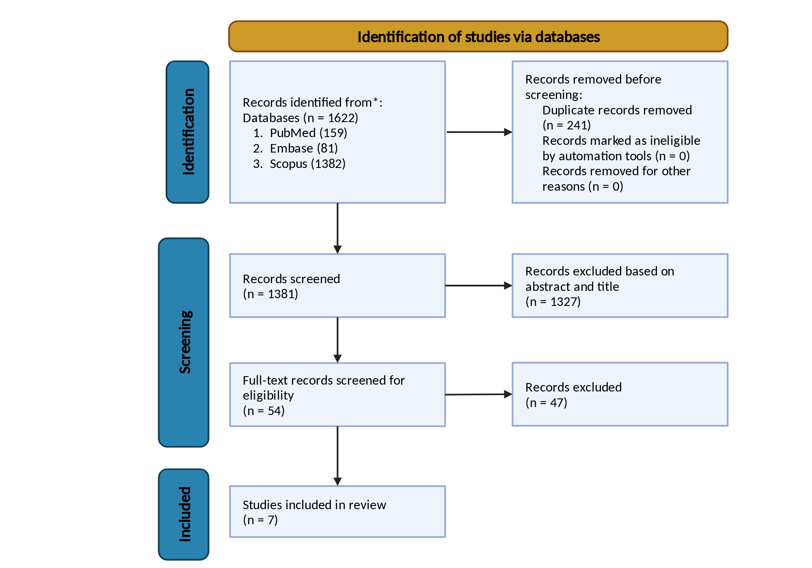

---
puppeteer:
  displayHeaderFooter: true
  headerTemplate: '<div style="font-size: 14px; margin: 0 auto;">第四章：學術文字工程——從 PDF 排版詛咒到純淨 Markdown</div>'
  footerTemplate: '<div style="font-size: 14px; margin: 0 auto;">第 <span class="pageNumber"></span> 頁 / 共 <span class="totalPages"></span> 頁</div>'
  margin:
    top: "1.5cm"
    bottom: "1.5cm"
    left: "1.5cm"
    right: "1.5cm"
---
<style>
  /* 全域字型大小放大為 1.4 倍（預設 16px * 1.4 = 22.4px） */
  html, body, .mume, .markdown-preview {
    font-size: 22.4px !important;
    line-height: 1.6 !important;
  }
  /* 標題分頁控制 */
  h2 {
    page-break-before: always;
  }
  /* 表格與程式碼區塊維持等比例適配 */
  table {
    font-size: 0.9em !important;
  }
  pre, code {
    font-size: 0.88em !important;
  }
</style>
---

# 第四章：學術文字工程：從 PDF 排版詛咒到純淨 Markdown

## 課程導讀：破除「直接把 PDF 丟給 AI」的致命迷思

歡迎來到「AI Agent 學術研究與文獻探討實務」的第四週課堂。

在過去三週的密集奠基中，我們已經為碩士論文工作區建構了極為嚴密的文獻採集與治理防線：
- **第一週（環境與脈絡規格）**：劃定了五大工程目錄，並在根目錄注入了靈魂規格書 `PROJECT.md`。
- **第二週（API 檢索與品質把關）**：透過 OpenAlex API 自動檢索論文、排除巨型期刊、落實三態人工審查（`[+]` 採納 / `[-]` 排除 / `[ ]` 待定），並自動下載開放取用（OA）全文。
- **第三週（自尋文獻與元數據治理）**：建立了 `01_papers/inbox/` 收件箱隔離制度，透過 DOI 自動探測與 CrossRef 逆向解析，將教授推薦或自行下載的外部文獻全面規範化入庫。

至此，環顧工作區的 `01_papers/raw_pdf/` 目錄，無論是 API 檢索還是外部自尋的論文，全部都已經整整齊齊、以標準檔名（`{年份}_{作者}_{短篇名}.pdf`）存放在磁碟中。

### 初學者的常見誤區：為什麼不能直接將整份 PDF 拖入聊天框？

面對這批得來不易的 PDF 原件，很多剛接觸生成式 AI 的研究生最直覺的操作是：
> *「太好了！我現在一口氣把這 10 篇 30 頁的 PDF 通通拖進 ChatGPT 或 Claude 聊天框裡，叫它幫我寫出文獻探討第二章！」*

如果你曾經這樣嘗試過，你一定經歷過以下令人沮喪的挫折：
1. **模型回答膚淺泛泛**：AI 似乎只讀了第一頁的摘要，後面扎實的研究方法、統計檢定與實證討論全被輕描淡寫帶過。
2. **語意顛三倒四**：文章中的因果關係莫名錯位，甚至把兩個完全不同的實驗組別數據混為一談。
3. **嚴重虛假引用（Hallucination）**：模型煞有其事地引述了某位知名學者的理論，但翻遍整篇論文，根本找不到該段文字。

為什麼會這樣？這並非大型語言模型（LLM）的智力不足，而是因為：
> **「PDF 格式最初的誕生目標，是為了在任何螢幕與印表機上達成 100% 精準的視覺排版再現，它根本不是為了讓電腦理解『文字語意』而設計的！」**

### 本週核心主旨：學術文字工程（Academic Text Engineering）

本週課程的核心任務，是要帶領大家全面攻克 PDF 的排版詛咒，掌握專業級的 **「學術文字工程（Academic Text Engineering）」**。

我們將剖析 PDF 的底層繪圖指令本質，運用高效能 C 核心的 `PyMuPDF` 與專為 LLM 設計的 `pymupdf4llm`，結合正規表達式章節截斷演算法，精準剔除佔據 30% 篇幅的參考文獻清單與出版噪音，將肥大混亂的二進位 PDF 淬鍊為結構完整、階層清晰、高資訊密度的純淨 Markdown（`.md`）。

**乾淨的學術文本（`01_papers/extracted_text/`），是下一週啟動本機 RAG 向量索引庫最關鍵的決勝基石！**

---

## 課前準備：套件安裝與文字工程腳本確認

在開始本週課程前，請確認本機 Python 環境已安裝專屬的文字轉譯套件，並檢查專案核心腳本：

1. **安裝高效能解析套件**：
   打開終端機，執行以下指令安裝 PyMuPDF 與 LLM 轉譯模組：
   ```bash
   pip install PyMuPDF pymupdf4llm
   ```
2. **確認核心文字工程腳本**：
   - `scripts/extract_pdf_to_md.py`（專屬雙欄排版重構、References 截斷與文字清洗之獨立終端批次工具）
3. **確認在庫文獻**：
   確認 `01_papers/raw_pdf/` 目錄中已有第二週或第三週所累積的 PDF 文獻。

---

## 第一節：PDF 的底層技術本質與學術「排版詛咒」深度剖析

### 1.1 PDF 的技術本質：為什麼「看得到」但模型「讀不懂」？

在深入探討清洗技術之前，我們必須先釐清一個關鍵認知： **PDF 檔案內部儲存的並非「文章」，而是一連串「畫布繪圖指令」**。

由 Adobe 於 1993 年發布的 PDF（Portable Document Format），其技術核心繼承自 PostScript 頁面描述語言。在 PDF 檔案內部，並沒有「這是一篇文章的一句話」或「這是一個段落」的概念。相反地，PDF 內部記錄的是如下的絕對幾何座標指令：

```text
BT
/F1 12 Tf
72.00 712.50 Td
(The role of AI scaffolding in graduate thesis...) Tj
ET
```

這段指令的白話意義僅僅是：*「在頁面橫坐標 72.00、縱坐標 712.50 的位置，用 12 號字型畫出這串英文字元」*。

因為 PDF 只關心字元「畫在哪裡好看」，它天生喪失了語言的 **「語意連續性（Semantic Continuity）」**。當我們使用傳統的純文字讀取工具時，程式只是依照坐標由上而下掃過，這在一般單欄文件尚可勉強應付，但一旦遇到國際學術期刊，便會引發致命的四大排版詛咒！

---

### 1.2 學術期刊四大「排版詛咒」

學術期刊在轉化為純文字輸入大型語言模型（LLM）時，常見以下四大底層排版問題，必須透過文字工程予以解析與清洗：

1. **雙欄排版橫向跨讀（Two-Column Cross-Reading）**：
   多數期刊採雙欄排版，若未經版面幾何辨識而直接按水平坐標由左至右逐行讀取，會造成左右兩欄句子交錯拼貼，嚴重破壞語意因果關係與上下文連貫性。
2. **頁首頁尾重複刺入（Running Headers & Footers Contamination）**：
   每頁頂部與底部的期刊名、卷期、DOI、版權宣告與頁碼等雜訊，會在翻頁處穿插於段落句子中間，打碎前後文長距離依賴脈絡。
3. **行末連字符號硬斷行（Hyphenation Splitting）**：
   為維持齊行對齊而在行末截斷單字（如 `inter-` 換行接 `vention`），若未自動進行反連字（De-hyphenation）拼接還原，會被模型視為破碎無效生詞，損害詞向量嵌入比對品質。
4. **文末龐大參考文獻雜音（References Noise）**：
   論文文末的數十至上百筆引用文獻往往佔據 25%～35% 篇幅，不僅浪費大量 Context Window 配額，更易引發長文本「中間遺忘（Lost in the Middle）」效應，並誘發模型將前人文獻誤認為本文研究結論的學術幻覺。

---

## 第二節：Markdown 語意優勢與語法說明

### 2.1 為什麼堅持使用 Markdown 作為學術語意載體？

在將 PDF 轉譯為純文字時，我們絕不輸出為無結構的 `.txt`，而是嚴格要求轉譯為 **Markdown（`.md`）**。

Markdown 對於學術研究 Agent 具有四大無可替代的戰略優勢：

1. **結構層級一目了然（Hierarchy Preservation）**：
   Markdown 的 `# 1. Introduction`、`## 2.3 Participants` 能清楚告訴 Agent 這段文字的學術定位。當 Agent 被要求「提取樣本量與受試者背景」時，它能精確定位到 `## Participants` 章節，而不會在研究背景中漫無邊際地搜尋。
2. **數據表格完美保真（GFM Table Structure）**：
   論文中最核心的實驗統計數據（如 $t$ 檢定值、$p$ 值、信效度分析、Cohen's $d$ 效果量），在 Markdown 中以標準管道符號（`| Variable | Mean | SD |`）結構化儲存，Agent 能精準讀懂表格中的欄位對照關係。
3. **超輕量與零二進位負擔（Token Efficiency）**：
   一份 25 頁的 PDF 原件大小約 3MB 至 8MB；轉譯為純淨 Markdown 後，檔案體積通常僅剩 40KB 到 80KB，體積縮減超過 **90%**，不僅載入速度呈指數級飛躍，更徹底免除了二進位解析的記憶體開銷。
4. **與第五週本機 RAG 向量切塊（Chunking）無縫對齊**：
   在即將到來的第五週中，我們將學習「標題感知切塊（Heading-aware Chunking）」。Markdown 的標題符號就是最天然、最完美的語意切片分界線！

---

### 2.2 Markdown 文件基礎語法

Markdown 是一種輕量級標記式語言（Lightweight Markup Language），由 John Gruber 於 2004 年創立，其核心設計哲學在於「易讀易寫（Readability & Writability）」——即使在未經渲染的純文字原始碼狀態下，人類與大型語言模型（LLM）都能清晰辨識其語意結構。

基礎語法構成了一篇 Markdown 文件的骨架與基本排版標記，包括標題、文字強調、水平分隔線、超連結與圖片以及清單：

#### 1. 標題層級（Headings）
使用 `#` 號宣告標題層級，`#` 與標題文字之間必須保留一個半形空格。標題能建立文檔的骨架大綱（Outline），是 LLM 進行章節定位與向量切塊（Chunking）的核心依據：

**語法原始碼：**
```markdown
# 一級標題（文件主題 / 論文篇名）
## 二級標題（主要章節，如文獻探討、研究方法）
### 三級標題（子章節，如研究對象、測量工具）
#### 四級標題（細部條目）
##### 五級標題
###### 六級標題
```

**實際呈現效果：**
> <div style="border-left: 4px solid #1a73e8; padding-left: 14px; margin: 8px 0;">
>   <div style="font-size: 1.55em; font-weight: bold; line-height: 1.3; margin: 6px 0;">一級標題（文件主題 / 論文篇名）</div>
>   <div style="font-size: 1.3em; font-weight: bold; line-height: 1.3; margin: 6px 0; border-bottom: 1px solid #eaecef; padding-bottom: 4px;">二級標題（主要章節，如文獻探討、研究方法）</div>
>   <div style="font-size: 1.15em; font-weight: bold; line-height: 1.3; margin: 6px 0;">三級標題（子章節，如研究對象、測量工具）</div>
>   <div style="font-size: 1.0em; font-weight: bold; line-height: 1.3; margin: 4px 0;">四級標題（細部條目）</div>
>   <div style="font-size: 0.9em; font-weight: bold; line-height: 1.3; margin: 4px 0;">五級標題</div>
>   <div style="font-size: 0.85em; font-weight: bold; color: #586069; margin: 4px 0;">六級標題</div>
> </div>

> [!TIP]
> **寫作規範**：一份文檔應嚴格維持樹狀層級遞進，避免跨級跳躍（例如由 `##` 直接跳至 `####`），以確保 Agent 能正確建構語意大綱樹。

#### 2. 文字內聯強調與樣式（Inline Formatting）
用於強調關鍵字、專業術語或變數：

| 語法格式 | 原始碼範例 | 實際呈現效果 | 適用情境 |
| :--- | :--- | :--- | :--- |
| **粗體** | `**統計顯著性**` | **統計顯著性** | 重點概念、統計結論 |
| *斜體* | `*p* < .05` 或 `*et al.*` | *p* < .05 / *et al.* | 統計符號、拉丁外來語、期刊書名 |
| ***粗斜體*** | `***重要核心假設***` | ***重要核心假設*** | 極度重要之核心界定 |
| ~~刪除線~~ | `~~舊版檢定方法~~` | ~~舊版檢定方法~~ | 標示修訂或廢除之觀點 |
| `行內程式碼` | `` `extract_pdf_to_md.py` `` | `extract_pdf_to_md.py` | 腳本檔名、函式、變數名稱 |

**綜合範例原始碼：**
```markdown
經多元迴歸檢定，該變項達 **統計顯著性**（*p* < .05），且由 `extract_pdf_to_md.py` 處理之結果具備 ***高度穩定度***。
```

**實際呈現效果：**
> 經多元迴歸檢定，該變項達 **統計顯著性**（*p* < .05），且由 `extract_pdf_to_md.py` 處理之結果具備 ***高度穩定度***。

#### 3. 水平分隔線（Horizontal Rules）
使用獨立成行且連續的三個或以上連字號 `---`、星號 `***` 或底線 `___`，能產生一條視覺分割線，適合用於主要段落切換或上下文轉折：

**語法原始碼：**
```markdown
文獻探討第一部分探討認知負荷理論的演進...

---

文獻探討第二部分轉向探討 AI Agent 鷹架支架之設計...
```

**實際呈現效果：**
> 文獻探討第一部分探討認知負荷理論的演進...
> 
> ---
> 
> 文獻探討第二部分轉向探討 AI Agent 鷹架支架之設計...

#### 4. 超連結與圖片嵌入（Links & Images）
在 Markdown 中，連結與圖片的語法格式高度一致，圖片僅在最前方多一個驚嘆號 `!`：

**語法原始碼：**
```markdown
請參閱 [CrossRef 官方 API 規範](https://api.crossref.org/) 以獲取詳細欄位說明。


```

**實際呈現效果：**
> 請參閱 [CrossRef 官方 API 規範](https://api.crossref.org/) 以獲取詳細欄位說明。
> 
> 
> *（註：若圖檔存在於指定本機或網路路徑則直接渲染圖片；若路徑無圖則如上顯示包含邊框與替代文字之圖形符號）*

#### 5. 清單與待辦工作清單（Lists & Task Lists）

##### (1) 無序清單（Unordered Lists）
使用 `-`、`*` 或 `+` 開頭，後接半形空格。縮排 2 至 4 個空格可建立巢狀子清單：

**語法原始碼：**
```markdown
- 文獻探討核心維度
  - 認知負荷理論（Cognitive Load Theory）
  - 支架鷹架理論（Scaffolding Theory）
- 實證研究設計
```

**實際呈現效果：**
> - 文獻探討核心維度
>   - 認知負荷理論（Cognitive Load Theory）
>   - 支架鷹架理論（Scaffolding Theory）
> - 實證研究設計

##### (2) 有序清單（Ordered Lists）
使用數字加半形句點 `1.` 開頭，數字順序會自動編排：

**語法原始碼：**
```markdown
1. 收集並篩選文獻候選名單
2. 進行外部文獻元數據逆向解析
3. 執行 PDF 雙欄重構與 References 截斷
```

**實際呈現效果：**
> 1. 收集並篩選文獻候選名單
> 2. 進行外部文獻元數據逆向解析
> 3. 執行 PDF 雙欄重構與 References 截斷

##### (3) GFM 待辦任務清單（Task Lists）
在清單後加上 `[ ]`（未完成）或 `[x]`（已完成），非常適合用於論文進度追蹤與審查標記：

**語法原始碼：**
```markdown
- [x] 完成第一階段 OpenAlex API 關鍵字檢索
- [x] 下載候選論文全文 PDF
- [ ] 執行學術文字工程轉譯純淨 Markdown
```

**實際呈現效果：**
> - [x] 完成第一階段 OpenAlex API 關鍵字檢索
> - [x] 下載候選論文全文 PDF
> - [ ] 執行學術文字工程轉譯純淨 Markdown

---

### 2.3 Markdown 文件中級語法

中級語法主要用於處理複雜的文獻引述、多維數據矩陣以及可執行的程式邏輯，是學術論文與技術文件表達深度的核心手段：

#### 1. 引用區塊與警告提示（Blockquotes & Alerts）
使用 `>` 建立引用區塊，可用於引用學術前人原話或論文摘要：

**語法原始碼：**
```markdown
> 認知負荷理論指出，工作記憶（Working Memory）的容量極其有限，
> 因此教學設計必須極力降低無效認知負荷（Extraneous Cognitive Load）。
> —— Sweller (1988)
```

**實際呈現效果：**
> 認知負荷理論指出，工作記憶（Working Memory）的容量極其有限，
> 因此教學設計必須極力降低無效認知負荷（Extraneous Cognitive Load）。
> —— Sweller (1988)

在 GitHub / Antigravity 環境中，更支援結構化的 GitHub Alerts（警告提示塊），能讓 Agent 與讀者瞬間辨識資訊的優先級別：

**語法原始碼：**
```markdown
> [!NOTE]
> 說明背景脈絡或實作補充資訊。

> [!TIP]
> 提供效能最佳化或效率操作技巧。

> [!IMPORTANT]
> 強調必須遵守的學術規格或關鍵原則。

> [!WARNING]
> 提醒潛在風險、格式衝突或相容性問題。
```

**實際呈現效果：**
> [!NOTE]
> 說明背景脈絡或實作補充資訊。

> [!TIP]
> 提供效能最佳化或效率操作技巧。

> [!IMPORTANT]
> 強調必須遵守的學術規格或關鍵原則。

> [!WARNING]
> 提醒潛在風險、格式衝突或相容性問題。

#### 2. 結構化表格（GFM Tables）
表格是學術論文傳遞實驗結果、樣本特徵與文獻矩陣的最佳工具。以管道符號 `|` 分隔欄位，第二行使用虛線 `-` 定義表頭，並透過冒號 `:` 控制對齊方向：
- `:---`：靠左對齊（預設，適合文字敘述）
- `:---:`：置中對齊（適合年份、狀態、作者姓氏）
- `---:`：靠右對齊（適合數值、統計數據）

**語法原始碼：**
```markdown
| 變項名稱 | 實驗組 ($N=45$) | 控制組 ($N=45$) | $t$ 檢定值 | $p$ 值 |
| :--- | :---: | :---: | ---: | ---: |
| 學習成效後測 | 84.5 (SD=6.2) | 76.2 (SD=8.1) | 5.42 | < .001 |
| 認知負荷量表 | 2.31 (SD=0.4) | 3.85 (SD=0.6) | -14.18 | < .001 |
```

**實際呈現效果：**

| 變項名稱 | 實驗組 ($N=45$) | 控制組 ($N=45$) | $t$ 檢定值 | $p$ 值 |
| :--- | :---: | :---: | ---: | ---: |
| 學習成效後測 | 84.5 (SD=6.2) | 76.2 (SD=8.1) | 5.42 | < .001 |
| 認知負荷量表 | 2.31 (SD=0.4) | 3.85 (SD=0.6) | -14.18 | < .001 |

#### 3. 程式碼區塊（Fenced Code Blocks）
使用三個反引號包裹多行程式碼，並在第一行反引號後方明確標示語言名稱（如 `python`、`bash`、`json`、`markdown`），以啟用精準的語法著色：

**語法原始碼：**
````markdown
```python
def clean_academic_text(raw_text: str) -> str:
    """消除行尾斷詞連字符號並回傳乾淨文本"""
    import re
    return re.sub(r'(\w+)-\s*\n\s*(\w+)', r'\1\2', raw_text)
```
````

**實際呈現效果：**
```python
def clean_academic_text(raw_text: str) -> str:
    """消除行尾斷詞連字符號並回傳乾淨文本"""
    import re
    return re.sub(r'(\w+)-\s*\n\s*(\w+)', r'\1\2', raw_text)
```

---

### 2.4 Markdown 文件進階語法

進階語法賦予 Markdown 表達複雜學術理論模型與正式學術出版規格的能力：

#### 1. 學術數學公式（LaTeX / KaTeX）
Markdown 支援與 KaTeX / MathJax 引擎深度整合，能直接排版專業學術公式：

##### (1) 行內公式（Inline Math）
使用單個錢字號 `$ ... $` 包裹於文字行中：

**語法原始碼：**
```markdown
經變異數分析，組間主要效果達顯著水準 $F(1, 88) = 29.38, p < .001$，判定係數為 $R^2 = 0.45$。
```

**實際呈現效果：**
> 經變異數分析，組間主要效果達顯著水準 $F(1, 88) = 29.38, p < .001$，判定係數為 $R^2 = 0.45$。

##### (2) 獨立區塊公式（Block Math）
使用雙錢字號 `$$ ... $$` 獨立成行包裹，例如效果量計算公式：

**語法原始碼：**
```markdown
$$d = \frac{\bar{X}_1 - \bar{X}_2}{s_{\text{pooled}}}$$
```

**實際呈現效果：**
$$d = \frac{\bar{X}_1 - \bar{X}_2}{s_{\text{pooled}}}$$

#### 2. 學術註腳（Footnotes）
在內文中使用 `[^標籤]` 標記，並在段落下或文末提供對應解釋，非常適合補充非核心但重要的學術背景限制：

**語法原始碼：**
```markdown
本研究採用準實驗研究法（Quasi-experimental Design）[^demo_fn]。

[^demo_fn]: 由於高教教學現場無法完全隨機分派班級，故採取非對等控制組前後測設計。
```

**實際呈現效果：**
> 本研究採用準實驗研究法（Quasi-experimental Design）[^demo_fn]。
> 
> <div style="font-size: 0.9em; color: #555; border-top: 1px solid #ddd; padding-top: 6px; margin-top: 10px;">
>   <strong>[^demo_fn]</strong>：由於高教教學現場無法完全隨機分派班級，故採取非對等控制組前後測設計。（文末或頁底將自動渲染並支援點擊跳轉）
> </div>

---

### 2.5 學術 Markdown 編寫最佳實踐

在論文寫作與 AI Agent 協同研究場景中，編寫高質量的 Markdown 應遵循以下最佳實踐：

1. **語意優先於視覺排版**：避免使用無語意的連續空行或非標準符號來達成排版目的，堅持以標準 Markdown 標籤引導結構。
2. **段落之間空一行**：在 Markdown 中，換行必須在兩段文字之間保留一個完整空行，或在行末輸入兩個空格，否則渲染引擎會將其合併為同一行。
3. **保持純文字易讀性**：Markdown 的最大價值在於「原始碼可直接閱讀」。編排表格與清單時，請盡可能對齊邊界，讓研究者直接在文字編輯器中閱讀時亦賞心悅目。
4. **樹狀標題階層嚴格對齊**：確保標題層級不跳級（`#` -> `##` -> `###`），利於後續本機 RAG 向量切塊演算法依大綱建立語意索引。

---

## 第三節：文本降噪實戰：References 截斷與標題層級重構演算法

### 3.1 參考文獻清單的精準邊界偵測（Boundary Detection on References）

如何從整篇數萬字的論文中，精確找到參考文獻的起點並將其乾脆俐落地「一刀切斷」？

#### 正則表達式演算法設計
學術期刊在排版參考文獻章節時，標題通常呈現特定的模式：
- Markdown 一級或二級標題：`# References`、`## References`、`## Bibliography`
- 中文期刊標籤：`## 參考文獻`、`## 引用書目`
- 特殊複合標題：`## References and Notes`、`## Literature Cited`
- 獨立成行之全大寫標題：`REFERENCES`、`BIBLIOGRAPHY`

```python
import re

# 匹配文末參考文獻章節之強健正則表達式
REF_HEADING_REGEX = re.compile(
    r'(?m)^(?:\s*#{1,3}\s*(?:References?|Bibliography|Literature\s+Cited|Works\s+Cited|參考文獻|引用書目).*$|'
    r'^\s*(?:REFERENCES|BIBLIOGRAPHY|LITERATURE\s+CITED|WORKS\s+CITED|參考文獻)\s*$)',
    re.IGNORECASE
)
```

#### 避免「正文誤殺」的防禦機制（Guardrails）
初學者寫正則常犯一個錯誤：只要內文中出現單字 "references"，整篇文章就被腰斬了。

為了杜絕誤殺，我們的演算法加入了三大物理邊界防護：
1. **行首與獨立行限制（`^` 與 `$`）**：必須是獨立成行或帶有 Markdown 標題標籤的行，正文中出現的 "...with reference to previous studies..." 絕不匹配。
2. **位置區間保護（Position Threshold）**：真正的參考文獻清單絕不可能出現在論文的前 40% 篇幅。演算法強制規定**只有在文本進度超過 45% 以上所命中的匹配項**才被視為有效起點。
3. **長度上限防護**：標題行的字元長度通常小於 40 個字元，排除任何包含該單字但其實是長句子的段落。

---

### 3.2 頁首頁尾與出版雜音清洗演算法

除了截斷 References 外，演算法還會對正文執行逐行過濾：
- **消除頁首 DOI 網址行**：如 `https://doi.org/10.1016/...`、`doi: 10.xxxx/...`。
- **清除重複版權宣告行**：如 `© 2023 Elsevier B.V. All rights reserved.`、`This article is published under CC-BY 4.0 license.`。
- **消除單純數字頁碼行**：如行首只有一個數字 `12`、`Page 4 of 15`。
- **連字符號拼接還原（De-hyphenation）**：
  ```python
  # 將跨行斷詞進行語意拼接
  cleaned_text = re.sub(r'(\w+)-\s*\n\s*(\w+)', r'\1\2', raw_text)
  ```

---

### 3.3 深入剖析專案核心腳本：`scripts/extract_pdf_to_md.py`

在專案中，所有的文字工程演算法已經被高度模組化封裝於：
- **核心工具路徑**：`scripts/extract_pdf_to_md.py`

#### 指令參數與使用方式說明表

| 模式 / 參數 | 指令範例 | 運作機制與說明 | 適用時機與情境 |
| :--- | :--- | :--- | :--- |
| **預設模式（無參數）** | `python scripts/extract_pdf_to_md.py` | 自動偵測最新一批 `candidate_papers_XX.md`，僅轉譯該批次中標記 `[+]` 採納的文獻（終端互動環境支援清單選單挑選） | 最常見日常情境；剛完成最新一批檢索與審查時 |
| **指定批次流水號** | `python scripts/extract_pdf_to_md.py 01`<br>`python scripts/extract_pdf_to_md.py -b 01` | 精確鎖定指定批次（如 `candidate_papers_01.md`）並讀取 tracking 檔，只轉譯該批次勾選為 `[+]` 的文獻 | 回溯補轉特定歷史檢索批次，避免重跑其他文獻 |
| **全量轉譯模式** | `python scripts/extract_pdf_to_md.py --all`<br>`python scripts/extract_pdf_to_md.py -a` | 忽略評估清單限制，直接全量掃描 `01_papers/raw_pdf/` 目錄下的所有 PDF 原件進行批次轉譯 | 初次建立文獻庫、或欲全面更新抽取格式時 |
| **進度狀態總覽** | `python scripts/extract_pdf_to_md.py --list`<br>`python scripts/extract_pdf_to_md.py -l` | 列出工作區所有批次的檢索主題、採納篇數、在庫 PDF 數及已轉譯 Markdown 篇數統計 | 快速盤點文獻庫在庫狀態與轉譯完整度 |


---

## 本週小結與下週預告

在本週（第四講）的密集實戰中，我們成功攻克了學術文獻走向 AI 深度閱讀的最硬核關卡——「學術文字工程」。我們不再受制於 PDF 的排版詛咒，而是掌握了四大核心里程碑：
1. **破解 PDF 排版詛咒：** 深刻理解了幾何繪圖指令、雙欄穿插、連字符號斷詞與頁首頁尾對 LLM 注意力機制的毀滅性干擾。
2. **References 雜音截斷技術：** 設計了具備位置門檻防護的正則表達式，精準切除佔據 30% 篇幅的參考文獻清單，徹底破解「中間遺忘（Lost in the Middle）」與引文幻覺致命傷。
3. **高效能 C 核心工具鏈：** 運用 `PyMuPDF` 與 `pymupdf4llm`，在毫秒級別完成雙欄排版重構、階層標題恢復與 GFM 結構化表格保真。
4. **工具化與純淨文本庫就位：** 將文字工程封裝為專屬高效能終端批次工具，產出純淨、高密度、體積縮減 90% 的學術語料於 `01_papers/extracted_text/`。

---

### 下週預告：第五講——本機 RAG：論文語意檢索與向量分塊索引

現在，請同學深吸一口氣，回顧我們的工作區：
- `01_papers/raw_pdf/`：存放著規範化命名、元數據齊全的原始文獻；
- `01_papers/extracted_text/`：存放著剔除 References 噪音、結構化排版的純淨 Markdown 文本！

萬事俱備，只欠東風！有了這批高品質的純淨語料，下一週我們將正式迎來整個學期最具爆發力的核心技術—— **「本機 RAG（Retrieval-Augmented Generation，檢索增強生成）：論文語意檢索」**！

在第五週的課程中，我們將全神貫注於 RAG 的底層原理與本機工程實戰：
- **為什麼學術精讀非 RAG 不可**：破解當論文庫多達數十篇、文字量高達數十萬字時，如何超越傳統關鍵字比對的語意鴻溝（Semantic Gap）。
- **標題感知切塊工程（Heading-aware Chunking）**：剖析固定長度切塊（Fixed-size Chunking）與學術標題結構化切塊的巨大質量差異。
- **文字向量化與語意空間（Embeddings & Vector Space）**：理解文本轉向量、高維空間語意距離與餘弦相似度演算法。
- **深入實戰 `scripts/paper_retriever_mcp.py`**：逐行拆解專案檢索引擎原始碼，掌握離線雙檔向量索引建庫與在線 `search_paper_chunks` 毫秒級語意段落秒回！

為下一階段的「單篇文獻批判精讀卡片化」與「跨篇研究矩陣共構」，裝上真正的語意導航雷達！
