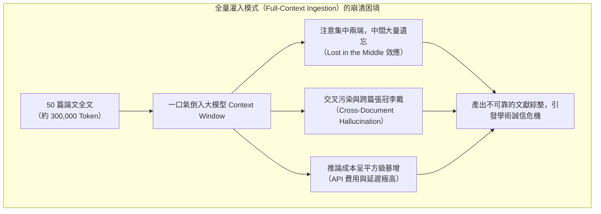
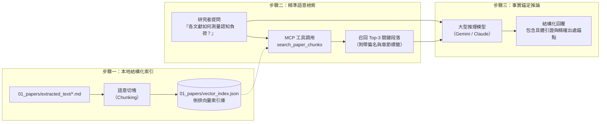
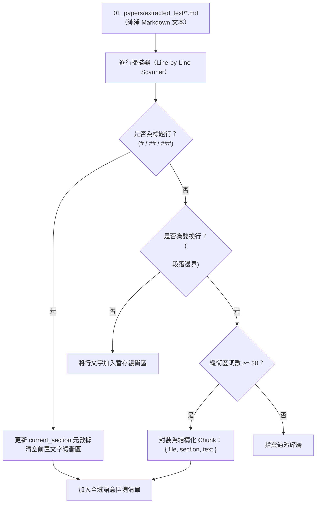
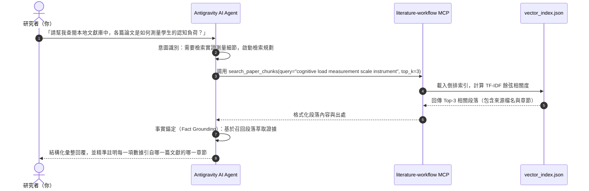

---
puppeteer:
  displayHeaderFooter: true
  headerTemplate: '<div style="font-size: 14px; margin: 0 auto;">第五章：本機 RAG 向量檢索：論文語意分塊與事實錨定</div>'
  footerTemplate: '<div style="font-size: 14px; margin: 0 auto;">第 <span class="pageNumber"></span> 頁 / 共 <span class="totalPages"></span> 頁</div>'
  margin:
    top: "1.5cm"
    bottom: "1.5cm"
    left: "1.5cm"
    right: "1.5cm"
---
<style>
  /* 全域字型大小放大為 1.4 倍（預設 16px * 1.4 = 22.4px） */
  html, body, .mume, .markdown-preview {
    font-size: 22.4px !important;
    line-height: 1.6 !important;
  }
  /* 標題分頁控制 */
  h2 {
    page-break-before: always;
  }
  /* 表格與程式碼區塊維持等比例適配 */
  table {
    font-size: 0.9em !important;
  }
  pre, code {
    font-size: 0.88em !important;
  }
</style>
---

# 第五章：本機 RAG 向量檢索：論文語意分塊與事實錨定

## 課程導讀

在經歷前四週的扎實訓練後，我們的文獻研究工作區已經建立起嚴整的資產管線：從第一週的 `PROJECT.md` 規格鎖定、第二週的 OpenAlex 智慧檢索與 PRISMA 追蹤、第三週的外部文獻 DOI 反查與收件治理，到第四週運用 `pymupdf4llm` 破解雙欄排版詛咒並截斷參考文獻雜訊，我們的手中已經累積了一批高度純淨、結構清晰的 Markdown 論文文本，妥善存放於 `01_papers/extracted_text/` 目錄中。

然而，當研究者手握 20 篇、50 篇甚至上百篇論文全文時，一個極為嚴峻的工程與認知瓶頸隨即浮現：**我們該如何讓 AI Agent 精確查閱這些文獻？**

許多剛接觸生成式 AI 的研究生常有一種直覺想法：「現在的大型語言模型（如 Gemini 1.5/2.5 Pro）動輒支援 100 萬乃至 200 萬 Token 的超長上下文視窗（Context Window），我把幾十篇論文的 Markdown 檔案全部打包，一口氣貼進對話框不就解決了嗎？」

這種「全量灌入（Full-Context Ingestion）」的作法，在嚴肅的學術研究中已被證實是極度危險且低效的。當文本量達到數十萬字時，大模型會不可避免地面臨**長程注意力稀釋（Lost in the Middle 效應）**、**推論成本急遽飆升**，以及**跨論文事實雜交（Cross-Paper Hallucination）**等致命缺陷。模型極可能將 A 論文的樣本數（N=120）張冠李戴到 B 論文的實驗結論中，進而在文獻探討中產出看似頭頭之道、實則漏洞百出的偽造證據。

為了解決這個根本性困局，本週我們將正式導入當代 AI 系統的核心架構——**檢索增強生成（Retrieval-Augmented Generation，簡稱 RAG）**。貫穿本週實作的核心箴言是：

> **檢索不是為了取代閱讀，而是為了在浩瀚的文獻庫中，讓 AI 代理人精確定位客觀事實，實現有憑有據的事實錨定（Fact Grounding）。**

在本週的課堂中，我們將深入剖析 RAG 的技術本質，探討如何針對學術論文進行「結構感知分塊（Structure-Aware Chunking）」；接著揭開本地倒排向量索引 `01_papers/vector_index.json` 的底層運作演算法，並透過 MCP 工具鏈驅動 Agent 執行毫秒級的文獻定位，最終建立起嚴格拒絕學術幻覺的「事實錨定引用防線」。

---

## 第一節：RAG 檢索增強生成架構與學術事實防禦

### 1.1 大模型上下文的「幻象」與「現實」：為什麼「全量灌入」必然失效

近年來，商業大模型廠商不斷宣傳超百萬 Token 的上下文容量，給許多研究者造成了一種「可以直接把整個圖書館倒給 AI」的樂觀錯覺。但在嚴謹的學術場域中，將多篇完整論文全量倒入 Prompt 會引發三大災難性後果：



1. **長程注意力稀釋與中間遺忘（Lost in the Middle）：**
   史丹佛大學與柏克萊大學的研究團隊（Liu et al., 2023）透過大量實證指出，現代 Transformer 架構的大型語言模型在處理超長文本時，其注意力分佈呈現顯著的 **「U 型曲線（U-shaped Attention Curve）」**。模型對於位於 Prompt 最開頭與最結尾的資訊具備極高的檢索召回率，但對於夾在中間 70% 的深層內容，其檢索準確率會呈現懸崖式暴跌。學術論文中最關鍵的研究細節——如統計檢定顯著性、共變數控制、實驗排除條件與研究限制——往往隱含在內文的中段，極易被模型直接「視而不見」。
2. **跨文獻事實雜交（Cross-Document Cross-Contamination）：**
   當模型同時加載 20 篇主題相近的實證論文時，由於各篇論文討論的變項（如「認知負荷」、「自我效能」）高度重疊，模型內部的自注意力矩陣（Self-Attention Matrix）會產生語意混淆。模型會將 A 論文（2023 年，問卷研究，N=250）的研究設計，與 B 論文（2024 年，眼動實驗，N=30）的結論拼湊在一起，生成出一個「看似完美但兩篇都沒做過」的虛假事實。在學位口試中，口試委員一旦查證原始文獻，這種事實雜交將立刻被定性為嚴重的學術不端。
3. **推論延遲與 Token 預算耗盡：**
   每次提問若都要重新上傳數十萬 Token，不僅會產生數十秒乃至數分鐘的漫長推論等待，更會迅速耗盡免費 API 額度或累積高昂的計費帳單，完全違背敏捷研究的初衷。

### 1.2 學術級 RAG 的核心承諾：零幻覺事實錨定（Grounding）

面對上述挑戰，**檢索增強生成（RAG）** 提供了一種精準優雅的架構解法。RAG 的精神在於：**「儲存歸儲存，檢索歸檢索，生成歸生成」**。

在 RAG 架構下，電腦不需要把所有論文塞給大腦，而是將本機的 Markdown 論文庫建立為結構化的「外掛知識庫」。當研究者提出具體的學術問題時，系統先以極高的速度在知識庫中找出與該問題最相關的 3 至 5 個「精華段落（Relevant Chunks）」，並僅將這幾個段落作為「證據（Context Grounding）」提供給大型語言模型，命令模型：**「必須且只能依據下列提供的證據段落回答問題，並標註段落出處；若證據中未提及，嚴禁自行推測。」**



透過 RAG 架構，我們為學術 Agent 建立了兩道不可逾越的事實防禦線：
- **可驗證性（Verifiability）：** Agent 的每一句論斷，都伴隨著原始論文的檔名、所屬章節與原文引句，研究者只需點擊連結即可在 3 秒內完成人工核對。
- **邊界防禦（Hallucination Boundary）：** 當文獻庫中沒有相關研究時，模型受到指令約束，會誠實回覆「本地文獻庫查無此項實證數據」，迫使研究者擴大搜尋，而不是聽信 AI 的胡言亂語。

### 1.3 檢索機制演進：稀疏檢索、稠密向量檢索與混合檢索

在 RAG 系統的技術演進中，主要存在三種主流的文字匹配機制：

| 檢索典範 | 代表技術與演算法 | 運作原理 | 學術場域的優勢 | 學術場域的局限 |
| :--- | :--- | :--- | :--- | :--- |
| **稀疏檢索（Sparse Retrieval）** | TF-IDF / BM25 / 倒排索引 | 計算字詞在段落中出現的頻率（TF）與在全庫中的稀有度（IDF）進行統計評分 | 對專有名詞、量表名稱（如 `NASA-TLX`）、統計術語（`ANCOVA`）、作者人名極度敏感且精確；無須神經網路，運算速度極快且完全在本機執行 | 無法辨識同義詞（例如搜尋 `cognitive burden` 找不到只寫 `mental workload` 的段落） |
| **稠密向量檢索（Dense Retrieval）** | 語意嵌入向量（Embeddings）、餘弦相似度（Cosine Similarity） | 將文字透過神經網路投射為高維幾何向量（如 768 或 1536 維），計算向量間的夾角餘弦值 | 具備極強的深層語意理解能力，能夠進行概念映射、跨語言比對與同義置換 | 對精確代碼、罕見縮寫或數字不夠敏感；建立索引需要調用嵌入模型 API 或消耗本機 GPU 資源 |
| **混合檢索（Hybrid Search）** | BM25 + Dense Embeddings + 重排序（Reranking） | 先以 BM25 確保關鍵字命中，再以向量餘弦補足語意相似度，透過加權融合評分 | 兼具術語精確命中與概念聯想，被視為工業級與專業科研 RAG 的黃金標準 | 系統架構較為複雜，索引體積與維護成本較高 |

在本專案的輕量化開源教學實踐中，我們採用了一種**針對學術 Markdown 最佳化的本機倒排 TF-IDF 檢索引擎**。它無需依賴外部收費的向量資料庫（如 Pinecone 或 Weaviate），亦不需要在本機配置龐大的 PyTorch 環境，僅需純粹的 Python 標準庫即可在零延遲、零依賴、純本地的條件下，對數百篇 Markdown 論文提供絕佳的學術檢索精度。

---

## 第二節：學術文字的分塊策略（Chunking Strategies）與本機索引建構

### 2.1 機械式分塊（Fixed-size Token Splitting）的學術災難

在建構 RAG 系統時，最關鍵的第一步就是**分塊（Chunking）**——將長達數萬字的論文拆解成若干個適當大小的資訊片段。

許多通用型 RAG 教學通常會建議使用 LangChain 或 LlamaIndex 的預設切分器，例如 `CharacterTextSplitter(chunk_size=500, chunk_overlap=50)`，每 500 個字元強行切一刀。在處理一般新聞或維基百科時，這種切法或許勉強可用；但在學術論文中，**機械式固定長度切分是一場災難**：

```text
【機械式切分範例：硬生生切斷學術因果鏈】
---------------------------------------------------------------
Chunk #12:
...本研究提出三大假設。H1 認為導入 AI 鷹架將顯著降低學生的外在
認知負荷；H2 認為學習成效與提示詞熟練度呈正相關；H3 則主張
---------------------------[截斷]-------------------------------
Chunk #13:
高自我效能感之學生在面對工具中斷時會表現出更高的抗挫折力。
透過單因子變異數分析，結果顯示 F(2, 87) = 4.32, p = .016，
因此假設獲得支持...
---------------------------------------------------------------
```

當研究者向 Agent 詢問：「本研究的 H1 假設是否獲得支持？」時：
- 如果檢索召回了 `Chunk #12`，裡面只有假設內容，沒有檢定數據；
- 如果檢索召回了 `Chunk #13`，裡面寫著「因此假設獲得支持」，但模型根本不知道這個統計結果到底是在支持 H1、H2 還是 H3！

機械式分塊破壞了學術論述的**語意完整性**、**因果鏈條**與**階層脈絡**，直接導致後續生成的推論錯誤。

### 2.2 學術結構感知分塊（Structure-Aware Chunking）

為了解決這個痛點，本專案在 `scripts/paper_retriever_mcp.py` 與 `scripts/extract_pdf_to_md.py` 中實現了**「學術結構感知分塊（Structure-Aware Chunking）」**策略。

學術論文具有高度標準化的章節架構（IMRaD：Introduction, Methods, Results, and Discussion）。結構感知分塊的核心原則為：
1. **章節標題即語意邊界（Header-Preserved Boundaries）：** 將 Markdown 的二級與三級標題（`##`、`###`）視為不可跨越的語意屏障。當掃描到新標題時，立即封裝上一段區塊，並將新標題名稱（如 `Methodology > 2.3 Instruments`）寫入後續所有段落的元數據（Metadata）中。
2. **段落語意單元保全（Paragraph Cohesion）：** 以自然段落（雙換行 `\n\n`）作為最小基礎單位。段落是學者闡述單一核心論點（Idea Unit）的自然邊界，絕不在段落中間任意橫向截斷。
3. **極小碎屑過濾（Noise Filtering）：** 自動過濾詞數低於 15 至 20 個 Token 的破碎孤行（如孤立的圖表標題、頁碼殘渣或公式符號），避免垃圾區塊污染檢索空間。



### 2.3 本地向量索引資料結構剖析：`vector_index.json`

在完成結構感知分塊後，系統會將所有論文的段落彙整，並在 `01_papers/` 目錄下生成專屬的本地檢索索引檔：`01_papers/vector_index.json`。

讓我們拆解其底層 JSON 資料架構：

```json
{
  "metadata": {
    "total_papers": 12,
    "total_chunks": 348,
    "last_updated": "2026-09-28T11:00:00Z"
  },
  "idf": {
    "cognitive": 1.482,
    "scaffolding": 2.153,
    "ancova": 3.892,
    "reflection": 1.905
  },
  "chunks": [
    {
      "chunk_id": "2023_Chen_chunk_42",
      "file": "2023_Chen_Scaffolding_GenAI_in_Higher_Ed.md",
      "section": "3. Methodology and Experimental Design",
      "text": "The experiment was conducted across eight weeks. Participants in the experimental group (N=62) utilized the custom-built AI Agent equipped with literature scaffolding tools, whereas the control group (N=58) relied on traditional manual database searching. Cognitive load was measured using the Paas Mental Effort Rating Scale..."
    }
  ]
}
```

這個索引資料結構包含三大支柱：
- **`metadata`（全域元數據）：** 記錄收錄的論文篇數與切分出的總段落數，作為系統完整性校驗的基準。
- **`idf`（反向文件頻率表）：** 記錄每一個字詞在全庫中的稀有程度。像 `the`、`study` 這種隨處可見的詞，其 IDF 權重接近於 0；而 `ancova`、`scaffolding` 等關鍵概念詞，則被賦予極高的檢索權重。
- **`chunks`（結構化段落清單）：** 每個段落均完整綁定所屬檔名（`file`）、章節標籤（`section`）與清洗後的正文文本（`text`），確保檢索命中時具備完整的事實上下文。

---

## 第三節：MCP 檢索工具鏈實戰與事實錨定提示工程

### 3.1 本機工具鏈操作：`build_paper_index` 與 `search_paper_chunks`

在我們的 `literature-workflow` MCP 伺服器中，封裝了兩大核心檢索工具：

1. **`build_paper_index`：**
   - **功能：** 遍歷 `01_papers/extracted_text/` 目錄下的所有 Markdown 論文，執行結構感知分塊，計算詞頻與 IDF 權重，產出或更新 `01_papers/vector_index.json`。
   - **調用時機：** 每當有新論文加入庫中，或重新執行了第四週的文字清洗程序後，必須執行一次以刷新索引。
2. **`search_paper_chunks`：**
   - **參數：** `query`（查詢語句，如 `"cognitive load Paas scale"`）、`top_k`（召回段落筆數，預設 3 筆）。
   - **回傳內容：** 依相關度排序的精選段落，包含所屬來源論文、章節標題、相關度評分與段落原文。



### 3.2 學術檢索語句設計（Query Formulation）

在調用 `search_paper_chunks` 時，提問的語句結構直接決定了召回段落的品質。研究者與 Agent 在構思查詢詞時，應遵循**「概念特異性（Concept Specificity）」**原則：

| 不良查詢語句（模糊、泛泛而談） | 優質學術查詢語句（精準錨定方法或變項） | 預期檢索目標 |
| :--- | :--- | :--- |
| `What is AI?` | `generative AI scaffolding definition higher education` | 鎖定導論中的理論定義 |
| `How did they do the study?` | `experimental group control group sample size methodology` | 鎖定研究方法章節的樣本分組數據 |
| `cognitive load results` | `cognitive load mental effort scale ANCOVA significant difference` | 鎖定統計檢定數值與量表測量結果 |
| `limitations` | `limitations future research sample bias threats to validity` | 鎖定研究限制與作者自陳的缺陷 |

### 3.3 事實錨定（Fact Grounding）提示詞工程範式

當 Agent 取得檢索段落後，我們必須透過嚴格的上下文工程與提示詞約束，封死模型的「胡思亂想」。以下是專門為學術事實錨定設計的標準 Prompt 結構：

```markdown
【學術事實錨定標準提示範本】

你是一位受過嚴格學術訓練的研究助理。請仔細閱讀下方由本機論文庫檢索回傳的【實證證據段落】，回答使用者的研究問題。

### 核心紀律規範：
1. **嚴格事實錨定（Strict Grounding）：** 你的所有回答必須完全基於提供的證據段落。嚴禁推論未被提及的數據，嚴禁利用預訓練常識進行腦補。
2. **出處精確標註（Exact Citations）：** 每一項實證主張、樣本數據或結論，都必須緊跟標註來源格式：`[來源論文檔名, 章節標籤]`。
3. **客觀承認空白（Acknowledge Absence）：** 若提供的段落中沒有包含解答問題所需之資訊，請直接回答：「本機現有檢索段落中未包含此項資訊，需進一步擴大文獻庫」，切勿編造。

### 實證證據段落（Retrieved Chunks）：
{{检索工具回传的 Top-K 结果}}

### 使用者問題：
{{研究者的具体问题}}
```

當 Agent 嚴格執行上述規範時，產出的成果將具備無可挑剔的學術公信力：

```markdown
【Agent 事實錨定回答範例】

根據本機論文庫的檢索證據，各篇文獻對認知負荷的測量方式彙整如下：

1. **量表工具與測量構面：**
   - **Chen (2023)：** 採用 Paas 九點量表測量心理努力程度（Mental Effort），並於實驗後立即施測 `[2023_Chen_Scaffolding_GenAI.md, 3. Methodology]`。
   - **Wang et al. (2024)：** 採用 Leppink 等人編製之多維度認知負荷量表，明確區分內在認知負荷（Intrinsic Load）與外在認知負荷（Extraneous Load）`[2024_Wang_Empirical_Evaluation.md, 2.3 Instruments]`。

2. **統計檢驗結果：**
   - 在導入 AI Agent 輔助後，實驗組的外在認知負荷顯著低於對照組（F = 5.21, p = .024）`[2024_Wang_Empirical_Evaluation.md, 4. Results]`。
   - *（註：現有檢索段落中未提及相關負荷（Germane Load）之顯著性差異。）*
```

---

## 第四節：課堂探索小活動與實作驗收

### 4.1 課堂實作小活動：建構本地向量索引並驗證事實錨定

> **活動時間：** 15 分鐘
> **活動目標：** 為工作區建立首份 `vector_index.json`，並親自測試稀疏檢索與事實錨定的精準度。
>
> 1. **檢查文字庫：** 確認 `01_papers/extracted_text/` 目錄下至少有 2 至 3 篇已轉譯完成的 Markdown 論文。
> 2. **建置索引：** 在 Antigravity 2.0 對話框中向 Agent 發送指令：
>    *「請調用 MCP 工具 `build_paper_index`，為工作區的所有 Markdown 論文建立本地檢索索引。」*
>    觀察終端回傳之總段落數（Total Chunks）與檔案儲存路徑。
> 3. **定向事實檢索：** 向 Agent 發送指令：
>    *「請使用 `search_paper_chunks` 工具，檢索文獻庫中關於『樣本數（Sample Size）』或『研究限制（Limitations）』的具體段落，並以嚴格的事實錨定格式，向我報告各篇論文的實證細節。」*
> 4. **核對原文真確性：** 點開對話回傳的 Markdown 檔案連結，核對 Agent 所引述的數字或結論是否與原文一字不差！

```text
老師的真心話：
學術研究最迷人的地方，在於它的『真實與精確』。
當你第一次看著 Agent 不是在打高空，而是精準翻出『2024_Wang 論文第 4 節第三段 F=5.21, p=.024』，
並且把整句話的原貌呈現在你眼前時，你才會真正體會到什麼叫做『強大的研究副駕駛』！
記住：永遠不要讓 AI 替你『想像』文獻；讓 AI 替你『索引與翻閱』文獻，才是頂級學者的思維模式！
```

---

## 本週小結與下週預告

在本週的第五講中，我們成功攻克了學術文獻探討中最關鍵的技術堡壘——**本機 RAG 向量檢索系統**。我們徹底揚棄了盲目且危險的「全量灌入」模式，理解了長程注意力衰減（Lost in the Middle）的科學成因；我們實踐了保護學術邏輯脈絡的「結構感知分塊」，剖析了輕量本地倒排索引 `vector_index.json` 的設計原理，並透過 `build_paper_index` 與 `search_paper_chunks` 實現了零幻覺的事實錨定（Fact Grounding）。

然而，檢索出零碎的精華段落，只是研究拼圖的第一步。一篇優秀的碩士論文或期刊論文，要求研究者必須對關鍵經典文獻進行**「解剖級的深度精讀」**。

在下一週（第六講）的課程中，我們將跨入 **《單篇批判精讀與標準閱讀卡片化：學術知識的晶體化》**。我們將學習卡片盒筆記法（Zettelkasten）在學術文獻中的進階應用，定義涵蓋「研究問題、理論框架、實證設計、關鍵發現、方法盲點、對本研究啟發與黃金引句」的七維標準學術卡片（Schema），並訓練 Agent 化身為最挑剔的學術審稿人，將厚重的單篇論文淬鍊為永不遺忘的知識晶體！
