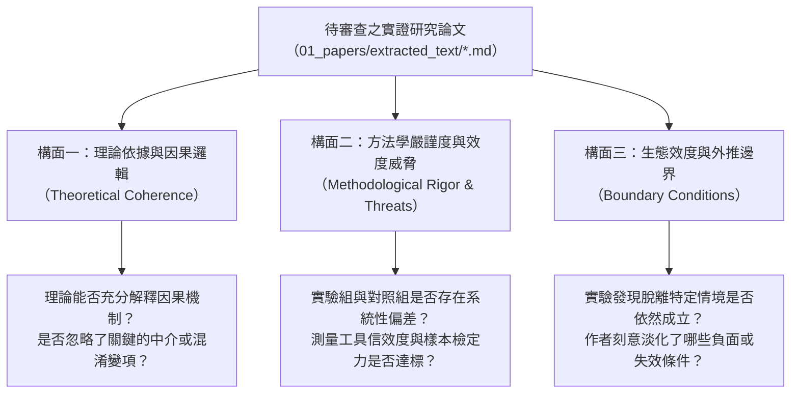
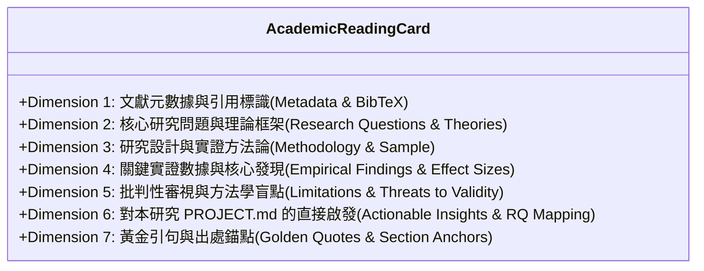

---
puppeteer:
  displayHeaderFooter: true
  headerTemplate: '<div style="font-size: 14px; margin: 0 auto;">第六章：單篇批判精讀與標準閱讀卡片化：學術知識的晶體化</div>'
  footerTemplate: '<div style="font-size: 14px; margin: 0 auto;">第 <span class="pageNumber"></span> 頁 / 共 <span class="totalPages"></span> 頁</div>'
  margin:
    top: "1.5cm"
    bottom: "1.5cm"
    left: "1.5cm"
    right: "1.5cm"
---
<style>
  /* 全域字型大小放大為 1.4 倍（預設 16px * 1.4 = 22.4px） */
  html, body, .mume, .markdown-preview {
    font-size: 22.4px !important;
    line-height: 1.6 !important;
  }
  /* 標題分頁控制 */
  h2 {
    page-break-before: always;
  }
  /* 表格與程式碼區塊維持等比例適配 */
  table {
    font-size: 0.9em !important;
  }
  pre, code {
    font-size: 0.88em !important;
  }
</style>
---

# 第六章：單篇批判精讀與標準閱讀卡片化：學術知識的晶體化

## 課程導讀

在第五週的課堂中，我們成功建立起本地 RAG 檢索系統，讓 AI Agent 具備了毫秒級翻閱本機 Markdown 論文、提取具體章節與精準定位事實的強大能力。然而，在學術研究的真實征途上，單純具備「檢索零碎段落的能力」，並不足以支撐起一篇具備深度洞察的碩士論文或期刊論文。

幾乎每一位碩士研究生在文獻探討的初期，都會陷入一種典型的 **「文獻消化不良症候群」**：
- 電腦硬碟裡下載了上百篇 PDF，資料夾被塞得滿滿噹噹；
- 每一篇論文都用螢光筆畫得密密麻麻，甚至逐字翻譯或寫下了幾千字的零散摘要；
- **但當坐在螢幕前要撰寫第二章文獻探討時，腦袋卻一片空白，無法將讀過的文獻轉化為自己論文的有力論據。**

這種現象的根源在於：大部分學生在閱讀學術論文時，採用的是 **「被動且非晶體化」** 的閱讀方式。他們把文獻當成小說或教科書來讀，只滿足於了解「這篇論文說了什麼」，卻從未對論文進行嚴謹的「批判性解剖」；更糟糕的是，閱讀的收穫隨手記錄在零散的筆記軟體或紙本上，隨著時間推移而迅速蒸發。

為了解決這項痛點，本週我們將導入現代知識管理學中最具威力的範式——**學術知識晶體化（Academic Knowledge Crystallization）**與**原子閱讀卡片（Atomic Reading Cards）**。

貫穿本章的精讀哲學是：

> **讀論文不是為了替原作者背書，而是為了在自己的研究大廈中找到一塊合適的基石；優秀的研究者絕不作平鋪直敘的摘錄者，而作手持顯微鏡的對抗性審稿人。**

在本週的課堂中，我們將學習如何超越傳統摘要，對論文的研究設計與效度威脅展開深度質疑；我們將正式定義涵蓋七大核心構面的**標準學術閱讀卡片（Schema）**，並引導 Agent 讀取根目錄的 `PROJECT.md`，將單篇論文的精華與我們自己的核心研究問題（RQ1-RQ3）建立緊密的共振連結，妥善儲存於 `02_notes/cards/` 目錄中，為第七週的跨篇文獻矩陣共構打下堅不可摧的單元基石！

---

## 課前準備：工作區擴充 Skills 目錄、配置卡片庫與複製專屬 Skill

在開始本週的批判精讀與原子卡片化實作前，請同學依照以下三項步驟，在個人論文工作區 `my_thesis_workspace` 下完成目錄擴充、複製專屬 Skill 模組檔案，並確認核心前置資產就位：

### 1. 工作區目錄結構擴充（建立 `skills/` 與 `02_notes/cards/`）

本週實作將為工作區注入現代 Agentic 系統的核心能力——**專案自訂 Skill 模組**，同時建立集中管理原子閱讀卡片的資產庫。在目錄組織上，我們將方法學參照（References）與規格範本整併入 `resources/` 目錄中，並建立存放金牌少樣本的 `examples/` 與輔助驗證的 `scripts/`（純文字工作流無須建立 `assets/`）。

請在你的論文工作區 `my_thesis_workspace` 根目錄下擴充並確認以下資料夾結構：
- **專屬 Skill 模組目錄**：
  - `skills/academic_reading_card/`（存放 Skill 核心規格）
  - `skills/academic_reading_card/resources/`（存放靜態規格、空白 Schema 範本與審查規準）
  - `skills/academic_reading_card/examples/`（存放金牌卡片少樣本學習範例）
  - `skills/academic_reading_card/scripts/`（存放卡片格式自動驗證腳本）
- **原子文獻卡片儲存目錄**：
  - `02_notes/cards/`（用於集中收納本週起所有精讀晶體化產出的原子卡片）

### 2. 複製專屬 Skill 模組檔案

請將本週課程所提供的學術論文批判精讀 Skill 模組檔案，複製至個人工作區的相應目錄中：
- **核心流程入口：** `my_thesis_workspace/skills/academic_reading_card/SKILL.md`
- **靜態規範與範本（合併 references）：** 
  - `my_thesis_workspace/skills/academic_reading_card/resources/card_template.md`（七維空白卡片 Schema 範本）
  - `my_thesis_workspace/skills/academic_reading_card/resources/review_criteria.md`（對抗性審稿檢核表與經典文獻參照）
- **少樣本學習典範：** `my_thesis_workspace/skills/academic_reading_card/examples/sample_reading_card.md`（金牌卡片範例）
- **格式自動驗證工具：** `my_thesis_workspace/skills/academic_reading_card/scripts/validate_card.py`（卡片格式自動檢查腳本）

完成配置後，`my_thesis_workspace` 的整體目錄結構應呈現如下樹狀關聯：

```text
my_thesis_workspace/
│
├── PROJECT.md                                # 專案研究規格書（已定義個人 RQ1-RQ3）
│
├── 01_papers/
│   ├── raw_pdf/                              # 原始 PDF 論文原件庫
│   ├── extracted_text/                       # 第四週轉譯之純淨 Markdown 論文
│   │   └── 2023_Kasneci_ChatGPT_for_good...md
│   ├── vector_index.json                     # 第五週建置之向量分塊文字與元數據
│   └── vector_embeddings.npz                 # 第五週建置之 768 維稠密向量矩陣
│
├── 02_notes/
│   └── cards/                                # 【本週新增】原子化學術閱讀卡片庫
│       └── card_YYYY_Author_Concept.md       # （由 Skill 自動批判提煉產出）
│
└── skills/                                   # 【本週新增】專案自訂 Skill 資產庫
    └── academic_reading_card/
        ├── SKILL.md                          # 核心流程入口（SOP 規範與人設）
        ├── resources/                        # 靜態規範與文獻參照（合併 references）
        │   ├── card_template.md              # 七維標準卡片空白 Schema 範本
        │   └── review_criteria.md            # 審稿檢核規準與經典方法學參照
        ├── examples/                         # 少樣本學習（Few-shot）金牌典範
        │   └── sample_reading_card.md        # 完整生產級文獻閱讀卡片範例
        └── scripts/                          # 本機自動化輔助工具
            └── validate_card.py              # 卡片 Frontmatter 與七維結構自動驗證腳本
```

### 3. 確認核心資產與前置環境就位

在驅動 Agent 執行精讀前，請逐一檢查以下三項核心資產：
1. **確認在庫 Markdown 文本：**  
   確認 `01_papers/extracted_text/` 目錄中已存放至少一篇由第四週文字工程轉譯產出的 Markdown 論文（例如 `2023_Kasneci_ChatGPT_for_good__On_opportunities.md`）。
2. **確認 `PROJECT.md` 規格就位：**  
   確認根目錄的 `PROJECT.md` 中已明確記錄你個人的論文工作題目與核心研究問題（RQ1、RQ2、RQ3）。Agent 執行本 Skill 時將自動讀取此檔，以完成卡片【第六維度：對本研究的直接啟發】的深度映射。
3. **確認本機 RAG 向量檢索工具鏈運作正常：**  
   確認第五週產生的 `01_papers/vector_index.json` 與 `vector_embeddings.npz` 索引檔案在庫，使 Agent 能在精讀過程中隨時調用 `search_paper_chunks` 進行多維度事實查核與統計數據錨定。

---

## 第一節：學術批判精讀（Critical Reading）的思維典範

### 1.1 從「被動摘要（Summarizing）」到「審訊式閱讀（Interrogative Reading）」

在大學部階段，學生閱讀文獻的目標通常是「吸收已知知識」；但在碩士乃至博士研究階段，文獻閱讀的目標發生了本質上的典範轉移——**「檢驗與重構知識」**。

下表清晰對比了初學者與資深研究者在文獻閱讀思維上的鴻溝：

| 評估構面 | 初學者的被動摘要模式（Passive Summary） | 學術專用的批判精讀模式（Critical Reading） |
| :--- | :--- | :--- |
| **心理定位** | 仰望權威：把論文結論當作不可動搖的客觀真理 | 平等對話：將論文視為原作者的一場學術「辯護論證」 |
| **閱讀問題** | 「這篇論文的作者說了什麼？主要結論是什麼？」 | 「作者的結論是如何被推導出來的？背後藏有哪些沒說的假設？」 |
| **對數據態度** | 照單全收：只看摘要寫的顯著性（p < .05）與正面效果 | 穿透檢視：檢查對照組條件、樣本代表性、流失率與測量誤差 |
| **對限制態度** | 忽略不看：通常直接略過論文最後的 Limitations 章節 | 視為珍寶：研究限制正是孕育自己論文研究空白（Research Gap）的沃土 |
| **筆記成果** | 冗長的摘抄筆記，充斥著作者的原始文句，難以重用 | 高度模組化的原子卡片，提煉出對自己研究的具體借鑑與批判啟發 |

批判性閱讀並不是為了「挑刺」或「為反對而反對」，而是為了**探求知識成立的邊界（Boundary Conditions）**。在傳播學、教育科技、管理科學等社會科學領域中，任何一項技術引入、教學介入或研究工具，都絕不可能在所有情境下都一體適用。只有看清前人研究是在什麼特定的脈絡、特定的樣本與特定限制下才成立，我們才能在自己的論文中找到真正的立足點。

### 1.2 批判解剖的三大核心構面

當我們精讀一篇實證研究論文時，必須引導 Agent 共同手持手術刀，聚焦於以下三大構面進行深度解剖：



為協助同學掌握這三大構面如何落實於真實學術論文，我們直接調用工作區本機文獻庫中已轉譯為 Markdown 的真實論文進行深度解剖：

> **【文獻庫貫穿解剖案例】**    
> - **論文篇名：** *ChatGPT for good? On opportunities and challenges of large language models for education*  
> - **作者與出處：** Enkelejda Kasneci et al. (2023), 發表於教育心理學頂級期刊 *Learning and Individual Differences* (SSCI, 被引用逾 6,500 次)。  
> - **文獻屬性定位：** 此文為一篇國際知名度極高、跨領域專家共同背書的「前瞻立場與架構論述論文（Position Paper）」。

---

#### 1. 構面一：理論依據與因果邏輯（Theoretical Coherence & Causal Mechanism）

- **核心概念詳解：**
  任何嚴謹的學術研究，其自變項（介入手段/預測因素）與因變項（學習成效/心理反應）之間絕不能僅停留於表面關聯或願景倡議，而必須建立在扎實且自洽的理論因果機制之上。優秀的審查人在研讀文獻時，會嚴格檢驗作者是否犯了「只拋出美好假設，卻缺乏認知或社會學因果推導」的盲點：
  - **理論適用性：** 論文引用的理論架構（如建構主義、認知負荷理論、自我決定論），是否真正能合理解釋該現象？
  - **因果傳導路徑（Causal Mechanism）：** 自變項究竟透過何種認知或行為中介機制傳導至因變項？兩者之間是否存在未被說明的「黑盒子」？作者是否將「工具易用性」與「深層學習成效」劃上未經證實的等號？
- **文獻庫實務解剖（以 Kasneci et al., 2023 為例）：**
  - **原文論點：** 作者群（第 1-3 節）樂觀論述生成式 AI 能即時解答學生疑惑、客製化學習路徑，進而顯著提升學生的學習參與度（Engagement）與批判性思維。
  - **審查者的批判質疑：** 在因果機制上，作者將「流暢的人機對話互動（Surface Interaction）」直接等同於「促進深度認知重構（Deep Learning）」，缺乏認知負荷理論或知識建構理論的因果中介解釋。若學生僅是被動複製 AI 的精美解答，大腦未經歷檢索練習（Retrieval Practice）與反思掙扎，其「能力提升」的因果鏈條在理論上是不成立的。

#### 2. 構面二：方法學嚴謹度與效度威脅（Methodological Rigor & Threats to Validity）

- **核心概念詳解：**
  文獻所得出的結論是否可信，完全取決於研究設計是否排除了各種方法學效度威脅（Shadish et al., 2002）。在閱讀文獻時，必須嚴防將「未經嚴謹實證檢驗的觀點」誤當成「已被證實的科學真理」：
  - **內部效度（Internal Validity）：** 結論是否建立於受控實驗之上？是否存在嚴重的評估者偏差、霍桑效應（Hawthorne Effect）或未受控制的歷史混淆變項？
  - **構念/工具效度（Construct Validity）：** 是否有標準量表、測量題項與客觀指標？信度係數（Cronbach's $\alpha$）與因素結構效度是否具備？
  - **實證基礎與證據等級（Empirical Grounding）：** 論文的論據是來自「實證數據」抑或「專家質性觀點」？
- **文獻庫實務解剖（以 Kasneci et al., 2023 為例）：**
  - **原文屬性限制：** 該文在篇名下方明確標示為「A Position Paper（立場論述論文）」，本質屬於學者觀點綜述，而非雙盲或準實驗研究。
  - **審查者的批判質疑（效度威脅）：** 儘管該文被引用數千次，但從實證方法學審視，全篇**完全沒有實驗組與對照組設計、無隨機抽樣、無量表測量、無量化統計效果量（Effect Sizes）**！其宣稱的各種教學潛力，皆來自於專家推論與質性前瞻倡議（Expert Opinion）。審查者必須清楚意識到：這是一篇「探索性架構藍圖」，不能在文獻探討中寫成「Kasneci et al. (2023) 證實了生成式 AI 具有顯著學習成效」，否則即犯下了嚴重的證據等級誤判！

#### 3. 構面三：生態效度與外推邊界（Ecological Validity & Boundary Conditions）

- **核心概念詳解：**
  科學知識永遠具有其成立的情境條件（Boundary Conditions，Whetten, 1989）。任何研究主張都不可能在所有時空與群體中一體適用。批判精讀的關鍵在於探求「在什麼條件下該結論會失效」：
  - **生態效度（Ecological Validity）：** 主張的介入手段若放入真實課堂或組織環境中，是否會遭遇制度阻力、認知過載或技術落差？
  - **對象與學科外推邊界（Generalizability & Boundary Conditions）：** 該結論適用於哪一類受試者？若轉換到不同的學科領域、不同年齡層或不同文化脈絡，效果是否會翻轉？
  - **深掘限制以定位研究空白（Research Gap）：** 原作者在「挑戰（Challenges）」或「限制（Limitations）」中提及的缺陷，正是我們學位論文開拓獨特研究空間的黃金沃土。
- **文獻庫實務解剖（以 Kasneci et al., 2023 為例）：**
  - **群體邊界忽視：** 作者群主張大型語言模型可廣泛應用於各教育層級（第 4 節，涵蓋中小學至高等教育）。然而，成人研究生具備基礎學術鑑別力，面對 AI 幻覺（Hallucination）尚能反向查核；若直接推廣到認知成熟度不足的中小學生，盲目信任 AI 假資訊將導致嚴重的認知扭曲。
  - **學科邊界混淆：** 在容錯率較高的創意思考或語文表達領域，AI 的發散生成極具啟發性；但若外推到需要絕對精準與實證查核的醫療、法學或嚴肅學術研究，AI 的隨機生成將帶來毀滅性風險。原作者未界定清楚的學科邊界與年齡邊界，恰恰為我們自己的實證研究指明了最關鍵的「學術空白（Research Gap）」！

> [!NOTE] 學術理論淵源與方法學出處（Methodological Foundations）
> 「批判解剖的三大核心構面」是本課程針對實證研究精讀所設計的教學化操作框架（Pedagogical Operationalization），其學理根基融合了社會科學與教育研究方法的三大經典體系：
> 1. **構面二（方法學嚴謹度與效度威脅）與構面三（生態效度）：** 源自 **Shadish, Cook, & Campbell (2002)** 建立的實驗與準實驗設計效度分類系統（內部效度、構念效度、統計結論效度與外部/生態效度）。
> 2. **構面一（理論依據與因果邏輯）與構面三（外推邊界）：** 源自管理與組織科學領域對「理論建構與評價標準」的經典規範（**Whetten, 1989**; **Sutton & Staw, 1995**），強調檢驗自變項與因變項之間的因果解釋力（Why/How）及理論成立的邊界條件（Boundary Conditions: Who, Where, When）。
> 3. **批判精讀與審訊式閱讀範式：** 參照研究生批判性文獻閱讀指引（**Wallace & Wray, 2021**; **Booth et al., 2016**），將文獻視為論證辯護並系統化檢視其證據漏洞。

### 1.3 人機協同：將 Agent 訓練為「對抗性審稿人（Adversarial Reviewer）」

許多同學使用 AI 輔助閱讀時，最常下的指令是：「請幫我總結這篇論文的重點。」
這樣做往往只會得到一份客氣、奉承且充斥公關語調的表面摘錄，AI 會將論文作者自誇的優點全盤接受。

在 Antigravity 2.0 中，最有效的提示策略是**要求 Agent 轉換人設，扮演國際頂級期刊（如 *Computers & Education*、*ETR&D*）的最嚴苛審稿人（Adversarial Reviewer）**。當我們要求 Agent 站在對立面挑剔論文漏洞時，Agent 會迅速啟動批判性思維，精準揪出論文中的統計疑點與論述破綻。

---

## 第二節：學術知識晶體化與原子閱讀卡片標準規範

### 2.1 為什麼需要「卡片化」：卡片盒筆記法（Zettelkasten）的學術落地

德國社會學巨擘尼克拉斯·魯曼（Niklas Luhmann）一生出版了 70 餘部學術專著、發表了 400 多篇高質量論文，其驚人生產力的核心秘密就在於**卡片盒筆記法（Zettelkasten）**。

在傳統線性筆記中，資訊像是一本越寫越厚但無法翻閱的死帳簿；而「卡片化」的核心思想在於**原子化（Atomicity）**與**模組化（Modularity）**：
- **一文一卡（One Paper, One Card）：** 每一篇被採納（`[+]`）的關鍵文獻，都必須被提煉成一份獨立、自足、格式高度統一的 Markdown 檔案。
- **儲存目錄規範：** 工作區統一指定存放於 `02_notes/cards/` 目錄。
- **標準命名格式：**
  ```text
  card_{發表年份}_{第一作者英文姓氏}_{核心概念縮寫}.md
  ```
  例如：`card_2023_Chen_AI_Scaffolding.md`、`card_2024_Wang_Cognitive_Load.md`。
- **便於隨機重組：** 每一張卡片都是一顆晶體化的知識積木。到了第七週，我們可以讓 Agent 同時加載多張卡片，瞬間縱橫比對出跨篇文獻的學術空白！

### 2.2 七維標準學術卡片結構（Schema）深度解析

一份兼具嚴謹學術深度與實踐指導價值的「標準文獻閱讀卡片」，必須包含以下七大不可或缺的標準構面（7-Dimension Schema）：



各構面的核心內涵與填寫標準如下：

1. **第一維度：文獻元數據與引用標識（Metadata & Citation Key）**
   - 記錄標準 BibTeX Key、完整篇名、所有作者群、發表年份、刊名或研討會名稱、DOI 與工作區原始 Markdown 相對路徑。
2. **第二維度：核心研究問題與理論框架（Research Questions & Theoretical Lens）**
   - 提取原作者試圖解答的具體研究問題（RQ）。
   - 標明支撐該研究的核心理論模型（如 Self-Regulated Learning Theory, Cognitive Load Theory）。
3. **第三維度：研究設計與實證方法論（Methodology, Sample, Context, Instruments）**
   - **研究方法：** 準實驗設計、質性個案研究、問卷調查法或混合研究。
   - **研究對象與樣本量：** 具體樣本數（N）、性別比例、年齡、修課背景。
   - **研究情境：** 介入時間長度（如 8 週）、施測環境（實體課堂或線上）。
   - **測量工具：** 具體使用的量表全稱、施測時機與統計信效度。
4. **第四維度：關鍵實證數據與核心發現（Empirical Findings & Key Evidence）**
   - **拒絕空洞結論：** 嚴禁只寫「兩組有顯著差異」，必須記錄具體統計指標（如 $F(1, 84) = 6.42, p = .013, \eta_p^2 = .07$）。
   - 若為質性研究，則提煉核心編碼主題（Themes）與關鍵發現。
5. **第五維度：批判性審視與方法學盲點（Critical Limitations & Vulnerabilities）**
   - 記錄作者在文中承認的研究限制。
   - **研究者自己的批判觀點：** 指出其方法學缺陷（如未設延宕後測、缺乏質性訪談佐證、存在樣本自願參與偏差等）。
6. **第六維度：對本研究（`PROJECT.md`）的直接啟發與映射（Actionable Insights for My Thesis）**
   - **整張卡片的靈魂所在！**
   - 具體回答：這篇論文對我們在 `PROJECT.md` 中界定的 RQ1、RQ2 或 RQ3 有何啟發？
   - 我們可以借用其什麼量表？如何避免其犯過的方法學錯誤？我們的研究可以在其結論上推進哪一步？
7. **第七維度：黃金引句與出處錨點（Golden Quotes with Section Anchors）**
   - 精選 2 至 3 句最具學術張力、最適合未來直接引用在論文第二章的英文原文金句，並精確標註所屬章節標題。

> [!NOTE] 卡片結構之學理淵源與標準參照（Theoretical & Design Foundations）
> 七維標準學術卡片結構是本課程針對 Prompt Engineering 與 Markdown 筆記知識庫所制定的資料規格（Schema），其背後融合了四大學術與知識管理方法：
> 1. **卡片盒筆記法（Zettelkasten）：** 源自社會學家 Niklas Luhmann，並由 **Ahrens (2017)** 現代化推廣之「原子化文獻筆記（Literature Notes）」理念，強調一文一卡、概念模組化與可重組性。
> 2. **矩陣式文獻檢閱法（The Matrix Method）：** 借鑑實證研究文獻綜整之經典架構（**Garrard, 2020**），將文獻依核心問題、方法、數據、限制進行結構化橫向拆解，本課程進一步將矩陣列轉換為獨立的原子 Markdown 卡片。
> 3. **期刊論文報告標準（APA JARS）：** 第 3、4、5 維度遵循美國心理學會（**APA, 2020**; **Appelbaum et al., 2018**）之實證論文報告規範（Journal Article Reporting Standards），嚴格要求記錄樣本細節、信效度與統計效果量（Effect Sizes）。
> 4. **學術空間開拓理論（CARS Model）：** 第 6 維度（對自身研究的直接啟發）落實了 **Swales (1990, 2004)** 的 CARS 模式，強調閱讀文獻的終極目的在於定位自身研究利基（Establishing a Niche）並建立研究缺口（Research Gap）。

### 2.3 人機協同審核光譜：七維卡片的認知責任分配

在現代學術研究中，生成式 AI（大型語言模型）具備強大的資訊提煉與文本摘要能力，但過度依賴自動化極易誘發研究者的**「認知外包（Cognitive Offloading）」**與**「解釋深度錯覺（Illusion of Explanatory Depth，Rozenblit & Keil, 2002）」**——研究者看到 AI 生成了字面工整、語氣權威的卡片，便誤以為自己已經「真正讀懂並消化了該篇論文」。一旦在論文口試或期刊審查中被問及研究設計缺陷或統計細節，便會立刻露出破綻。

為了確保學術嚴謹性並兼顧文獻處理效率，我們必須建立一套**「七維卡片人機協同責任光譜（Human-AI Collaboration Spectrum）」**。這套機制將七個維度劃分為三大協同層級（Tiers），明確界定「何者可全自動生成」、「何者必須經由研究者審核挑刺」、「何者必須由研究者親自主筆」：

| 協同層級（Tier） | 涵蓋維度 | AI Agent 角色與職責 | 研究者（研究生）責任與行動 | 認知把關重點與防禦機制 |
| :--- | :--- | :--- | :--- | :--- |
| **Tier 1：完全自動化**<br>*(綠燈 / 機器主力)* | **維度一：** 文獻元數據與引用標識<br>**維度七：** 黃金引句與出處錨點 | **全自動執行：**<br>自 Markdown 解析 BibTeX、作者群、年份、DOI、期刊與高張力原文引句。 | **低摩擦快速掃描：**<br>核對 DOI 連結是否可點擊、作者拼寫與頁碼錨點是否準確無誤。 | **格式合規與引用正確性：**<br>防止模型因 OCR 或抽取錯誤導致作者漏字或年份偏差。 |
| **Tier 2：人機共構審核**<br>*(黃燈 / 批判對抗)* | **維度二：** 核心研究問題與理論框架<br>**維度三：** 研究設計與實證方法論<br>**維度四：** 關鍵實證數據與核心發現<br>**維度五：** 批判性審視與方法學盲點 | **初稿生成與挑刺提問：**<br>提取 RQ、理論框架、樣本數、測量量表、統計檢定值 ($F, t, p, \eta_p^2$)，並化身對抗性審稿人列出效度威脅。 | **實質查核與深化批判：**<br>1. 打開原文 PDF/Markdown 交叉核對關鍵數據（如樣本數 N、效果量）。<br>2. 注入研究者個人的學術洞見，擴充並具體化批判論點。 | **杜絕幻覺與方法學把關：**<br>嚴防 AI 將「專家觀點」誤判為「實證統計」（如 Kasneci et al., 2023），嚴懲浮誇宣稱。 |
| **Tier 3：研究者親筆主導**<br>*(藍燈 / 人類靈魂)* | **維度六：** 對本研究 `PROJECT.md` 的直接啟發與映射 | **蘇格拉底式提問與銜接：**<br>讀取 `PROJECT.md`，提供候選啟發點與引導式問題（如「這篇的量表可否用於你的 RQ2？」）。 | **親自主筆與決策：**<br>研究者必須親自撰寫！深入闡明該文如何推進自己的論文開題、如何避免其前人錯誤、如何定位學術空白。 | **學位論文原創性核心：**<br>嚴禁完全交由 AI 代筆！此處是研究生個人開題與畢業論文立論的精髓所在。 |

#### 深度解析：三層級協同的認知科學防禦

1. **Tier 1（維度 1、7）：釋放認知資源於機械性任務**
   - 元數據解析與引句檢索屬於典型的低認知複雜度工作。讓 Agent 利用 Regex 與向量比對全自動提取，能為研究者省下 80% 的繁瑣機械勞動，將寶貴的注意力與認知資源（Sweller, 1988）集中於高階批判思考。
2. **Tier 2（維度 2、3、4、5）：以「批判性覆核」破除 AI 權威錯覺**
   - 傳統做法中，學生常直接複製 AI 摘要的「研究發現」，導致統計數據被過度簡化甚至產生幻覺。在 Tier 2 規範下，Agent 產出的是**「待審查草稿」**。研究者必須手持原文進行核實：*「原文真的有做雙盲嗎？」「這個 p 值後面有沒有附效果量？」* 同時，在第五維度中，研究者必須補入自己的批判觀點，確保對文獻的審視具備個人視角。
3. **Tier 3（維度 6）：守護學位論文的研究原創性（Originality）**
   - 他人的研究發現只有在與**「我自己的碩士論文」**產生化學反應時，才具有真正的學術價值。AI 不具備研究者的個人學術抱負、研究直覺與研究脈絡，因此第六維度嚴禁一鍵自動生成。Agent 只能扮演「學術對話夥伴（Academic Dialogue Partner）」，提供鷹架提示，最終的文字闡述必須由研究生在白紙黑字上一筆一劃深思落筆。

---

## 第三節：驅動 Agent 產出標準閱讀卡片：專屬 Skill 封裝與自動化實踐

### 3.1 為什麼需要從「裸提示詞（Bare Prompt）」升級為「專屬 Skill」？

#### 1. 什麼是 Skill？現代 Agent 架構的核心能力封裝

在現代 AI 代理人架構（如 Google Antigravity 2.0）中，**Skill（專用技能）** 指的是一種針對特定專業任務所封裝的 **「模組化、標準化且具備自我意識的執行單元（Modular & Self-Contained Capability Unit）」**。

Skill 不再只是一段隨意複製貼上的提示詞文字，而是一個具備完整軟體工程規範的目錄體系，其核心組成架構包含：
1. **語意指紋與中繼宣告（Metadata Declaration，YAML Frontmatter）：**  
   透過 `name`、`description`、`tags` 與版本資訊，向 Agent 系統正式註冊技能。當研究者在對話框中發出任何自然語言需求時，Agent 能根據其內部意圖路由機制，進行 **「語意發現與自動喚醒（Semantic Discovery & Zero-Shot Activation）」**，完全無需使用者手動調用特定的硬編碼指令。
2. **標準作業流程（Standard Operating Procedures, SOP）：**  
   明確規範任務執行的狀態機流轉。從檔案讀取、跨工具協同（Tool Orchestration）、人機協同審查暫停點（Human-in-the-Loop），到最後的落盤儲存，提供一套嚴密不可逾越的步驟約束。
3. **解耦式資源與範本支持（Decoupled Resources & Few-Shot Examples）：**  
   將龐雜的「指令邏輯」與具體的「輸出格式」徹底解耦。透過 `@Resource` 引入空白 Schema 範本與審查規準，並透過 `@Example` 提供高水準的金牌少樣本範例，引導大模型進行高精度的情境學習（In-Context Learning）。
4. **本機環境與工具鏈深度感知：**  
   Skill 具備存取本機工作區結構的能力，能主動跨越目錄讀取專案規格書（`PROJECT.md`）、調用本機向量檢索工具（`search_paper_chunks`），並精準寫入目標資產庫（`02_notes/cards/`）。

#### 2. 從「裸提示詞」到「專屬 Skill」的質變對比

在過去使用一般聊天式 AI（如 ChatGPT 或 Claude 網頁版）時，研究者往往必須每次手動複製長達數百字的提示詞模板（Prompt Template），將論文貼入並反覆叮嚀 AI「不要客套、要看方法學效度、要結合我的題目」。然而，在面對系統性學術研究時，這種「單純複製貼上提示詞」的做法存在嚴重的工程赤字：

| 評估構面 | 傳統「裸提示詞（Bare Prompt）」模式 | 現代「專屬 Skill（Agent Skill）」模式 |
| :--- | :--- | :--- |
| **存在型態** | 散落在記事本或對話視窗中的鬆散、易失文字 | 工作區中納入 Git 版本控制的標準化工程資產（`SKILL.md`） |
| **觸發方式** | **被動且繁瑣**：每次均需手動複製貼上、代換檔名，認知摩擦大 | **主動語意感知**：Agent 聽懂自然語言請求後，自動發現並一鍵喚醒 |
| **流程約束** | **單輪不可控**：模型往往一次性吐出所有文字，無法分步調用工具查證 | **多步狀態機（SOP）**：嚴格約束「讀全文 $\rightarrow$ 查規格 $\rightarrow$ 對抗審查 $\rightarrow$ 寫入卡片」 |
| **專案感知** | **脫節孤島**：無法自動感知本機 `PROJECT.md` 與論文目錄結構 | **深度整合**：自動讀取本機研究問題 RQ1–RQ3，並精準寫入 `02_notes/cards/` |
| **範例品質** | 提示詞長度有限，難以同時塞入完整格式規範與高水準示範 | 透過 `resources/` 與 `examples/` 模組化載入，維持最嚴謹的輸出穩定度 |

因此，在 Antigravity 2.0 中，我們將上一節定義的七維規範與對抗性審查邏輯，完整封裝為專屬專案 Skill：`skills/academic_reading_card/`。

### 3.2 論文卡片晶體化 Skill 規範（`skills/academic_reading_card/SKILL.md`）

我們在專案目錄的 `skills/academic_reading_card/` 中建立了專屬的 `SKILL.md`。這份文件規範了 Agent 從「全文解析」到「批判解剖」再到「卡片儲存」的完整執行步驟與嚴格防禦紀律。

#### Skill 模組化架構分工（解耦規範、範例與腳本）：
本 Skill 採用解耦的工程設計，將規範與文獻整併於 `resources/`，並以 `examples/` 實現少樣本錨定，無需建立靜態 `assets/`：
- **`SKILL.md`（核心入口）：** 定位人設、SOP 與執行紀律，調度下方模組。
- **`resources/`（規格與參照，合併 references）：** 包含七維空白範本 `card_template.md` 與審稿檢核規準 `review_criteria.md`。
- **`examples/`（金牌少樣本）：** 提供完整生產級範例 `sample_reading_card.md`，引導模型精準仿作。
- **`scripts/`（自動化驗證）：** 提供 `validate_card.py` 供研究者於終端機自動檢查卡片格式合規性。

#### Skill 核心定義與中繼資料（Metadata）：
```yaml
---
name: academic-reading-card
description: >
  當使用者需要對單篇已採納之學術論文（位於 01_papers/extracted_text/ 的 Markdown 檔案）進行深度批判精讀、
  解剖理論架構與方法學效度威脅、提取精準實證統計數據，並晶體化產出符合七維標準的
  原子學術閱讀卡片（儲存於 02_notes/cards/）時，請使用本 Skill。
  本 Skill 具備對抗性審稿人思維、嚴格事實錨定紀律，並能主動讀取 PROJECT.md 
  將論文發現精準映射至使用者的研究問題（RQ1-RQ3）。
version: "1.0"
author: "AI Agent 課程"
tags:
  - 學術精讀
  - 閱讀卡片
  - 批判性思考
  - 效度威脅
  - Zettelkasten
---
```

#### Skill 嚴格規範的六步執行流程（SOP）：以 `academic_reading_card/SKILL.md` 為核心解析

在 `skills/academic_reading_card/SKILL.md` 的工程規範中，Agent 不再被動等待隨意雜亂的提示，而是被封裝於一套高度嚴整、具備狀態機流轉的六步執行流程中。以下以專案實際運作流程為例，詳細解構每一個步驟的工程邏輯與實踐細節：

##### 【第一步】定位目標論文與研讀全文（Context Grounding & Chunk Search）
- **核心目標：** 確保 Agent 完整掌握原文事實脈絡，徹底杜絕「只看摘要就開始腦補」的表面生成。
- **具體運作細節：**
  1. **定位純淨文本：** Agent 根據使用者的自然語言指示，精確鎖定 `01_papers/extracted_text/` 中的純淨 Markdown 檔案（例如本機文獻庫中的 `2023_Kasneci_ChatGPT_for_good__On_opportunities.md`）。
  2. **全文結構研讀：** 依循序研讀論文的引言、理論框架、研究方法、實證數據與限制章節。
  3. **向量檢索輔助定位：** 若遇萬字長篇文獻或夾雜複雜表格，Skill 明確指示 Agent 可視需要動態調用工作區的 `literature-workflow` MCP 工具 `search_paper_chunks`，利用語意檢索針對特定章節進行二次交叉定位與查核，確保微小統計細節無所遁形。

##### 【第二步】主動讀取專案規格（PROJECT.md Alignment）
- **核心目標：** 破除文獻筆記的「孤島效應」，將他人研究轉化為自己論文立論的基石。
- **具體運作細節：**
  1. **跨目錄規格感知：** Skill 強制規範 Agent 在精讀論文的同時，必須主動讀取工作區根目錄的 `PROJECT.md` 最新規格書。
  2. **提取核心研究問題：** 解析研究者個人的研究題目、研究對象、時程約束，以及現階段探索性研究問題（RQ1、RQ2、RQ3）。
  3. **奠定第六維度基石：** 此步驟是產出卡片【第六維度：對本研究的直接啟發】的絕對前提。唯有透徹理解研究者自身的題目，Agent 才能精準指出：「該文的研究方法如何支援你的 RQ1？該文使用的量表如何借鏡於你的 RQ2？我們的論文能如何補足該文的缺口？」。

##### 【第三步】啟動「對抗性審稿人（Adversarial Reviewer）」深度批判
- **核心目標：** 徹底摒棄公關式的奉承讚美，手持手術刀剖析論文的實證破綻。
- **具體運作細節：**
  1. **載入審查清單：** Agent 動態掛載 `@Resource(resources/review_criteria.md)` 中的對抗性審核清單與經典方法學參照（如 Shadish et al., 2002; Whetten, 1989）。
  2. **化身國際頂刊審稿專家：** 要求模型轉換為國際頂級期刊（如 *Computers & Education*, *ETR&D*）的最嚴苛審查人，聚焦於三大構面展開深度批判：
     - **理論因果：** 質疑作者是否只是硬套理論標籤？自變項與因變項之間的因果傳導機制是否存在未檢驗的「黑盒子」？
     - **方法學效度：** 揪出內部效度威脅（如霍桑效應、指導時間不均）、工具效度漏洞（未經信效度檢驗的自製問卷）與抽樣偏差（自願參與樣本）。
     - **外推邊界：** 檢視若抽離原作者特定的年齡層或特定學門，該結論是否會失效甚至產生反效果？
  3. **強制批判紀律：** Skill 嚴格規定卡片第五維度必須提出至少 2 點犀利的方法學或生態效度批判，嚴禁只抄寫作者客套的研究限制。

##### 【第四步】事實與實證數據精確錨定（Strict Fact Grounding & Anti-Hallucination）
- **核心目標：** 杜絕模糊不清的量化描述，鎖定論文最堅實的實證證據。
- **具體運作細節：**
  1. **提取具體統計指標：** Agent 被嚴格禁止只寫「效果顯著」等空泛形容詞，必須精確提取原文中的統計檢定值（如 $F$ 值、$t$ 值、$p$ 值、自由度）與關鍵效果量（如 $\eta_p^2$、Cohen's $d$）。
  2. **誠實防禦機制：** 若目標文獻為立場論述（如 Kasneci et al., 2023）或未報告特定統計指標，Skill 強制要求 Agent 坦誠標註「原文未提供具體效果量或量化檢定值」，嚴禁利用預訓練常識自行腦補。
  3. **黃金引句錨定：** 精選 2 至 3 句具備高度學術張力、最適合未來直接援引於學位論文第二章的英文原文金句，並明確記錄所屬章節標題與頁碼錨點。

##### 【第五步】遵循「七維標準 Schema」晶體化輸出（Schema Conformance & Few-Shot Ingestion）
- **核心目標：** 產出格式百分之百標準化、可隨機重組的 Markdown 原子卡片。
- **具體運作細節：**
  1. **骨架規範載入：** Agent 自動調用 `@Resource(resources/card_template.md)` 作為骨架藍本，嚴格遵循預設的 YAML Frontmatter 元數據與 7 大標準 Markdown 標題層級。
  2. **少樣本學習錨定：** 同步參照 `@Example(examples/sample_reading_card.md)`（Chen, 2023 金牌範例），透過少樣本學習約束行文語氣、學術用詞專業度與格式嚴謹度，防止模型在輸出過程中發生格式漂移或漏缺維度。

##### 【第六步】持久化落盤與人機協同驗證（Persistence & Human-in-the-Loop Verification）
- **核心目標：** 完成知識資產存檔，並由研究者掌握最後的學術決策權。
- **具體運作細節：**
  1. **標準命名與存檔：** 嚴格遵循小寫開頭標準檔名規範 `card_{發表年份}_{第一作者英文姓氏}_{核心概念縮寫}.md`，自動將卡片寫入工作區 `02_notes/cards/` 目錄。
  2. **自動化語法防護：** 研究者或 Agent 可直接於終端機執行 `@Script(scripts/validate_card.py)`，對產出的卡片進行欄位完整性與 RQ 映射的秒級合規檢查。
  3. **對話回報與核可：** Agent 在對話介面中清晰呈現：卡片儲存路徑、對本研究（RQ1–RQ3）的核心啟發摘要，並特別標記第 4 維度數據與第 5 維度批判盲點，主動邀請研究者核實確認，完成人機協同共構的完整閉環。

### 3.3 Skill 實戰操作演練：自然語言一鍵驅動

有了 `SKILL.md` 的賦能，研究者無需再貼上任何繁瑣的 Prompt 模板。在 Antigravity 2.0 對話框中，只需使用自然的學術語言發出指令：

> **使用者指令範例：**
> *「請使用 `academic-reading-card` Skill，幫我針對 `01_papers/extracted_text/2023_Chen_Scaffolding_GenAI_in_Higher_Ed.md` 製作一份標準閱讀卡片，並存入卡片庫。」*

Agent 會自動匹配該 Skill 的語意描述，依循標準 SOP 讀取論文、比對 `PROJECT.md`、調用檢索工具確認統計數據，並於 `02_notes/cards/` 自動產出如下所示的生產級原子卡片！

### 3.4 產出成果典範：一份完整的生產級文獻閱讀卡片

以下展示由本 Skill 產出、完全符合規範且可直接作為典範的真實閱讀卡片檔案（`02_notes/cards/card_2023_Chen_AI_Scaffolding.md`）：

```markdown
---
type: literature_card
card_version: 1.0
bibtex_key: chen2023scaffolding
title: "Scaffolding Complex Academic Writing with Generative AI Agents: An Empirical Study in Graduate Education"
first_author: "Chen, Mei-Ling"
year: 2023
journal: "Computers & Education"
doi: "10.1016/j.compedu.2023.104800"
source_md: "01_papers/extracted_text/2023_Chen_Scaffolding_GenAI_in_Higher_Ed.md"
tags: [AI_Agents, Scaffolding, Cognitive_Load, Graduate_Writing, Higher_Ed]
created_date: 2026-09-28
---

# 文獻卡片：Chen (2023) - AI 代理人鷹架輔助研究生學術寫作實證研究

## 1. 文獻元數據與引用標識 (Metadata)
- **標準引用 (APA 7th)：** Chen, M.-L., & Roberts, D. (2023). Scaffolding complex academic writing with generative AI agents: An empirical study in graduate education. *Computers & Education*, 198, 104800. https://doi.org/10.1016/j.compedu.2023.104800
- **研究領域：** 教育科技 / 人工智慧教育應用 / 高等教育教學實踐 (SoTL)
- **原始文件路徑：** `01_papers/extracted_text/2023_Chen_Scaffolding_GenAI_in_Higher_Ed.md`

## 2. 核心研究問題與理論框架 (RQs & Theoretical Lens)
- **核心研究問題：**
  1. 導入具備反思機制的 AI Agent 鷹架，對碩士生在撰寫文獻探討時的外在認知負荷（Extraneous Cognitive Load）有何影響？
  2. 學生在人機協作過程中的自我調節學習（SRL）策略如何演變？
- **支撐理論框架：**
  - Sweller 的認知負荷理論（Cognitive Load Theory, CLT）：特別聚焦於如何降低「外在認知負荷」，釋放資源以進行「相關認知負荷（Germane Load）」。
  - Zimmerman 的自我調節學習模型（Self-Regulated Learning, SRL）。

## 3. 研究設計與實證方法論 (Methodology & Context)
- **研究方法：** 混合研究設計（混合準實驗與質性反思日誌分析）。
- **研究樣本與情境：**
  - 台灣某國立大學碩士班研究生共 64 名（教育與社會科學領域），進行為期 10 週的教學介入。
  - **實驗組 (N=32)：** 使用結構化 AI Agent 輔助文獻檢索與架構梳理。
  - **對照組 (N=32)：** 使用一般商用搜尋引擎與未受提示約束的 ChatGPT 進行文獻收集。
- **測量工具：**
  - Paas & Van Merriënboer (1994) 9 點心理努力量表（施測於每週作業提交後）。
  - 文獻探討成果盲審評分規準（Rubric，滿分 50 分，由兩位資深審稿人盲審，Kappa = .86）。

## 4. 關鍵實證數據與核心發現 (Empirical Findings)
- **量化統計結論：**
  - **外在認知負荷顯著降低：** 實驗組的外在認知負荷平均得分 ($M = 3.42, SD = 0.81$) 顯著低於對照組 ($M = 5.86, SD = 1.05$)，單因子共變數分析顯示達極顯著水準：$F(1, 61) = 14.82, p < .001, \eta_p^2 = .195$（達大效果量）。
  - **文獻綜整品質顯著提升：** 實驗組在「概念批判與整合」維度的評分顯著高於對照組 ($t(62) = 3.45, p = .001$)。
- **質性發現：**
  - 對照組學生在反思日記中頻繁表達「被海量文獻淹沒」與「無法驗證 AI 假引用」的高度焦慮感；實驗組則將焦點轉移至「如何向 Agent 提出更尖銳的提問」。

## 5. 批判性審視與方法學盲點 (Critical Limitations)
- **作者承認之限制：** 介入時間僅 10 週，且樣本僅限於單一人文社科院所，缺乏跨理工學科的外推驗證。
- **審查者獨立批判（我的觀點）：**
  1. **忽視長期依賴性：** 該研究未設計「撤除 AI 鷹架後的延宕後測（Delayed Post-test）」，無法證明學生的批判思考能力是真正內化，抑或只是對該 Agent 產生了認知依賴。
  2. **實驗組額外指導偏差：** 實驗組在介入前接受了 2 小時的提示詞培訓，而對照組未獲得同等時數的常規寫作指導，可能存在指導時間不等造成的內部效度威脅。

## 6. 對本研究 PROJECT.md 的直接啟發 (Actionable Insights)
- **對 RQ1（教學設計與鷹架）的啟發：**
  - 可直接借鑑 Chen (2023) 的 10 週進度節奏，將文獻探討拆分為「概念發散、篩選驗證、批判矩陣」三階段，並將此流程寫入我們課程的課堂引導講義中。
- **對 RQ2（認知負荷與日誌分析）的啟發：**
  - Chen 使用的 Paas 心理努力量表設計簡短（僅單一題目），非常適合放入我們工作區的 `04_research_data/diaries/` 每週反思問卷中，不造成學生額外填寫負擔。
- **本研究可推進的空間（Research Gap）：**
  - Chen 的研究未探討「本機 RAG 向量檢索」與「MCP 工具鏈」的具體工程架構。我們的碩士論文可在此基礎上，進一步論證「具備本地檔案感知與 PRISMA 追蹤機制的 Agent」如何進一步降低學生的工具中斷焦慮！

## 7. 黃金引句與出處錨點 (Golden Quotes)
1. *"The primary bottleneck in graduate literature reviews is not the acquisition of information, but the cognitive exhaustion caused by unstructured information processing."*
   — Section 1. Introduction, p. 2.
2. *"When AI scaffolding transitions from open-ended chat to constraint-based task execution, students shift from passive consumers of generated text to active evaluators of synthesized evidence."*
   — Section 5. Discussion, p. 9.
```

### 3.5 人機協同審核面板：Antigravity 2.0 Generative UI 實務

在傳統純文字介面中，「人機協同審核」往往要求研究者在長篇 Markdown 文本中上下滾動、手動尋找數據進行核對，認知負擔依然沉重。在 Antigravity 2.0 Desktop 環境中，我們可以將前述的「七維卡片責任光譜（Tier 1–3）」直接落地為一個**互動式 Generative UI 審核面板（`card_curator.html`）**。

#### 1. Generative UI 審核面板的設計理念
該面板直接內嵌於側邊欄工作區或對話視窗中，透過語意主題色彩（Theme Design Tokens）與三層級光譜視覺化，為研究者提供清晰的認知導引：
- **Tier 1 綠燈區（自動萃取）：** 文獻元數據與原文金句一鍵快速預覽，核對 DOI 與頁碼錨點。
- **Tier 2 黃燈區（人機審核與對抗批判）：** 
  - 核心研究問題與理論框架核實。
  - 研究設計、樣本與測量工具檢查。
  - **數據防幻覺核對（Data Verification）：** 醒目標註原文統計指標（$F, t, p, \eta_p^2$），提供「已與原文比對無誤」核取按鈕，嚴防虛假數據。
  - **對抗性質疑與個人洞見：** 顯示對抗性審稿人提煉的方法學盲點，並提供輸入框供研究者追加「我的獨立批判觀點」。
- **Tier 3 藍燈區（研究者主筆）：**
  - 動態讀取本機 `PROJECT.md` 之研究問題（RQ1, RQ2, RQ3）標籤晶片。
  - 提供蘇格拉底式反思引導，由研究生親筆撰寫對自身研究的具體啟發與學術空白推進。
- **即時落盤與格式驗證：**
  - 提供即時 Markdown 複製、一鍵匯出儲存至 `02_notes/cards/`，並串接格式合規檢核。

#### 2. 在工作區中調用審核面板
面板原始碼已存檔於技能資源庫：`skills/academic_reading_card/resources/card_curator.html`。當 Agent 完成初稿後，你可以要求 Agent 在側邊欄為你開啟此 UI 面板，進行視覺化的人機共審！

---

## 第四節：課堂探索小活動與實作驗收

### 4.1 課堂實作小活動：親手晶體化你的第一篇採納論文

> **活動時間：** 20 分鐘
> **活動任務：** 挑選一篇在第二週或第三週採納（`[+]`）並已轉為 Markdown 的論文，驅動 Agent 產出第一張標準化原子閱讀卡片，並透過「人機協同光譜」或「Generative UI 審核面板」審核落盤至 `02_notes/cards/`。
>
> 1. **選定目標：** 查看 `01_papers/extracted_text/` 目錄，選定一篇與你個人碩士論文主題最相關的實證論文。
> 2. **喚醒晶體化 Skill：** 在 Antigravity 2.0 中對話框直接發出指令（例如：「請使用 `academic-reading-card` Skill，幫我為 `01_papers/extracted_text/2024_Wang_Cognitive_Load.md` 產出標準閱讀卡片並存入 `02_notes/cards/`」）。
> 3. **人機協同審查（落實責任光譜）：**
>    - **綠燈（Tier 1）：** 快速核對 BibTeX、DOI 與黃金引句。
>    - **黃燈（Tier 2）：** 打開原文交叉核對第 4 維度的統計檢定值與效果量，並於第 5 維度補充你自己的方法學批判。
>    - **藍燈（Tier 3）：** 親自主筆填寫第 6 維度，精確指認該文對你在 `PROJECT.md` 界定的 RQ1、RQ2 或 RQ3 的啟發與推進空間！
>    - *(進階選用)* 可開啟 Generative UI 審核面板進行互動式勾選、填寫並一鍵匯出 Markdown。
> 4. **合規驗證與確認：** 在終端機執行 `python skills/academic_reading_card/scripts/validate_card.py 02_notes/cards/<你的卡片檔名>.md`，確認 7 大維度與 RQ 映射全數通過驗證！

```text
老師的真心話：
在文獻探討的馬拉松中，最可怕的不是『讀得很慢』，而是『讀完假裝自己懂了，過兩個月全部忘光』。
每一篇認真製作的標準閱讀卡片，都是你在學術世界裡插下的一面旗幟。
當你累積了 10 張、15 張標準卡片時，你會發現一件神奇的事：
你對整個領域的理論流派、實驗方法與統計弱點，已經比絕大多數同儕掌握得深刻數十倍！
此時，文獻探討不再是一項苦差事，而是一場由你主導的學術拼圖遊戲！
```

---

## 本週小結與下週預告

在本週的第六講中，我們成功攻克了「文獻讀過就忘」的研究焦慮。我們實現了從「被動摘要」到「對抗性批判精讀」的思維躍遷，學會了從理論依據、方法學嚴謹度與外推邊界三大構面解剖論文；我們定義了兼具引用元數據、實證數據、批判盲點與專案啟發的**七維標準閱讀卡片（Schema）**，並成功建立了專屬的卡片資產庫 `02_notes/cards/`。

然而，單張卡片即使再精緻，依然只是散落的知識孤島。在學位論文的正式文獻探討（Chapter 2）中，教授最反感的就是「一段介紹 A 論文、下一段介紹 B 論文」的報流水帳（Annotated Bibliography）寫法。學術界真正看重的是**「跨篇文獻的綜整（Synthesis）與學術空白（Research Gap）的精確定位」**。

在下一週（第七講）的課程中，我們將迎來文獻探討的高潮章節——**《跨篇文獻矩陣共構與學術空白（Research Gap）鎖定》**。我們將學習如何調度所有累積的原子卡片，繪製橫跨多篇文獻的二維比較矩陣，辨識學者之間的理論共識與激烈爭端，並用最犀利的學術語言提煉出你個人碩士論文獨一無二的「學術空白陳述（Gap Statement）」，為你的開題計畫書立下堅不可摧的合法性防線！

---

## 附錄：本章學理基礎與參考文獻（References）

本章所建立之「批判解剖三大核心構面」與「七維標準學術卡片架構」，其學理基礎與方法論出處如下（採 APA 第七版格式標註，同學於學位論文或研究計畫中亦可作為方法論之參考文獻）：

### 1. 批判閱讀、效度威脅與理論評價（支撐三大核心構面）
- **Booth, W. C., Colomb, G. G., Williams, J. M., Bizup, J., & FitzGerald, W. T. (2016).** *The craft of research* (4th ed.). University of Chicago Press.
- **Campbell, D. T., & Stanley, J. C. (1963).** *Experimental and quasi-experimental designs for research*. Rand McNally.
- **Kasneci, E., Sessler, K., Küchemann, S., Bannert, M., Dementieva, D., Fischer, F., Gasser, U., Groh, G., Günnemann, S., Hüllermeier, E., Krusche, S., Kutyniok, G., Michaeli, T., Nerdel, C., Pfeffer, J., Poquet, O., Sailer, M., Schmidt, A., Seidel, T., … Kasneci, G. (2023).** ChatGPT for good? On opportunities and challenges of large language models for education. *Learning and Individual Differences*, *103*, 102274. https://doi.org/10.1016/j.lindif.2023.102274 *(本機文獻庫貫穿解剖案例)*
- **Shadish, W. R., Cook, T. D., & Campbell, D. T. (2002).** *Experimental and quasi-experimental designs for generalized causal inference*. Houghton Mifflin.
- **Sutton, R. I., & Staw, B. M. (1995).** What theory is not. *Administrative Science Quarterly*, *40*(3), 371–384. https://doi.org/10.2307/2393788
- **Wallace, M., & Wray, A. (2021).** *Critical reading and writing for postgraduates* (4th ed.). SAGE Publications.
- **Whetten, D. A. (1989).** What constitutes a theoretical contribution? *Academy of Management Review*, *14*(4), 490–495. https://doi.org/10.5465/amr.1989.4308371

### 2. 文獻矩陣、卡片筆記與報告規範（支撐七維卡片 Schema 與人機協同光譜）
- **Ahrens, S. (2017).** *How to take smart notes: One simple technique to boost your writing, learning and thinking*. CreateSpace Independent Publishing Platform.
- **American Psychological Association. (2020).** *Publication manual of the American Psychological Association* (7th ed.). American Psychological Association. https://doi.org/10.1037/0000165-000
- **Appelbaum, M., Cooper, H., Kline, R. B., Mayo-Wilson, E., Nezu, A. M., & Rao, S. M. (2018).** Journal article reporting standards for quantitative research in psychology: The APA Publications and Communications Board task force report. *American Psychologist*, *73*(1), 3–25. https://doi.org/10.1037/amp0000191
- **Garrard, J. (2020).** *Health sciences literature review made easy: The matrix method* (6th ed.). Jones & Bartlett Learning.
- **Luhmann, N. (1981).** Kommunikation mit Zettelkästen: Ein Erfahrungsbericht. In H. Baier, H. M. Kepplinger, & K. Reumann (Eds.), *Öffentliche Meinung und sozialer Wandel* (pp. 222–228). Westdeutscher Verlag.
- **Rozenblit, L., & Keil, F. (2002).** The misunderstood limits of folk science: An illusion of explanatory depth. *Cognitive Science*, *26*(5), 521–562. https://doi.org/10.1207/s15516709cog2605_1
- **Swales, J. M. (1990).** *Genre analysis: English in academic and research settings*. Cambridge University Press.
- **Swales, J. M. (2004).** *Research genres: Explorations and applications*. Cambridge University Press. https://doi.org/10.1017/CBO9781139524827
- **Sweller, J. (1988).** Cognitive load during problem solving: Effects on learning. *Cognitive Science*, *12*(2), 257–285. https://doi.org/10.1207/s15516709cog1202_4

