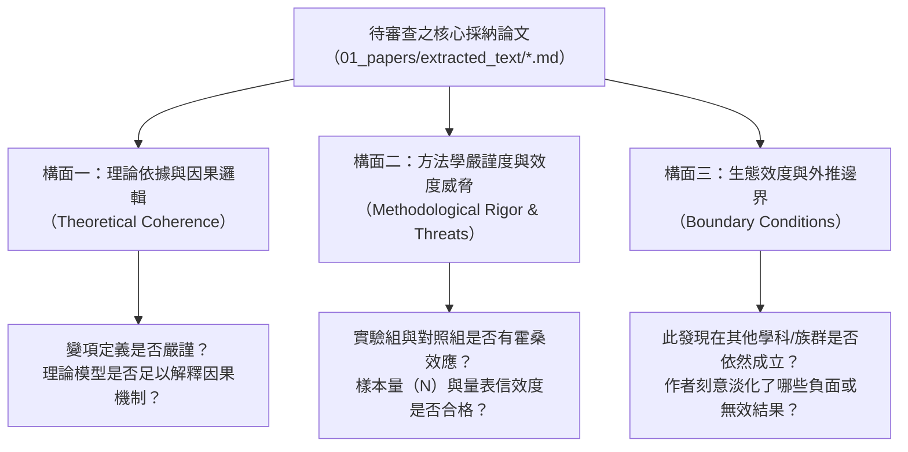
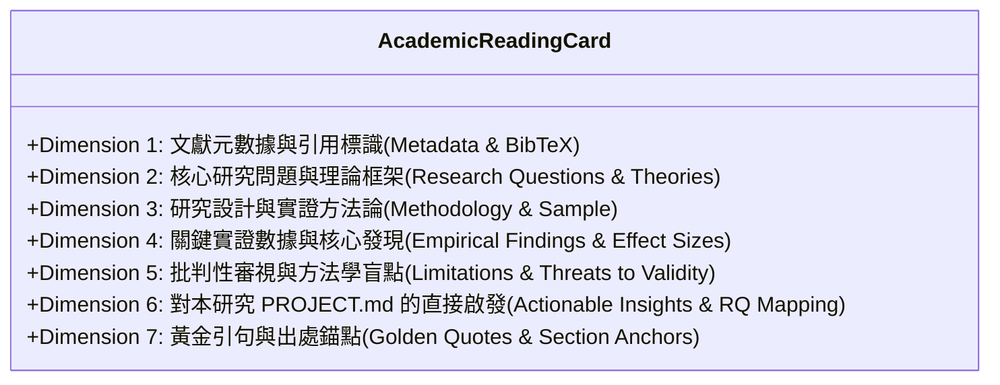

---
puppeteer:
  displayHeaderFooter: true
  headerTemplate: '<div style="font-size: 14px; margin: 0 auto;">第六章：單篇批判精讀與標準閱讀卡片化：學術知識的晶體化</div>'
  footerTemplate: '<div style="font-size: 14px; margin: 0 auto;">第 <span class="pageNumber"></span> 頁 / 共 <span class="totalPages"></span> 頁</div>'
  margin:
    top: "1.5cm"
    bottom: "1.5cm"
    left: "1.5cm"
    right: "1.5cm"
---
<style>
  /* 全域字型大小放大為 1.4 倍（預設 16px * 1.4 = 22.4px） */
  html, body, .mume, .markdown-preview {
    font-size: 22.4px !important;
    line-height: 1.6 !important;
  }
  /* 標題分頁控制 */
  h2 {
    page-break-before: always;
  }
  /* 表格與程式碼區塊維持等比例適配 */
  table {
    font-size: 0.9em !important;
  }
  pre, code {
    font-size: 0.88em !important;
  }
</style>
---

# 第六章：單篇批判精讀與標準閱讀卡片化：學術知識的晶體化

## 課程導讀

在第五週的課堂中，我們成功建立起本地 RAG 檢索系統，讓 AI Agent 具備了毫秒級翻閱本機 Markdown 論文、提取具體章節與精準定位事實的強大能力。然而，在學術研究的真實征途上，單純具備「檢索零碎段落的能力」，並不足以支撐起一篇具備深度洞察的碩士論文或期刊論文。

幾乎每一位碩士研究生在文獻探討的初期，都會陷入一種典型的**「文獻消化不良症候群」**：
- 電腦硬碟裡下載了上百篇 PDF，資料夾被塞得滿滿噹噹；
- 每一篇論文都用螢光筆畫得密密麻麻，甚至逐字翻譯或寫下了幾千字的零散摘要；
- **但當坐在螢幕前要撰寫第二章文獻探討時，腦袋卻一片空白，無法將讀過的文獻轉化為自己論文的有力論據。**

這種現象的根源在於：大部分學生在閱讀學術論文時，採用的是**「被動且非晶體化」**的閱讀方式。他們把文獻當成小說或教科書來讀，只滿足於了解「這篇論文說了什麼」，卻從未對論文進行嚴謹的「批判性解剖」；更糟糕的是，閱讀的收穫隨手記錄在零散的筆記軟體或紙本上，隨著時間推移而迅速蒸發。

為了解決這項痛點，本週我們將導入現代知識管理學中最具威力的範式——**學術知識晶體化（Academic Knowledge Crystallization）**與**原子閱讀卡片（Atomic Reading Cards）**。

貫穿本章的精讀哲學是：

> **讀論文不是為了替原作者背書，而是為了在自己的研究大廈中找到一塊合適的基石；優秀的研究者絕不作平鋪直敘的摘錄者，而作手持顯微鏡的對抗性審稿人。**

在本週的課堂中，我們將學習如何超越傳統摘要，對論文的研究設計與效度威脅展開深度質疑；我們將正式定義涵蓋七大核心構面的**標準學術閱讀卡片（Schema）**，並引導 Agent 讀取根目錄的 `PROJECT.md`，將單篇論文的精華與我們自己的核心研究問題（RQ1-RQ3）建立緊密的共振連結，妥善儲存於 `02_notes/cards/` 目錄中，為第七週的跨篇文獻矩陣共構打下堅不可摧的單元基石！

---

## 第一節：學術批判精讀（Critical Reading）的思維典範

### 1.1 從「被動摘要（Summarizing）」到「審訊式閱讀（Interrogative Reading）」

在大學部階段，學生閱讀文獻的目標通常是「吸收已知知識」；但在碩士乃至博士研究階段，文獻閱讀的目標發生了本質上的典範轉移——**「檢驗與重構知識」**。

下表清晰對比了初學者與資深研究者在文獻閱讀思維上的鴻溝：

| 評估構面 | 初學者的被動摘要模式（Passive Summary） | 學術專用的批判精讀模式（Critical Reading） |
| :--- | :--- | :--- |
| **心理定位** | 仰望權威：把論文結論當作不可動搖的客觀真理 | 平等對話：將論文視為原作者的一場學術「辯護論證」 |
| **閱讀問題** | 「這篇論文的作者說了什麼？主要結論是什麼？」 | 「作者的結論是如何被推導出來的？背後藏有哪些沒說的假設？」 |
| **對數據態度** | 照單全收：只看摘要寫的顯著性（p < .05）與正面效果 | 穿透檢視：檢查對照組條件、樣本代表性、流失率與測量誤差 |
| **對限制態度** | 忽略不看：通常直接略過論文最後的 Limitations 章節 | 視為珍寶：研究限制正是孕育自己論文研究空白（Research Gap）的沃土 |
| **筆記成果** | 冗長的摘抄筆記，充斥著作者的原始文句，難以重用 | 高度模組化的原子卡片，提煉出對自己研究的具體借鑑與批判啟發 |

批判性閱讀並不是為了「挑刺」或「為反對而反對」，而是為了**探求知識成立的邊界（Boundary Conditions）**。在教育科技、管理科學或資訊傳播學中，任何一項教學介入或系統工具，都絕不可能在所有情境下都一體適用。只有看清前人研究是在什麼特定的脈絡、特定的樣本與特定限制下才成立，我們才能在自己的論文中找到真正的立足點。

### 1.2 批判解剖的三大核心構面

當我們精讀一篇實證研究論文時，必須引導 Agent 共同手持手術刀，聚焦於以下三大構面進行深度解剖：



1. **構面一：理論依據與因果邏輯（Theoretical Coherence）**
   - 論文引用的理論（如認知負荷理論、自我決定論、科技接受模型）是否真正支撐了其研究假設？
   - 自變項（如 AI 鷹架介入）與因變項（如學習成效、焦慮感）之間的因果機制是否清晰？是否存在未被測量的中介變項或干擾變項？
2. **構面二：方法學嚴謹度與效度威脅（Methodological Rigor & Threats to Validity）**
   - **內部效度（Internal Validity）：** 實驗組在使用 AI 工具時，是否有教師或研究者額外提供更多的技術指導？（這可能引發霍桑效應或評估者偏差）。
   - **工具效度（Construct Validity）：** 量表是否經過標準的探索性與驗證性因素分析（EFA/CFA）？Cronbach's $\alpha$ 係數是否充足？
   - **樣本限制（Sampling Bias）：** 樣本是否僅來自單一大學的特定資訊科系學生？樣本量（N）是否足以提供足夠的統計檢定力（Statistical Power）？
3. **構面三：生態效度與外推邊界（Ecological Validity & Boundary Conditions）**
   - 該研究成果能否推廣到非理工科系？能否推廣到全線上教學情境？
   - 原文作者在「研究限制（Limitations）」中承認了哪些不可逆的缺陷？有哪些未解之謎直接為我們留下了延伸研究的切入點？

### 1.3 人機協同：將 Agent 訓練為「對抗性審稿人（Adversarial Reviewer）」

許多同學使用 AI 輔助閱讀時，最常下的指令是：「請幫我總結這篇論文的重點。」
這樣做往往只會得到一份客氣、奉承且充斥公關語調的表面摘錄，AI 會將論文作者自誇的優點全盤接受。

在 Antigravity 2.0 中，最有效的提示策略是**要求 Agent 轉換人設，扮演國際頂級期刊（如 *Computers & Education*、*ETR&D*）的最嚴苛審稿人（Adversarial Reviewer）**。當我們要求 Agent 站在對立面挑剔論文漏洞時，Agent 會迅速啟動批判性思維，精準揪出論文中的統計疑點與論述破綻。

---

## 第二節：學術知識晶體化與原子閱讀卡片標準規範

### 2.1 為什麼需要「卡片化」：卡片盒筆記法（Zettelkasten）的學術落地

德國社會學巨擘尼克拉斯·魯曼（Niklas Luhmann）一生出版了 70 餘部學術專著、發表了 400 多篇高質量論文，其驚人生產力的核心秘密就在於**卡片盒筆記法（Zettelkasten）**。

在傳統線性筆記中，資訊像是一本越寫越厚但無法翻閱的死帳簿；而「卡片化」的核心思想在於**原子化（Atomicity）**與**模組化（Modularity）**：
- **一文一卡（One Paper, One Card）：** 每一篇被採納（`[+]`）的關鍵文獻，都必須被提煉成一份獨立、自足、格式高度統一的 Markdown 檔案。
- **儲存目錄規範：** 工作區統一指定存放於 `02_notes/cards/` 目錄。
- **標準命名格式：**
  ```text
  card_{發表年份}_{第一作者英文姓氏}_{核心概念縮寫}.md
  ```
  例如：`card_2023_Chen_AI_Scaffolding.md`、`card_2024_Wang_Cognitive_Load.md`。
- **便於隨機重組：** 每一張卡片都是一顆晶體化的知識積木。到了第七週，我們可以讓 Agent 同時加載多張卡片，瞬間縱橫比對出跨篇文獻的學術空白！

### 2.2 七維標準學術卡片結構（Schema）深度解析

一份兼具嚴謹學術深度與實踐指導價值的「標準文獻閱讀卡片」，必須包含以下七大不可或缺的標準構面（7-Dimension Schema）：



各構面的核心內涵與填寫標準如下：

1. **第一維度：文獻元數據與引用標識（Metadata & Citation Key）**
   - 記錄標準 BibTeX Key、完整篇名、所有作者群、發表年份、刊名或研討會名稱、DOI 與工作區原始 Markdown 相對路徑。
2. **第二維度：核心研究問題與理論框架（Research Questions & Theoretical Lens）**
   - 提取原作者試圖解答的具體研究問題（RQ）。
   - 標明支撐該研究的核心理論模型（如 Self-Regulated Learning Theory, Cognitive Load Theory）。
3. **第三維度：研究設計與實證方法論（Methodology, Sample, Context, Instruments）**
   - **研究方法：** 準實驗設計、質性個案研究、問卷調查法或混合研究。
   - **研究對象與樣本量：** 具體樣本數（N）、性別比例、年齡、修課背景。
   - **研究情境：** 介入時間長度（如 8 週）、施測環境（實體課堂或線上）。
   - **測量工具：** 具體使用的量表全稱、施測時機與統計信效度。
4. **第四維度：關鍵實證數據與核心發現（Empirical Findings & Key Evidence）**
   - **拒絕空洞結論：** 嚴禁只寫「兩組有顯著差異」，必須記錄具體統計指標（如 $F(1, 84) = 6.42, p = .013, \eta_p^2 = .07$）。
   - 若為質性研究，則提煉核心編碼主題（Themes）與關鍵發現。
5. **第五維度：批判性審視與方法學盲點（Critical Limitations & Vulnerabilities）**
   - 記錄作者在文中承認的研究限制。
   - **研究者自己的批判觀點：** 指出其方法學缺陷（如未設延宕後測、缺乏質性訪談佐證、存在樣本自願參與偏差等）。
6. **第六維度：對本研究（`PROJECT.md`）的直接啟發與映射（Actionable Insights for My Thesis）**
   - **整張卡片的靈魂所在！**
   - 具體回答：這篇論文對我們在 `PROJECT.md` 中界定的 RQ1、RQ2 或 RQ3 有何啟發？
   - 我們可以借用其什麼量表？如何避免其犯過的方法學錯誤？我們的研究可以在其結論上推進哪一步？
7. **第七維度：黃金引句與出處錨點（Golden Quotes with Section Anchors）**
   - 精選 2 至 3 句最具學術張力、最適合未來直接引用在論文第二章的英文原文金句，並精確標註所屬章節標題。

---

## 第三節：驅動 Agent 產出標準閱讀卡片：提示詞鷹架與實戰操作

### 3.1 結構化卡片生成提示詞模組（Prompt Template）

為了確保 Agent 產出的文獻卡片嚴格符合七維標準，我們將提示詞固化為標準化的工程模板。研究者在對話視窗中只需指明論文檔名，Agent 即可自動調用本機工具並完成深度批判提煉：

```markdown
【學術知識晶體化：七維文獻卡片生成指令】

你現在是一位受過世界頂級學術訓練的審稿專家與文獻分析顧問。請為本機工作區中的以下論文建立一份高標準的【原子閱讀卡片】：

- 論文 Markdown 檔案：`01_papers/extracted_text/{{指定論文檔名.md}}`
- 輸出卡片目標檔案：`02_notes/cards/card_{{年份}}_{{第一作者}}_{{概念}}.md`

### 執行指引與紀律：
1. **讀取全貌與檢索：** 請先完整讀取該論文的 Markdown 內容；若有統計或細節疑義，可調用 `search_paper_chunks` 驗證。
2. **連動專案規格：** 請務必主動讀取根目錄下的 `PROJECT.md`，理解我當前的研究主題與核心研究問題（RQ1-RQ3），並在【第六維度】中進行深度的具體映射。
3. **拒絕客套讚美：** 在【第五維度】中，必須以嚴苛的學術標準剖析其方法學盲點與未解問題。
4. **輸出格式：** 必須嚴格遵照【七維標準學術卡片範本】之結構，包含完整 Frontmatter 元數據與清晰 Markdown 標題。
```

### 3.2 實作範例演練：一份完整的生產級文獻閱讀卡片

以下展示一份完全符合規範、可直接作為典範的真實閱讀卡片範例：

```markdown
---
type: literature_card
card_version: 1.0
bibtex_key: chen2023scaffolding
title: "Scaffolding Complex Academic Writing with Generative AI Agents: An Empirical Study in Graduate Education"
first_author: "Chen, Mei-Ling"
year: 2023
journal: "Computers & Education"
doi: "10.1016/j.compedu.2023.104800"
source_md: "01_papers/extracted_text/2023_Chen_Scaffolding_GenAI_in_Higher_Ed.md"
tags: [AI_Agents, Scaffolding, Cognitive_Load, Graduate_Writing, Higher_Ed]
created_date: 2026-09-28
---

# 文獻卡片：Chen (2023) - AI 代理人鷹架輔助研究生學術寫作實證研究

## 1. 文獻元數據與引用標識 (Metadata)
- **標準引用 (APA 7th)：** Chen, M.-L., & Roberts, D. (2023). Scaffolding complex academic writing with generative AI agents: An empirical study in graduate education. *Computers & Education*, 198, 104800. https://doi.org/10.1016/j.compedu.2023.104800
- **研究領域：** 教育科技 / 人工智慧教育應用 / 高等教育教學實踐 (SoTL)
- **原始文件路徑：** `01_papers/extracted_text/2023_Chen_Scaffolding_GenAI_in_Higher_Ed.md`

## 2. 核心研究問題與理論框架 (RQs & Theoretical Lens)
- **核心研究問題：**
  1. 導入具備反思機制的 AI Agent 鷹架，對碩士生在撰寫文獻探討時的外在認知負荷（Extraneous Cognitive Load）有何影響？
  2. 學生在人機協作過程中的自我調節學習（SRL）策略如何演變？
- **支撐理論框架：**
  - Sweller 的認知負荷理論（Cognitive Load Theory, CLT）：特別聚焦於如何降低「外在認知負荷」，釋放資源以進行「相關認知負荷（Germane Load）」。
  - Zimmerman 的自我調節學習模型（Self-Regulated Learning, SRL）。

## 3. 研究設計與實證方法論 (Methodology & Context)
- **研究方法：** 混合研究設計（混合準實驗與質性反思日誌分析）。
- **研究樣本與情境：**
  - 台灣某國立大學碩士班研究生共 64 名（教育與社會科學領域），進行為期 10 週的教學介入。
  - **實驗組 (N=32)：** 使用結構化 AI Agent 輔助文獻檢索與架構梳理。
  - **對照組 (N=32)：** 使用一般商用搜尋引擎與未受提示約束的 ChatGPT 進行文獻收集。
- **測量工具：**
  - Paas & Van Merriënboer (1994) 9 點心理努力量表（施測於每週作業提交後）。
  - 文獻探討成果盲審評分規準（Rubric，滿分 50 分，由兩位資深審稿人盲審，Kappa = .86）。

## 4. 關鍵實證數據與核心發現 (Empirical Findings)
- **量化統計結論：**
  - **外在認知負荷顯著降低：** 實驗組的外在認知負荷平均得分 ($M = 3.42, SD = 0.81$) 顯著低於對照組 ($M = 5.86, SD = 1.05$)，單因子共變數分析顯示達極顯著水準：$F(1, 61) = 14.82, p < .001, \eta_p^2 = .195$（達大效果量）。
  - **文獻綜整品質顯著提升：** 實驗組在「概念批判與整合」維度的評分顯著高於對照組 ($t(62) = 3.45, p = .001$)。
- **質性發現：**
  - 對照組學生在反思日記中頻繁表達「被海量文獻淹沒」與「無法驗證 AI 假引用」的高度焦慮感；實驗組則將焦點轉移至「如何向 Agent 提出更尖銳的提問」。

## 5. 批判性審視與方法學盲點 (Critical Limitations)
- **作者承認之限制：** 介入時間僅 10 週，且樣本僅限於單一人文社科院所，缺乏跨理工學科的外推驗證。
- **審查者獨立批判（我的觀點）：**
  1. **忽視長期依賴性：** 該研究未設計「撤除 AI 鷹架後的延宕後測（Delayed Post-test）」，無法證明學生的批判思考能力是真正內化，抑或只是對該 Agent 產生了認知依賴。
  2. **實驗組額外指導偏差：** 實驗組在介入前接受了 2 小時的提示詞培訓，而對照組未獲得同等時數的常規寫作指導，可能存在指導時間不等造成的內部效度威脅。

## 6. 對本研究 PROJECT.md 的直接啟發 (Actionable Insights)
- **對 RQ1（教學設計與鷹架）的啟發：**
  - 可直接借鑑 Chen (2023) 的 10 週進度節奏，將文獻探討拆分為「概念發散、篩選驗證、批判矩陣」三階段，並將此流程寫入我們課程的課堂引導講義中。
- **對 RQ2（認知負荷與日誌分析）的啟發：**
  - Chen 使用的 Paas 心理努力量表設計簡短（僅單一題目），非常適合放入我們工作區的 `04_research_data/diaries/` 每週反思問卷中，不造成學生額外填寫負擔。
- **本研究可推進的空間（Research Gap）：**
  - Chen 的研究未探討「本機 RAG 向量檢索」與「MCP 工具鏈」的具體工程架構。我們的碩士論文可在此基礎上，進一步論證「具備本地檔案感知與 PRISMA 追蹤機制的 Agent」如何進一步降低學生的工具中斷焦慮！

## 7. 黃金引句與出處錨點 (Golden Quotes)
1. *"The primary bottleneck in graduate literature reviews is not the acquisition of information, but the cognitive exhaustion caused by unstructured information processing."*
   — Section 1. Introduction, p. 2.
2. *"When AI scaffolding transitions from open-ended chat to constraint-based task execution, students shift from passive consumers of generated text to active evaluators of synthesized evidence."*
   — Section 5. Discussion, p. 9.
```

---

## 第四節：課堂探索小活動與實作驗收

### 4.1 課堂實作小活動：親手晶體化你的第一篇採納論文

> **活動時間：** 20 分鐘
> **活動任務：** 挑選一篇在第二週或第三週採納（`[+]`）並已轉為 Markdown 的論文，驅動 Agent 產出第一張標準化原子閱讀卡片，並存入 `02_notes/cards/`。
>
> 1. **選定目標：** 查看 `01_papers/extracted_text/` 目錄，選定一篇與你個人碩士論文主題最相關的實證論文。
> 2. **發送晶體化指令：** 在 Antigravity 2.0 中輸入第三節提供的【七維文獻卡片生成指令】，指定該論文檔名與目標路徑（如 `02_notes/cards/card_2024_Wang_AI_Writing.md`）。
> 3. **人機協同審查：** 仔細檢查 Agent 生成的卡片內容，特別檢查：
>    - 第 4 維度的統計數據是否與原文完全一致？
>    - 第 5 維度是否抓出了具體的方法學盲點，而不是空泛讚美？
>    - 第 6 維度是否精準對接了你在 `PROJECT.md` 中界定的 RQ1、RQ2 或 RQ3？
> 4. **微調與確認：** 針對不足之處，在對話框中要求 Agent 修訂，確認無誤後將卡片儲存於 `02_notes/cards/`。

```text
老師的真心話：
在文獻探討的馬拉松中，最可怕的不是『讀得很慢』，而是『讀完假裝自己懂了，過兩個月全部忘光』。
每一篇認真製作的標準閱讀卡片，都是你在學術世界裡插下的一面旗幟。
當你累積了 10 張、15 張標準卡片時，你會發現一件神奇的事：
你對整個領域的理論流派、實驗方法與統計弱點，已經比絕大多數同儕掌握得深刻數十倍！
此時，文獻探討不再是一項苦差事，而是一場由你主導的學術拼圖遊戲！
```

---

## 本週小結與下週預告

在本週的第六講中，我們成功攻克了「文獻讀過就忘」的研究焦慮。我們實現了從「被動摘要」到「對抗性批判精讀」的思維躍遷，學會了從理論依據、方法學嚴謹度與外推邊界三大構面解剖論文；我們定義了兼具引用元數據、實證數據、批判盲點與專案啟發的**七維標準閱讀卡片（Schema）**，並成功建立了專屬的卡片資產庫 `02_notes/cards/`。

然而，單張卡片即使再精緻，依然只是散落的知識孤島。在學位論文的正式文獻探討（Chapter 2）中，教授最反感的就是「一段介紹 A 論文、下一段介紹 B 論文」的報流水帳（Annotated Bibliography）寫法。學術界真正看重的是**「跨篇文獻的綜整（Synthesis）與學術空白（Research Gap）的精確定位」**。

在下一週（第七講）的課程中，我們將迎來文獻探討的高潮章節——**《跨篇文獻矩陣共構與學術空白（Research Gap）鎖定》**。我們將學習如何調度所有累積的原子卡片，繪製橫跨多篇文獻的二維比較矩陣，辨識學者之間的理論共識與激烈爭端，並用最犀利的學術語言提煉出你個人碩士論文獨一無二的「學術空白陳述（Gap Statement）」，為你的開題計畫書立下堅不可摧的合法性防線！
