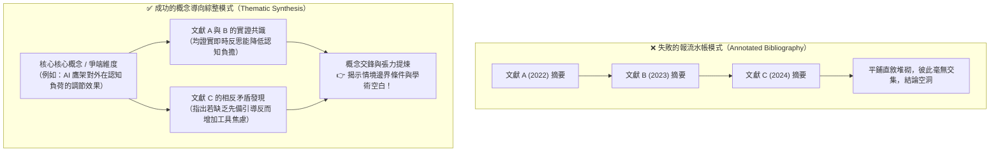
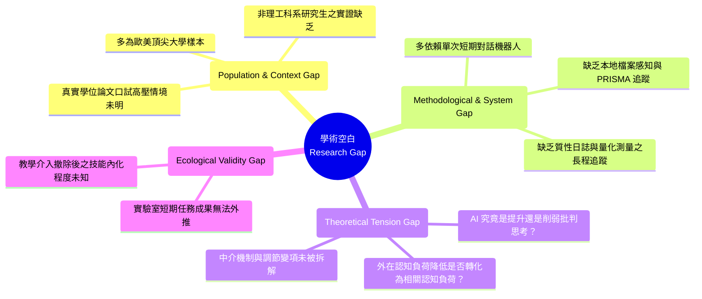

---
puppeteer:
  displayHeaderFooter: true
  headerTemplate: '<div style="font-size: 14px; margin: 0 auto;">第七章：跨篇文獻矩陣共構與學術空白（Research Gap）鎖定</div>'
  footerTemplate: '<div style="font-size: 14px; margin: 0 auto;">第 <span class="pageNumber"></span> 頁 / 共 <span class="totalPages"></span> 頁</div>'
  margin:
    top: "1.5cm"
    bottom: "1.5cm"
    left: "1.5cm"
    right: "1.5cm"
---
<style>
  /* 全域字型大小放大為 1.4 倍（預設 16px * 1.4 = 22.4px） */
  html, body, .mume, .markdown-preview {
    font-size: 22.4px !important;
    line-height: 1.6 !important;
  }
  /* 標題分頁控制 */
  h2 {
    page-break-before: always;
  }
  /* 表格與程式碼區塊維持等比例適配 */
  table {
    font-size: 0.9em !important;
  }
  pre, code {
    font-size: 0.88em !important;
  }
</style>
---

# 第七章：跨篇文獻矩陣共構與學術空白（Research Gap）鎖定

## 課程導讀

在第六週的課堂中，我們完成了「學術知識晶體化」的精實訓練。透過對抗性批判精讀，我們將散落在 `01_papers/` 中的厚重文獻，逐一解剖並淬鍊為一張張標準化的原子閱讀卡片，整齊歸檔於 `02_notes/cards/` 目錄中。

此時，我們手中已經擁有了一批高品質的「知識晶體」。然而，當我們準備動筆撰寫碩士學位論文的**第二章「文獻探討（Literature Review）」**時，幾乎所有初學者都會面臨整個學術生涯中最致命的一堵高牆：

> **「我的每一張卡片都寫得很好，但當要把十幾篇論文寫成一個章節時，為什麼看起來就像一份枯燥乏味的摘要清單？」**

在各大學的學位計畫書口試與學位論文答辯中，口試委員對第二章最常見、也最嚴厲的批評往往是：**「你這不是文獻探討，這只是在報流水帳（Annotated Bibliography）！」**
學生常寫成：「學者 A (2022) 做了什麼實驗，得出 X 結論；學者 B (2023) 調查了什麼樣本，得出 Y 結論；學者 C (2024) 則指出了 Z 理論……」整章讀下來，只看到前人成果的碎片化堆砌，完全看不到研究生自己的獨立思維，更無法解答那個最關鍵的問題：**「既然前人已經做了這麼多研究，那為什麼學術界還需要你這篇論文？」**

貫穿本週實戰教學的核心法則為：

> **文獻探討不是前人成就的陳列館，而是一場由你擔任主席的學術辯論圓桌會議；找不出真正的學術空白（Research Gap），你的研究題目就失去了存在的合法性。**

在本週的第七講中，我們將學習如何從「單篇卡片」躍升至「跨篇概念網絡」；我們將設計並產出結構化的**二維文獻比較矩陣（Literature Comparison Matrix）**，儲存於 `02_notes/literature_matrix.md`；接著，我們將深入剖析四種經典的**學術空白（Research Gap）**型態，掌握公式化的學術命題語言，並訓練 Agent 化身為最刁鑽的學位口試委員對你的立論進行極限壓力測試，為你的碩士論文開題立下堅不可摧的學術立足點！

---

## 第一節：文獻綜整（Synthesis）與概念導向架構

### 1.1 報流水帳（Summary List） vs. 概念導向綜整（Thematic Synthesis）

在學術寫作中，「摘要（Summary）」與「綜整（Synthesis）」有著本質上的層次差異。



下表透過真實論文寫作的情境對照，展示兩者在思維與文字上的巨大差距：

| 評估維度 | 報流水帳模式（低階被動） | 概念導向綜整模式（高階批判） |
| :--- | :--- | :--- |
| **章節組織** | 以「文獻/作者」為小節標題（如 2.1 Chen 的研究；2.2 Wang 的研究） | 以「核心概念/變項/爭端」為標題（如 2.1 智慧代理人對認知負荷之雙向調節機制） |
| **段落開頭** | `Chen et al. (2023) investigated... Next, Wang (2024) found that...` | `While prior literature broadly confirms that... (Chen, 2023; Lee, 2024), substantial divergence emerges regarding... (Wang, 2024).` |
| **論述焦點** | 聚焦於個別論文的實驗步驟與細節描述 | 聚焦於跨文獻之間的**理論異同**、**變項關係**與**方法學矛盾** |
| **作者角色** | 旁觀者、秘書、打字員（替別人記錄功勞） | **圓桌會議主持人、法官、辯論裁決者**（引導各家學說相互對質） |
| **導向結果** | 無法推導出自己的研究動機，只能在結尾硬說「因此本研究很重要」 | 必然且自然地推導出**現有文獻尚未解決的矛盾或空白**，順理成章引出本研究的必要性 |

### 1.2 三種經典跨篇對話模式：共識、爭端與微差

當我們引導 Agent 調度 `02_notes/cards/` 中的多篇文獻時，應重點辨識並編織三種經典的跨篇對話模式：

1. **學術共識（Consensus）：**
   - 多位學者在不同時間、不同情境、採用不同方法，卻共同支持了某項核心假設。
   - *學術價值：* 作為你研究設計的「穩固底座」。例如：「大量實證研究一致指出，缺乏結構化引導的生成式 AI 對話，會顯著增加初學者的認知盲區（Chen, 2023; Roberts, 2024; Smith, 2022）。」
2. **學術爭端與矛盾（Contradiction & Tension）：**
   - 兩派學者研究相同的主題，卻得出了截然相反的結論。
   - *學術價值：* **這是挖掘 Research Gap 最肥沃的土壤！** 你必須深入追查：為什麼 Chen (2023) 發現 AI 能顯著提升論文品質，而 Wang (2024) 卻指出學生的批判思考能力下降？是因為介入時間長短不同？還是因為前者設計了強制反思暫停點，而後者任由學生自由生成？
3. **情境脈絡微差（Nuance & Boundary Conditions）：**
   - 理論在前人脈絡下成立，但在特定情境（如不同學科、不同年級、不同文化背景、全遠距環境）中效果發生衰減或質變。
   - *學術價值：* 為你的實證研究場域提供完美的理論正當性。

---

## 第二節：二維文獻比較矩陣（Literature Comparison Matrix）設計與建構

### 2.1 高維資訊的降維神器：二維文獻矩陣

要從 10 篇以上的論文中理出清晰的概念脈絡，光靠大腦記憶或上下翻閱檔案是極其不可靠的。我們必須將每一張原子卡片中的關鍵維度抽離出來，橫向鋪平在一個**二維文獻比較矩陣（Literature Comparison Matrix）**中。

在 Antigravity 2.0 架構中，該矩陣統一固化存放於工作區的 `02_notes/literature_matrix.md`。矩陣的標準縱橫維度設計如下：

| 篇名與作者 (Citation) | 理論框架 (Theoretical Framework) | 研究對象與情境 (Sample & Context) | 自變項 / 介入工具 (Independent Variable) | 因變項與測量工具 (Dependent Variables) | 關鍵實證結果 (Key Empirical Findings) | 批判盲點與限制 (Limitations & Gaps) |
| :--- | :--- | :--- | :--- | :--- | :--- | :--- |
| **Chen (2023)** | 認知負荷理論 (CLT)、自我調節學習 (SRL) | 碩士生 N=64，人文社會領域，10 週實體課程 | 自訂 AI Agent（具備反思提問鷹架） | 外在認知負荷 (Paas 9點量表)、文獻綜整盲審規準 | 外在認知負荷顯著降低 ($p < .001$)；綜整品質提升 ($p = .001$) | 未設計撤除 AI 後的延宕後測；未提供本機檔案索引 |
| **Wang et al. (2024)** | 科技接受模型 (TAM)、自我效能理論 | 大學部大三生 N=120，資工科系，單次 2 小時實驗 | 商用 ChatGPT 網頁版（無結構化提示約束） | 任務完成速度、科技焦慮感量表、批判提問次數 | 完成速度提升 40% ($p < .01$)；但深度批判提問次數顯著少於對照組 | 單次短時實驗缺乏生態效度；非真實論文寫作場域 |
| **Roberts (2024)** | 活動理論 (Activity Theory)、人機協同認知 | 碩士生 N=18，質性行動研究，整學期 16 週 | 提示詞範本庫 (Prompt Library) 與研究日誌 | 每週反思日誌質性編碼、深度半結構訪談 | 學生在第 4-6 週經歷嚴重的「工具幻覺幻滅期」；反思日誌能促進後設認知 | 缺乏量化對照組；提示詞手動複製搬運造成嚴重工具中斷 |
| **Lin & Davis (2025)** | 認知學徒制 (Cognitive Apprenticeship) | 博士生 N=30，生化醫學領域，文獻探討專題 | 商業文獻搜尋外掛（僅限搜尋與摘要提取） | 文獻檢索召回率、引用準確率、查證耗時 | 檢索時間縮短 60%；但無法有效排除非領域頂級期刊之掠奪性論文 | 依賴閉源商業資料庫；未整合人機協同審查決策管線 |

### 2.2 驅動 Agent 批量提煉文獻比較矩陣

在我們的 Antigravity 2.0 中，研究者無須手動搬運表格。我們可以驅動 Agent 批次遍歷 `02_notes/cards/` 目錄下的所有 `.md` 卡片檔案，自動提取各維度欄位，動態合成結構嚴整的比較矩陣：

```markdown
【驅動 Agent 生成文獻比較矩陣提示範本】

請檢視 `02_notes/cards/` 目錄下的所有文獻原子閱讀卡片（`card_*.md`）。

### 執行任務：
1. **遍歷提取：** 讀取每一張卡片的七大維度內容，特別提取其理論框架、樣本背景、介入工具、量化/質性發現以及研究限制。
2. **橫向對齊：** 將各篇文獻對齊至標準的【二維文獻比較矩陣】，包含：篇名與作者、理論基礎、樣本與情境、介入機制、評估指標與實證發現、主要研究限制。
3. **儲存成果：** 將產出的結構化 Markdown 矩陣寫入 `02_notes/literature_matrix.md`。
4. **綜整洞察提煉：** 在矩陣下方，撰寫一段 500 字的「跨篇文獻綜整分析」，明確指出：
   - 目前文獻在哪些結論上已達成高度共識？
   - 哪兩篇文獻之間存在實證結果或方法學上的明顯矛盾？
   - 現有文獻在「研究對象」、「技術介入模式」與「評估指標」上呈現出何種普遍性的盲點？
```

---

## 第三節：學術空白（Research Gap）的四種識別維度與命題化

### 3.1 什麼是真正的「學術空白（Research Gap）」？

當二維矩陣在我們眼前展開時，各家文獻的聚焦點與盲點便一覽無遺。這時，我們終於具備了鎖定**學術空白（Research Gap）**的客觀基礎。

許多研究生在開題報告時，最喜歡說的一句話是：「**因為過去很少有人研究過 X 對 Y 的影響，所以本研究具有創新性。**」
這在學術界被稱為**「偽空白（Spurious Gap）」**。教授通常會反問你：「過去沒有人做，會不會是因為這個問題根本毫無研究價值？或者過去早有人證明這是一條死胡同？」

真正的學術空白，是指**「現有文獻體系中存在著某個已顯露、但尚未被妥善解決的結構性矛盾或認知缺口」**。填補這個空白，能夠推進學界對該現象的理解深度，或為實踐領域帶來具體的解決方案。

### 3.2 四大經典學術空白型態

在社會科學、教育科技與人機互動領域，最經典且最具說服力的學術空白主要分為以下四種型態：



1. **型態一：族群與場域脈絡空白（Population & Context Gap）**
   - *現象：* 現有文獻多以「歐美大學的大學部資工系學生」為受試對象，任務多為「撰寫短篇英文摘要」。
   - *空白定位：* 針對「非英語母語的碩士研究生在面對正式學位論文（Master's Thesis）這種高壓、長週期、高度結構化的文獻探討」時，AI Agent 的介入歷程與認知轉變在現有文獻中仍鮮有實證研究。
2. **型態二：方法學與工具架構空白（Methodological & System Gap）**
   - *現象：* 過去研究採用的工具多為商用網頁對話框（如 ChatGPT 網頁版）或單向摘要生成器，缺乏對工作區實體檔案系統的感知與學術標準管理。
   - *空白定位：* 現有研究尚未探討「具備本地檔案感知（Workspace Awareness）、PRISMA 系統性審查追蹤機制與結構化文字工程之 AI Agent 管線」，對研究生文獻梳理品質之長程因果影響。
3. **型態三：理論衝突與機制未解空白（Theoretical Tension Gap）**
   - *現象：* 文獻 A 認為 AI 顯著降低了學生的認知負擔，文獻 B 卻發現 AI 生成的幻覺資訊大幅增加了學生的驗證焦慮與工具中斷感。
   - *空白定位：* 兩派研究呈現矛盾，其背後的核心機制——「AI 鷹架如何透過不同約束機制（如人機協同暫停點），將學生的外在負擔轉化為實質的批判性深度」——尚未建立清晰的理論解釋模型。
4. **型態四：生態效度與實踐轉化空白（Ecological Validity Gap）**
   - *現象：* 絕大多數實證研究僅為「2 小時一次性實驗室測試」，測驗完成即結束。
   - *空白定位：* 缺乏在真實研究生專題研討課堂中，橫跨整學期（16-18 週）從概念探索、論文精讀到初稿成型的動態行動研究歷程證據。

### 3.3 學術空白陳述句（Research Gap Statement）公式化寫作範式

一旦鎖定了你的空白型態，我們就可以使用國際頂級期刊通用的**「四步修辭轉折公式」**，撰寫出兼具學術說服力與邏輯張力的學術空白陳述句（Gap Statement）：

```text
【學術空白陳述句四步寫作公式】

第一步：肯定前人成就（Consensus Grounding）
"While substantial literature has demonstrated that... [引述文獻 A, B, C]"
（儘管既有文獻已普遍證實……）

第二步：指出致命局限或矛盾（The Critical "However" Pivot）
"However, prior studies predominantly focus on..., leaving the nuanced mechanism of... largely unexplored."
（然而，既有研究主要聚焦於……，使得……的深層機制仍未得到充分探索。）

第三步：闡明未解問題的潛在危害（Cost of Inaction）
"Consequently, the field lacks empirical evidence regarding how..., which hampers the development of effective..."
（其結果是，學術界仍缺乏關於……的實證證據，這阻礙了……的有效建構。）

第四步：確立本研究的填補價值（Bridging the Gap & Introducing RQs）
"To bridge this critical gap, this study investigates... specifically addressing RQ1, RQ2, and RQ3 in the context of..."
（為填補此一關鍵缺口，本研究旨在探討……，並在……脈絡下具體解答 RQ1、RQ2 與 RQ3。）
```

讓我們來看一段以本課程情境為例的精彩實例：

> **實例展示：**
> 「儘管既有文獻已普遍證實生成式 AI 有助於加速學術文字的起草與檢索（Chen, 2023; Roberts, 2024），**然而（However）**，既有實證研究絕大多數局限於短期實驗室任務或單向文字摘要，**仍鮮少有研究探討具備本機工作區感知、PRISMA 追蹤機制之自主代理人（AI Agent），在真實碩士論文文獻探討長程歷程中所發揮的漸進式引導效果**。其結果是，教育現場對於研究生在面對 AI 幻覺時的後設認知轉變與認知負荷動態歷程仍缺乏細緻理解。**為填補此一關鍵學術空白（To bridge this critical gap）**，本研究以碩士班學位論文文獻探討教學為場域，透過行動研究與每週反思日誌，深入探究以 AI Agent 為核心的鷹架引導架構對研究生認知轉變與研究瓶頸的實證影響。」

### 3.4 人機對抗性壓力測試：讓 Agent 扮演嚴苛口試委員

在將 Research Gap 寫入正式計畫書前，最關鍵的品質把關步驟，就是讓 Agent 扮演最具攻擊性的學位口試委員，對你的空白陳述進行嚴格的「對抗性壓力測試」：

```markdown
【學術空白極限壓力測試指令】

我已經起草了我的碩士論文研究空白陳述（Research Gap Statement）如下：
「{{貼上你的 Gap Statement}}」

請你現在脫下熱情顧問的人設，轉換為【國際頂級期刊副主編兼最嚴厲的學位口試委員】。請毫不留情地對我的這段立論進行壓力測試，並從以下三個角度向我提出最刁鑽的質疑：
1. **真偽性檢驗：** 我的這個 Gap 是否只是無關緊要的「為了做而做（Trivial Gap）」？如果根本沒人關心這個問題，你要如何反駁我？
2. **文獻反擊：** 依據工作區 `02_notes/literature_matrix.md` 中的文獻，是否有任何一篇論文的結論已經部分解答了我的問題，讓我宣稱的 Gap 不攻自破？
3. **可操作性挑戰：** 以一個碩士生僅有的一學期時間與資源，我的研究設計真的有能力填補這個龐大的 Gap 嗎？

請直接列出你的三大嚴厲質詢，並在我逐一回答後，再協助我修訂出邏輯更堅不可摧的終極版本！
```

---

## 第四節：課堂探索小活動與實作驗收

### 4.1 課堂實作小活動：共構文獻矩陣並起草個人 Research Gap

> **活動時間：** 20 分鐘
> **活動任務：** 驅動 Agent 為工作區的所有卡片生成 `02_notes/literature_matrix.md`，並起草一段個人論文專屬的 Research Gap Statement。
>
> 1. **矩陣共構：** 在對話框中發送第二節的指令，要求 Agent 讀取 `02_notes/cards/*.md`，將比對結果儲存為 `02_notes/literature_matrix.md`。
> 2. **審視盲點：** 打開產出的矩陣 Markdown 檔案，橫向觀察所有文獻在「研究對象」或「研究限制」欄位中，是否呈現出某種共同的空白。
> 3. **起草陳述句：** 運用第三節的「四步修辭轉折公式」，在對話框中寫下一段 200 字以內的個人論文 Research Gap Statement，並精確連結至根目錄 `PROJECT.md` 中的 RQ1、RQ2 或 RQ3。
> 4. **發動壓力測試：** 發送 3.4 節的壓力測試指令，認真回答 Agent 口試委員的質疑，體會學術答辯的真實張力！

```text
老師的真心話：
在學術界，平庸的研究者總是在『證明別人已經知道的事』，
而優秀的研究者則是在『照亮前人留下的盲區』。
當你能夠在口試委員會面前，氣定神閒地打開二維文獻矩陣，
指著上面十篇文獻的限制欄，清清楚楚地說出：
『委員好，Chen (2023) 止步於 X，Wang (2024) 矛盾於 Y，而本研究正是為了解決 Z 而生！』
那一刻，你就不再是一個等待被考核的學生，而是一個真正走進學術對話核心的獨立研究學者！
```

---

## 本週小結與後續章節展望

在本週的第七講中，我們跨越了從「個別文獻精讀」邁向「跨篇概念綜整」的最關鍵里程碑。我們徹底告別了低階的報流水帳摘要，建立了以概念為核心的跨篇對話思維；我們打造了結構化的高維降維工具——**二維文獻比較矩陣（`02_notes/literature_matrix.md`）**；我們精準掌握了四大經典學術空白型態，學會了頂級期刊通用的四步轉折陳述公式，並透過 Agent 的對抗性壓力測試，為自己的碩士論文鑄造了無可撼動的立論盾牌！

截至本週，我們的文獻探討基礎工程已全數構建完畢：
- 🔍 **第一至二週：** 環境架構與 API 檢索審查管線（`PROJECT.md` / `candidate_papers_XX.md`）
- 📥 **第三至四週：** 外部文獻治理與文字工程清洗（`inbox/` / `pymupdf4llm`）
- 🧠 **第五至七週：** 本機 RAG 向量事實錨定、原子卡片晶體化與跨篇學術空白鎖定（`vector_index.json` / `cards/` / `literature_matrix.md`）

在接下來的課程中，我們將正式挺進正式論文草稿（`03_drafts/`）的生成階段！我們將運用所有沉澱在 `02_notes/` 中的矩陣與卡片資產，引導 Agent 撰寫具備高度學術批判力、符合 APA 7th 規範且嚴格錨定真實事實的**第二章文獻探討正式章節草稿**，帶領同學們從容迎戰 11 月的碩士論文計畫書口試！
