---
puppeteer:
  displayHeaderFooter: true
  headerTemplate: '
第二章：深度學習架構：從神經元到 Transformer 演進
'
  footerTemplate: '
第  頁 / 共  頁
'
  margin:
    top: "1.5cm"
    bottom: "1.5cm"
    left: "1.5cm"
    right: "1.5cm"
---

---

# 第二章：深度學習架構：從神經元到 Transformer 演進

## 課程導讀

在上一章的情感分析實驗中，我們回顧了人工智慧如何從規則導向（Rule-based Systems）跨越到統計機器學習（Machine Learning），並初步見識了 Transformer 注意力機制在處理語境轉折時的強大能力。

本章我們將進一步深入神經網路的底層世界。回顧深度學習（Deep Learning，DL）的發展歷程，本質上是一部**「克服資料維度與物理記憶限制」的工程進化史**。每當現有的神經網路架構在處理特定型態的資料（例如高維度空間幾何、長距離時間序列）遭遇瓶頸時，計算機科學界便會提出全新的拓撲結構與運算機制來突破限制。

貫穿本章的核心演進邏輯如下：

> **每一種神經網路架構的誕生，都是為了解決前一代架構在處理「空間」或「時間（順序）」維度上的無能為力。**

本章將依序解構五代核心神經網路架構——**多層感知機（MLP）**、**卷積神經網路（CNN）**、**循環神經網路（RNN）**、**長短期記憶模型（LSTM）** 與 **Transformer**，帶領讀者透徹理解各架構的數學原理、工程極限與實務選型策略。

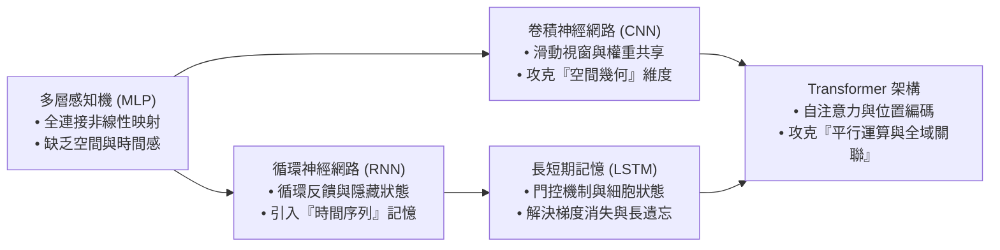

---

## 第一節：神經網路的起點：多層感知機（MLP）與非線性邊界

### 1.1 人工神經元與感知機模型

深度學習的基礎積木是**人工神經元（Artificial Neuron）**。受到生物大腦神經元傳遞電訊號的啟發，科學家在 1950 年代提出了感知機（Perceptron）數學模型。

一個標準的人工神經元包含三個核心運算步驟：
1. **加權求和（Weighted Sum）：** 將輸入訊號向量 $\mathbf{x} = [x_1, x_2, \dots, x_n]^T$ 與權重向量 $\mathbf{w} = [w_1, w_2, \dots, w_n]^T$ 進行內積運算，並加上偏置項（Bias，標記為 $b$），得到線性組合值 $z$：
   \[
   z = \sum_{i=1}^{n} w_i x_i + b = \mathbf{w}^T \mathbf{x} + b
   \]
2. **激活轉換（Activation）：** 將線性組合值 $z$ 傳入非線性激活函數 $f(z)$，模擬生物神經元在電位超過閾值時的「興奮發射（Firing）」現象。
3. **輸出訊號（Output）：** 輸出計算後的數值 $y = f(z)$，作為最終預測或傳遞給下一層神經元。

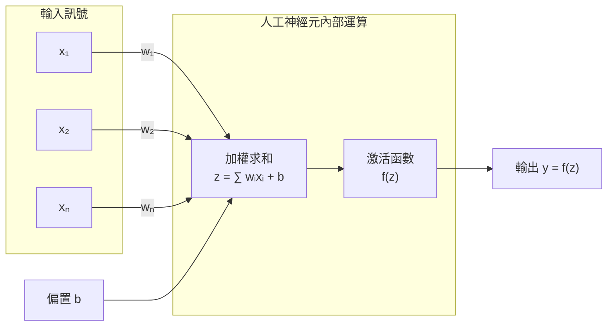

### 1.2 多層感知機（Multi-Layer Perceptron，MLP）

單一神經元只能繪製出一條線性分界線，無法解決如同「互斥或（XOR）」等非線性問題。為了學習複雜的資料分佈，研究者將大量神經元分層排列並彼此連結，形成了**多層感知機（Multi-Layer Perceptron，MLP）**，亦常被稱為**全連接神經網路（Fully Connected Neural Network，FCNN）**。

MLP 的標準架構包含三種層級：
- **輸入層（Input Layer）：** 負責接收原始特徵數據（如年齡、溫度、表格數值）。
- **隱藏層（Hidden Layers）：** 位於輸入與輸出之間的一層或多層神經元，負責逐層萃取資料特徵。
- **輸出層（Output Layer）：** 輸出最終的分類類別機率或迴歸預測數值。

在全連接架構下，前一層的「每一個」神經元，都會與後一層的「所有」神經元建立連結權重。

### 1.3 激活函數的關鍵角色：打破線性堆疊的死穴

初學者常問：「既然一層神經元不夠強大，那我們只要疊加 100 層全連接層，網路不就能學會世界上所有的複雜規律了嗎？」

答案是**「否定的」**——前提是如果沒有加入非線性激活函數。

#### 線性堆疊的數學坍塌：
假設我們堆疊了兩層沒有激活函數的純線性神經網路：
- 第一層輸出：$h = W_1 x + b_1$
- 第二層輸出：$y = W_2 h + b_2$

將第一層代入第二層可得：
\[
y = W_2 (W_1 x + b_1) + b_2 = (W_2 W_1) x + (W_2 b_1 + b_2) = W' x + b'
\]
數學上，兩個矩陣相乘 $W' = W_2 W_1$ 依然只是一個線性矩陣，多個偏置相加 $b' = W_2 b_1 + b_2$ 依然只是一個線性常數。這意味著：**無論你堆疊了多少層線性神經元，整個網路在數學上完全等價於單一線性方程式，其決策邊界永遠是一條死板的直線或超平面。**

因此，必須在每一層神經元後方加入**非線性激活函數（Non-linear Activation Function）**：
- **線性整流單元（Rectified Linear Unit，ReLU）：** 公式為 $f(z) = \max(0, z)$。計算極其快速，能有效抑制深層網路訓練時的梯度衰退，是當代深度學習最主流的激活函數。
- **S 型函數（Sigmoid）：** 公式為 $\sigma(z) = \frac{1}{1 + e^{-z}}$，將輸出壓縮至 $(0, 1)$ 區間，常用於二元分類的輸出層。
- **雙曲正切函數（Tanh）：** 公式為 $\tanh(z) = \frac{e^z - e^{-z}}{e^z + e^{-z}}$，輸出均值為 0，區間落於 $(-1, 1)$。

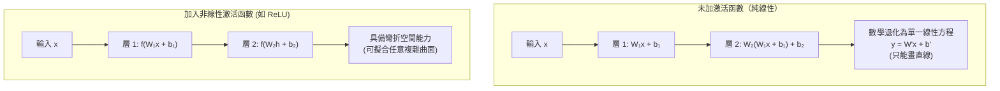

### 1.4 多層感知機的工程限制

雖然 MLP 具備強大的非線性擬合能力（通用近似定理，Universal Approximation Theorem），但在面對真實世界的複雜感知任務時，MLP 遭遇了兩大無法逾越的物理限制：

1. **參數爆炸（Parameter Explosion）：**
   若輸入一張 $1000 \times 1000$ 像素的彩色圖片，輸入向量維度高達 $1000 \times 1000 \times 3 = 3,000,000$。若第一個隱藏層配置 1000 個神經元，僅第一層的權重參數就高達 $300\text{萬} \times 1000 = 30\text{億}$ 個。如此龐大的參數量會迅速耗盡 GPU 記憶體，且極易引發嚴重的過擬合（Overfitting）。
2. **缺乏空間與時間維度感知：**
   MLP 假定每個輸入維度都是平權且相互獨立的。如果我們把一張貓咪照片的所有像素順序隨機打散，或者把一句話中單字的順序全部顛倒，只要訓練與測試時使用相同的打亂排列，MLP 的計算公式與數值結果將完全沒有差別。MLP 根本無法理解「相鄰像素構成了貓耳朵」或「前一個單字修飾後一個名詞」的空間與時序結構。

---

### 1.5 課堂實作活動：TensorFlow Playground 視覺化分類實驗

請各位同學打開瀏覽器，進入 TensorFlow Playground 官方教學平台（[playground.tensorflow.org](https://playground.tensorflow.org)），透過互動式界面親眼觀察神經網路如何學習非線性邊界。

#### 實驗環境配置：
- **DATA（資料集）：** 選擇右上角的「螺旋形（Spiral）」（此為非線性特徵最強的雙色資料集）。
- **FEATURES（特徵輸入）：** 僅勾選最原始的二維座標特徵 $X_1$ 與 $X_2$。
- **LEARNING RATE（學習率）：** 設定為 `0.03`。

#### 實驗步驟與任務：
1. **任務 A（線性極限測試）：**
   - 將 **ACTIVATION（激活函數）** 設定為 **Linear**。
   - 在 **HIDDEN LAYERS（隱藏層）** 建立 2 層，每層配置 4 個神經元。
   - 點擊左上角「開始訓練」按鈕，讓網路運行 500 個世代（Epochs）。
   - **觀察：** 畫面右側的分類背景是否永遠只能呈現一條單調的直線，完全無法將兩種顏色的螺旋資料切分開來？
2. **任務 B（非線性曲面擬合測試）：**
   - 按下「重置（Reset）」按鈕。
   - 將 **ACTIVATION** 切換為 **ReLU**。
   - 再次點擊開始訓練，觀察損失值（Loss）的下降曲線與背景著色。
   - **觀察：** 背景的決策邊界如何從折線逐漸彎曲，最終形成細膩包裹螺旋點群的非線性色塊。
3. **任務 C（神經元特徵階層探測）：**
   - 將滑鼠懸停在神經網路內部的單一神經元上方，觀察神經元小方塊內的圖形。
   - **第一層神經元：** 是否只看得懂方向不同的單一直線分界？
   - **第二層神經元：** 如何將第一層的直線進行交集與聯集成弧形、多邊形或孤島狀特徵？

> **老師的提醒：**
> - **切勿把「深度」誤當作「非線性」**：如果神經網路沒有設定非線性激活函數，就算堆疊了 1000 層隱藏層，本質上仍然只是在做一元一次方程式的變形。
> - **MLP 並未被淘汰，而是退居「最後一哩路」**：在當代所有高階架構（如 CNN、Transformer）中，特徵被抽取完成後，最終依然需要掛載一個小型的 MLP（通常稱為分類頭 Classification Head 或全連接層 Linear Projection）來輸出預測數值。

---

## 第二節：視覺與空間特徵的突破：卷積神經網路（CNN）

為了解決多層感知機在處理影像時「參數爆炸」與「缺乏空間感」的致命弱點， **卷積神經網路（Convolutional Neural Network，CNN）** 應運而生，引領了 2012 年以來的電腦視覺革命。

### 2.1 影像的空間局部關聯性

人類在辨識一張圖片時，並不需要同時掃描全圖的所有像素。例如辨識一隻貓時，我們的視覺皮層會先注意到「三角形的耳朵」、「橢圓形的瞳孔」與「細長的鬍鬚」等局部特徵。這些特徵由相鄰的像素群所組成，具有強烈的**空間局部相關性（Spatial Locality）**。

CNN 借鑑了生物視覺皮層的感受野機制，引入了兩項革命性的工程設計：**局部感受野（Local Receptive Field）** 與 **權重共享（Weight Sharing）**。

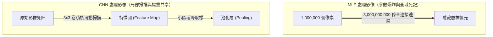

### 2.2 卷積運算與卷積核機制

CNN 的核心操作稱為**卷積（Convolution）**。系統不再讓神經元與整張圖片全連接，而是設計一個小尺寸的權重矩陣（例如 $3 \times 3$ 或 $5 \times 5$ 的矩陣），稱為**卷積核（Kernel，或濾鏡 Filter）**。

卷積核像一個滑動視窗，在輸入圖片上由左至右、由上至下依序滑動：
1. 每滑動到一個局部區域（感受野），卷積核內的數值便與覆蓋區域的像素值進行**逐元素相乘並加總（Element-wise Multiply and Accumulate）**。
2. 加上偏置項並通過激活函數後，將計算結果填入輸出的**特徵圖（Feature Map）**中。

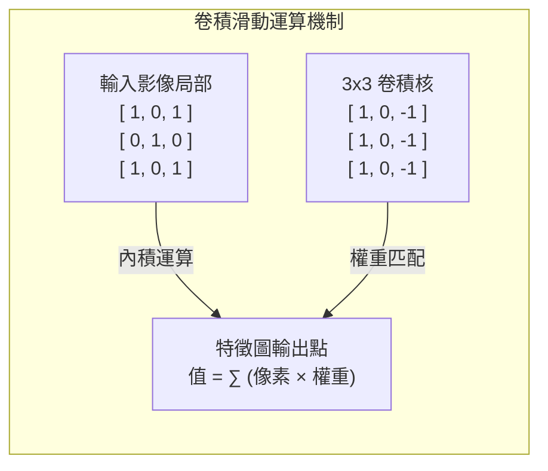

### 2.3 權重共享與平移不變性

卷積機制為神經網路帶來了巨大的技術突破：

1. **參數數量極致壓縮：**
   不論輸入圖片是 $1000 \times 1000$ 還是 $4K$ 解析度，一個 $3 \times 3$ 的卷積核永遠只有 $3 \times 3 = 9$ 個權重參數。這 $9$ 個參數在滑動掃描整張圖片的過程中被重複使用，這項特性稱為**權重共享（Weight Sharing）**。
2. **平移不變性（Translation Invariance）：**
   若某個卷積核學會了偵測「垂直邊緣」或「貓耳朵」，那麼無論這隻貓出現在圖片的左上角、正中央還是右下角，當卷積核滑動經過該區域時，都會產生強烈的激活數值。神經網路不再需要針對不同像素位置分別學習相同的圖案。

### 2.4 階層式特徵提取與池化層

一個成熟的 CNN 網路通常由多個卷積層與**池化層（Pooling Layer，如 Max Pooling）**交替堆疊而成，實現了極具美感的**階層式特徵提取（Hierarchical Feature Extraction）**：

- **淺層卷積（Low-level Features）：** 感受野極小，負責抓取線條、水平/垂直邊緣、顏色斑塊與基礎紋理。
- **中層卷積（Mid-level Features）：** 將淺層的線條組合，識別出圓形、網格、轉角等幾何部件（如車輪、眼睛輪廓）。
- **深層卷積（High-level Semantic Features）：** 感受野涵蓋整張物體，將部件拼接成完整的物件語義（如整隻狗、汽車全貌、人臉表情）。

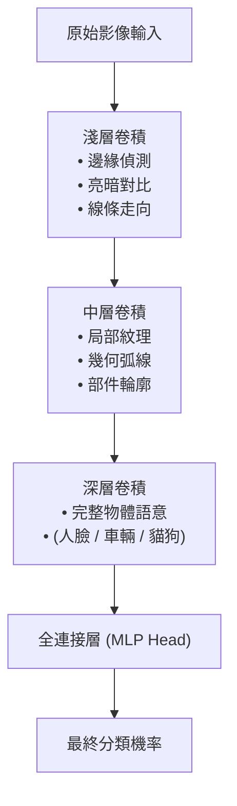

---

### 2.5 專題解析：遷移學習（Transfer Learning）的架構分工

在工業界與日常應用中，我們很少從零開始訓練一個包含數千萬參數的深層 CNN。相反地，工程界普遍採用**遷移學習（Transfer Learning）**技術。

以 Google Teachable Machine 為例，它之所以能在網頁瀏覽器中僅耗費 3 秒鐘、只用 30 張照片就學會辨識全新物體，其底層架構分工如下：

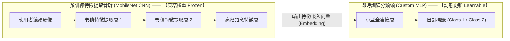

1. **預訓練 CNN 骨幹（MobileNet Backbone）：**
   Google 預先在包含 1400 萬張圖片的 ImageNet 資料集上訓練好了一個 MobileNet 卷積模型。該模型的卷積層已經精通真實世界所有基礎視覺特徵（邊緣、光影、材質）。在瀏覽器中，這幾十層卷積權重是**被凍結（Frozen）**的，不參與訓練，僅負責將輸入影像轉化為一串具備高度抽象語意的「特徵向量（Feature Embedding）」。
2. **後端自訂分類頭（Custom MLP Head）：**
   當使用者點擊「Train Model」時，瀏覽器實際上**只在訓練最後掛載的小型 MLP 分類器**。它學習如何將 MobileNet 輸出的特徵向量，分類到使用者自訂的標籤上。由於只需調整最後幾百個權重，運算量極小，幾秒鐘即可收斂完畢。

---

### 2.6 課堂動手做活動：Teachable Machine 影像分類與遷移學習實戰

請各組同學使用筆記型電腦開啟 Google Teachable Machine 官方網站（[teachablemachine.withgoogle.com](https://teachablemachine.withgoogle.com)），親自體驗遷移學習的威力。

#### 實驗步驟與任務：
1. **建立分類專案：**
   - 點選 **"Get Started"** ──> **"Image Project"** ──> **"Standard Image Model"**。
   - 建立兩個類別，分別命名為 **"Class 1：手機"** 與 **"Class 2：皮夾（或手錶/鑰匙）"**。
2. **任務 A（特徵採樣與快速訓練）：**
   - 點選 "Webcam"，長按 "Hold to Record" 按鈕，對著鏡頭旋轉物件，各自擷取約 30-50 張不同角度與距離的照片。
   - 點擊 **"Train Model"** 按鈕（注意訓練期間請勿切換瀏覽器分頁）。
   - 計算模型訓練花費的秒數（通常在 5 秒內完成）。
3. **任務 B（模型壓力測試與特徵干擾）：**
   - 在右側 "Preview" 預覽視窗中進行即時辨識測試。
   - **測試 1（角度旋轉）：** 將物件倒置或側放，觀察信心指標（Confidence Bar）的變化。
   - **測試 2（背景干擾）：** 用手遮住部分背景，或者將物件移至不同光線下，測試模型是否產生誤判。
   - **測試 3（近似物混淆）：** 拿出一支同組同學不同型號的手機靠近鏡頭，觀察分類機率是否劇烈跳動。

> **老師的真心話：**
> - **小心「背景作弊」陷阱**：初學者在玩 Teachable Machine 時常發現：「明明辨識率 100%，為什麼拿去別的地方就失效了？」。因為 CNN 非常敏感，如果你拍手機時都在左側房間（背景較暗），拍皮夾時都在右側（背景有窗戶），CNN 很可能根本沒有學會辨識手機，而是學會了辨識「光線明暗」或「背後的白板」！
> - **CNN 依然不具備邏輯推理能力**：CNN 能一眼看出一張圖裡有貓，但它無法告訴你「這隻貓為什麼打破了花瓶」以及「這會導致主人產生什麼情緒」，因為因果推理與時序邏輯並非卷積運算所長。

---

## 第三節：序列與時間維度的記憶：循環神經網路（RNN）

CNN 完美解決了空間維度（影像）的特徵提取，但當人類面對**自然語言文本、語音訊號、股票行情或氣象監測**等資料時，遇到了全新的挑戰——**時間序列（Time Series）**。

### 3.1 為什麼處理序列資料需要「時間與記憶」？

自然語言的本質是具備嚴格先後順序的符號流。同一個單字在不同的前文語境下，含意可能完全相反：

> 句子甲：*「這部電影拍得非常**好看**。」*
> 句子乙：*「這部電影如果沒有這個爛結局，本來應該很**好看**。」*

在閱讀句子乙的最後一個詞「好看」時，讀者的腦海中必須保留前面「爛結局」的資訊。如果像 MLP 或 CNN 一樣把單字視為靜態空間排列，便無法理解語言在時間維度上的語意流動。

### 3.2 循環神經網路（RNN）的架構與隱藏狀態

為此，計算機科學界提出了**循環神經網路（Recurrent Neural Network，RNN）**。RNN 在神經元內部引入了「時間遞推」與「內部反饋循環」。

#### 核心運作機制：
在處理序列資料時，RNN 依時間步（Time Step $t = 1, 2, \dots, T$）逐字讀入資料。在時間點 $t$：
1. 神經元接收**當前的輸入特徵 $X_t$**（例如當前讀到的單字向量）。
2. 神經元同時接收**上一時刻的隱藏狀態（Hidden State $H_{t-1}$）**——這代表了網路對前文所有歷史資訊的「記憶」。
3. 透過權重矩陣計算後，產生**當前時刻的隱藏狀態 $H_t$**：
   \[
   H_t = \tanh(W_{xh} X_t + W_{hh} H_{t-1} + b_h)
   \]
4. $H_t$ 不僅可用於計算當前時間點的輸出 $Y_t$，更會如同記憶接力棒一樣，傳遞給下一個時間步 $t+1$。

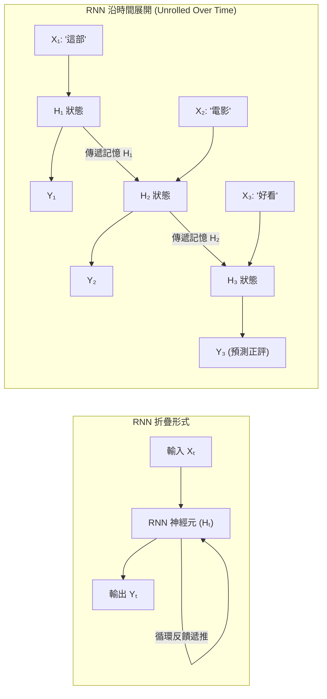

### 3.3 傳統 RNN 的致命瓶頸：梯度消失與長距離遺忘

儘管 RNN 在理論上能處理任意長度的序列，但在工程實務中，傳統 RNN 卻有著嚴重的**「健忘症」**。

#### 梯度消失（Gradient Vanishing）的數學詛咒：
神經網路訓練依賴反向傳播演算法（Backpropagation Through Time，BPTT）。當 RNN 反向計算梯度時，誤差訊號必須沿著時間軸從 $t=T$ 一路向前回傳至 $t=1$。

在回傳過程中，梯度公式中包含了連乘項 $\prod_{k=1}^{T} W_{hh}^T$：
- 若權重矩陣特徵值小於 1，隨著時間步拉長（例如句子超過 20 個字），連乘效應會使傳遞至句首的梯度值**呈指數級衰減至接近 0（Gradient Vanishing）**。
- 網路的權重因此無法根據句首的資訊進行更新，導致神經網路「只記得最後 3 到 5 個字，前面的內容全部忘光」。

---

### 3.4 課堂思考活動：長文本記憶衰減模擬

請同學們觀察以下這個長句子：

> *「那位在 1990 年獲得了三座奧斯卡金像獎、隨後隱居歐洲山區長達三十年且從不接受媒體採訪的傳奇老演員，昨天終於在影展紅毯上**公開現身**。」*

1. **核心語意關聯：** 句首的主詞是「老演員」，句尾的核心動詞是「公開現身」。
2. **RNN 的困境：** 兩者之間夾雜了超過 30 個字的修飾子句。請小組討論：如果使用傳統 RNN 來預測句尾動詞的單複數或主詞對象，為什麼 RNN 會把「老演員」的資訊遺忘殆盡？

> **老師的提醒：**
> - **別把「遞迴神經網路（Recursive NN）」與「循環神經網路（Recurrent NN）」搞混**：兩者英文簡稱皆為 RNN。我們常說的處理前後文的 RNN 是 Recurrent（循環/時間遞推）；而 Recursive 則是指沿著樹狀語法結構遞迴處理的網路。
> - **RNN 的時代定位**：雖然傳統 RNN 已不適合處理長文本，但在超低功耗的微控制器（如智慧手環的即時步數計算、心率跳動濾波）中，輕量級的 RNN 依舊佔有一席之地。

---

## 第四節：門控記憶管理：長短期記憶網路（LSTM）

為了解決傳統 RNN 的長距離遺忘與梯度消失難題，Hochreiter 與 Schmidhuber 提出了**長短期記憶網路（Long Short-Term Memory，LSTM）**，成為 2014 至 2018 年間自然語言處理與語音辨識的統治級架構。

### 4.1 細胞狀態：記憶的專用高速公路

LSTM 最核心的創新在於引入了**細胞狀態（Cell State，記為 $C_t$）**。

如果把傳統 RNN 的隱藏狀態比喻成一條充滿阻礙的泥濘小徑，那麼 LSTM 的細胞狀態就像是一條**「記憶專用輸送帶」**。資訊在細胞狀態中線性流動，只有少數的線性加減操作，使得誤差梯度在時間軸上反向傳播時不會發生劇烈衰減，從而打破了長期記憶保留的物理魔咒。

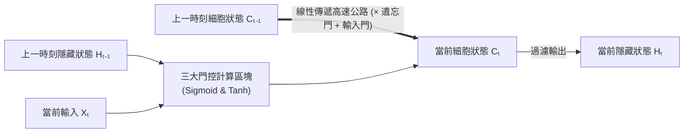

### 4.2 三大門控機制深度拆解

為了精準控制哪些資訊該保留、哪些資訊該丟棄，LSTM 在細胞內部設計了三個精密的數學閥門——**門控機制（Gates）**。每個門控均使用 $\sigma$（Sigmoid 函數，輸出值介於 0 到 1 之間）來決定資訊通過的比例（$0$ 代表完全關閉丟棄，$1$ 代表完全通過保留）。

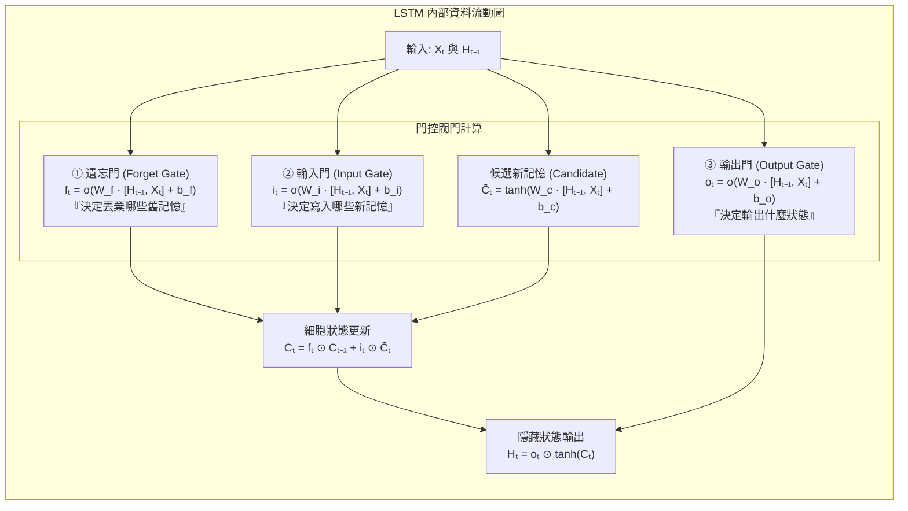

1. **遺忘門（Forget Gate，標記為 $f_t$）：**
   - **任務：** 審視上一時刻的隱藏狀態 $H_{t-1}$ 與當前輸入 $X_t$，決定從舊細胞狀態 $C_{t-1}$ 中「遺忘」哪些資訊。
   - **生活實例：** 在閱讀文章時，當讀到一個新段落的主詞從「約翰」換成了「瑪麗」，遺忘門會將關於「約翰」的性別代名詞權重調低。
2. **輸入門（Input Gate，標記為 $i_t$ 與 $\tilde{C}_t$）：**
   - **任務：** 決定當前輸入的新資訊中，有哪些重要內容需要被「寫入」細胞狀態中。
   - **運作：** $i_t$ 決定更新哪些維度，$\tilde{C}_t$ 產生候選新記憶，兩者相乘後累加進細胞狀態：$C_t = f_t \odot C_{t-1} + i_t \odot \tilde{C}_t$。
3. **輸出門（Output Gate，標記為 $o_t$）：**
   - **任務：** 根據最新的細胞狀態 $C_t$，決定當前時間步應輸出什麼樣的隱藏狀態 $H_t$ 給下一層神經元：$H_t = o_t \odot \tanh(C_t)$。

### 4.3 LSTM 的工程瓶頸：序列計算的平行化障礙

雖然 LSTM 成功將神經網路的有效記憶長度從數個字擴展至數百個字，支撐起了早期的 Google 翻譯系統，但它依然撞上了**硬體運算的物理鐵壁**：

> **序列依賴性（Sequential Dependency）：**
> 無論是 RNN 還是 LSTM，時間點 $t$ 的計算**必須嚴格等待時間點 $t-1$ 的隱藏狀態算完**才能開始。

這意味著：處理一篇 10,000 字的長文，演算法必須在 CPU/GPU 上依序進行 10,000 次序列等待。現代顯示卡（GPU）具備數萬個平行政算核心，最擅長同時進行大規模矩陣運算，但面對 LSTM 的「單行道」序列迴圈，GPU 的龐大平行算力完全無用武之地。這使得 LSTM 的訓練速度極慢，無法利用全球網路的萬億級語料進行超大規模預訓練。

---

### 4.4 課堂對比小活動：RNN 與 LSTM 記憶管理機制對決

請小組同學扮演 LSTM 內部的各個門控閥門，針對以下情境進行角色扮演：

- **情境：** 系統正在閱讀一本文學小說，前文記錄了主角在第 1 頁拿走了一把「金色鑰匙」（重要長期記憶）。隨後在第 2 至第 10 頁都是關於天氣和風景的描寫。到了第 11 頁，主角走到了一扇「上鎖的大門」前。
1. **在第 2 至 10 頁（描寫風景時）：** 遺忘門對「金色鑰匙」應該輸出接近 $1$ 還是 $0$？輸入門對「藍天白雲」應該如何處理？
2. **在第 11 頁（面對大門時）：** 輸出門如何將儲存了 10 頁的「金色鑰匙」記憶提取出來，完成開門的推理？
3. 請比較若換成傳統 RNN，第 11 頁時會發生什麼事？

> **老師的真心話：**
> - **門控本質上只是「軟開關（Soft Switch）」**：數學公式看似繁複，但請把它想像成可調亮度的開關——Sigmoid 算出的 $0.9$ 代表「保留 90% 記憶」，$0.1$ 代表「只留下 10%」。
> - **技術演進的殘酷現實**：LSTM 是一個極其精巧的數學架構，但它最終不是因為「效果不好」被淘汰，而是因為「無法善用硬體平行算力」被 Transformer 超越。在工程世界裡，**演算法與硬體架構的契合度往往決定了技術的生死**。

---

## 第五節：現代 AI 的核心革命：Transformer 架構

2017 年，Google 團隊發表了劃時代的論文《Attention Is All You Need》，提出了 **Transformer 架構**。Transformer 完全拋棄了 RNN/LSTM 的循環遞推設計，徹底重構了深度學習處理序列資訊的底層邏輯。

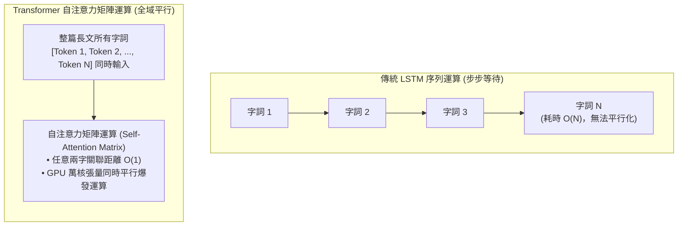

### 5.1 徹底打破時間限制：自注意力機制（Self-Attention）

Transformer 的靈魂是**自注意力機制（Self-Attention Mechanism）**。它不再要求文字排隊進場，而是將整篇文本的所有 Token **一次性、平行地**輸入神經網路中。

#### 查詢、鍵與值的檢索比喻：
對於輸入序列中的每一個 Token，Transformer 透過三個可學習的投影權重矩陣，將其映射為三個向量：
- **查詢向量（Query，$\mathbf{Q}$）：** 代表「我當前正在關注什麼？我想尋找什麼關聯？」。
- **鍵向量（Key，$\mathbf{K}$）：** 代表「我是誰？我有什麼樣的特徵可供匹配？」。
- **值向量（Value，$\mathbf{V}$）：** 代表「我所包含的真實資訊內容是什麼？」。

#### 自注意力公式核心：
\[
\text{Attention}(Q, K, V) = \text{softmax}\left(\frac{QK^T}{\sqrt{d_k}}\right)V
\]

1. **關聯度計算（$QK^T$）：** 將所有字詞的 Query 與所有字詞的 Key 進行矩陣內積，計算出全句子所有單字彼此之間的兩兩相關性得分。
2. **縮放與歸一化（$\text{softmax}(\cdot / \sqrt{d_k})$）：** 除以維度平方根 $\sqrt{d_k}$ 保持數值穩定，並透過 Softmax 將得分轉化為總和為 1 的機率權重矩陣。
3. **資訊加權聚合（$\cdot V$）：** 依據注意力權重，將所有字詞的 Value 向量進行加權相加，得到融合了全域語意上下文的新表徵。

### 5.2 位置編碼：找回遺失的空間與順序

因為 Transformer 同時處理整篇文本，矩陣內積運算本身是具備「置換不變性（Permutation Invariance）」的——也就是說，如果你把句子「狗咬人」換成「人咬狗」，自注意力矩陣計算出的相關性數值是完全一樣的。

為了讓模型精確掌握單字的先後順序，Transformer 引入了**位置編碼（Positional Encoding，PE）**。系統利用不同頻率的正弦與餘弦三角函數，為每個單字的位置生成獨一無二的座標特徵向量，並直接**疊加（Add）**在輸入的字詞向量上：

\[
\begin{aligned}
PE_{(pos, 2i)} &= \sin\left(\frac{pos}{10000^{2i/d_{\text{model}}}}\right) \\
PE_{(pos, 2i+1)} &= \cos\left(\frac{pos}{10000^{2i/d_{\text{model}}}}\right)
\end{aligned}
\]

透過位置編碼，神經網路既能享受全矩陣平行運算帶來的超高速度，又能清楚分辨單字在句子中相隔多遠、誰前誰後。

### 5.3 跨越 $O(1)$ 關聯距離與大模型時代降臨

Transformer 的誕生為 AI 帶來了兩項不可逆轉的質變：

1. **語意關聯距離縮短為 $O(1)$：**
   在 RNN/LSTM 中，第 1 個字要和第 100 個字產生關聯，必須跨越 99 次狀態遞推（關聯路徑為 $O(N)$）；而在 Transformer 中，任何兩個字詞的注意力權重都是直接透過一次矩陣乘法算出（關聯路徑為 $O(1)$），徹底終結了長距離遺忘問題。
2. **完美釋放 GPU 平行算力：**
   由於沒有任何時間循環依賴，整篇文本的運算全部轉化為標準的密集矩陣乘法（GEMM）。這完美契合了 GPU 的 Tensor Core 硬體架構，使得訓練百億、千億乃至萬億參數的大型語言模型（如 GPT-4、Gemini、Claude）成為可能。

---

### 5.4 課堂探索小活動：Transformer vs 傳統序列架構特性分析

請小組成員根據本節內容，完成以下對比分析表並進行討論：

| 評估維度 | 循環架構（RNN / LSTM） | 注意力架構（Transformer） |
| :--- | :--- | :--- |
| **運算順序** | 循序單行道（$t=1 \to 2 \to \dots$） | 全序列同時平行矩陣運算 |
| **任意兩字語意距離** | $O(N)$（隨文字長度線性增加） | **$O(1)$**（直接一步矩陣內積） |
| **GPU 硬體利用率** | 極低（核心常處於等待狀態） | **極高**（矩陣乘法滿載運算） |
| **長文字運算複雜度** | 計算量隨長度呈線性 $O(N)$ | 計算量與記憶體隨長度呈平方級 **$O(N^2)$** |

> **老師的提醒：**
> - **天下沒有白吃的午餐：$O(N^2)$ 的代價**：Transformer 雖然解決了平行運算與記憶距離，但因為每個字都要跟所有字計算注意力，長度為 $N$ 的文本需要維護 $N \times N$ 大小的注意力矩陣。這意味著當上下文長度從 4K 暴增至 128K 或 1M 時，運算量與顯存消耗會呈平方級爆炸增長！這也是為什麼現代 LLM 研究極力發展 FlashAttention、KV Cache 優化與稀疏注意力技術。
> - **位置編碼是不可或缺的羅盤**：如果拿掉位置編碼，Transformer 就會退化成一個對詞序完全無感的「高級詞袋模型」。

---

## 第六節：五大經典神經網路架構全面評估與工程決策

作為未來的 AI 工程師、系統架構師或產品經理，最關鍵的能力並非盲目追求最新、最大的模型，而是根據專案的**資料結構、即時性要求、硬體算力預算與維護成本**，精準挑選最合適的架構。

### 6.1 五大神經網路架構決策評估矩陣

以下為本章探討之五大核心架構的橫向綜合評估表：

| 架構名稱 | 核心數學機制 | 空間感知 | 時間記憶 | 硬體平行度 | 典型生活應用 | 當前工業界技術定位 |
| :--- | :--- | :---: | :---: | :---: | :--- | :--- |
| **MLP** (多層感知機) | 全連接層矩陣乘法 + 非線性激活 | ✕ (無) | ✕ (無) | 高 | • 房價數值預測 • 銀行信用卡詐欺初篩 • 簡單 Excel 表格分析 | • 深度學習入門基礎組件 • 普遍擔任高階網路的最終輸出分類頭（Head） |
| **CNN** (卷積神經網路) | 局部感受野 + 權重共享滑動視窗 | **強** (空間幾何) | ✕ (無) | 高 | • 醫療 X 光腫瘤偵測 • 自動駕駛道路障礙辨識 • 門禁人臉解鎖 | • 電腦視覺領域歷久彌新的絕對核心 • 邊緣端輕量影像處理首選 |
| **RNN** (循環神經網路) | 隱藏狀態循環反饋 遞推計算 | ✕ (無) | **弱** (易梯度消失) | 極低 | • 智慧手錶即時心率步數統計 • 極短時序感測器濾波 | • 退居超低功耗微控制器（MCU）與極致輕量邊緣運算 |
| **LSTM** (長短期記憶) | 細胞狀態專用通道 + 三大門控閥門 | ✕ (無) | **中/強** (門控長記憶) | 低 | • 早期 Google 翻譯系統 • 工廠機台剩餘壽命預測 • 氣象站降雨時序預報 | • 逐步被 Transformer 取代 • 仍活躍於中小型工業時序預測專案 |
| **Transformer** (注意力機制) | 自注意力矩陣內積 + 位置編碼投影 | **中** (藉由 ViT) | **極強** ($O(1)$全域) | **極高** | • ChatGPT / Claude / Gemini • GitHub Copilot 程式碼生成 • 跨語言即時長文翻譯 | • 當代生成式 AI 與大型語言模型的統治級核心基礎 |

---

### 6.2 奧卡姆剃刀原則與架構選型實務

在軟體工程與 AI 落地實務中，請牢記著名的**「奧卡姆剃刀（Occam's Razor）」原則**：

> **如無必要，勿增實體。能用簡單模型達到 95% 效果並穩定落地的，絕不盲目引入超大型模型增加系統複雜度與運算成本。**

在進行架構選型時，建議依循下列決策流程樹進行評估：

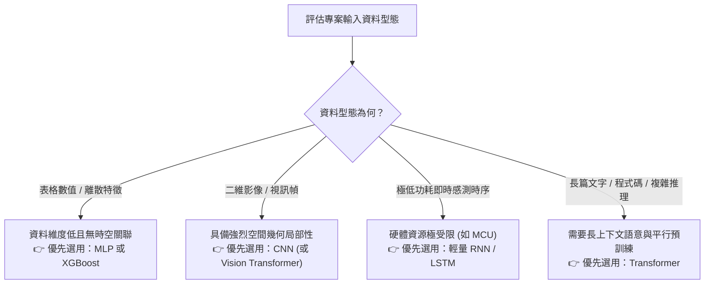

---

### 6.3 實戰案例決策判斷

#### 案例一：智慧工廠零件外觀瑕疵即時檢測
- **情境描述：** 晶圓代工廠需要在輸送帶上方架設高畫質工業攝影機，以每秒 30 幀的速度即時辨識晶片表面是否有細微刮痕或裂斑。
- **適切技術方案：** **CNN（卷積神經網路）**。
- **架構決策理由：** 刮痕與裂斑屬於高度局部的幾何線條特徵。CNN 具備優異的平移不變性與極高的推論速度，能在邊緣端推論設備（如 Jetson Orin）上以數毫秒的超低延遲完成判定，性價比遠高於大型多模態模型。

#### 案例二：電商平台客戶回購機率預測
- **情境描述：** 行銷部門整理了一份包含客戶「年齡、性別、註冊天數、過去三個月消費總金額、登入次數」的 CSV 表格（共 8 個欄位），希望在每週一凌晨預測哪些會員可能在下週回購。
- **適切技術方案：** **MLP（多層感知機）或傳統梯度提升樹（如 XGBoost / LightGBM）**。
- **架構決策理由：** 資料維度僅有 8 個數值欄位，完全不具備空間像素排布或連續時間語意結構。若盲目使用 Transformer，不僅會導致嚴重的模型過擬合，更會徒增數十倍的雲端伺服器算力帳單。

#### 案例三：金控集團跨國合約法規風險審查
- **情境描述：** 金融機構法務部門需要一套自動化審查系統，能夠完整閱讀上百頁的中英雙語投資合約，跨章節比對違約賠償條款、責任限制與管轄法院，並標註出潛在的法律衝突漏洞。
- **適切技術方案：** **Transformer（大型語言模型）**。
- **架構決策理由：** 合約文本存在大量長距離跨條款引用（如「依據第 14 條第 3 款之除外規定...」），需要極強的長文本全域注意力矩陣與上下文推理能力，這是傳統模型完全無法勝任的場景。

---

### 6.4 課堂小組活動：企業 AI 架構選型大比拼

請小組成員針對以下三項新提案進行技術選型評估，並指派代表進行 1 分鐘提案說明：

1. **提案 A（智慧農業）：** 部署在果園無人機上的害蟲即時辨識與噴藥定位系統。
2. **提案 B（醫療照護）：** 透過智慧手環 24 小時連續監測病患呼吸頻率，在發生呼吸中止時發出蜂鳴警報。
3. **提案 C（軟體開發）：** 協助工程師閱讀整份開源專案程式庫（包含數十個檔案與模組），自動產生架構說明文件並找出潛在的安全漏洞。

> **老師的真心話：**
> - **不要拿大砲打小鳥**：在 AI 領域，技術的先進程度不等於商業價值。一個在樹莓派上穩定運行 5 年、零出錯的 CNN 缺陷檢測系統，在工業價值上遠遠勝過一個每天消耗幾百美金 API 費用卻偶爾會產生幻覺的超大模型。
> - **現代 AI 系統是「多兵種協同作戰」**：在真實的軟體系統架構中，我們通常會組合多種模型——用 CNN 進行影像特徵前處理，用輕量 MLP 進行第一輪快速過濾，最後才將關鍵複雜資訊交由 Transformer 進行高階推理與文字輸出。

---

## 本章小結與思考問題

### 核心觀念回顧

1. **架構演進的驅動力：** 深度學習架構的演進並非盲目堆疊參數，而是為了解決前一代在處理**資料維度（空間）**與**物理記憶（時間）**時的數學限制。
2. **空間維度的征服（CNN）：** 透過卷積核滑動運算與權重共享，CNN 成功擺脫了 MLP 的參數爆炸與空間感缺失，實現了高效的階層式幾何特徵提取。
3. **時間維度的突圍（RNN $\to$ LSTM）：** 傳統 RNN 因反向傳播的連乘效應面臨梯度消失與健忘症；LSTM 透過「細胞狀態高速公路」與「三大門控機制」，首次實現了對長短期記憶的主動管理。
4. **平行運算與全域視野的終極變革（Transformer）：** Transformer 摒棄了循環結構，全面採用自注意力機制與位置編碼，將任意單字間的語意關聯路徑縮短為 $O(1)$，徹底解放了 GPU 的平行運算潛能，成為當代生成式 AI 與 LLM 的基石。
5. **工程選型哲學：** 堅守奧卡姆剃刀原則，依據資料維度與任務場景選擇最適架構，追求效能、算力成本與系統穩定度的最佳平衡。

---

### 課後思考題

請同學們在進入下一章之前，深入思考下列問題：

1. **非線性激活函數的本質：** 試著用簡單的幾何概念向一位沒有程式背景的同學解釋：為什麼沒有加上 ReLU 激活函數的神經網路，就算層數再多也無法把「螺旋形」的資料分開？
2. **遷移學習的商業價值：** 為什麼「凍結 CNN 骨幹 + 自訂 MLP 分類頭」的遷移學習架構，能夠讓中小企業在沒有海量標註資料與超級電腦的情況下，也能快速落地高精度的 AI 影像應用？
3. **Transformer 的算力瓶頸：** 既然自注意力機制的關聯路徑是 $O(1)$，為什麼處理百萬字（1M Context）的超長文本時，硬體記憶體需求會呈平方級（$O(N^2)$）暴增？未來的架構可能會朝什麼方向進行改良？
