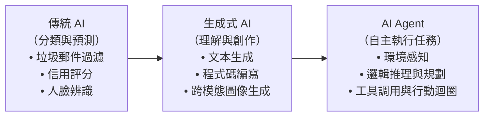
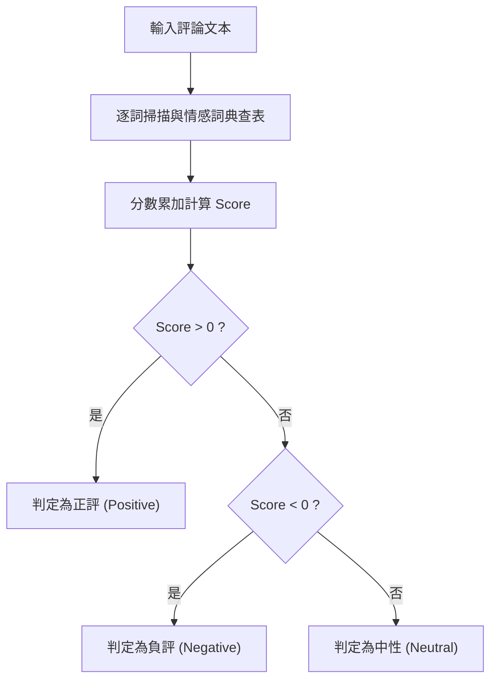
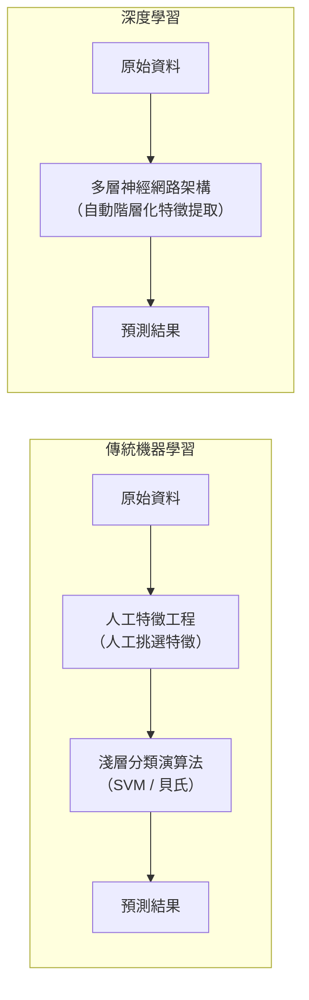
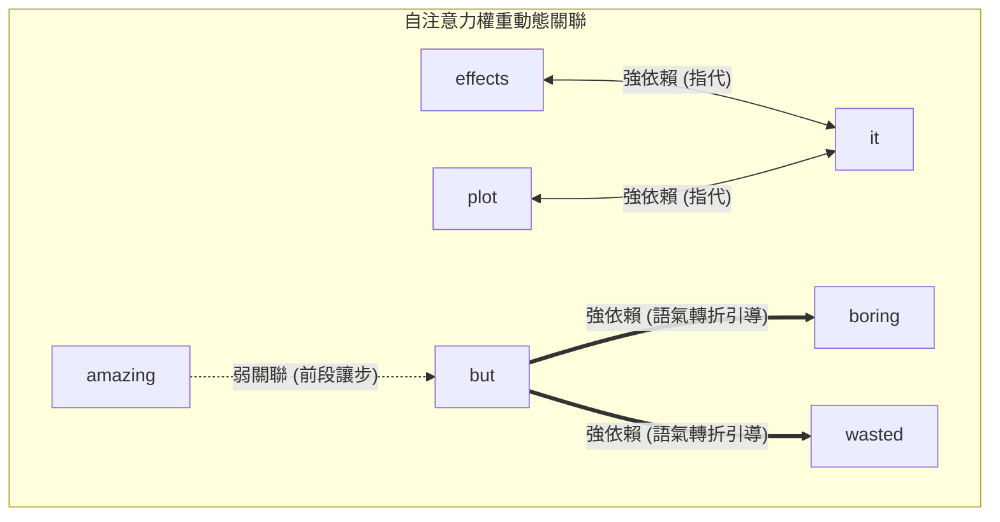
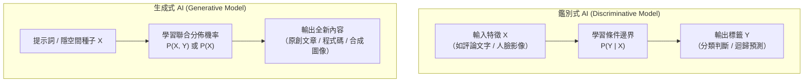
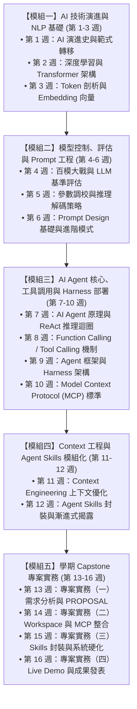

---
puppeteer:
  displayHeaderFooter: true
  headerTemplate: '
第一章：人工智慧導論與技術演進史
'
  footerTemplate: '
第  頁 / 共  頁
'
  margin:
    top: "1.5cm"
    bottom: "1.5cm"
    left: "1.5cm"
    right: "1.5cm"
---

---

# 第一章：人工智慧導論與技術演進史

## 課程導讀

歡迎進入大型語言模型應用與傳播的探索旅程。作為本課程的開篇之章，我們將建立宏觀的科技演進地圖，帶領讀者釐清人工智慧的學術本質，並深入理解計算機系統如何從早期仰賴專家撰寫的規則系統，跨越統計機器學習與深度學習，最終演進為今日具備複雜推理與內容生成能力的大型模型。

理解技術的演進脈絡，不僅是回顧歷史，更是掌握現代生成式 AI 與未來 AI Agent 運作架構的關鍵基礎。貫穿整套教材的核心邏輯如下：

> **傳統人工智慧負責「分類與預測」，現代生成式模型負責「內容生成」，而未來的 AI Agent 則進一步負責「自主規劃與執行任務」。**

---

## 第一節：人工智慧的定義與核心演進觀念

### 1.1 人工智慧的學術與工程本質

人工智慧（Artificial Intelligence，AI）是一門探討如何建構電腦系統以展現類似人類認知與決策能力的綜合學科。從工程與數學的觀點來看，人工智慧並非賦予機器具有自覺的靈魂，而是透過數學架構、統計模型與優化演算法，讓計算系統能夠從大量數據中自動提取特徵與規律，進而**執行過去必須依賴人類智能才能完成的複雜任務**，例如自然語言理解、視覺辨識、模式分類與多步驟推理。

在計算機科學發展的早期，人們試圖直接透過邏輯代數與人工規則來重現人類理性；然而隨著真實世界問題的複雜度倍增，人工智慧的研究焦點逐漸轉向如何讓機器從環境與資料中自主學習。

如上圖所示，AI 的核心能力歷經了三個主要範式的轉變：早期系統專注於「判別與分類」，現代大型模型突破了「多模態生成」，而即將迎來的 Agent 浪潮則聚焦於「自主目標達成」。

### 1.2 日常生活中的人工智慧滲透

在深入探討底層數學模型之前，我們可以先審視當前日常生活中無處不在的人工智慧技術。當代 AI 應用主要以兩種形式融入人類社會：

1. **無形感知系統（Ambient Intelligence）：** 這類系統通常在背景默默運作，使用者往往感受不到明確的「對話」過程，但其運作深刻影響著數位體驗。例如電子郵件服務中的垃圾信件自動過濾、串流影音平台的個人化推薦演算法、智慧型手機的人臉辨識解鎖與金融交易的即時防詐欺偵測。這些系統多屬於執行特定單一任務的傳統判別式模型。
2. **顯性互動系統（Interactive Generative AI）：** 以 ChatGPT、Gemini 等大型語言模型（Large Language Models，LLM）以及 Midjourney、Stable Diffusion 等影像生成工具為代表。使用者透過自然語言提示詞（Prompt）與系統進行連續對話，系統則即時合成文字、程式碼或視覺作品。

為了理解這些現代技術是如何誕生的，我們必須將視角拉回 AI 發展史上的關鍵轉折點。

### 1.3 課堂探索小活動：辨識生活中的 AI 形態

請同學們花費 3 分鐘，檢視手機中今日使用過的 3 款 App（如地圖導航、社群軟體、串流音樂），並記錄下列問題：
1. 該 App 中有哪些功能屬於「無形感知傳統 AI」（例如自動路況預測、推薦歌單）？
2. 該 App 是否已經整合了「顯性互動生成式 AI」（例如智慧助理、AI 摘要）？
3. 請與鄰座同學交流，討論哪一類 AI 帶給你的依賴度更高。

> **老師的提醒：**
> * **切勿將「自動化邏輯」與「人工智慧」混為一談**：許多初學者常將簡單的定時提醒、試算表公式或固定流程判斷（如「如果餘額不足則跳出通知」）誤認為 AI。真正的 AI 系統必須具備**基於數據學習**或**從特徵中歸納推理**的統計模型本質，而不是單純由工程師手寫的固定條件式。
> * **無形比顯性更龐大**：雖然生成式 AI 是當前話題中心，但在全球伺服器運行的 AI 運算中，傳統的分類與推薦模型依然佔據了絕大多數的運算負載。

---

## 第二節：從規則導向到統計機器學習

人類追求機器智慧的歷程，在技術演進上展現出從「人工硬編碼」走向「數據驅動」的深刻轉變。

### 2.1 規則導向系統（Rule-based Systems）

在人工智慧發展初期，專家系統（Expert Systems）與規則導向方法佔據了主導地位。其運作邏輯非常直觀：由特定領域的人類專家，將該領域的知識、邏輯與決策流程，轉化為一連串精確的條件判斷式（`If-Then` 語句）。

- **運作機制：** 系統內部具備一個「知識庫（Knowledge Base）」與一個「推理引擎（Inference Engine）」。當輸入資料進入系統時，推理引擎會逐一檢索知識庫中的條件規則，只要符合預設條件，便輸出相應的結論。
- **技術限制與瓶頸：** 規則導向系統最大的挑戰在於「規則爆炸（Rule Explosion）」。真實世界的語言現象與環境變數極其繁複，人類專家無法透過窮舉法列出所有可能的情況。當規則數量從數十條擴增至數萬條時，規則之間容易產生互相衝突、難以維護的困境，且系統完全缺乏處理未見過特例的泛化能力。

### 2.2 機器學習（Machine Learning，ML）

為突破規則編寫的限制，研究者在 1980 年代至 1990 年代大力推動統計機器學習的發展。機器學習的核心思想是：**人類不再直接撰寫判斷邏輯，而是設計學習演算法，讓計算機能夠直接從大量歷史數據中自主統計並找出規律。**

- **運作機制：** 給定一組訓練資料集（Training Dataset），演算法透過調整內部參數以最小化預測誤差，進而建立起從輸入特徵到輸出預測的數學映射函數 (在電腦科學習慣稱為模型，Model)。
- **技術限制：** 傳統機器學習極度依賴「**特徵工程（Feature Engineering）**」。也就是說，演算法本身無法直接理解原始資料（如整篇文字或未處理的像素），必須由資料科學家手動挑選並萃取關鍵特徵（例如詞頻統計、邊緣偵測數值等）。模型的預測準確率上限，往往取決於人類工程師所設計特徵的品質。

---

### 2.3 專題實驗：電影評論的情感分析演進（The Sentiment Lab）

為了更具體地體會不同技術世代的本質差異，我們透過一個經典的自然語言處理任務——**電影評論情感分析**來進行對比實驗。

> **學術定義界定：**
> 本實驗所探討的是**情感分析（Sentiment Analysis）**，其主要目標在於量化並判斷文本的「極性（Polarity）」，亦即分析文本整體偏向「正向（Positive）」或「負向（Negative）」。這與探討人類複雜心理狀態（如喜、怒、哀、懼）的**情緒分析（Emotion Analysis）**在運算目標與範疇上具有明確區別。

本實驗準備了五則具備不同語言特性的英文電影短評作為測試語料：

- **Review A（直白負評）：** *"The plot is boring and the acting is stiff, it totally wasted my time."*
- **Review B（直白正評）：** *"The special effects are amazing, I love this masterpiece!"*
- **Review C（語氣轉折）：** *"The acting is stiff, but the story is amazing and it is a masterpiece."*
- **Review D（雙重否定與反諷）：** *"This movie is not boring at all, I will never hate it."*
- **Review E（多重轉折與代名詞指代）：** *"The effects were amazing, but it had a boring plot which wasted the great acting."*

---

#### 實驗階梯一：規則導向系統（Rule-based）—— 手動情感詞典查表法

在規則導向時代，工程師會預先建構一張「情感詞典（Sentiment Lexicon）」，並為每個詞彙賦予固定的極性分數：

- **正向詞（+1 分）：** `amazing`, `love`, `masterpiece`, `great`
- **負向詞（-1 分）：** `boring`, `stiff`, `wasted`, `hate`
- **中性詞（0 分）：** 其餘單字（如 `movie`, `plot`, `acting`, `but`, `not`, `never`）

系統判斷邏輯極為單純：逐詞掃描文本，若遇到詞典中的單字便累加其分數。若總分 $\text{Score} > 0$ 判定為正評，若 $\text{Score} < 0$ 則判定為負評。

##### 規則導向系統之盲點分析：

1. **面對語氣轉折（Review C）：**
   Review C 包含 `stiff (-1)`、`amazing (+1)` 與 `masterpiece (+1)`，累加總分為 $+1$。雖然最終碰巧得到了正向的分類結果，但系統完全無法理解句中 `but` 所扮演的語義重心轉移角色，只是單純的數字抵銷。
2. **面對否定詞與雙重否定（Review D）：**
   Review D 包含 `boring (-1)` 與 `hate (-1)`，累加總分為 $-2$，系統因而判定為負評。然而人類讀者能輕易看出 `not boring` 與 `never hate` 是強烈的正向讚美。規則導向系統因為將詞彙視為彼此孤立的符號，無法處理否定修飾詞的語義反轉現象。

---

#### 實驗階梯二：統計機器學習（Machine Learning）—— 單純貝氏分類器

為解決手動規則難以維護的問題，統計機器學習改由演算法從數萬筆已標註情感的歷史短評中，自動統計各單字在不同類別下出現的「條件機率（Conditional Probability）」。

以經典的**單純貝氏分類器（Naive Bayes Classifier）**為例，假設資料集中正評與負評的先驗機率均為 $50\%$，即 $P(\text{Pos}) = 0.5$ 且 $P(\text{Neg}) = 0.5$。經統計學習後得到的詞彙條件機率如下表所示：

| 詞彙（Token） | 正評中出現機率 $P(\text{Word} \mid \text{Pos})$ | 負評中出現機率 $P(\text{Word} \mid \text{Neg})$ |
| :--- | :---: | :---: |
| **amazing** | **0.40** | 0.01 |
| **masterpiece** | **0.30** | 0.01 |
| **boring** | 0.02 | **0.50** |
| **wasted** | 0.01 | **0.40** |
| **stiff** | 0.05 | **0.20** |
| **but** | 0.20 | 0.20 |
| **not** | 0.15 | 0.15 |

對於一則輸入評論 $D = \{w_1, w_2, \dots, w_n\}$，單純貝氏模型根據貝氏定理計算其屬於正評或負評的後驗機率。由於正負評的先驗機率相等，我們只需比較下列聯合條件機率得分：

\[
\text{Score}(\text{Pos}) = P(\text{Pos}) \times \prod_{i=1}^{n} P(w_i \mid \text{Pos})
\]
\[
\text{Score}(\text{Neg}) = P(\text{Neg}) \times \prod_{i=1}^{n} P(w_i \mid \text{Neg})
\]

##### 數值計算範例：以 Review C 為例

對於句子 *"The acting is stiff, but the story is amazing and it is a masterpiece."*，我們提取具備鑑別力的關鍵字序列：`stiff`, `but`, `amazing`, `masterpiece`。

- **正評條件得分：**
  \[
  \begin{aligned}
  \text{Score}(\text{Pos}) &= 0.5 \times P(\text{stiff}\mid\text{Pos}) \times P(\text{but}\mid\text{Pos}) \times P(\text{amazing}\mid\text{Pos}) \times P(\text{masterpiece}\mid\text{Pos}) \\
  &= 0.5 \times 0.05 \times 0.20 \times 0.40 \times 0.30 \\
  &= 0.5 \times 0.0012 = \mathbf{0.0006}
  \end{aligned}
  \]
- **負評條件得分：**
  \[
  \begin{aligned}
  \text{Score}(\text{Neg}) &= 0.5 \times P(\text{stiff}\mid\text{Neg}) \times P(\text{but}\mid\text{Neg}) \times P(\text{amazing}\mid\text{Neg}) \times P(\text{masterpiece}\mid\text{Neg}) \\
  &= 0.5 \times 0.20 \times 0.20 \times 0.01 \times 0.01 \\
  &= 0.5 \times 0.000004 = \mathbf{0.000002}
  \end{aligned}
  \]

計算結果顯示 $\text{Score}(\text{Pos}) \gg \text{Score}(\text{Neg})$，模型以壓倒性的機率優勢正確將 Review C 分類為正評。

##### 統計機器學習之盲點分析：

儘管貝氏模型利用機率統計大幅改善了分類效能，但它在處理 **Review D**（*"This movie is not boring at all, I will never hate it."*）時依然遭遇挫折。

因為在單純貝氏模型中，否定詞 `not` 在正負評中出現的機率大致相當（均約為 $0.15$），而 `boring` 在負評中的出現機率（$0.50$）遠高於正評（$0.02$）。當兩者機率連乘時，負評得分依然遠遠高於正評得分，導致判斷錯誤。

> **核心學術結論：**
> 該模型之所以被冠以 **「單純（Naive，或譯天真）」** 之名，是因為它在數學上做出了強烈的**條件獨立性假設（Conditional Independence Assumption）**——它假設句子中的每一個單字都是獨立出現的，彼此之間沒有先後順序或語法依賴。這種「詞袋模型（Bag of Words）」視角，注定使其無法理解複雜句式中的語意組合與長距離修飾關係。

### 2.4 課堂動手做小活動：手算貝氏模型的否定句陷阱

請小組成員拿出紙筆，利用上方表格中的機率數據，實際計算 **Review D** 關鍵字 `not` 與 `boring` 的正負評得分：
- $\text{Score}(\text{Pos}) = 0.5 \times P(\text{not}\mid\text{Pos}) \times P(\text{boring}\mid\text{Pos})$
- $\text{Score}(\text{Neg}) = 0.5 \times P(\text{not}\mid\text{Neg}) \times P(\text{boring}\mid\text{Neg})$

請觀察負評得分是正評得分的幾倍？並思考若要讓機器學習模型理解 `not boring`，工程師在特徵工程階段必須額外做什麼處理（提示：N-gram 雙詞組合）？

> **老師的真心話：**
> * **不要嘲笑「單純」貝氏的幼稚**：雖然單純貝氏無法理解語意脈絡，但由於其計算速度極快、幾乎不需要龐大算力，直到今天在工業界的大規模垃圾郵件初篩與超高速文字分類中，依然扮演著非常實用的先鋒角色。
> * **特徵工程的代價**：過去工程師為了讓機器學習看懂 `not boring`，會手動將相鄰單字組合成 Bigram（雙詞組，如 `not_boring`）。但這樣做會導致詞彙維度呈指數級暴增，這正是促使學界轉向深度學習的根本驅動力。

---

## 第三節：深度學習革命與 Transformer 注意力機制

為了克服統計機器學習無法捕捉序列語境與深層語義的限制，人工智慧迎來了深度學習與神經網路架構的全面革新。

### 3.1 深度學習（Deep Learning，DL）的表徵學習

深度學習奠基於多層人工神經網路（Artificial Neural Networks，ANN）。與傳統機器學習最大的差異在於：**深度學習實現了「表徵學習（Representation Learning）」**。

透過多層非線性變換，系統能直接從最原始的文字符號或像素陣列中，層層抽象出低階、中階乃至高階的語義特徵，徹底免除了對人工特徵工程的依賴。

### 3.2 Transformer 架構與自注意力機制（Self-Attention）

在處理自然語言等序列資料時，早期的循環神經網路（Recurrent Neural Networks，RNN）與長短期記憶模型（LSTM）採用循序遞推計算，面臨「難以平行化運算」以及「長距離依賴遺忘（Vanishing Gradients）」等嚴峻限制。

2017 年，Vaswani 等人發表論文《Attention Is All You Need》，提出了 **Transformer 架構**。Transformer 完全摒棄了循環結構，全面採用**自注意力機制（Self-Attention Mechanism）**。

#### 自注意力機制之數學本質：

在自注意力機制中，序列中的每一個字詞（Token）不再是孤立的個體。模型會將每個 Token 投影為三個向量：查詢向量（Query, $Q$）、鍵向量（Key, $K$）與值向量（Value, $V$）。

對於句子中的任意字詞 $i$，模型透過矩陣內積計算它與句子中所有其他字詞 $j$ 的語義關聯權重，公式如下：

\[
\text{Attention}(Q, K, V) = \text{softmax}\left(\frac{QK^T}{\sqrt{d_k}}\right)V
\]

透過這套矩陣運算，Transformer 具備以下核心優勢：
1. **全域視野（Global Context）：** 任何兩個字詞之間的關聯距離均為 $O(1)$，能夠直接建立跨句、長距離的語義依賴。
2. **高度平行化（Massive Parallelism）：** 整個序列的所有字詞可同時進行矩陣運算，完美契合 GPU 的平行運算特性，使訓練超大規模語言模型成為可能。

---

### 3.3 實驗階梯三：Transformer 自注意力機制語意解析

我們再次回到情感分析實驗，使用 Transformer 模型（如 BERT）來處理複雜句 **Review E**：

> *"The effects were amazing, but it had a boring plot which wasted the great acting."*

透過注意力權重視規化工具（如 [exBERT](https://huggingface.co/spaces/exbert-project/exbert)），將滑鼠懸停於特定 Token 上，可以觀察神經網路高層（Layer 11-12）所建立的注意力權重連線：

#### 視覺化現象與深度解析：

1. **語氣轉折脈絡引導：** 當觀察焦點停留在轉折詞 `but` 時，模型會自動將極高的注意力權重分配給後半句的 `boring` 與 `wasted`。這證明 Transformer 能自動辨識句式結構，理解轉折詞後面的一段論述才是整段評論的語意焦點。
2. **代名詞指代消解（Coreference Resolution）：** 當焦點停留在代名詞 `it` 時，模型能自動在沒有任何人為指定規則的情況下，將強烈注意力同時連向 `effects` 與 `plot`，精準解析出代名詞在上下文中的真實指代實體。

透過自注意力機制，人工智慧終於跨越了字面計數的限制，真正具備了理解上下文語境與複雜語法結構的能力。

### 3.4 課堂觀察小活動：注意力權重探測

請使用瀏覽器開啟 exBERT（或由講師進行即時大螢幕展示）：
1. 輸入句子：*"The animal didn't cross the street because it was too tired."*
2. 觀察高層注意力頭（Attention Heads）中，代名詞 `it` 主要與哪一個名詞產生最粗的連線？
3. 將句子中的 `tired` 改為 `wide`（*"...because it was too wide."*），再次觀察 `it` 的注意力連線轉移到了哪個詞彙？這說明了什麼？

> **老師的提醒：**
> * **注意力是「數學相關性」，不是「人類的意識專注」**：初學者容易被「注意力（Attention）」這個心理學名詞誤導。請牢記，在 Transformer 內部，注意力純粹是**高維向量的內積與 Softmax 機率分佈**，代表的是文字表徵之間的資訊流動權重，而非機器產生了人類般的自主感知。
> * **平方級計算成本（$O(N^2)$）的代價**：因為每個字都要與所有字計算注意力，長度為 $N$ 的句子需要計算 $N \times N$ 次。這也是為什麼各大模型廠商在擴展上下文長度（Context Window）時，必須投入巨大的硬體與演算法優化成本。

---

## 第四節：鑑別式 AI 與生成式 AI 的架構分工

隨著深度學習與大型模型技術的成熟，當代人工智慧依據其**數學建模本質**與**任務目標**，形成了兩大主要分支：**鑑別式 AI** 與 **生成式 AI**。

### 4.1 數學本質與建模思維對比

這兩類架構在統計學本質上具有根本差異：

1. **鑑別式人工智慧（Discriminative AI）：**
   - **數學目標：** 學習在給定輸入資料 $X$ 的條件下，目標標籤 $Y$ 出現的條件機率分佈 $P(Y \mid X)$。
   - **思維邏輯：** 它專注於在不同類別之間尋找最佳的「決策邊界（Decision Boundary）」。它的核心任務是區分：「這張圖片是貓還是狗？」、「這封郵件是否為垃圾信？」或「這則評論是正向還是負向？」。
2. **生成式人工智慧（Generative AI）：**
   - **數學目標：** 學習輸入特徵與輸出內容的聯合機率分佈 $P(X, Y)$，或無監督學習輸入資料本身的底層分佈 $P(X)$。
   - **思維邏輯：** 它試圖理解整個資料空間的生成規律與分佈結構。一旦掌握了分佈規律，系統就能利用自回歸（Autoregressive）或擴散（Diffusion）等機制，生成符合該分佈的全新資料樣本，例如撰寫全新段落、合成擬真影像或編寫程式碼。

### 4.2 綜合比較矩陣

為了全面掌握兩者的分工與特性，下表從多個維度進行系統化對比：

| 比較維度 | 鑑別式人工智慧 (Discriminative AI) | 生成式人工智慧 (Generative AI) |
| :--- | :--- | :--- |
| **底層任務** | 資料分類、數值預測、異常檢測、極性判斷 | 內容創作、語意轉換、自回歸接龍、跨模態合成 |
| **數學本質** | 條件機率建模：$P(Y \mid X)$ *(尋找類別之間的決策分界線)* | 聯合分佈建模：$P(X, Y)$ 或 $P(X)$ *(理解資料空間的整體分佈特徵)* |
| **輸入輸出關係** | 輸入高維資料（如影像/文本），輸出低維標籤或數值 | 輸入提示詞或隨機噪聲，輸出高維全新結構化資料 |
| **典型應用範例** | 垃圾郵件過濾器、人臉辨識、銀行信用評分系統 | ChatGPT 文章寫作、Claude 程式生成、Midjourney 繪圖 |
| **評估指標** | 準確率（Accuracy）、精確率（Precision）、F1-Score | 困惑度（Perplexity）、BLEU、ROUGE、人類偏好評分 |
| **限制與挑戰** | 無法無中生有產製新內容，容易受未見分佈干擾 | 容易產生幻覺（Hallucination）、運算成本極高 |

由上表可知，鑑別式 AI 與生成式 AI 並非互相取代的競爭關係，而是相輔相成的工程模組。在構建現代高階 AI 應用（例如具備驗證機制的 AI Agent）時，我們常利用生成式模型進行思考規劃與內容生成，同時調用鑑別式模型進行輸出內容的品質把關與分類過濾。

### 4.3 課堂小組活動：設計「生成+鑑別」雙核心系統

請與同組同學共同構思一個「智慧客服自動回覆與合規系統」：
1. **生成式 AI 的角色**：負責讀取客戶問題並生成親切、具同理心的回覆草稿。
2. **鑑別式 AI 的角色**：在草稿發送給客戶前，鑑別模型需要執行哪些具體檢測（例如：辱罵言論過濾、洩漏個資偵測、情緒極性把關）？
3. 請畫出這兩者串聯的工作流程圖。

> **老師的真心話：**
> * **「幻覺（Hallucination）」是生成式 AI 的天性**：很多同學常抱怨 LLM 偶爾會一本正經地胡說八道。請記住，生成式模型本質上是在高維機率分佈中進行「最可能下一個字（Next-token Prediction）」的取樣，它沒有「真理」的概念。
> * **鑑別式模型是最佳的安全帶**：想要打造可信賴的工業級應用，絕對不能單靠 LLM 自我反省，必須在架構外圍掛載嚴謹的鑑別式分類器（Guardrails）來進行事實查核與合規攔截。

---

## 第五節：人工智慧的演進階段與課程架構展望

### 5.1 人工智慧發展的三大階段

在科技哲學與電腦科學的長遠藍圖中，人工智慧的發展通常被劃分為三個重要階段：

1. **狹義人工智慧（Artificial Narrow Intelligence，ANI）：**
   此為**目前人類技術所處的真實階段**。系統被設計用來在特定、單一的領域中達到極致效能（例如 AlphaGo 下圍棋、語音識別引擎、特定領域大型語言模型）。儘管 LLM 在多個領域展現出廣泛的應答能力，但其本質仍是基於機率分佈的模式匹配，尚未具備通用的自我意識與自主跨領域遷移推理能力。
2. **通用人工智慧（Artificial General Intelligence，AGI）：**
   研究界追求的下一個重大里程碑。在 AGI 階段，系統將具備與人類相當甚至超越常人的跨領域通用認知能力，能夠自主學習全新學科、進行抽象邏輯推理、具備長程目標規劃能力，並能自主解決複雜的多步驟開放性問題。
3. **超級人工智慧（Artificial Superintelligence，ASI）：**
   哲學家與未來學家所定義的理論階段。此時機器的智慧、創造力、科學探索能力與戰略洞察力，將在全方位遠遠超越全體人類智慧的總和。

---

### 5.2 16 週課程結構地圖與學習路徑

本門課程精心設計為 16 週的漸進式學習旅程，由淺入深、由底層原理向工業級落地應用推進，共劃分為五大核心模組：

- **模組一：AI 技術演進與自然語言處理基礎（第 1-3 週）**
  - **第 1 週（第一章）：** 人工智慧導論與技術演進史 —— 建立從規則系統、統計機器學習到深度學習與 AI Agent 的宏觀視野。
  - **第 2 週（第二章）：** 深度學習基礎與 Transformer 核心架構 —— 剖析自注意力機制（Self-Attention）與神經網路演進。
  - **第 3 週（第三章）：** Token 剖析與 Embedding 語意向量 —— 深入 Tokenizer 分詞機制、向量空間（Vector Space）與餘弦相似度。
- **模組二：模型控制、評估與 Prompt 工程（第 4-6 週）**
  - **第 4 週（第四章）：** 當代百模大戰與 LLM 基準評估 —— 評估開源與閉源模型特性，解析 MMLU、GSM8K 等主流 Benchmark 指標。
  - **第 5 週（第五章）：** 模型參數調校與推理解碼策略 —— 掌握 Temperature、Top-p、Top-k 與 System Prompt 安全權限隔離。
  - **第 6 週（第六章）：** Prompt Engineering 基礎與進階設計模式 —— 實作 Zero-shot、Few-shot 與 Chain-of-Thought (CoT) 思維鏈設計。
- **模組三：AI Agent 核心推理、工具調用與 Harness 部署（第 7-10 週）**
  - **第 7 週（第七章）：** AI Agent 原理與 ReAct 自主推理迴圈 —— 剖析 Perception-Reasoning-Action 迴圈與 ReAct 思考框架。
  - **第 8 週（第八章）：** Function Calling / Tool Calling 工具調用機制 —— 掌握 JSON Schema 工具宣告、Tool Selection 與 Observation 回轉。
  - **第 9 週（第九章）：** 主流 Agent 框架橫向對比與 Harness 架構 —— 橫向對比自主 Agent 框架，理解 Antigravity 2.0 原生 Primitives 與 Harness 工程。
  - **第 10 週（第十章）：** Model Context Protocol (MCP) 開放標準與架構 —— 學習 MCP Client/Server 雙層架構、FastMCP 開發與 stdio 傳輸協議。
- **模組四：Context 工程與 Agent Skills 模組化（第 11-12 週）**
  - **第 11 週（第十一章）：** Context Engineering 上下文工程與檢索優化 —— 掌握 Context Window 邊界、Targeted Retrieval、Context Compression 與 Caching。
  - **第 12 週（第十二章）：** Agent Skills 模組化封裝與 Progressive Disclosure —— 學習 Skill Package 五大元件、YAML Metadata 與 Progressive Disclosure 4 階段 Pipeline。
- **模組五：學期 Capstone 專案實務（第 13-16 週）**
  - **第 13 週（第十三章）：** AI Agent 專案實務（一）：問題領域分析與系統架構提案 —— 完成 Problem Domain 分析、User Story、`PROPOSAL.md` 規格書與 Mermaid 架構圖。
  - **第 14 週（第十四章）：** AI Agent 專案實務（二）：Agent 建構、Workspace 規劃與工具整合 —— 建立 `Social_Topic/` Workspace、`AGENTS.md` 規範與自訂 MCP Server（`src/topic_tracker_mcp.py`）。
  - **第 15 週（第十五章）：** AI Agent 專案實務（三）：Skills 封裝、Context 優化與系統穩健性 —— 完成 `skills/topic-tracker/` 封裝、Edge Cases 邊界防禦與 `tests/test_mcp_eval.py` 自動化評估。
  - **第 16 週（第十六章）：** AI Agent 專案實務（四）：成果發表、Live Demo 展示與系統檢討 —— 進行 5 段式簡報發表、Live Demo 互動演示、同儕評審與技術復盤。

---

### 5.3 課堂反思小活動：評估當前 AI 的智慧邊界

請同學們在課堂筆記本上寫下自己的觀點：
1. 你認為具備強大程式生成與數學推理能力的最新大型語言模型（如 GPT-4、Gemini 1.5 Pro），是否已經具備了 AGI 的雛形？為什麼？
2. 如果要讓一個 AI 從「聊天機器人」真正升級為「具備實用價值的 AI Agent」，你認為目前最缺乏的關鍵模組是什麼（例如：長期記憶、環境操作工具、自主錯誤修正機制）？

> **老師的提醒：**
> * **不要被單純的「提示詞串接（Prompt Chaining）」蒙蔽**：在實務中，很多人把一串預先寫死的 Prompt A $\rightarrow$ Prompt B 稱為 AI Agent。請記住，**真正的 Agent 必須具備動態決策迴圈（Loop）**——它能根據工具執行的實際反饋（如報錯訊息或新資料），自主調整下一步的行動計畫，而不是照著固定劇本走。
> * **腳踏實地學工程**：未來的競爭力不在於背誦模型名稱，而在於如何利用 Context Engineering、Tool Calling 與 Harness 架構，將 LLM 鍛造成可靠的工業級生產力工具。

---

## 本章小結與思考問題

### 核心觀念回顧

1. **技術演進的推動力：** 從規則導向（人工窮舉）、機器學習（統計特徵）、深度學習（自動表徵），再到 Transformer 自注意力機制，每一次重大躍進都是為了解決前一代在處理資料維度、特徵表達與上下文關聯時的數學瓶頸。
2. **語意理解的關鍵突破：** 自注意力機制使模型能夠在全域範圍內計算所有字詞的相互關聯矩陣，成功解決了代名詞指代消解與轉折句式理解等複雜語言難題。
3. **任務範式的轉換：** 現代 AI 正在從「單向分類判別」跨越至「生成創造」，並快速走向具備「環境感知、規劃推理與行動執行」能力的 AI Agent。

---

### 課後思考題

請同學們在進入下一章之前，深入思考以下三個問題：

1. **規則系統與機器學習的互補性：** 既然深度學習具備強大的特徵提取能力，為什麼在現代航空控制系統或某些醫療關鍵判斷中，依然普遍保留規則導向系統的檢驗機制？
2. **注意力矩陣的計算複雜度：** 在自注意力機制中，計算長度為 $N$ 的句子時，所有 Token 兩兩計算關聯的計算複雜度為 $O(N^2)$。這對處理數百萬字超長文本（Long Context）會帶來什麼樣的工程挑戰？
3. **Agent 與純 LLM 的差異：** 一個只能在對話框內回答問題的 ChatGPT，與一個能夠自主登入雲端、撰寫程式碼並部署網站的 AI Agent，在系統架構上最大的差異是什麼？
